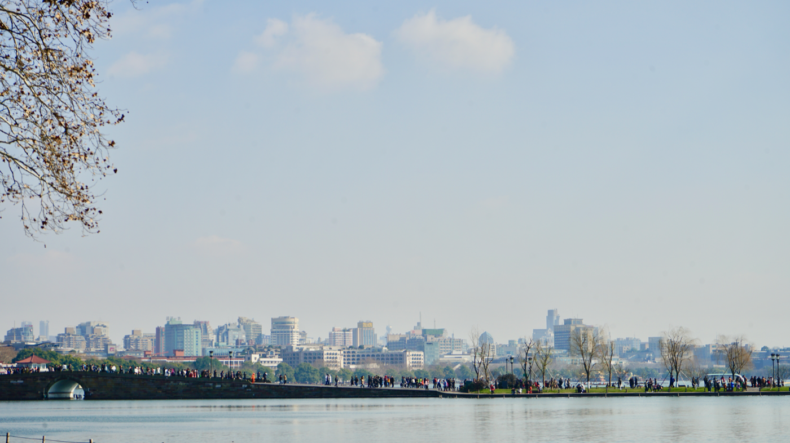

# 一 杭州本地

{ width="640" .center }

杭州在外人眼里是一个城市，在本地人眼里是两个。

外人版本的杭州有一张固定的清单：西湖一日游、灵隐烧香、河坊街买伞、楼外楼吃东坡肉。这个版本是从断桥开始的，下午三点，乌泱泱的旅游团跟在小旗子后面，导游用麦克风讲许仙白娘子，每隔十分钟讲一遍。这个杭州也确实存在，它运转得很顺，配套的酒店、码头、纪念品店、收费厕所都齐全，但它和本地人无关。

本地人版本的杭州在另一些地方。周六早上他们开车去龙井村喝头道茶，茶农认识他们，给他们留了明前的狮峰。下午带孩子去良渚博物院，看 5000 年前的玉琮，门票二十块。傍晚去小河直街拐弯的小店吃片儿川，老板不抬头，知道他们要细面少汤。秋天他们去满觉陇闻桂花，冬天去灵峰探梅，不去人挤人的孤山。西湖他们也去，但去得很挑，挑早晨六点的苏堤、挑落雪的断桥、挑黄昏走到一半坐下来发呆的曲院风荷。

这一章不重复旅游团的清单。选景的标准是：本地人自己愿不愿意第二次去。能进来的，要么是西湖里被忽略的时段和角度，要么是西湖之外那些不需要排队、不收高价票、味道更接近真实的地方。住宿挑万豪系里位置和性价比说得过去的几家，吃挑老馆子里还没被外卖毁掉的那几家，再附一份按月份的季节地图，免得你来错时间，看一池死水的荷塘。

杭州可以一日游，也可以待一星期。一星期的版本更值。

## 万豪推荐（杭州）

### 杭州西湖国宾馆
**Autograph Collection** · 杨公堤丁家山 · 携程 4.8 · ¥3200+

1953 年建成的老国宾馆，毛泽东住过 27 次，G20 国宴也在这里。八幢临湖小楼组成，独占西湖南线一段湖岸，客房窗外就是西湖。房间硬件不及新酒店，但氛围是国宾级。中餐厅涌金阁的杭帮菜在杭州前三，必须订位。适合愿意为湖岸位置和历史叙事付溢价、不挑浴室细节的住客。

### 杭州JW万豪酒店
**JW Marriott Hangzhou** · 武林广场 · 携程 4.7 · ¥1000-1800

武林广场地铁 600 米，离西湖打车 10 分钟，是杭州万豪系里最方便刷西湖的一家。运河景房比城景房值。中餐厅做粤菜，早餐 JW Café 偏国际化，本地味淡。Bond 大堂吧的鸡尾酒水准在杭州前三。适合第一次来、行程以西湖和武林商圈为主、想要标准万豪硬件的人。

### 杭州钱江新城万豪酒店
**Hangzhou Marriott Hotel Qianjiang** · 钱江世纪城 · 携程 4.7 · ¥800-1300

奥体中心旁，房型 285 间是真江景，没有对面楼挡。游泳池是杭州万豪系里最大的之一，早餐本地化菜品多，片儿川和小笼都做。地铁直达西湖二十分钟。适合家庭、长住、想要开阔江景但不上顶级预算的人。周边晚上冷清，吃饭要打车过江。

### 杭州西溪喜来登度假大酒店
**Sheraton Grand Hangzhou Wetland Park Resort** · 西溪湿地 · 携程 4.6 · ¥900-2000

西溪湿地正门外，是用来配西溪的，不是用来配西湖的。湿地景观房阳台正对水面，清早能看到白鹭。中餐厅杭帮菜比城里几家认真，因为湿地里就有本地茶农供货。适合早春看芦苇返青、晚秋看柿子的住客，住一晚第二天清早进湿地。到西湖打车 30-40 分钟。

## 当地特色酒店

### 杭州西子湖四季酒店
**Four Seasons Hotel Hangzhou at West Lake** · 杨公堤金沙港 · 携程 4.8 · ¥4500+

西湖边唯一的国际顶奢，2010 年开业。江南园林布局，客房隐在几组小院里，门口到房间要穿竹林步道。露天石板泳池冬天供暖，全年能游。中餐厅金沙厅是杭州米其林一星，虾爆鳝面单做一道菜上桌。适合度蜜月、过周年、要安静和私密度的两人。

### 杭州柏悦酒店
**Park Hyatt Hangzhou** · 钱江新城万象城 · 携程 4.8 · ¥2500-4500

2016 年开业，柏悦的极简文人路线，公共区域用了宋画元素和本地艺术家作品。客房尺度比 JW 万豪大一档，浴室双台盆配独立浴缸和步入式淋浴。和威斯汀只隔一条街，但调性偏审美而非商务。适合钱江新城刷夜景、对设计酒店有要求的住客。

### 杭州富春山居
**Fuchun Resort, an Aman destination** · 富阳庙山坞 · 携程 4.8 · ¥5000+

建在《富春山居图》原型山谷里，2003 年开业，中国最早的国际级度假村之一，现归 Aman。沿山势铺开的低密度别墅，配 18 洞高尔夫球场、茶园、SPA。距杭州市区一小时车程。适合住三晚以上、把进山当度假节奏的人，不适合双线行程。

### 杭州西溪悦榕庄
**Banyan Tree Hangzhou** · 西溪湿地内 · 携程 4.7 · ¥2600+

少数建在景区里而不是景区旁的度假酒店，2010 年开业。72 栋独立别墅，每栋带私家庭院和水道，从客房直接划船桨进湿地。配 SPA、泳池、私家码头。适合不想出酒店、把湿地当后院的两人。到西湖打车 40 分钟，纯刷西湖不要选。

### 浙江西子宾馆·汪庄
**Zhejiang Xizi Hotel** · 南山路雷峰夕照 · 携程 4.7 · ¥2000-3500

1927 年建的西湖四大名园之一，三面濒湖独占西湖南岸 1/10 湖岸线，客房窗外就是雷峰塔倒影。1972 年尼克松访华和 2016 年 G20 都在这里接待。建筑是五十年代和八十年代两段风格混搭，没有现代连锁的硬件参数感。适合喜欢民国和共和国早期外交史氛围、不挑现代浴室细节的住客。

### 杭州法云安缦
**Amanfayun** · 灵隐 · 携程 4.6 · ¥6000+

灵隐寺旁的法云古村改造，安缦把 47 间老民居做成客房，保留夯土墙、石板路、村落地势。客房分散在村中，从大堂走到房间要穿过菜地和柿子树，是亚洲安缦里最有村子感的一家。适合愿意为氛围付溢价、住三晚以上慢慢过日子的住客。蒸菜餐厅好但晚餐贵。

### 杭州君悦酒店
**Grand Hyatt Hangzhou** · 湖滨步行街 · 携程 4.6 · ¥1500-2500

2003 年开业，西湖东岸位置无可替代：步行五分钟到断桥，二十分钟走到吴山广场。湖景房从落地窗看西湖东岸全景，雷峰塔、保俶塔、苏堤一线收齐。中餐厅湖滨 28 杭帮菜认真做。适合第一次来杭州、行程以西湖为主、不在乎硬件不算最新的人。

## 杭州值得去的地方

### 西湖（怎么避开旅游团）

西湖(5A)的问题不是西湖本身，是时间和角度。下午两点到四点的断桥、三潭印月、雷峰塔，是中国旅游团密度最高的三个点之一，去了等于在排队拍证件照。

正确的西湖打开方式有三段。第一段是清晨六点的孤山。坐公交或者打车到岳庙，从西泠桥走上孤山，七点之前山上只有本地晨练的老人。从孤山看保俶塔的角度，是清代以来文人画里最常见的那个角度，吴昌硕、黄宾虹都在山上画过。沿路看放鹤亭（林逋的墓）、西泠印社（一百二十年的金石学社团，章太炎、吴昌硕、马一浮都在这里待过）、楼外外的楼外楼，不进去吃。第二段是黄昏的苏堤白堤，五点之后旅游团撤了，从断桥北端往西，走到平湖秋月，正好赶上日落贴在保俶塔肩上。第三段是北山街老别墅区，从葛岭路上去，春润庐、抱青别墅、坚匏别墅一连串民国砖石宅子，多数是不开放的住宅，但外立面就值得走一遍，配雪天最好。

避雷：雷峰塔现版是 2002 年钢结构新塔，铜瓦电梯齐全，外形和原塔相去甚远，不值十块以上门票；游船上的"三潭印月"小岛同理，不值得专门坐船去。

### 龙井村 + 茅家埠

龙井是中国茶最有名的产地之一，但"龙井茶"是个大类，真正卖得上价的核心产区只有狮峰、龙井、云栖、虎跑、梅家坞五个村，习惯叫"狮龙云虎梅"。龙井村是其中名气最大、坡度最陡、茶树最老的一个，明代起就是贡茶产地，乾隆下江南封了胡公庙前十八棵御茶树，今天还在。

去法是从动物园边上的杨公堤进来，沿龙井路一直开到龙井村牌坊，停车，剩下的步行。村子里到处是茶农自家的小院，门口写着"茶农直销"的就敢进，挑常年开门、有正经招待空间的那家，要老板亲自泡，问明前还是雨前，雨前的香气足、明前的滋味淡，看自己口味。一杯茶配一碟瓜子能坐两小时，结账按茶叶买，不强制点餐。茅家埠在龙井路下山口，是西湖最西面的一段水域，水浅、水草多、白鹭多，没有游船码头，因此安静。可以从茅家埠湿地步道走回西湖主湖区，全程一个半小时，这条路上 90% 是本地遛弯的人。

避雷：龙井路上有一段叫"龙井问茶"的景区入口，售卖各种"乾隆御封"，茶叶价格虚高，不是茶农直供，看到牌楼绕开。

### 良渚遗址公园

良渚是 5000 年前的城市文明遗址，2019 年被联合国教科文组织列入世界文化遗产名录，也是把"中华文明 5000 年"这句话从口号变成考古认证的关键节点。在良渚之前，国际学界普遍只承认中国文明从商朝（约 3600 年前）算起；良渚的城墙、水坝、玉琮、稻作遗迹一起，把这条线往前推了 1400 年。

公园在杭州城北，地铁 2 号线良渚站再打车 15 分钟。一定要先去良渚博物院再去遗址公园，顺序反了等于看一片草地。博物院里看玉琮王（重 6.5 公斤、十二节神人兽面纹）、玉钺、玉璧、漆木器，一圈两小时。然后去遗址公园看反山王陵、莫角山宫殿基址、外围水坝（中国最早的大型水利系统，比大禹治水的传说还早千年）。整个公园是步行 + 电瓶车结合，慢慢走半天。

最适合秋天来，10 月底到 11 月中，遗址区的水稻田刚收割完，矮草发黄，颜色和夯土城墙吻合。夏天暴晒，遮阴少，慎入。避雷：公园里有一段复原的"古城门"是 2010 年代新建的，造型偏戏剧化，和真正的考古现场没关系，看一眼就好。

### 小河直街 + 大兜路

京杭大运河杭州段最有生活气的两段。小河直街在拱墅区，明清时是运河码头工人和米商的聚居区，整条街沿小河走向，两边是两层木结构的民居，下铺上居，铺子卖米卖油卖糕。2007 年整修过一次，但保留了原住民和原业态，今天还有人住、还有人开早点铺，不是空壳古镇。

去的时间挑早上七点到九点，本地人买菜下面，街上没有游客。小河边上有几家早面馆，片儿川、虾爆鳝面、葱油拌面，三十块吃到饱。大兜路在另一侧，是老香积寺门前的运河支街，被改造得更新一些，有几家不错的咖啡和精酿，傍晚去坐一杯。

两条街共享一个对比：和河坊街、清河坊那种"古镇模板"完全不一样。河坊街是给外地人的，小河直街和大兜路是真生活。避雷：小河直街南端的"刀剪剑博物馆""伞博物馆""扇博物馆"是一组小型工艺博物馆，三个馆十五分钟逛完，不必专门去；大兜路的香积寺正殿是 2010 年重建，没有古建价值。

### 灵隐寺 + 飞来峰

灵隐是东晋咸和元年（326 年）建的，比杭州城本身还老。寺本体是后来历代重修的，正殿大雄宝殿是 1956 年版，没有特别老的木构，香火气是它的核心。但灵隐前面的飞来峰石窟才是真正的看点：从五代到元代，分布着 470 多尊摩崖造像，是江南最大的摩崖造像群，密度仅次于敦煌、龙门、云冈、大足这一档。

最重要的是青林洞口的弥勒坐像（南宋作品，胖弥勒，世俗化造像的经典）和元代藏传佛教造像群（在通往灵隐的步道两侧，戴五叶冠的菩萨、多臂明王，体现元代藏传佛教进入江南的痕迹）。

打开方式：早上 8 点之前到飞来峰检票口，那时候只有零星香客，9 点之后旅游团进场，密度立刻上来。飞来峰先逛，然后进灵隐烧三炷香（寺方免费给三炷，禁止外带烟雾大的香），再原路返回。整个流程两个半小时。避雷：灵隐路上的"中华佛国"主题游乐区是九十年代的产物，水泥假山加 LED 灯，看到牌坊绕开。

### 西溪湿地

西溪(5A)是杭州城西的一片人工 + 自然混合湿地，南宋时已经有了"西溪且留下"的说法（宋高宗当年路过这里说的），但真正被规划成今天这个公园是 2003 年以后的事。它和西湖的最大区别是：西湖是大水面 + 围合的群山，西溪是细小水网 + 鱼鳞状的桑基鱼塘和柿子林。

最适合两个季节去：早春（3 月底到 4 月中）看桃花和柳烟，整个湿地的水道两岸开粉色，配新发芽的柳条；晚秋（11 月初到 11 月底）看柿子和芦苇，柿子树满树红果不摘，芦苇荡白头一片。

进园选东区（深潭口），西区（高庄）是新建仿古建筑，跳过。东区可以坐摇橹船，二十块一段，船工是本地大伯，会指给你看哪片是原住民的鱼塘、哪片是新挖的，比电瓶船有意思得多。沿水步道全程 5 公里，慢走两小时。避雷：西溪有个"洪园"票区是另外收费的，里面是新建仿明清园林，和湿地本身没什么关系；电视剧《非诚勿扰》取景地的牌子也别理，那是 2008 年的事了。

### 钱塘江夜色（钱江新城）

杭州的夜景从西湖转移到钱塘江，是 2010 年以后的事。钱江新城是杭州的新 CBD，对岸是钱江世纪城，亚运会主会场就在那一片。整个江段最戏剧化的是市民中心广场到大金球（杭州国际会议中心）这段，金球外立面 2017 年装了灯光秀，每天晚上 7:00 和 8:00 各一场，配两岸高楼的联动灯效，是国内城市夜景做得相对节制的一组（没有过度滥用 LED）。

打开方式：傍晚六点到江边，先在市民中心广场看日落（西边正对老城方向，能看到雷峰塔的剪影），然后沿江散步到大金球，看七点的灯光秀，结束后过江去钱江世纪城看反向角度，奥体大莲花和小蛮腰一起亮。整个流程两小时，配 JW万豪 或 威斯汀 大堂吧收尾正好。

避雷：江边有几艘"夜游钱塘江"的游船，价格 100-200，路线短、灯光秀在船上看反而看不全，不如岸上走。

### 富春山居 + 黄公望故居

从杭州东站坐高铁到富阳站 15 分钟，再打车 20 分钟到庙山坞，黄公望（1269-1354）晚年隐居作《富春山居图》的地方就在这里。《富春山居图》是中国山水画史上的顶级作品之一，一半在台北故宫，一半（剩山图）在浙江省博物馆，画里的山水原型就是富阳到桐庐这一段富春江。

故居本体是 2011 年根据元代记载复建的，建筑本身没有古意，但所在的庙山坞地形和黄公望画里的"披麻皴"山势完全吻合，对照画看实景很震撼。山坞里有几片茶园和竹林，可以走两小时。去的时间挑深秋或者初冬，山色枯黄、江面有雾，最接近画里的视觉。

避雷：故居不大，门票二十，单程到富阳一日往返够了，不必住宿；富阳市区另有一个"富春山居度假村"，是商业酒店，和黄公望故居无关，别走错。

### 桐庐 + 严子陵钓台

杭州东站到桐庐高铁 30 分钟。严子陵（约 39 BC - 41 AD）是东汉初年的隐士，光武帝刘秀的老同学，刘秀做了皇帝想拉他入朝，他不去，回到富春江边钓鱼。范仲淹在《严先生祠堂记》里写了那句"云山苍苍，江水泱泱，先生之风，山高水长"，把这里钉成了中国隐逸文化的地标之一。

钓台位于桐庐县富春江镇，从桐庐高铁站打车 40 分钟到钓台景区。景区从富春江坐摆渡船到对岸的山脚，然后爬几百级石阶到东台和西台。东台传说是严子陵真正钓鱼的地方，西台是南宋谢翱哭祭文天祥的地方（文天祥兵败后，谢翱在严子陵钓台西台设祭哭恸）。两个台之间有一段山脊步道，江面在脚下转弯，开阔程度是富春江全段最好的一段。

适合春秋两季，夏天石阶上太晒。避雷：桐庐还有"瑶琳仙境"溶洞景区，宣传力度大，但洞内灯光过度且潮湿，本地人评价偏低，时间不多就跳过。

### 千岛湖

杭州东站到千岛湖站高铁 1 小时。千岛湖(5A)严格说不是天然湖，是 1959 年新安江水电站建成后蓄水形成的人工湖，淹了原来的淳安、遂安两座古城（"狮城"和"贺城"现在沉在水下，是水下考古的对象）。蓄水后的湖面 580 平方公里，1078 个岛屿，是华东最大的人工湖。

主城区在排岭半岛，湖边一圈步道修得不错，骑共享单车一小时一圈。坐船游湖要选东南湖区（梅峰岛、龙山岛），西北湖区开发过度，岛上是各种主题游乐场。梅峰岛山顶有观景台，是看千岛湖最经典的角度，云雾天去最好。湖鱼（千岛湖鱼头）是本地名菜，但要注意：城区里挂"鱼头"招牌的店九成以上是预制冷冻鱼，要吃现杀鱼头去环湖路上那几家挂"渔家"招牌的小馆，老板娘自己上船买鱼那种。

适合夏天和初秋。冬天湖面起雾，但是岛上一片枯黄，看起来不如夏天的青翠。避雷：千岛湖中心湖区的"锁岛""鸟岛""猴岛"是九十年代规划的人造主题岛，门票几十块一座，全部跳过。

## 杭州吃什么

### 奎元馆（中山中路总店）

杭州面馆顶流，1867 年开业，光绪年间已经名满杭州。招牌是片儿川（雪菜笋片瘦肉浇头）和虾爆鳝面（鳝鱼现炸现浇）。中山中路总店是老店，环境一般、上菜快、味道稳。一碗面 30-50 元，加浇头 60-80。不接受预订，11:30 之前到，否则排队。延安路分店和这家味道差不多但更新，老人家可能更喜欢中山中路。避雷：火车东站和西湖边的奎元馆是后开的，水准漂浮。

### 知味观（仁和路总店）

1913 年开业的老字号，杭州人小时候吃糕点和小笼的地方。仁和路总店离西湖近，是真正的老店，有堂吃也有外带糕点柜。招牌是猫耳朵、虾肉小笼、糯米烧麦、鲜肉粽。人均 60-100。不必预订，但周末等位 20-40 分钟。避雷：知味观在杭州有十几家分店，写"味庄"的是高端版，写"知味观快餐"的是商场标准化版，都比仁和路总店逊一截，认准仁和路。

### 外婆家（建议跳过总店，去湖滨银泰店）

外婆家是杭州人又爱又恨的连锁，2010 年代靠"30 块钱吃一桌"火遍全国，质量随之打折。今天的外婆家在外地人眼里仍然是"杭帮菜入门"，本地人早就不去了。但如果你只在杭州待 24 小时、又想点个茶香鸡、麻婆豆腐、绿茶饼对照一下连锁版的杭帮菜长什么样，去湖滨银泰店，离西湖近、翻台快、错峰去（晚上八点后）不需要排队。人均 80。避雷：节假日的外婆家任何分店等位都能 2 小时，不值得。

### 老头儿油爆虾（孩儿巷店）

杭州吃河虾最实在的一家。油爆虾是杭帮菜核心，重油重糖重酱、外脆里嫩、一口一个。孩儿巷店是老店，环境一般但虾新鲜，活虾现做。配响油鳝糊、糖醋小排、酒酿圆子。人均 120-180。建议预订，节假日不订进不去。避雷：分店"老头儿"和"老头儿油爆虾"两个名字都有，挑后者，前者是另外一家挂相似招牌的。

### 龙井草堂（龙井路 399 号）

不便宜的那一档。2003 年开业，戴建军做的杭帮菜精品路线，所有食材直供（自己有农场、茶园、渔场），按节气走菜单。位置在龙井村去虎跑的路上，独门独院，竹林环绕。人均 600-1500，必预订（提前一周）。适合的场合是：你想吃一顿"杭帮菜应该是什么样"的标杆饭，一辈子去一两次就够。点全鸡汤、东坡肉、清炒虾仁、笋干老鸭煲。避雷：不要点海鲜类，他们的强项是本地土菜。

### 新白鹿（任意一家分店）

性价比那一档。本地连锁，菜单覆盖杭帮菜大部分常见菜，价格只有外婆家的 70%、味道做得比外婆家稳。招牌是茶香鸡、糖醋里脊、椒盐虾、雪菜黄鱼。人均 60-80。任何一家分店都行，差别不大。不必预订，但饭点等 30 分钟正常。是你在杭州临时想吃顿饭、又不想踩雷的安全选择。

### 绿茶餐厅（湖滨银泰店或者西溪店）

新派杭帮菜路线，2008 年起家于西湖边。比外婆家精致一档，比龙井草堂便宜两档。招牌是绿茶烤肉、面包诱惑（菠萝面包配冰淇淋）、火焰虾。人均 100-150。湖滨银泰店和西溪店是开业最早的两家，水准比后开的高。建议预订。避雷：商场新店标准化严重，能去湖滨或西溪不要去其他。

## 杭州的最佳季节

### 春：3 月底到 4 月中

杭州最盛大的一段。3 月底樱花满城，太子湾公园、孤山、苏堤北段都有樱花，太子湾的樱花郁金香混搭是抖音流量入口，去得越早越好（早 7 点之前没人）。4 月初桃花、海棠、玉兰交叠，柳树发青色嫩芽贴着水面（"柳烟"这个词的实景），西湖整体偏粉绿色调。这段时间也是明前龙井开采的尾声，去龙井村喝头道茶最对季节。雨水多，备伞。

### 夏：6 月雨季后到 8 月

6 月梅雨，雨季前后避开，进入 7 月正式入夏。7 月初到 8 月中是西湖荷花季，曲院风荷、北里湖、平湖秋月一带的荷塘开得最盛，清晨拍荷花的最好时间是 5:30-7:00。但夏天的代价是热，杭州夏天能到 38 度，湿度高、体感更糟，户外行程要切早晚两段，中间避暑。这个季节也适合去千岛湖、新安江消暑，水温比西湖低、岸边有风。

### 秋：10 月底到 11 月中

杭州一年里最舒服的一段。9 月底到 10 月初是桂花季（满觉陇、杨梅岭、龙井路一带，整条街是糖香），10 月底到 11 月中是红叶 + 银杏季（北山街、九溪十八涧、灵隐路），同时也是良渚、西溪柿子林最好看的时间。气温 15-22 度，几乎没雨。所有"去杭州的时间应该是什么时候"的问题，答案默认是这一段。订房早，国庆和桂花周末旺季溢价高。

### 冬：12 月到 1 月

冬天是杭州最被低估的季节。12 月底到 1 月会下两到三场雪，下雪当天的西湖是中国最有名的雪景之一（断桥残雪、孤山初雪），但雪化得快，要看准天气预报当天扑过去。除了雪，1 月初的灵峰探梅是另一个本地人才去的事件：灵峰、孤山、超山的梅花从 1 月中开到 2 月底，配冬末稀薄的阳光。冬天的西湖人少，民国老别墅区的北山街、龙井村的茶园、西溪湿地的芦苇都进入肃杀状态，调子和春夏完全不一样。
