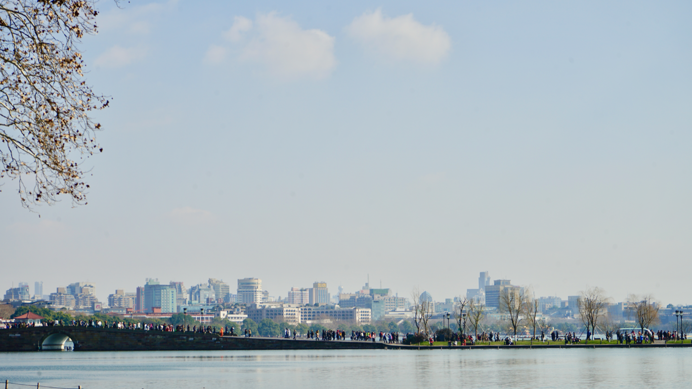

# 一 杭州本地

{ width="640" .center }

杭州在匆忙的过客眼中是一座城市，在常居者的生活谱系里则是截然不同的另一座。

行色匆匆的游人往往受制于程式化的路线：断桥打卡、灵隐进香、河坊街买伞、临湖大馆品尝东坡肉。午后三点，喧嚣的人群循着导游旗涌过白堤，扩音喇叭里反复流转着白蛇断桥的传说。这一重杭州依托成熟的商业设施运转不休，却与真实的城市肌理渐行渐远。

常居者所熟悉的杭州则藏于另一重静谧时空中。周六清晨，循着蜿蜒山道前往龙井村品饮头道春茶，茶农依约留着明前狮峰；午后步入良渚博物院，静观五千年前神人兽面纹玉琮的微雕工致；薄暮时分转入小河直街的深巷，在老面馆里要一碗细面少汤的片儿川。仲秋移步满觉陇寻桂，隆冬前往灵峰探梅，皆能避开人潮。西湖自然亦是常去的，但极为讲究时段与视角：偏爱清晨六点薄雾初散的苏堤、雪落无声的断桥残雪，或是黄昏时分曲院风荷水廊边的一席静坐。

本章旨在剔除流于表面的喧嚣打卡，甄选值得反复体味的经纬：既有西湖深处被大众忽略的时间与构图，亦有西湖之外无需排队、少有人造喧哗的真实风土。住宿甄选万豪体系内区位与品质俱佳的居所，餐饮探寻传承老味的地道馆子，并附有一份清晰的月份物候指南，助你在最得宜的时令里领略江南气韵。

杭州可作一日浮光掠影之游，亦堪细品数日乃至一周；唯有放缓步调，方见真章。

## 万豪推荐（杭州）

### 杭州西湖国宾馆
**Autograph Collection** · 杨公堤丁家山 · 携程 4.8 · ¥3200+

1953 年建成的老国宾馆，毛泽东住过 27 次，G20 国宴也在这里。八幢临湖小楼组成，独占西湖南线一段湖岸，客房窗外就是西湖。房间硬件不及新酒店，但氛围是国宾级。中餐厅涌金阁的杭帮菜在杭州前三，必须订位。适合愿意为湖岸位置和历史叙事付溢价、不挑浴室细节的住客。

### 杭州JW万豪酒店
**JW Marriott Hangzhou** · 武林广场 · 携程 4.7 · ¥1000-1800

武林广场地铁 600 米，离西湖打车 10 分钟，是杭州万豪系里最方便刷西湖的一家。运河景房比城景房值。中餐厅做粤菜，早餐 JW Café 偏国际化，本地味淡。Bond 大堂吧的鸡尾酒水准在杭州前三。适合第一次来、行程以西湖和武林商圈为主、想要标准万豪硬件的人。

### 杭州钱江新城万豪酒店
**Hangzhou Marriott Hotel Qianjiang** · 钱江世纪城 · 携程 4.7 · ¥800-1300

奥体中心旁，房型 285 间是真江景，没有对面楼挡。游泳池是杭州万豪系里最大的之一，早餐本地化菜品多，片儿川和小笼都做。地铁直达西湖二十分钟。适合家庭、长住、想要开阔江景但不上顶级预算的人。周边晚上冷清，吃饭要打车过江。

### 杭州西溪喜来登度假大酒店
**Sheraton Grand Hangzhou Wetland Park Resort** · 西溪湿地 · 携程 4.6 · ¥900-2000

西溪湿地正门外，是用来配西溪的，不是用来配西湖的。湿地景观房阳台正对水面，清早能看到白鹭。中餐厅杭帮菜比城里几家认真，因为湿地里就有本地茶农供货。适合早春看芦苇返青、晚秋看柿子的住客，住一晚第二天清早进湿地。到西湖打车 30-40 分钟。

## 当地特色酒店

### 杭州西子湖四季酒店
**Four Seasons Hotel Hangzhou at West Lake** · 杨公堤金沙港 · 携程 4.8 · ¥4500+

西湖边唯一的国际顶奢，2010 年开业。江南园林布局，客房隐在几组小院里，门口到房间要穿竹林步道。露天石板泳池冬天供暖，全年能游。中餐厅金沙厅是杭州米其林一星，虾爆鳝面单做一道菜上桌。适合度蜜月、过周年、要安静和私密度的两人。

### 杭州柏悦酒店
**Park Hyatt Hangzhou** · 钱江新城万象城 · 携程 4.8 · ¥2500-4500

2016 年开业，柏悦的极简文人路线，公共区域用了宋画元素和本地艺术家作品。客房尺度比 JW 万豪大一档，浴室双台盆配独立浴缸和步入式淋浴。和威斯汀只隔一条街，但调性偏审美而非商务。适合钱江新城刷夜景、对设计酒店有要求的住客。

### 杭州富春山居
**Fuchun Resort, an Aman destination** · 富阳庙山坞 · 携程 4.8 · ¥5000+

建在《富春山居图》原型山谷里，2003 年开业，中国最早的国际级度假村之一，现归 Aman。沿山势铺开的低密度别墅，配 18 洞高尔夫球场、茶园、SPA。距杭州市区一小时车程。适合住三晚以上、把进山当度假节奏的人，不适合双线行程。

### 杭州西溪悦榕庄
**Banyan Tree Hangzhou** · 西溪湿地内 · 携程 4.7 · ¥2600+

少数建在景区里而不是景区旁的度假酒店，2010 年开业。72 栋独立别墅，每栋带私家庭院和水道，从客房直接划船桨进湿地。配 SPA、泳池、私家码头。适合不想出酒店、把湿地当后院的两人。到西湖打车 40 分钟，纯刷西湖不要选。

### 浙江西子宾馆·汪庄
**Zhejiang Xizi Hotel** · 南山路雷峰夕照 · 携程 4.7 · ¥2000-3500

1927 年建的西湖四大名园之一，三面濒湖独占西湖南岸 1/10 湖岸线，客房窗外就是雷峰塔倒影。1972 年尼克松访华和 2016 年 G20 都在这里接待。建筑是五十年代和八十年代两段风格混搭，没有现代连锁的硬件参数感。适合喜欢民国和共和国早期外交史氛围、不挑现代浴室细节的住客。

### 杭州法云安缦
**Amanfayun** · 灵隐 · 携程 4.6 · ¥6000+

灵隐寺旁的法云古村改造，安缦把 47 间老民居做成客房，保留夯土墙、石板路、村落地势。客房分散在村中，从大堂走到房间要穿过菜地和柿子树，是亚洲安缦里最有村子感的一家。适合愿意为氛围付溢价、住三晚以上慢慢过日子的住客。蒸菜餐厅好但晚餐贵。

### 杭州君悦酒店
**Grand Hyatt Hangzhou** · 湖滨步行街 · 携程 4.6 · ¥1500-2500

2003 年开业，西湖东岸位置无可替代：步行五分钟到断桥，二十分钟走到吴山广场。湖景房从落地窗看西湖东岸全景，雷峰塔、保俶塔、苏堤一线收齐。中餐厅湖滨 28 杭帮菜认真做。适合第一次来杭州、行程以西湖为主、不在乎硬件不算最新的人。

## 杭州值得去的地方

#### 西湖（错峰与适宜视角）

西湖(5A)的游览体验关键在于时段与视角的抉择。午后两点至四点的断桥、三潭印月与雷峰塔周边，往往游人如织，难以领略湖山静穆的本色。

适宜的游赏方式可分三段：其一是清晨六点漫步孤山。乘车至岳庙，自西泠桥缓步登上孤山，清晨山上多为晨练常客。自孤山远眺保俶塔的构图，深契明清文人画的萧散意趣；沿途可拜谒林逋墓与放鹤亭，瞻仰创立百余年的金石名社西泠印社（章太炎、吴昌硕、马一浮等先贤曾在此驻足讲学）。其二是傍晚漫步苏堤与白堤，待暮色四合、人潮渐退，自断桥北端向西行至平湖秋月，恰见残阳隐入西山塔影。其三是寻访北山街近现代建筑群，自葛岭路拾级而上，春润庐、抱青别墅、坚匏别墅等一众青砖灰瓦的宅邸依山而建，若逢落雪之日，更显幽邃。

避坑提示：雷峰塔现存建筑为 2002 年落成的钢结构仿古塔，内置观光电梯，与古塔原貌相去甚远；湖中三潭印月小岛人流高度密集，亦不必专程登岛。

### 龙井村 + 茅家埠

龙井名扬四海，而核心传统产区向有"狮、龙、云、虎、梅"（狮峰、龙井、云栖、虎跑、梅家坞）五村之称。龙井村地势起伏、茶树植根深厚，自明清起便为御茶产地，胡公庙前乾隆御封的十八棵茶树至今犹存。

前往时可由杨公堤转入龙井路，一路蜿蜒至龙井村牌坊后步行入村。村中茶舍林立，宜选常年开门、陈设素雅的茶农小院，由主人亲手瀹茶。可依喜好垂询明前或雨前茶：雨前香气馥郁高扬，明前滋味细致鲜爽。茅家埠位于龙井路下山口，地处西湖西部水域，水浅草丰、白鹭栖止，因无大型游船码头而格外清幽。沿茅家埠湿地木栈道漫步返回西湖主湖区约需一个半小时，沿途多为寻幽漫步的常居者。

避坑提示：龙井路上标有大型仿古牌楼的所谓"御茶"商业景点，常有高价推销，建议直接进入村内茶户探访。

### 良渚遗址公园

良渚为距今五千年的早期区域性国家城市文明遗址，2019 年列入联合国教科文组织《世界遗产名录》，为实证中华五千年文明史提供了确凿的考古依据。良渚规模宏大的古城外郭、复杂的水利工程体系、等级分明的玉器礼制以及发达的稻作农业，展现出高度成熟的早期文明形态。

公园位于杭州城北，可乘地铁 2 号线至良渚站后转乘接驳。建议先造访良渚博物院，再前往遗址公园，方能建立系统的文明认知。博物院内重点观摩玉琮王（刻有繁复神人兽面纹）、玉钺、玉璧及出土漆木器；随后在遗址公园实地探访反山王陵、莫角山宫殿基址与外围庞大的水利堤坝系统。全园适宜结合步行与观光车徐徐游览。

深秋时节（10 月下旬至 11 月中旬）最为适宜，稻田收割后泛出淡金暖色，与夯土城墙遗址浑然一体。夏季遮阴较少，需注意防晒避暑。避坑提示：遗址区内部分现代复原的古城门景观偏于概念演绎，核心审美仍在于真实的台地地貌与博物院珍品。

### 小河直街 + 大兜路

京杭大运河杭州段最具市井烟火气息的街区。小河直街地处拱墅区，明清时期为运河码头工匠与米商聚居之所。整条街巷依水而筑，保留着两层木结构的传统水乡民居，下铺上居，至今仍延续着原住民的生活常态。

适宜于清晨七点至九点前往，此时运河两岸市井初醒，沿河老面馆的片儿川与葱油拌面热气腾腾。运河对岸的大兜路历史街区紧邻香积寺，经修缮后入驻了多家独立咖啡馆与精酿空间，适宜傍晚凭河小酌。

此二处街巷与商业化模板式的仿古步行街截然不同，保留了鲜活的江南水岸日常。避坑提示：街区周边部分微型主题展馆展陈较为单薄，无需特意耗时；香积寺主殿为现代重修，重点宜放在运河水岸的漫步体验。

### 灵隐寺 + 飞来峰

灵隐寺始建于东晋咸和元年（326 年），历史深厚。现存大雄宝殿等主要建筑虽多为近代重修，但寺前飞来峰的摩崖造像群堪称江南佛教艺术的瑰宝：自五代至宋元时期，石壁间错落分布着 470 余尊精美石刻，其规模与艺术价值在华东地区首屈一指。

其中青林洞口的布袋弥勒坐像是南宋世俗化造像的传世代表，神态开朗生动；而沿溪石壁上的元代梵式藏传佛教造像群（如头戴五叶冠的菩萨与多臂明王像），更是元代密教艺术南传的珍贵实物见证。

建议于早晨 8 点前抵达飞来峰检票口，趁旅行团尚未抵达时静心观摩造像石刻，随后入寺礼佛，全程约需两小时半。避坑提示：景区外围个别人造主题园林缺乏历史价值，径直前往飞来峰核心摩崖区域即可。

### 西溪湿地

西溪(5A)是杭州城西珍贵的次生湿地，自宋代便有"西溪且留下"的佳话。与西湖群山环抱的开阔水域不同，西溪由纵横交错的细密水网、桑基鱼塘与茂密柿林交织而成，呈现出典型的水乡野趣。

一年之中尤以春秋两季最为得宜：早春三四月间，两岸桃花盛开、杨柳夹道，泛舟水道宛如穿行粉翠画卷；深秋十一月，两岸芦花飞白，火柿缀满枝头。

建议由东区（深潭口）入园，体验人工摇橹船慢行于岔道港汊之间，船工摇橹掌舵，水声欸乃，远比常规电瓶快船更具幽趣。沿水岸木栈道漫步全程约 5 公里。避坑提示：园区内个别收费仿古园林及影视取景宣传缺乏在地历史底蕴，不必耗时停留。

### 钱塘江夜色（钱江新城）

新世纪以来，杭州的城市天际线逐步从西湖时代迈向钱塘江时代。钱江新城中央商务区与对岸钱江世纪城隔江相望，构建出现代都市的雄浑画卷。由市民中心广场延伸至杭州国际会议中心（金球）的沿江景观带，是领略江景的理想视野。

黄昏六时许漫步至江畔，可先在市民中心开阔平台上目送落日隐入老城天际线，继而沿江漫步欣赏江面夜景与两岸建筑光影。适宜与钱江新城万豪或周边酒店的高空酒廊行程相结合。

避坑提示：沿江散步视野开阔且从容，无需专门购票乘坐短途夜游游船。

### 富春山居 + 黄公望故居

自杭州东站乘高铁至富阳站仅需约 15 分钟，出站后驱车前往庙山坞。元代大家黄公望（1269-1354 年）晚年结庐隐居于此，绘就传世名作《富春山居图》。画卷中所描绘的富春江畔峰峦秀润、林木苍翠之景，其地理源头正坐落于这片幽深山坞。

故居依山而建，虽为后世依文献复原，但庙山坞独特的山体起伏与江南植被，与黄公望笔下的"披麻皴"法高度契合。漫步于竹林与茶园之间，对照画卷品味实景，别有会心。适宜于深秋或初冬前往，水汽氤氲、山色沉着，最得黄公望画中气韵。

避坑提示：故居景区小巧幽静，半日往返即可，无须在周边留宿。

### 桐庐 + 严子陵钓台

自杭州东站乘高铁至桐庐站约 30 分钟。东汉高士严子陵隐居富春江畔，辞官不仕、泛舟垂钓，北宋范仲淹作《严先生祠堂记》赞曰"云山苍苍，江水泱泱，先生之风，山高水长"，使此地成为历代文人墨客追慕高洁风骨的精神地标。

景区位于富春江镇，自高铁站前往约需 40 分钟车程。抵岸后乘舟横渡富春江至山脚，拾级登临东台与西台。东台传为严子陵垂钓之处，西台则为南宋谢翱悲歌哭祭文天祥之所。两台之间山脊步道视野辽阔，富春江于山脚大角度蜿蜒转折，江山相映，极为壮阔。

适宜春秋两季前往。避坑提示：周边部分开发过度的普通溶洞景区商业化偏重，若时间有限可专注游赏钓台山水。

### 千岛湖

自杭州东站乘高铁至千岛湖站约 1 小时。千岛湖(5A)前身为 1959 年新安江水电站拦截蓄水形成的大型人工湖泊，湖面广达 580 平方公里，千余座青翠岛屿星罗棋布。

游湖建议选择视野开阔的东南湖区（梅峰岛、龙山岛等），登临梅峰岛顶观景台，可俯瞰千岛竞秀的壮丽全貌，云雾升腾之时更显气象万千。品尝千岛湖鱼头，建议避开景区周边千篇一律的速食餐馆，寻访环湖信誉良好的老店，体验现熬白汤的鲜醇原味。

适宜夏初与早秋游览。避坑提示：湖中部分早期开发的微型人工主题岛屿内容单薄，游览时宜侧重自然湖山全景。

## 杭州吃什么

### 奎元馆（中山中路总店）

杭州老字号面馆代表，创于 1867 年（清同治六年）。招牌为片儿川（倒笃菜、鲜笋片配瘦肉丝浇头）与虾爆鳝面（鳝鱼现炸爆炒、河虾鲜嫩）。中山中路总店保留着传统市井风貌，出品稳定、出餐利落。建议在午前 11:30 前抵达以避开客流高峰。避坑提示：交通枢纽及部分商圈新开分店出品水准有所波动，仍首推中山中路老店。

### 知味观（仁和路总店）

百年餐饮名号，初创于 1913 年。仁和路总店临近西湖，一楼供应传统面点小吃，亦有外带点心档口。招牌首推猫耳朵、鲜肉小笼、糯米烧麦与鲜肉粽。周末用餐时段需适度排队。避坑提示：旗下连锁快餐与新式分店风格各异，寻访传统滋味首选仁和路总店。

### 外婆家（湖滨银泰店）

当代大众杭帮菜连锁的早期代表。若在杭逗留时间有限，希望便捷品尝茶香鸡、麻婆豆腐与西湖牛肉羹等大众风味，湖滨银泰店地理位置优越，晚间错峰前往无需久候。避坑提示：节假日正餐时段候位时间较长，宜错峰就餐。

### 老头儿油爆虾（孩儿巷店）

品尝传统杭帮油爆河虾的代表馆子。油爆虾讲究油温火候，外壳焦脆金黄、虾肉鲜甜紧致，甜咸适口。另配响油鳝糊、糖醋排骨与酒酿圆子，皆具老派杭菜特色。建议提前订座。

### 龙井草堂（龙井路 399 号）

杭州文人雅宴与节气餐饮的高水准代表。坐落于龙井村前往虎跑的山谷林泉之间，独门幽院、竹林掩映。餐厅恪守二十四节气严选在地食材，土鸡汤、东坡肉、清炒虾仁与时令鲜笋层次分明。人均消费较高，需提前一周以上预约。避坑提示：该店强项在于江浙风物与山林珍味，点单宜侧重传统节气土菜。

### 新白鹿

性价比突出的本地老牌连锁，菜品涵盖家常杭菜经典，如茶香鸡、糖醋里脊、椒盐大虾与雪菜大黄鱼，出品稳定扎实。适合在市区游览间隙作为省心可靠的用餐选择。

### 绿茶餐厅（西溪店或湖滨店）

新派融合杭帮菜，起源于西湖茶园畔。招牌菜品包括绿茶烤肉、面包诱惑等。西溪店与湖滨店环境较为雅致，水准相对沉稳，建议提前线上取号或错峰前往。

## 杭州的最佳季节

### 春：3 月下旬至 4 月中旬

江南物候最盛的时节。3 月下旬樱花与桃花竞放，太子湾公园郁金香与早樱交织成锦绣花海（宜清晨 7 点前入园避开人潮）；4 月初杨柳垂青、水汽溟濛，呈现西湖"柳烟"的经典风貌。此期恰逢明前龙井采摘制茶尾声，前往龙井村品饮头道新茶最为应季。春雨绵绵，出行宜常备雨具。

### 夏：7 月至 8 月

梅雨过后即入盛夏。7 月至 8 月中旬为西湖荷花鼎盛之期，曲院风荷、北里湖与平湖秋月一带接天莲叶、荷香四溢，清晨 5:30 至 7:00 晨光初照时最为清幽。杭州盛夏气温偏高，户外探访宜集中于清晨与黄昏，正午时分可安排室内展馆或前往千岛湖、富春江畔寻幽消夏。

### 秋：10 月下旬至 11 月中旬

杭州气候最为宜人舒爽的黄金期。9 月末至 10 月上旬满觉陇与龙井山道金桂飘香；10 月底至 11 月中旬，北山街梧桐泛金、九溪红枫渐染，良渚古城稻谷金黄、西溪湿地火柿盈枝。气温维持在 15 至 22 度之间，天高气爽。秋季订房宜提早规划。

### 冬：12 月至 1 月

冬季的杭州展现出静穆深沉的人文气象。隆冬若遇降雪，西湖断桥与孤山银装素裹、宛如水墨画卷，需密切关注天气预报，于初雪降下时即刻前往；1 月中旬灵峰与超山梅花初绽，暗香浮动。此时游人稀少，漫步北山街近代建筑群或西溪湿地枯苇水岸，最能体味江南冬日的清旷意境。
