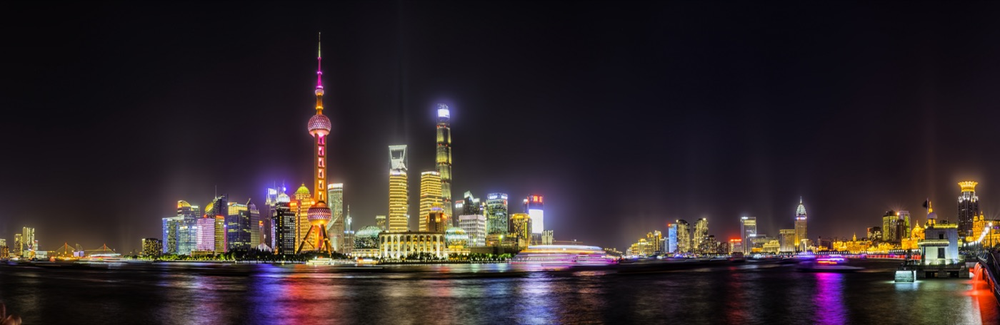
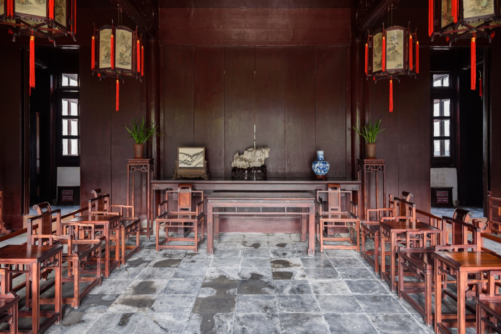
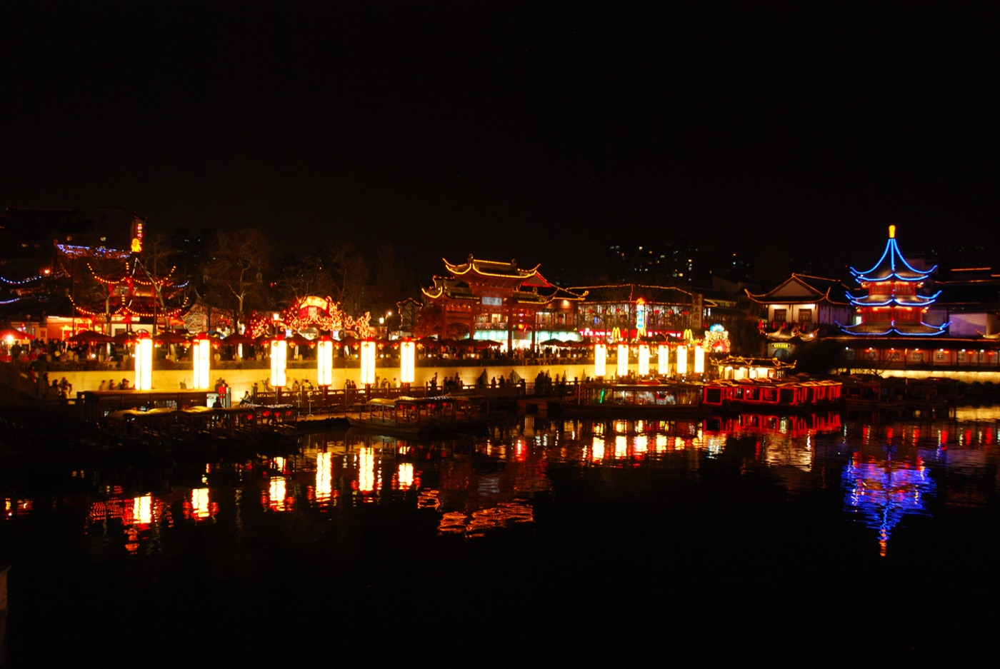
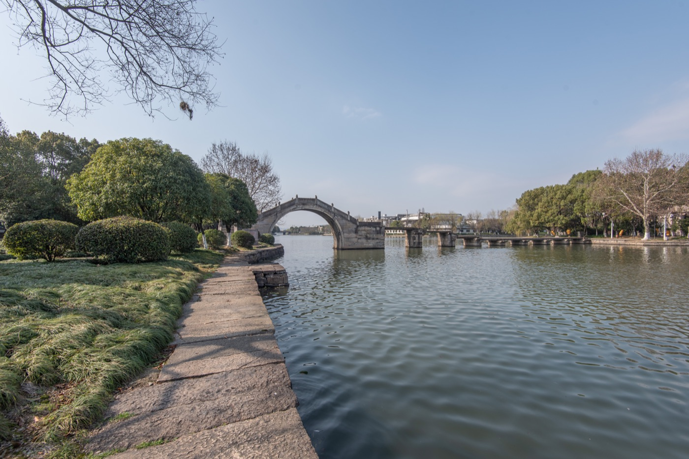
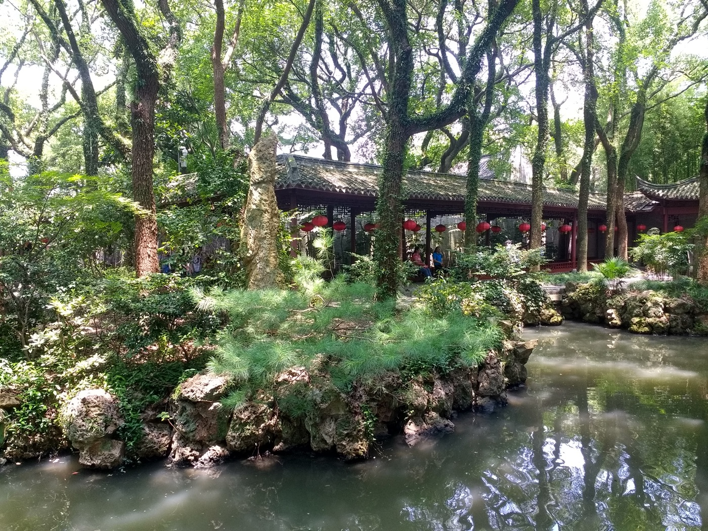
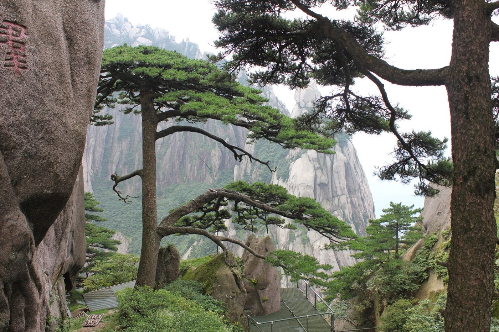

# 二 短途圈（1-2 小时）

短途圈是杭州出发最该被用足的一圈。一小时多一点的车程意味着周五下班赶 20:00 那班 G 字头，到酒店还能下楼吃夜宵；周日晚饭后再上车，回家洗完澡刚好十一点。一个双肩包就够：换洗衣物、相机、充电器、一双备用鞋。住一晚和住两晚的边际成本几乎只是房费本身。

正因为来回轻，这圈最适合错开节假日。十一、五一这种全国长假里，外滩和拙政园(5A)不能去，但上海博物馆东馆、南京博物院、宁波天一阁(5A)这些偏冷的硬核选项依旧能走。淡季的周中房价能砍到周末六折，挑周二周三去苏州和绍兴是常被忽略的窗口。

六个城市的调性差得远。上海是国际都市的样本，看的是当代和近代叠加；苏州走园林和水巷，慢；南京是六朝和民国的厚度，博物馆和陵墓为主；绍兴是文人故里，鲁迅王羲之的密度；宁波是港口城市的低调，藏书楼加海鲜；黄山是这圈唯一的纯自然项目，要换山路鞋。把它们排在同一圈，只是因为车程相近，玩法完全不互相替代。

下面按城市拆开。

## 上海

{ width="640" .center }

上海和杭州的差异不在风景，在密度。杭州一天消化两到三个点，因为西湖周边松散；上海一个下午能走完外滩、武康路、思南公馆三段，因为城市本身按高密度路网铺开。所以上海适合"集中刷"的节奏：早出门、街区一段段啃、晚上回酒店泡澡。不适合带老人，步行公里数动辄十公里。也不适合想看古迹的人，明代以前的东西基本不在地面上，都进了博物馆。来上海要带的判断很简单：你是来看 1843 年以后这一百八十年的事的，再往前要去南京。

### 高铁

杭州东到上海虹桥，最快 45 分钟，常规班次 1 小时整。早上 6:30 起每十几分钟一班，到 22:30 末班。上海站（老北站）班次少，主要走 D 字头，1 小时 20 分上下，停得多。除非住在静安寺以北、北外滩附近，否则都该买虹桥的票，因为虹桥换 10 号线和 2 号线对接整个市中心更顺。

座位上，1 小时车程不值上商务座，差价两三百块只换 45 分钟的真皮座椅，不划算。一等座比二等座宽一点，靠窗能放杯子，多花六十块可以接受。二等座足够，唯一的问题是节假日早晚高峰满员，上车前买不到一起的两个座，这时候宁可往后挪一班车。

### 万豪推荐

按携程评分从高到低排。

### 上海宝格丽酒店
**Bulgari Hotel Shanghai** · 静安苏州河北岸 · 携程 4.8 · ¥6000

万豪 LXR 旗下，外滩源步行五分钟就到。客房整片黄铜配深木，卫浴全大理石、独立浴缸和淋浴间分开，水压在沪上五星里靠前。一楼 Il Ristorante Niko Romito 是米其林一星意餐，午市套餐性价比比晚餐高出一截。适合想要外滩位但不想被南京东路游客淹没的人。避雷：晚上从外滩走回酒店那段路在施工，打车更稳。

### 上海浦东丽思卡尔顿酒店
**The Ritz-Carlton Shanghai, Pudong** · 陆家嘴 IFC 53 楼以上 · 携程 4.7 · ¥3500

陆家嘴 IFC 顶部的高区房，江景房正对外滩三件套。两类人合适：出差顺住要东方明珠(5A)正面景的、带小孩要硬件最稳的。58 楼的 Flair 露台酒吧黄昏去最好，能拍到反向外滩。避雷：浦东这一侧吃饭都在商场里，没有上海街区的烟火气。来上海"刷街区"的人不该住浦东。

### 上海静安瑞吉酒店
**The St. Regis Shanghai Jingan** · 静安寺商圈 · 携程 4.7 · ¥2500

地铁 2 号 7 号线交汇，南京西路和巨富长街区步行半小时内全部覆盖。瑞吉管家服务标配，行政酒廊江景一般但出品稳。客房空间在静安一带大酒店里偏大。适合走街区动线、又不想牺牲品牌服务的人。

### 上海浦东文华东方酒店
**Mandarin Oriental Pudong, Shanghai** · 陆家嘴滨江 · 携程 4.7 · ¥3500

陆家嘴沿江一侧，江对岸正对外滩天际线。文华东方亚洲服务标准的代表，餐厅艾利爵士轩做得稳，SPA 是浦东最好的之一。江景房比丽思卡尔顿同位置低一档高度但更近水面。避雷：和丽思一样的浦东问题，吃饭都得在商场里。

### 上海艾迪逊酒店
**The Shanghai Edition** · 黄浦南京东路中段 · 携程 4.7 · ¥3000

外壳是 1929 年的电力公司大楼，内里全部翻新成 Edition 一贯的低饱和低照度风格。步行三分钟到外滩。顶楼 Roof 酒吧能看到陆家嘴三件套，但要提早一周预约、最低消费一人 300。地下二楼的 Hiya 做日式定食，比西式自助有看头。避雷：南京东路这一侧的房间晚上 11 点前都很吵，订房一定指定河景或内院。

### 上海波特曼丽思卡尔顿酒店
**The Portman Ritz-Carlton, Shanghai** · 静安南京西路 · 携程 4.7 · ¥2500

1990 年开业，丽思在中国大陆的第一家。位置无可挑剔（南京西路上海商城内），但建筑硬件偏老，电梯偶尔慢一点。客房翻新过一轮，质感比账面年龄好。适合订位看重位置而不是新酒店硬件的人，常客密度极高。

### 上海明天广场 JW 万豪酒店
**JW Marriott Hotel Shanghai at Tomorrow Square** · 黄浦人民广场 · 携程 4.7 · ¥1500

人民广场西侧地标尖塔楼，38 楼大堂是这家的招牌，城市俯瞰干净。走南京路加人民广场动线最顺。客房从 38 楼往上展开，体感比同价位的浦东酒店更"上海"。早餐做得规整，行政酒廊鸡尾酒时段有诚意。

### 上海外滩瑞吉酒店
**The St. Regis on the Bund, Shanghai** · 黄浦外滩源 · 携程 4.7 · ¥3500

外滩源地段，紧邻圆明园路历史建筑群，步行五分钟到外滩。外滩系瑞吉覆盖市中心+瑞吉管家标准服务，是外滩位的万豪系综合性价比最高选项之一。行政套房能看黄浦江，下午茶精致。适合以外滩为重心、要瑞吉积分的行程。

### 上海威斯汀大饭店
**The Westin Bund Center, Shanghai** · 黄浦外滩延安东路 · 携程 4.6 · ¥1800

外滩延安东路，步行三分钟到外滩，地铁 2 号线南京东路站。天梦之床稳定，健身中心 24 小时，出行便利度在外滩万豪系里属高。适合看重外滩位置又不需顶级奢华配置的商务和旅游客。

### 上海外滩 W 酒店
**W Shanghai - The Bund** · 北外滩苏州河口 · 携程 4.6 · ¥2000

北外滩苏州河口，正对外滩三件套，是这一档里看景最便宜的选项。Yen 粤菜在沪上 W 系里水准最高。客房色彩饱和度高，床品偏硬，不是所有人都喜欢。适合年轻客群和拍照需求，行政房升级常常能蹲到。

### 上海龙之梦万丽酒店
**Renaissance Shanghai Zhongshan Park Hotel** · 长宁中山公园地铁站上盖 · 携程 4.6 · ¥800

长宁路 1018 号龙之梦广场内，2 号 3 号 4 号线交汇的中山公园站正上方，去虹桥三站、去静安五站、去陆家嘴一线直达，是上海万豪系里地铁动线最强的一家。客房布在 25 层以上，套间和复式房型多，采光在万丽体系里居前。楼下连通龙之梦购物中心，吃饭和补给不必出门。适合不想被打车困住、也不需要外滩景观的旅客。

### 上海特色酒店

不在万豪体系里、值得为名字和场所本身住一次的几家。

### 上海半岛酒店
**The Peninsula Shanghai** · 外滩源最北段 · 携程 4.6 · ¥4500

2009 年开业，是外滩百年来唯一新建的整栋老式风格酒店，建筑做得克制。陆家嘴江景正面，房间空间在外滩五星里最舒展。Sir Elly's 14 楼露台景观一流，下午茶比午餐性价比高。适合一辈子来外滩住一次的人。

### 上海四季酒店
**Four Seasons Hotel Shanghai** · 静安威海路 · 携程 4.7 · ¥2800

距南京西路五分钟步行，1989 年项目改造，房间空间大、隔音好，是上海老钱阶层订位的常选。一楼粤菜思汀是本地老饕饭局基地，订位至少提前两周。Tripadvisor 老牌排名里常年挤进上海前五。

### 上海璞丽酒店
**The PuLi Hotel and Spa** · 静安公园对面 · 携程 4.6 · ¥2500

国内最早一批做 city resort 的酒店，76 米的中央泳池配落地玻璃看静安公园是签名场景。客房中式当代设计，浴室开放式但隔音不算特别好。适合不在乎品牌、要安静住一晚再出门刷街区的人。

### 上海安缦养云
**Amanyangyun** · 闵行马桥 · 携程 4.7 · ¥9000

把江西抚州明清古宅整体迁建复原再做现代度假村，市区西南 30 公里。不是市区酒店，是从市区出发的"远郊静修"项目，去机场比进市区还顺。早餐和 SPA 是亮点，价格在沪上独一档。专门来住的人会把它当目的地，不当过夜处。

### 行程

休闲版，不赶。

**半天**：外滩到武康路一条线。外滩上午看光线，地铁 10 号线到武康大楼，武康路到安福路慢走，下午找一家咖啡馆坐下来。

**一天**：上午外滩源加苏州河北岸（四行仓库、邮政博物馆），中午到静安寺商圈吃午饭。茶歇随便挑一家公馆系小馆，下午武康路加巨鹿路，傍晚回外滩看陆家嘴亮灯，本帮菜餐厅吃晚饭。

**两天**：第一天按上面走。第二天上午留给上海博物馆东馆（最好提前 App 预约），中午陆家嘴边上吃个粤菜简餐，下午龙美术馆西岸馆或西岸美术馆任选一家，晚上挑一家粤菜或本帮菜。两天能把租界历史和当代艺术都过一遍，不用爬楼，不用赶路。

### 景点详介

**外滩 + 苏州河**。1843 年开埠后逐步建成，现存 52 栋老建筑里以汇丰银行（现浦发银行总行）和海关大楼最值得近看。1923 和 1927 年完工，前者圆顶马赛克要进大堂才看得到。看外滩的最佳时间是早上 6:30 到 7:30，江风干净、游客没醒，光线打在建筑正面最有戏。傍晚和晚上太挤，节假日尤其。建议从外滩源（北端）走到金陵东路（南端），全长 1.5 公里，再过桥到对岸看反向。苏州河北岸最近十年才整理出来，从外白渡桥往西一公里到四行仓库，比正面外滩冷清得多，建筑密度和故事密度都不输。避雷：陈毅广场那一段的"网红观景台"是踩点拍照位，不是看建筑的位置。

**武康路 / 巨鹿路 / 安福路**。法租界核心，1920-1930 年代建成。武康大楼路口被网红化以后，每个周末上千人在十字路口拍照，秩序很差。绕开的办法是工作日下午两点到四点去，或者从安福路（话剧艺术中心那段）走起，向西穿到武康路中段，避开最堵的路口。这一带的真实价值不在拍照，在保存完整的 1930 年代里弄住宅和洋行公寓，路边的法国梧桐已经长到第三代。可以拐进巨鹿路 675 号（爱神花园，作协）和巨鹿路 889 号（Ferguson Lane）。建议两到三小时，慢走。避雷：网红咖啡店没有一家是必须的，本地咖啡的水平在街区平均线之上但不出彩。

**上海博物馆（人民广场馆 + 东馆）**。人民广场馆是 1996 年建成的老馆，青铜器和瓷器陈列国内顶尖。东馆 2024 年开放，在浦东花木地铁站旁，体量是老馆的三倍，把书画、古籍、考古一起搬过来，部分馆区还在分阶段开放。两个馆都免费，提前一天 App 预约。看的逻辑：青铜器去人民广场，能看到大克鼎、子仲姜盘、晋侯苏钟一整套教科书级标本；瓷器和书画去东馆，新陈列动线更舒服。每个馆建议给两到三小时。避雷：节假日老馆 10 点之前进，否则青铜器厅排队。

**思南公馆 / 张园**。两个都是花园洋房改商业街区的项目，但完成度不同。思南公馆 2010 年完成，全部是 1920-1940 年代独立花园住宅，被改造成酒店、餐厅、书店，密度低、走廊宽，是上海少数能感受到老租界尺度的地方。从复兴中路一侧进去，沿南北向走一圈四十分钟。张园在南京西路北侧，2022 年改造完毕，做奢侈品集合店，建筑修得漂亮但商业气更重。要选一个，思南更耐看；张园适合二十分钟快速过一遍。避雷：思南公馆的餐厅没有一家是非吃不可的，吃饭不用专门留在这里。

**龙美术馆西岸馆 / 西岸美术馆**。两馆都在徐汇滨江，步行十分钟距离。龙美术馆是私人馆，刘益谦王薇收藏，常设展强项是中国近现代和当代，门票常常因为大展开停。西岸美术馆是和巴黎蓬皮杜五年合作期项目，每年三个常设展轮换，是上海看西方现当代最稳的地方。两个馆加滨江步道可以排一个半天，下午两点到六点之间最好，晚上滨江看黄浦江西岸的工业遗址灯光是补充。避雷：周一两馆都闭馆，提前查。

### 吃

- **苏浙汇（淮海中路店）**：本帮菜稳妥牌，红烧肉、油爆虾、八宝鸭都到位。人均 250。
- **福 1088**：思南公馆附近的老洋房本帮菜，环境贵气，需提前一周订位。人均 700。
- **老吉士（天平路）**：本地老克勒打卡的本帮菜，店面破旧菜真实，需排队。人均 300。
- **席家花园（书院路）**：花园洋房本帮菜，露天位置好。人均 350。
- **南兴园（巨鹿路 889 号）**：粤菜里的稳妥选择，茶位干净。人均 400。

### 最佳季节

10 月到 11 月最好，干燥凉爽。3 月底到 4 月初次之，玉兰先开、樱花跟上，街区里很好看。避开 7-8 月（湿热到走五分钟就要进店避暑）和 12-2 月（湿冷，体感比北方零下还难受）。梅雨季 6 月中到 7 月初下连阴雨，户外景点会废一半。

## 苏州

{ width="640" .center }

苏州的核心是园林。园林不是公园，是私家宅邸里把山水缩到院子的一种营造方式，密度极高、寸步皆景。问题是园林经不起人多。拙政园节假日一万人入园，水榭里挤得连转身都要侧身，整个空间逻辑就垮了。所以苏州行程的成败取决于能不能错开人流：要么淡季周中去，要么早上七点半开门进、十点之前出来。和上海比，苏州是慢的、是要坐下来听蝉鸣的，不适合一天打卡五个地方。带长辈和小孩很合适，路面平、景点离得近、地铁直接到拙政园门口。

### 高铁

杭州东到苏州北最快 1 小时 20 分。苏州北站离老城区（拙政园、平江路一带）打车要 25 分钟、35 块。苏州站（火车站）才是离老城最近的，但高铁班次少很多，且大部分是过路车。优先苏州北加打车，只在出发时间正好对得上苏州站的时候考虑后者。商务座一等座没必要，二等座 1 小时 20 分够用。

### 万豪推荐

按携程评分从高到低排。苏州万豪体系在老城区里弱，最好的几家都在园区或太湖沿岸。

### 苏州福朋喜来登酒店
**Four Points by Sheraton Suzhou** · 工业园区月亮湾 · 携程 4.8 · ¥600

工业园区月亮湾畔，俯瞰独墅湖一线湖景。是这一档里评分最高、价位最低的组合。客房翻新做过，硬件比账面年龄好。早餐和湖景是亮点。适合预算敏感、又不愿意住老城区那些已经发旧的酒店的人。避雷：到拙政园打车 25 分钟，看园林为主的人要多算通勤。

### 苏州万豪酒店
**Suzhou Marriott Hotel** · 高新狮山板块（干将西路 1296 号）· 携程 4.7 · ¥900

干将西路 1296 号，姑苏与高新区交界，紧邻苏州市政府和行政服务中心，地铁 1 号线狮子山站步行十分钟。是苏州万豪系里离老城最近的标准五星，去拙政园、平江路打车十分钟。客房硬件成熟，行政酒廊稳定。适合以老城园林为重心、又想要万豪硬件的旅客；不适合金鸡湖度假向住法。

### 苏州工业园区 W 酒店
**W Suzhou** · 工业园区金鸡湖东岸 · 携程 4.7 · ¥1500

金鸡湖东岸，距老城打车 20 分钟。客房色彩饱和度高、床品硬，是 W 一贯的风格。Yen 粤菜水准在苏州中上，泳池夜场氛围在江浙 W 里偏好。适合两类人：带小孩要泳池硬件、看金鸡湖夜景。避雷：每天通勤老城 40 分钟，看园林为主的人不要选。

### 苏州湾艾美酒店
**Le Méridien Suzhou, Suzhou Bay** · 吴江太湖新城 · 携程 4.8 · ¥800

吴江区太湖新城，看东太湖。Tripadvisor 旅客评分 5.0 / 5，是这圈里游客口碑最稳的度假酒店。专门为太湖度假来住的人值得选，和老城园林动线分开看。285 间客房配落地窗，多数面湖。避雷：到苏州老城打车 40 分钟，不是看园林的住宿基地。

### 苏州太湖万豪酒店
**Suzhou Marriott Hotel Taihu Lake** · 吴中区太湖边 · 携程 4.7 · ¥800

太湖东岸，是苏州太湖区域的万豪旗舰度假型酒店。客房景观面湖，设施齐备。适合太湖度假为目的、不急着看老城园林的旅客。

### 苏州万怡酒店
**Courtyard by Marriott Suzhou** · 工业园区星海街 188 号 · 携程 4.6 · ¥600

工业园区中央商务区，星海街 188 号，地下直通地铁 1 号线星海广场站，去苏州中心和金鸡湖步行十分钟。27 层有泳池，硬件比账面年龄好。是园区内价位最亲民的万豪标牌，房型不大但够用。适合预算有限、又想要园区位置和地铁动线的旅客。

### 苏州特色酒店

老城区里的住宿乐趣不在万豪体系。

### 阳澄湖君澜度假酒店
**Narada Resort Yangcheng Lake** · 阳澄湖南岸 · 携程 4.7 · ¥600

阳澄湖南岸，本地系度假村。10-11 月大闸蟹季是首选，餐厅到湖边一步路、酒店食堂出蟹粉小笼能吃到饱。性价比是这一档里最高的。不挂万豪积分。避雷：除了吃蟹季，其他时候没有专程理由。

### 苏州拙政园书香府邸平江府
**Pingjiang Lodge Suzhou** · 拙政园 / 平江路一墙之隔 · 携程 4.7 · ¥1500

明清古宅改造，是苏州少数能"住进园林边"的选择。99% 推荐率，环境和服务分都在 4.8 以上。从酒店步行三分钟到平江路、五分钟到拙政园，是老城核心位置最好的精品酒店。房间数有限，节假日要提前一个月。早餐做苏式面，是亮点。

### 苏州尼依格罗酒店
**Niccolo Suzhou** · 狮山金融区 · 携程 4.7 · ¥1500

狮山金融区，建在仁恒国金中心顶部，城景视野好。115 层的天际大堂是签名场景。是金鸡湖以外苏州最高端的新酒店，2021 年开业。粤菜厅欣厨水准在苏州前列。适合喜欢城景、不一定看园林的客群。

### 苏州安缦阳澄湖
**Aman Yangcheng Lake** · 阳澄湖半岛 · 携程查无评分 · ¥8000+

阳澄湖半岛，市区东北 25 公里。江南安缦的代表作，把江南宅院尺度放到湖边度假村里。住的是安缦本身，不当过夜处。专程定一晚就值。

### 行程

休闲版，不爬山。

**半天**：拙政园加平江路。拙政园早上七点半进、十点之前出，中午到平江路找一家苏式面馆，下午茶歇配评弹。

**一天**：上午拙政园加苏州博物馆（两馆挨着，博物馆是贝聿铭设计、免费、要预约），中午到嘉余坊吃苏帮菜，下午平江路慢走，傍晚网师园夜花园（4 月到 11 月开放，有昆曲表演、需另买票）。

**两天**：第一天按上面走。第二天上午留园加西园寺，中午山塘街吃饭，下午太湖边的某一家咖啡或茶馆坐下来，傍晚回老城吃苏帮菜。这天节奏明显放松，不再赶景点。

### 景点详介

**拙政园**。建于明正德年间（1509），王献臣致仕后买下大弘寺旧址改建，文徵明参与设计。是江南私家园林面积最大的一座，5.2 公顷，分东中西三部分。中部是核心，远香堂、香洲、小飞虹是必看的三处。看拙政园只有一个原则：早。开园 7:30，七点 20 排队，前一个小时整个园子里只有几十个人。八点半之后游客密集，十点以后只能跟着人流推进，水榭里的对景全部被人头切碎。门票淡季 70、旺季 90，提前一天 App 预约。东部园是后期补建的，可看可不看。避雷：所有"园林夜游"都是灯光秀化的产物，和园林本身的审美关系不大。

**留园**。建于明嘉靖年间，比拙政园晚一点，清代刘恕重修。占地 2.3 公顷，比拙政园小，但建筑密度高、廊子和漏窗是全苏州最讲究的。看点是冠云峰（太湖石高 6.5 米，江南三大名石之一）和五峰仙馆的家具陈设。留园游客比拙政园少很多，可以放在下午两到四点之间，不用赶早。建议两小时。避雷：留园门口那条街改造得很商业，进园前不要在门口耗太久。

**网师园**。建于南宋，清代彭启丰重修。占地仅 0.6 公顷，是苏州现存最小的园林之一，但布局极精，被认为是私家园林的教科书。最经典的是月到风来亭和小山丛桂轩。白天看可以排一小时。但网师园真正的看点是夜花园：4 月到 11 月每晚 7:30 开放，园内八个厅堂分别有评弹、昆曲、笛子、古筝表演，按厅走完一圈大约 90 分钟，门票 100，限流 200 人，提前一天买。这是江南园林里少有的能配合夜间体验的项目。避雷：黄金周期间夜花园被旅游团包场，氛围会差。

**平江路 / 山塘街**。两条都是水街，但底色不同。平江路在老城区中心，长 1.6 公里，一边是河一边是民居，保留了苏州古城的街巷尺度。山塘街在阊门外，长 3.6 公里，明清是苏州最繁华的商业街，前半段（近阊门）商业化重，后半段（近虎丘方向）反而清静。要选一条，平江路适合第一次来；山塘街适合走得动、要走长一点的人。建议平江路放在午后，山塘街放在傍晚（夕阳下走完全段，到虎丘门口正好天黑）。避雷：平江路上的"猫的天空之城"和各种网红奶茶店没有意义。

**苏州博物馆（本馆 + 西馆）**。本馆 2006 年开放，贝聿铭设计的封山之作，本身就是建筑史项目。免费、预约。馆藏不算庞大，但虎丘塔出土的五代秘色瓷莲花碗、北宋真珠舍利宝幢是镇馆级。西馆 2021 年开放，体量大很多，做苏州通史和工艺展。两馆都建议去，本馆看建筑加一小时，西馆看展两到三小时。本馆挨着拙政园、忠王府，可以一起排进上午行程。避雷：本馆周一闭馆。

**太湖边 / 三山岛**。休闲版改法：不要专程跑三山岛（船程加岛上往返要一整天）。改成在太湖东山或西山找一家民宿茶馆坐下来，看湖、吃几只阳澄湖大闸蟹（季节对就有），半天一来回。这种节奏比赶岛更对得起苏州的"慢"。

**西塘 / 乌镇 / 周庄取舍**。这三个古镇都不在苏州行政区，但常被排进苏州行程。一句话判断：西塘活着（仍有居民日常生活），乌镇好看但是景区化（西栅是全包式商业），周庄(5A)过度开发不推荐。时间紧，一律建议在苏州城里待满；要去就选西塘加一晚住宿，或者乌镇西栅住一晚。

### 吃

- **新聚丰菜馆（嘉余坊店）**：苏帮菜本地老店，松鼠桂鱼、樱桃肉、响油鳝糊都标准。人均 200。
- **裕兴记（皇宫巷店）**：苏式面馆，秃黄油拌面、三虾面（夏季限定）值得排队。人均 80。
- **同得兴（嘉馀坊店）**：另一家苏式面，焖肉面是经典。人均 60。
- **吴门人家（潘儒巷店）**：环境是苏式厅堂，菜偏精致，适合带长辈。人均 250。
- **桃花源记（平江路店）**：本帮 / 苏帮的折中，外地客的稳妥选项。人均 200。

### 最佳季节

3 月底到 4 月中是首选，玉兰、海棠、紫藤接续开，园林空间感最饱满。9 月到 11 月次之，桂花和柿子。10 月底到 11 月初的红枫在拙政园和留园里都有几株。避开 7-8 月（高湿）和黄金周（园林节假日不能去，是底线）。

## 南京

{ width="640" .center }

南京和这圈其他城市不重叠的地方在它的厚度。明代是首都、民国是首都，两段最完整的政治史叠加在同一座城。所以南京最值得看的不是单点景区，是体系：明孝陵(5A)-中山陵的陵墓体系、南京博物院的国宝体系、颐和路的民国公馆体系。这些体系展开都需要半天到一天，不能像逛上海街区一样两小时刷完。南京适合喜欢历史和读得进解说的人，不适合纯度假的人。带小孩的话，南京博物院是这圈最好的博物馆课堂。

### 高铁

杭州东到南京南，最快 1 小时 5 分，常规 1 小时 15 分。班次密，早上 6:30 到晚上 22:00 几乎每半小时一班。南京南是新站，南京站（老站）班次少。出站后地铁 3 号线 1 号线全城接驳。商务座一等座意义不大，二等座足够。

### 万豪推荐

按携程评分从高到低排。

### 南京华泰万丽酒店
**Renaissance Nanjing Olympic Centre Hotel** · 建邺河西新城 · 携程 4.8 · ¥700

奥体中心走过去 15 分钟。建筑是双子塔造型，房间江景或城景。"熊阿姨的面"和"金陵大包"是常客之间相互推荐的项目。客房硬件比账面年龄新，性价比在南京万豪里突出。适合看演唱会的客群。避雷：到夫子庙打车 25 分钟，纯历史动线的人要算通勤。

### 南京丽思卡尔顿酒店
**The Ritz-Carlton, Nanjing** · 新街口中山路（德基二期）· 携程 4.7 · ¥2200

玄武区中山路 18 号，新街口德基二期 38 层以上，地铁 1/2 号线新街口站连通德基地下。是南京目前最高端的万豪系，2020 年开业。客房空间慷慨，丽湖轩中餐位列南京最佳粤菜之一，行政礼遇是这一档里口碑最稳的。两次行政房升级蹲到的概率比同档其他酒店高。

### 南京金茂威斯汀大酒店
**The Westin Nanjing Xuanwu Lake** · 玄武湖畔 · 携程 4.7 · ¥900

玄武湖畔，新街口走过去十分钟。客房空间大，行政酒廊在 35 楼，鸡尾酒时段送的牛肉沙拉做得有诚意。早餐做得稳，江景视野不如威斯汀其他城市的旗舰。适合第一次来南京、想要核心位置的人。避雷：周边商场吃饭都偏连锁，本地老馆子要打车去夫子庙或老门东。

### 南京金丝利喜来登酒店
**Sheraton Nanjing Kingsley Hotel & Towers** · 新街口汉中路 169 号 · 携程 4.6 · ¥800

汉中路 169 号，地铁 2 号线汉中门站步行五分钟，离新街口商圈和总统府都是步行可达，是南京老牌国际五星里位置最顺的一家。1996 年开业，是南京最早的喜来登，2017 年翻新过一轮，硬件比账面年龄好。中庭有水景庭院，本地老客喜欢早茶时段坐这里。适合第一次来南京、要新街口动线又不想付丽思价位的旅客。

### 南京南万豪酒店
**Marriott Nanjing South Hotel** · 江宁科技园 · 携程 4.6 · ¥700

江宁区科技园，距南京南站打车十分钟，高铁进出极方便。是南京南站周边配套最完整的国际品牌。客房空间大，商务设施完善。适合中转或出差顺住，不适合纯历史游客为主的行程。

### 南京特色酒店

万豪体系外，几家南京真正值得专门挑的。

### 南京颐和公馆
**The Yihe Mansions** · 鼓楼颐和路民国公馆区 · 携程 4.8 · ¥1800

颐和路民国公馆区里二十六栋老洋房改造成的酒店，2014 年开业，修复花了近十年，2014 年获联合国教科文组织亚太地区文化遗产保护奖。不挂任何国际品牌，调性是精品历史酒店。法餐厅 Le Siècle by Mauro Colagreco 据说是南京最好的西餐厅。住的是民国南京最完整的一段街区。

### 南京金奥费尔蒙酒店
**Fairmont Nanjing** · 建邺河西金奥中心 · Tripadvisor 4.8 · ¥1200

南京金奥中心高区，建筑像一只巨型中国灯笼。是离禄口机场和南京南站最近的奢华酒店。客房空间大、机场动线方便，适合从南方过来转一晚就走的人。携程评分页查不到清晰数字（页面显示需要专门查酒店主页），TripAdvisor 4.8 / 5、第 19 名 / 1033 家。

### 南京香格里拉大酒店
**Shangri-La Hotel, Nanjing** · 鼓楼广场 · 携程 4.8 · ¥1000

鼓楼广场，地铁 1 号 4 号线汇合。是南京老牌国际五星里口碑最稳的一家，1.4 万条点评、4.8 分。香宫粤菜在南京前三。客房硬件做过翻新，2020 年以后住进去不会有"老酒店感"。适合在南京住三晚以上、想要地铁交汇位的人。

### 南京涵碧楼酒店
**The Lalu Nanjing** · 浦口老山江岸 · 携程 4.7 · ¥1500

2018 年开业，客房 270 度江景。是南京少数把"看江"做到极致的奢华酒店。建筑语言是台湾涵碧楼一脉的当代东方风。江苏奢华酒店榜第 17 名。适合把"住江景"作为目的本身的客群，不适合刷景点。

### 行程

休闲版，不赶。

**半天**：总统府加 1912 街区，加上一杯下午茶。

**一天**：上午明孝陵神道（七点半进，从石象路一头走到明楼方向、不爬山顶；如果体力一般就只走神道这一截），中午紫金山脚吃午饭，下午中山陵山门和音乐台（不一定要爬到祭堂，从博爱坊看完全景就够），傍晚回新街口吃晚饭。这一天明清和民国都过到了，台阶量被压在两小时内。

**两天**：第一天按上面走。第二天上午南京博物院（最少三小时），下午颐和路民国公馆区漫步，傍晚朝天宫，晚饭吃老门东。这一天没有山岳类项目，全程平地。

### 景点详介

**明孝陵**。明洪武十四年（1381）开建，朱元璋和马皇后合葬，是明清皇家陵寝制度的开端，北京十三陵的样式都从这里来。看明孝陵的关键是走神道：从下马坊起，过大金门、四方城、石象路、翁仲路，到金水桥、文武方门，最后到方城明楼，全长约 2.6 公里。神道上的石象生（六种动物各两对）保存极完整，是中国陵墓石刻里现存等级最高的一组。建议从石象路这一头进、明楼方向出。石象路秋天是南京最好看的银杏路段，11 月中下旬到 12 月初最佳。门票 70，含中山陵和音乐台联票 100。建议给三小时。休闲版只走神道这一段，不上明楼台阶，体力压力降一半。避雷：节假日石象路被拍照人群占满，提前到上午 8 点之前进。

**中山陵**。1929 年建成，吕彦直设计。整体是中轴线设计，从博爱坊到祭堂高差 73 米、392 级台阶。台阶的视觉游戏是设计精髓：从下往上看只看见台阶看不见平台，从上往下看只看见平台看不见台阶。免费、需预约。休闲版的玩法：在博爱坊和音乐台一带看完全景，不爬到祭堂。整套陵墓的设计意图从下端看就成立。建议给一小时。避雷：周一闭馆。

**夫子庙**(5A)。明初重建（北宋始建），清咸丰年间被毁、同治年间重修、抗战中再被毁、1985 年重建。现在看到的多数是 1980 年代复建。文物价值不高，但作为南京最热闹的传统商业街区还是有去的理由。看点是大成殿、明远楼、贡院、秦淮河画舫。秦淮河画舫晚上坐 50 分钟一圈、120-150 元，能看到从夫子庙到中华门城堡这一段两岸夜景。建议放晚上去。避雷：夫子庙小吃街的小吃几乎全是连锁化产物，不要在这里吃饭。

**南京博物院**。前身是 1933 年蔡元培倡建的国立中央博物院，是中国第一座大型综合性博物馆。馆藏 43 万件，体量比上海博物馆大、文物等级也极高。重点看：历史馆（按通史展开）、特展馆（每年大展两到三次）、民国馆（全比例还原民国南京街道，是国内博物馆里唯一的沉浸式民国体验）、艺术馆（书画陶瓷玉器）。免费、需预约，提前一天网上约。馆藏里东汉金缕玉衣、明洪武年造铜鎏金佛、徐渭《杂花图卷》都是教科书级。建议至少三小时，刷得仔细要四到五小时。南京一日如果只能选一个景点，应该是这里。避雷：周一闭馆，节假日 9 点之前去。

**总统府**。从洪秀全天王府到两江总督署到孙中山临时大总统府再到国民政府总统府，几个政权都在同一组建筑群办公过，看点是建筑群本身的功能层叠。子超楼（蒋介石办公楼）、大堂、东花园（清代煦园保存完整）、西花园都要走到。建议两到三小时。门票 35。避雷：节假日入园限流，11 点以后排队会到一小时以上，建议早上 8 点半开门时进。

**颐和路民国公馆区**。1929 年国民政府《首都计划》划定的高级住宅区，1930 年代陆续建成 280 多栋花园洋房，住的是当时的政要、外交官、将领。现在大部分仍是机关或外事单位办公场所，不能进，但路上走走能感受民国南京最高端街区的尺度和密度。重点看公馆区的几条主路：颐和路、宁海路、北京西路。和上海武康路对照看很有意思：上海是商业租界的洋人楼，南京是政治首都的中国人花园别墅，气质完全不同。建议给一个半到两小时，慢走。避雷：这一带不商业化，没有咖啡店密度，要自己带水。

**老门东**。明代南京城墙内的老南片，清末民初是市井居住区，2013 年改造完成。比夫子庙清静，街区尺度小、本地化餐饮密度高。重点是箍桶巷一段、老万达广场对面那条横街。建议放在傍晚，从夫子庙过来步行 15 分钟，吃完饭看完城墙夜景再回。避雷：老门东也开始有网红化倾向。

### 吃

- **南京大牌档（多店）**：南京菜的连锁稳妥版本，盐水鸭、狮子头、桂花糖芋苗都有。人均 80。
- **马祥兴菜馆（云南北路店）**：百年老店，松鼠鱼、美人肝、凤尾虾是招牌。人均 150。
- **绿柳居（太平南路店）**：1912 年开业的素菜馆，素菜烧得有功夫。人均 100。
- **小郑酥烧饼（蓝旗街店）**：早餐烧饼，10 块钱能吃饱。
- **尹氏鸡汁汤包（夫子庙店）**：南京汤包代表，蟹粉汤包要时令。人均 50。

### 最佳季节

11 月中下旬到 12 月初最好，明孝陵石象路银杏、栖霞山红叶、中山陵法桐都进入颜色。3 月底樱花（鸡鸣寺路）次之但游客太多。避开 7-8 月（南京三大火炉之一）和 1-2 月（湿冷，紫金山台阶湿滑）。

## 绍兴

{ width="640" .center }

绍兴是文化密度极高、商业化程度极低的一个城。鲁迅故里(5A)、兰亭、沈园、大禹陵、安昌古镇这几个点全在绍兴市区或近郊，分别对应中国文学、书法、爱情笔记、上古传说、近代水乡这五个完全不同的脉络。但绍兴的体感是低调的，市区比苏州冷清，街上人不多，餐厅本地客比游客多。适合喜欢慢、不追求景点密度、能坐下来读两段文字再走下一站的人。绍兴和黄酒文化深度绑定，要去体验黄酒博物馆。

### 高铁

杭州东到绍兴北最快 18 分钟，常规 25 分。这是这圈里最近的目的地，从家里到酒店全程不到两小时。绍兴北到市区（鲁迅故里、沈园那一带）打车 25 分钟、35 元。绍兴东站离市区更近一点，但班次少。这种距离不需要坐商务座或一等座，二等座买不到都可以买无座，反正二十分钟。

### 万豪推荐

绍兴市万豪体系集中在上虞区，老城区无万豪覆盖。

### 绍兴上虞喜来登酒店
**Sheraton Shaoxing Shangyu** · 上虞区 · 携程 4.6 · ¥600

上虞区，是绍兴市可查到的喜来登。硬件新，建筑体量大。适合需要国际品牌稳定性、不介意住上虞的旅客。到老城区（鲁迅故里）打车约 50 分钟，不适合以老城为主的游客。

### 绍兴特色酒店

来绍兴的真正住宿乐趣不在万豪，老城区选精品民宿。

### 兰亭安麓
**Ahn Luh Lanting** · 柯桥兰亭 · 携程 4.8（参考）· ¥3500

兰亭附近，市区西南 13 公里。把会稽山下的明清宅院迁建复原做成度假村。是绍兴最值得住一晚的酒店，专程为它来一次也成立。建筑、SPA、餐厅都做得非常稳。住安麓系列里性价比最高的一家。

### 绍兴饭店
**Shaoxing Hotel** · 越城环山路 · 携程 4.7 · ¥500

1958 年开业，绍兴本地国营老酒店。园林式院落、亭台楼阁，是绍兴老干部和老饕饭局基地。客房硬件做过翻新，房型干净整洁。早餐里的米浆和茴香豆是亮点。位置离鲁迅故里打车十分钟。是绍兴住老城感最重的非民宿选项。

### 鲁迅故里精品民宿
**故里里 / 圣麓 / 一宅 等** · 越城老城 · 携程 4.8 多家 · ¥400-1000

鲁迅故里、仓桥直街、书圣故里这一带散落着十几家老宅改造民宿。携程评分 4.8 的有"故里里·古城名宿（仓桥直街店）"、"圣麓·庭院美宿（书圣故里店）"、"一宅民宿（金帝银泰城店）"几家。来绍兴是来沉到老城里的，住远了会失去这个城最好的部分。

### 行程

休闲版，不赶。

**半天**：鲁迅故里加沈园。两个挨着，半天能走完。

**一天**：上午鲁迅故里加沈园，中午吃绍兴菜，下午兰亭（出市区 13 公里、打车 25 分钟），傍晚回老城配茴香豆和黄酒。一天能把文学、书法两个层面都过一次。大禹陵是上古传说在地理上的实指点，时间紧可以略掉。

**两天**：第一天按上面走。第二天上午黄酒博物馆，下午安昌古镇（市区西北 20 公里、打车 30 分钟）半天。这天节奏慢，重点是体验绍兴的酒和水乡日常。

### 景点详介

**兰亭**。东晋永和九年（353）王羲之与四十一位文人在此修禊，写下《兰亭集序》。现在的兰亭是 1980 年代在原址附近重建的，包括鹅池、流觞亭、御碑亭、墨池几处。文物价值不高（《兰亭集序》真迹随唐太宗陪葬昭陵，传世只有摹本），但作为中国书法的精神原点必须去一次。看的方式是慢走：流觞亭旁的曲水流觞重做了一次后世的流杯渠，可以坐下；御碑亭的康熙乾隆双面碑（爷爷孙子两人各题一面）是清代政治文化的标本。门票 80。建议两小时。避雷：兰亭书法节（农历三月初三）期间兰亭不可看，全国书法家协会扎堆，散客挤不进去。

**沈园**。南宋时期沈姓富商私园，因陆游和唐婉的悲剧故事出名。陆游 31 岁时与表妹唐婉偶遇于此，写下《钗头凤》，唐婉次年和。这两首词被刻在园内的双照壁上。沈园本身规模小、修缮多次，文物意义有限，但在中国文学史上的地位极高。建议一小时。门票 40。沈园夜花园（晚 19:30-20:30）有越剧《钗头凤》折子戏表演，是绍兴最值得的夜晚活动。避雷：沈园白天不要久留，景小、文物寡，重点在夜花园。

**鲁迅故里**。包括鲁迅祖居、鲁迅故居、三味书屋、百草园、鲁迅纪念馆等几个点，都在绍兴老城东昌坊口一段，连成一片。1881 年鲁迅在新台门（现鲁迅故居）出生，三味书屋是他六到十二岁读书的地方，百草园是他童年玩耍的园子。所有点免费，要提前一天 App 预约。鲁迅纪念馆（现代建筑）展览非常详细，从生平到手稿到民国时期版画都有。建议走的顺序：鲁迅纪念馆（先做背景铺垫）、鲁迅故居、三味书屋、百草园。两到三小时。避雷：百草园本身只是一个小园子，期待"鲁迅笔下那个百草园"会失望。

**安昌古镇**。明清绍兴师爷的发源地，清末绍兴师爷外出做官的家底多在这里。古镇是水街形态，比西塘小很多，长 1.7 公里，有石桥 17 座。最大的看点是冬至前后的"晒酱"（腊肠、酱鸭、霉干菜挂满屋檐和廊棚），是绍兴人过年的物质基础。其他时段安昌相对清静，本地居民日常仍在街上展开。建议三到四小时，走完全镇加吃饭。门票 50（联票，不去博物馆可以不买）。避雷：12 月底到 1 月初晒酱季是高峰，平时安昌很冷清。

**黄酒博物馆**。位于绍兴老城南，是国内唯一的黄酒主题博物馆。展品包括黄酒酿造工艺、绍兴酒史、酒器、酒文化、太雕（高度黄酒）的酿造流程。最值得看的是地下酒窖（藏酒万坛）和黄酒品鉴室（含三种黄酒小杯）。绍兴这座城市的肌理和黄酒分不开（鲁迅笔下"温两碗黄酒"），博物馆是理解这点的最快方式。建议一个半小时。门票 60，含品酒。避雷：参观以后直接去馆外的"咸亨酒店"配茴香豆吃黄酒，体验闭环。

**大禹陵**。大禹治水的传说终点（"会稽"原是会盟稽核之意）。陵区分禹陵、禹祠、禹庙三部分，最早的祭祀活动从夏代延续到清代未断。现在的建筑是 1980 年代以后重建的，文物价值有限，但作为中国上古传说在地理上的实指点，人到这里站一站是有意义的。山上的禹穴洞和山顶的禹陵碑都要走完。建议两小时。门票 50。避雷：大禹陵在绍兴市东南郊，从兰亭过来顺路，单独打车性价比一般，建议和兰亭一起排在同一个下午。

### 吃

- **咸亨酒店（鲁迅故里店）**：因鲁迅小说出名的老店，茴香豆、霉干菜烧肉、绍兴酱鸭都齐，配温黄酒。人均 100。
- **寻宝记（鲁迅故里店）**：本地连锁绍兴菜，菜量大、稳妥。人均 90。
- **状元楼（解放南路店）**：本地老馆，菜偏精致。人均 150。
- **孔乙己酒家（鲁迅故里店）**：环境主题感强，菜中规中矩，适合带外地朋友。人均 100。
- **荣禄春（仓桥直街店）**：仓桥直街上的本地小馆，本帮加绍兴混合，霉千张烧肉是招牌。人均 80。

### 最佳季节

10 月到 11 月最好，干燥凉爽，黄酒新酒上市（"立冬开酿"是绍兴酒的传统）。3 月到 4 月次之，兰亭附近有油菜花。12 月底到 1 月初的安昌晒酱期是另一种季节性体验，专程为这件事来一次也值。避开 7-8 月（湿热，绍兴老城无空调小馆吃不了饭）。

## 宁波

{ width="640" .center }

宁波是这圈里调性最低调的一个。它的大牌不在表面：天一阁是中国现存最早的私家藏书楼，但游客密度只有西湖的几十分之一；老外滩是中国最早的对外开埠口岸之一（1844），比上海外滩还早一年开放，但完全没有商业噪声。宁波适合喜欢冷门优质项目、不追网红的人。城本身现代、整洁、节奏快，海鲜密度高、价格比江浙腹地便宜。带长辈合适（路面平、景点之间打车都不远），带小孩可以去东钱湖。

### 高铁

杭州东到宁波站，最快 50 分钟，常规 1 小时。班次密。宁波站本身就在市中心，出站打车到老外滩、天一阁都是 15 分钟内。一等座二等座差别在 50 分钟车程上不大，二等座足够。

### 万豪推荐

按携程评分从高到低排。

### 宁波万豪酒店
**Ningbo Marriott Hotel** · 海曙和义路 · 携程 4.7 · ¥800

海曙区和义路 188 号，姚江畔，距天一广场和天一阁步行十分钟以内。是这圈里位置最好的万豪系，2008 年开业、中间翻新过。客房江景或公园景，行政酒廊出品中等偏上，餐厅"宁波厅"做雪菜大汤黄鱼有水准。适合既想刷老城、又要稳妥品牌服务的客群。

### 宁波东港喜来登酒店
**Sheraton Ningbo Hotel** · 鄞州彩虹北路 · 携程 4.7 · ¥700

鄞州区彩虹北路，2006 年开业、宁波第一家国际五星，常年翻新。Tripadvisor 4.8 / 5、本地排第 9。建筑稳，行政酒廊、健身房和泳池硬件都比账面年龄好。早餐有宁波特色（汤圆、咸齑大汤黄鱼面）。距老外滩打车 10 分钟。

### 宁波威斯汀酒店
**The Westin Ningbo** · 鄞州南部商务区 · 携程"超棒"等级 · ¥800

鄞州区南部商务区，距老城打车 25 分钟。客房空间大，行政酒廊面积慷慨。早餐稳。携程评分页查不到清晰数字，但综合评价是"超棒"档（≥4.5）。适合出差顺住或要新酒店硬件的人。避雷：到老外滩、天一阁通勤是问题，不适合纯旅行者。

### 宁波鄞州万枫酒店
**Fairfield by Marriott Ningbo Yinzhou** · 鄞州区 · 携程 4.5 · ¥400

鄞州区，万豪 Fairfield 线，是宁波万豪系价位最低的选项。硬件简洁、新，早餐含在房价里。适合预算有限的旅客。去天一阁打车 20 分钟。

### 宁波特色酒店

万豪体系外，宁波有几家专门为住而住的好酒店。

### 宁波柏悦酒店
**Park Hyatt Ningbo Resort and Spa** · 鄞州东钱湖 · 携程 4.6 · ¥2200

东钱湖畔，市区东南 20 公里。是大中华区首家柏悦度假酒店，2012 年开业、宁波奢华榜第一。建筑是当代徽派语言（不是王澍设计但同一脉络）。客房景观慷慨，早餐每过一段时间换菜单，是浙东度假酒店里口碑最稳的一家。专程为它住一晚就成立。

### 宁波东钱湖山水君澜度假酒店
**Narada Resort Dongqian Lake** · 鄞州东钱湖 · 携程"很好"等级 · ¥800

东钱湖畔本地系度假村。亮点是浙东少见的氟泉温泉（18 座汤泉依山而建），秋冬泡汤是当地人开车专门来做的事。和柏悦同一片区域，性价比好得多。

### 镇海楼宾馆
**Zhenhai Tower Hotel** · 海曙鼓楼 · 携程"很好" · ¥400

鼓楼附近的老牌国营酒店，硬件普通但位置极佳，鼓楼步行街进门就是。是预算紧又要走老城动线的人的实用选项。早餐去街上找豆浆油条更值得。

### 行程

休闲版，不爬山。

**半天**：天一阁加月湖加鼓楼，老城核心一条线。

**一天**：上午天一阁加月湖，中午鼓楼吃饭，下午老外滩加和义大道，傍晚老外滩沿江看灯。一天能把宁波老城的两个层（明清士大夫文化和近代开埠）都过一次。

**两天**：第一天按上面走。第二天去东钱湖，骑湖边的一段（不必环湖），中午湖边吃鱼，下午陶公岛上看南宋石刻博物馆。这天节奏放慢，是带长辈或小孩的最佳安排。或者改成阿育王寺加天童寺半日，宁波东郊的两座古刹，山门级别就够看，不上山。

### 景点详介

**天一阁**。明嘉靖四十年（1561）兵部右侍郎范钦建。是中国现存最早的私家藏书楼，存世已经 460 多年。现存古籍 30 余万卷，其中明代地方志和科举录是国内最全的。看天一阁有两层：建筑层（藏书楼本体、东园西园）和文物层（馆内常设展示明清珍本和范氏家族文档）。建筑层用一小时，藏书楼正堂里能看到"天一生水、地六成之"的格局解释（防火设计）。文物层一个半小时，重点看《天一阁所藏书目》和明代刻本。门票 30。建议两到三小时。避雷：周一闭馆。

**老外滩**。1844 年开埠，比上海外滩（1843）只晚一年。但宁波老外滩的命运和上海完全不同：港口功能在 20 世纪后半叶逐步被边缘化（甬江航道淤积），老外滩失去经济地位，反而保留了下来。现在沿江一带还能看到海关楼、英国领事馆旧址、江北天主教堂（哥特复兴式，1872 年建）、巡捕房等十几栋老建筑。整片老外滩规模不大，1.5 公里步行二十分钟可走完，但建筑密度和保留度都好。适合放在傍晚到天黑的时段，江北天主堂的灯打起来很有质感。建议一个半小时。免费。避雷：老外滩商业化做得很克制（咖啡店酒吧密度比上海武康路低得多），不要期待网红打卡氛围。

**鼓楼**。宁波鼓楼是中国南方现存最早的城楼之一，唐长庆元年（821）就有记载，明万历年间重修，现存建筑是 1989 年按明代样式复建。鼓楼本身规模不大，半小时能看完。但鼓楼步行街是宁波本地市井最密的一段，从鼓楼往南五百米都是本地人吃饭、买菜、买药的街区。把鼓楼当成"逛街起点"，吃完饭往月湖方向漫步。免费。避雷：鼓楼步行街上的小吃摊大部分是连锁，不要在这里吃饭，吃饭去缸鸭狗或东福园。

**雪窦山 / 溪口**(5A)。在奉化区，距离市区 40 公里。是中国佛教五大名山之一（弥勒道场），雪窦寺始建于晋代。休闲版的玩法：只到山门和雪窦寺这一段，不上山到千丈岩瀑布顶。山下平地能走完核心建筑群。可以联动溪口（蒋氏故里、武岭中学、丰镐房），半天溪口半天雪窦山门，对禅宗或近代史感兴趣再去。门票联票 200。避雷：节假日溪口蒋氏故居人多到走不动。

**东钱湖**。宁波最大的天然淡水湖，面积 19.8 平方公里，是西湖的 4 倍。但东钱湖游客密度极低，沿湖有度假村和别墅区，但还有大片原生态湖岸和小渔村。最值得做的是骑行湖边一段（环湖一圈 45 公里专门骑行道，但休闲版不必骑全程），找一段三五公里来回足够。或者从大坝码头坐船到湖心岛上的陶公岛半小时，岛上有南宋大儒史浩家族墓道（南宋石刻博物馆是国内宋代石刻最集中的一处）。建议给一个下午。门票免费（陶公岛和石刻博物馆另收）。避雷：自行车要在湖边租，市区共享单车出不了运营区。

**阿育王寺 / 天童寺**。两座都在宁波东郊，距离市区 25 公里、相距 15 公里。阿育王寺始建于西晋（282），藏有"释迦牟尼真身舍利"，是中国佛教禅宗五大名刹之一。天童寺始建于晋代，唐代成为禅宗道场，是日本曹洞宗祖庭（日本僧人荣西、道元都来这里学禅，回去开创日本禅宗）。两寺都不收门票（阿育王寺收 5 元工本费），香客多但不喧闹。建议半天，从市区打车一起去。避雷：寺内不能拍佛像，也不要试图触摸经藏。

### 吃

- **缸鸭狗（鼓楼店 / 多店）**：宁波汤圆百年老店，黑芝麻汤圆是基本款，还有鲜肉、咸甜混合等。人均 30。
- **东福园（中山东路店）**：本帮宁波菜的稳妥老店，雪菜大汤黄鱼、红膏炝蟹、冰糖甲鱼是招牌。人均 200。
- **石浦大酒店（中山西路店）**：海鲜为主，从象山港直供，季节限定多。人均 250。
- **状元楼（江北店）**：另一家宁波菜老馆，环境厅堂式。人均 200。
- **甬府（多店）**：高端宁波菜，米其林一星，做工精细，是接待用餐的稳妥选项。人均 800。

### 最佳季节

10 月到 11 月最好，干爽且海鲜上市（梭子蟹、海瓜子、青蟹）。3 月到 5 月次之，雪窦山樱花和奉化水蜜桃花期。避开 7-9 月（台风季，海鲜也是歇渔期）和 1-2 月（湿冷且老外滩沿江风大）。

## 黄山

{ width="640" .center }

黄山是这圈里唯一的纯自然项目。其他五个城市都是文化或都市目的地，黄山风景区在徽州区西北，和黟县（西递宏村）、屯溪老街组成完整的"黄山旅游区"，但这三块的体验完全不同：风景区是看山的（住山上才有意义），黟县是看古村的，屯溪是看明清商业街市的。三块需要分别规划，不能混着走。这一节按"休闲版"重写：山只到山门和索道顶，重点放在西递宏村和屯溪老街，体力消耗压到带长辈也能走的程度。

### 高铁

杭州东到黄山北，最快 1 小时 23 分。从黄山北站到风景区南大门（汤口）打车 50 分钟、150 元，或者坐景区大巴。屯溪老街在黄山北站附近，打车 20 分钟就到。1 小时 20 分车程，二等座足够。

### 万豪推荐

黄山地区万豪系覆盖有限，汤口景区门口有一家福朋喜来登，屯溪暂无万豪确认品牌。山上风景区不能用万豪积分。

### 黄山汤口福朋喜来登度假酒店
**Four Points by Sheraton Huangshan, Tangkou Resort** · 黄山风景区南大门汤口 · 携程 4.6 · ¥600

位于风景区南大门汤口镇，是上山前后最近的万豪系落脚点。距云谷索道打车 15 分钟。不爬山的客群住屯溪更合适；要早出发赶索道的人，住这里能省去半小时通勤。早餐有徽州特色。

### 黄山特色酒店（山上）

风景区山上的酒店全部是国营老牌，不挂任何国际品牌、不能用万豪积分，但要看日出日落必须住山上。订房直接打酒店总台或走携程飞猪，不要指望品牌服务标准。本节列出的两家是评分最稳的，其他山上酒店硬件和服务都参差。

### 黄山西海饭店
**Huangshan Xihai Hotel** · 西海景区 · 携程 4.8 · ¥1500

西海景区，离西海大峡谷入口最近。建筑较新、是山上硬件最好的一家。1.2 万条点评、4.8 分。看日落（丹霞峰）走过去十分钟。是上山一晚的首选。

### 黄山白云宾馆
**Huangshan Baiyun Hotel** · 天海景区光明顶 · 携程 4.8 · ¥1500

天海景区光明顶附近，海拔最高的山上酒店。看日出到光明顶步行 15 分钟。安徽省口碑热度第二名（3.4 万条评价）。是看日出的最便利住宿。

### 黄山特色酒店（山下）

山下黟县和屯溪的非万豪选项，住一晚是过完整体验古村的最好方式。

### 西递归墟里·茶·民宿
**Xidi Boutique Inn** · 黟县西递镇 · 携程 4.9 · ¥600

2020 年开业，4.9 分、133 条评论。位于西递景区后边溪胡杏媛宅内，把明清老宅做茶宿主题。做工精致、早餐用本地食材。是西递最值得住一晚的几家之一。

### 宏村巷往·轻奢度假民宿（月沼店）
**Hongcun Boutique Inn at Yuezhao** · 黟县宏村月沼 · 携程 4.9 · ¥800

月沼边四十一号，4.9 分、962 条评论。早起开窗看月沼水面是这家的签名场景。古宅改造保留了徽派马头墙和天井。

### 屯溪老街边精品民宿
**Tunxi Old Street Boutique Inns** · 屯溪老街周边 · 携程 4.6-4.8 各家 · ¥400-1000

老街两侧巷子里有不少明清商铺改造的民宿，住的是老街本身的尺度。整体评分集中在 4.6 到 4.8 之间，挑评价数 500 以上的家比较稳。

### 行程

休闲版（不爬山主线）。

**半天**：屯溪老街。半天就足够走一遍 1.3 公里的街，吃顿徽菜，看几家老字号。

**一天（不上山）**：黟县西递加宏村一日。从屯溪打车 40 分钟到宏村，上午宏村月沼周边，中午村里民宿吃家常徽菜，下午西递。两个村各看半天到一天合适。这是体力一般、不想爬山的人的标准方案。

**两天（轻度看山）**：第一天屯溪老街半日加西递宏村半日（或者只看一个村，住村里）。第二天上午高铁到汤口、云谷索道上山到白鹅岭、看一眼始信峰（不爬到山顶）、原索道下山，下午回屯溪坐高铁。这个安排把"看一眼黄山"的需求满足了，但不要求体力。

**三天（标准休闲版）**：第一天到屯溪、住屯溪老街边民宿。第二天黟县西递加宏村，住村里民宿（月沼边或西递敬爱堂周边）。第三天云谷索道上山、白鹅岭附近的始信峰看一圈、原索道下山。三天能把山、村、街三块都过一次，体力消耗压在每天三四公里之内。

### 景点详介

**风景区索道（休闲版用法）**。黄山主要有三条缆车：玉屏（前山）、云谷（后山）、太平（北侧）。云谷索道直接到白鹅岭，海拔 1670 米，下了缆车走五分钟就是始信峰口子。这一段是黄山看奇松密度最高的位置之一，黑虎松、连理松、龙爪松都在附近。休闲版方案：云谷上、白鹅岭看一圈、原线下山。来回三小时，没有大段台阶，但足以看到黄山主要的视觉元素（奇松+怪石+远峰）。缆车单程 90-100 元。提前 App 买。避雷：节假日缆车排队两小时以上，提前买分时段票。

**始信峰**。黄山东部的一座次峰，海拔 1683 米。"始信"两字得名于明代游客黄习远到此感叹"信仰始具"，是黄山名字最讲究的一处。从云谷索道终点（白鹅岭）走到始信峰口子十分钟，环路一圈四十分钟，台阶量小。这是不爬主峰的人最有效的"看山"动作。避雷：栈道窄，旺季单向通行容易堵在桥上。

**西海大峡谷与光明顶（不推荐休闲版）**。西海大峡谷下到谷底要 5-6 小时，光明顶在最深处。这两段是黄山真正费体力的部分，休闲版直接跳过。如果一定要看西海，从排云亭外站着看进去就行，那个画面已经是黄山宣传照里出现频率最高的角度。避雷：冬季西海大峡谷封闭（11 月到 3 月），不必规划。

**黟县（西递、宏村）**。在屯溪西北 60 公里。两个村都是世界文化遗产，但调性不同。宏村是水系村（人工水圳贯穿全村，月沼是核心），最大特点是村落与水的关系；西递是宗祠村，街道完全沿地形展开，敬爱堂、追慕堂是必看点。两个村各看半天到一天合适。两村相距 18 公里，可以一天联游。村里都有几十家民宿（明清老宅改造），住一晚是把这两个村过完整的最好方式。门票宏村 104、西递 104。避雷：节假日两村人多到水圳边都站不下，必须淡季去。

**屯溪老街**。明清徽商发家的本钱地，从宋代雏形到清末完成的一条 1.3 公里商业街。两侧是连排的徽派店面（一二楼合一的木结构），现存约 300 多间清代和民国铺面。卖的东西从徽州毛笔徽墨歙砚到本地茶叶到旅游纪念品都有，质量参差。老街本身的建筑密度和长度是中国保留最好的明清商业街之一。建议两小时，慢走。避雷：老街上写着"老字号"的店多数 80 年代以后开的，真正的徽州老品牌（如胡开文徽墨）认准本店。

### 吃

- **老街第一楼（屯溪老街店）**：徽菜稳妥老店，臭鳜鱼、毛豆腐、刀板香都齐。人均 150。
- **美食人家（屯溪老街店）**：另一家徽菜，菜量足，本地客多。人均 100。
- **黄山菜馆（屯溪国际店）**：偏精致徽菜，适合带长辈。人均 200。
- **皖南山里人（屯溪老街店）**：山野菜和野菌为主。人均 120。
- **西递 / 宏村本地民宿餐**：宏村月沼边的几家民宿都做家常徽菜，比老街上的连锁好得多。人均 80。

### 最佳季节

10 月中下旬到 11 月上旬最好，秋高气爽、云海概率高、徽州黄叶。4 月到 5 月次之，山上杜鹃和油菜花。冬季（12 月底到 2 月）有雾凇和雪景，看运气，西海大峡谷封闭但其他线路开放。避开 7-8 月（雨季加台风加人多三个最差因素重叠）和黄金周（栈道单向都堵）。

## 嘉兴

嘉兴在杭州和上海之间，25 分钟车程却有完全不同的气质。南湖是中国近代史里具有象征意义的地点，月河老街是江南水巷里商业化程度低、本地生活气息浓的那一类。也是前往乌镇、西塘的最便利中转站 - 如果乌镇和西塘放在嘉兴住一晚而不是日归，节奏能宽松很多。

### 高铁

杭州东到嘉兴站，G/D 字头多趟，最快约 25 分钟，常规 30 分钟以内。嘉兴站在市区内，出站打车十分钟内到南湖景区或月河老街。嘉兴南站班次较少，优先嘉兴站。距离短，二等座足够，无座也无所谓。

### 酒店推荐

#### 嘉兴万豪酒店
**Jiaxing Marriott Hotel** · 南湖区太盛国际广场 · 携程 4.6 · ¥700

万豪标准旗舰，是嘉兴硬件最稳的国际连锁。客房 347 间全配落地窗，行政酒廊在高区，南湖景房视野直接。中餐厅做本帮加江浙融合，下午茶水准在嘉兴前列。适合需要稳定连锁体验、看重万豪积分的旅客。避雷：步行去月河老街不顺，必打车。

#### 月河边精品民宿
**月河 / 荷院等** · 月河老街沿岸 · 携程 4.7-4.8 各家 · ¥400-800

月河老街两侧的明清宅院改造民宿，数量不少，整体评分集中在 4.7 以上。住在水边，推门见石桥和乌篷船，是嘉兴住宿体验的核心。挑评价数 300 以上的家为稳，旺季节假日提前两周。早餐自行到老街上的粽子铺和豆腐花摊更地道。

#### 嘉兴福朋喜来登酒店
**Four Points by Sheraton Jiaxing** · 秀洲区高铁南站附近 · 携程 4.5 · ¥400

喜来登中端线福朋，价格友好。位置在嘉兴南站旁，高铁进出最顺，去南湖打车二十分钟。房型面积 35-40 平稳定，硬装中端水准，不惊艳但够用。适合一晚过站、做乌镇/西塘中转的高铁旅客，不适合把嘉兴当目的地深度玩的客群。

### 行程

**半天**：南湖景区加月河老街。南湖上午去，看红船、赶渡轮，中午到月河老街吃粽子，下午慢走水街。半天够，也够用。

**一天（乌镇/西塘中转版）**：嘉兴作为过夜节点，第二天上午打车 40 分钟到乌镇西栅或西塘，下午原路返回，傍晚坐高铁回杭州。这比古镇日归多一段夜晚水乡气氛。

### 景点详介

**南湖**。嘉兴南湖以中共一大在此完成历史闭幕为人所知，1921 年 7 月一大最后一天转到南湖游船上，烟雨楼是湖心岛上的明代园林建筑，湖面开阔，不靠山、不密集，是一种平原湖的气质。湖心岛上烟雨楼始建于五代，明嘉靖年间迁建于此，历史上和武汉黄鹤楼、浙江蓬莱阁并列"江南三大名楼"之一。门票联票 60（含红船）。建议一个半小时。南湖并不靠商业运营，本地人散步的场景和游客共存，气氛好。避雷：节假日游船排队，提前上午去。

**月河老街**。嘉兴老城核心的水街，长约一公里，两岸是清末民初的商铺和民居，保留程度高于大多数已被过度商业化的江南古街。本地茶馆、点心铺、豆腐花摊还在正常营业，没有从杭州或上海引进的网红店铺密度。早上来最好，市民买菜喝粥的场面比下午更完整。沿河走完一条街四十分钟，不用赶。免费。避雷：老街里的纪念品铺跟其他地方大同小异，不必花时间。

**乌镇西栅 / 西塘**。从嘉兴打车或坐大巴，乌镇西栅 40 分钟、西塘 50 分钟。乌镇西栅是全封闭景区，全包式商业，建筑修整精良，夜景有水平，但代价是失去了真实日常生活。西塘仍有居民日常在街上展开，没有西栅整洁但真实得多。要选一个，西塘更"活"。门票：乌镇西栅 150（白天）/200（夜间），西塘 100。住一晚的体验远好于日归。

### 吃

- **五芳斋（嘉兴老店）**：嘉兴粽子的代名词，鲜肉粽、豆沙粽，现蒸现卖。一个粽子 8-15 元。
- **月河老街豆腐花摊**：老嘉兴早餐，咸甜都有，1 块钱一碗。
- **蒋相公酱鸭（嘉兴老城）**：嘉兴卤味老店，酱鸭、猪蹄，带走当下酒菜。人均 50。
- **南湖鱼馆（南湖边）**：太湖系白鱼、鲤鱼，做法简单，湖边吃。人均 150。

### 最佳季节

3 月到 5 月最好，气候温和，乌镇和西塘春水清澈。9 月到 11 月次之，秋高气爽，月河老街枫叶几株。避开 7-8 月（湿热），五一和十一（古镇人山人海，住宿溢价高）。

## 湖州

湖州是莫干山的出发基地，这是最重要的一点。莫干山作为长三角最早被精品民宿开发的山地目的地，裸心谷、大乐之野这些名字在品质住宿圈里流传了十多年，到今天仍然是长三角周边民宿的标杆。市区本身有太湖南岸，安吉有竹海。节奏是慢的，以住宿体验为主线。

### 高铁

杭州东到湖州站，最快约 30 分钟，常规 35-40 分钟，G/D 字头多趟。湖州站在城区内，出站打车到市区十分钟。莫干山景区在德清县，从湖州站打车 40 分钟到莫干山镇，或从杭州东直接叫滴滴上山（约 1.5 小时）。安吉从湖州站打车 50 分钟，或从杭州出发滴滴直达安吉更顺。

### 酒店推荐

#### 莫干山裸心谷
**naked Stables Private Reserve** · 德清莫干山 · 携程 4.8 · ¥2500

长三角精品民宿的标杆之一，是莫干山最早的顶级度假村，建于 2009 年。树屋、夯土小屋、溪边帐篷各有特色，自然融入竹林和坡地，不强调建筑体量。餐厅食材以自家菜园为主，早餐是亮点。适合两人或小家庭，不适合要打麻将喝酒的团建。旺季（周末、节假日）要提前一个月。

#### 莫干山郡安里
**Moganshan Naked Retreats** · 德清莫干山 · 携程 4.7 · ¥1500

同一片山区，比裸心谷价位低一档，建筑群依山而建，泳池视野不错。客房设计走现代简约，公共空间有书房和小型活动室。适合要长三角精品度假气氛但预算偏中等的人。

#### 湖州太湖喜来登温泉度假酒店
**Sheraton Huzhou Taihu Lake Hot Spring Resort & Spa** · 湖州太湖南岸 · 携程 4.6 · ¥800

太湖南岸，建筑外形是一个圆柱体倒映在太湖水面，从对岸看是湖州的地标。景观房正对太湖，日落方向好。温泉和泳池是亮点，早餐稳。适合要太湖边大酒店体验而不上莫干山的人。距湖州站打车 30 分钟。

#### 湖州福朋喜来登酒店
**Four Points by Sheraton Huzhou** · 吴兴区虹丰路 · 携程 4.5 · ¥400

距湖州高铁站 10 分钟车程，是湖州市区价格最平的万豪系选项。房型 35-40 平稳定，硬件中端。适合在湖州做一晚过站、不上莫干山的旅客。到太湖喜来登打车 20 分钟。

### 行程

**一天（莫干山快访）**：杭州出发滴滴上山，抵达裸心谷或郡安里办理入住，下午在山间溪边慢走，晚饭在民宿餐厅，夜晚山里极静。第二天早餐后原路返回杭州。这是最紧凑的莫干山体验。

**两天（莫干山+湖州）**：第一天住莫干山民宿，第二天下山，打车到湖州城区，午饭吃太湖白鱼，下午逛湖州旧城，晚饭后坐高铁回杭州。或者不进城，第二天直接去安吉竹海看半天，傍晚回杭州。

### 景点详介

**莫干山**。位于德清县，海拔 400 米左右，是清末民初上海富商和外国人夏季避暑的山地。1920 年代开始有别墅群，现存 300 多栋民国老别墅散落在竹林里，这是莫干山和其他山地不同的底色。休闲版不爬主峰，只在民宿群和竹林溪边活动。裸心谷附近有几条溪边步道，单次走 2-4 公里，没有大段台阶。莫干山最值钱的体验是"住"本身 - 清晨推开窗，竹叶和雾气，这是杭州市区复制不了的。门票：景区入口 100，但多数民宿已含在住宿里。避雷：五一、十一和暑假竹林里人满为患，住宿价格翻倍，坚决淡季去。

**安吉竹海**。安吉竹博园，毛竹面积全国最大，竹林密度极高，天气好时竹子遮天蔽日。是《卧虎藏龙》竹林戏份的取景地附近区域。门票 50。半天够，配合安吉白茶的茶园喝一杯，节奏对了很舒服。避雷：安吉 Hello Kitty 乐园是游乐场性质，不推荐给成人旅行。

**太湖南岸**。湖州是太湖南岸最重要的城市，湖岸线长。喜来登周边的太湖岸边有公共步道，芦苇荡和湖面日落是亮点。如果住太湖边的酒店，傍晚往湖边走一段，不需要做什么。

### 吃

- **太湖白鱼**：太湖最有名的淡水鱼，肉细刺多，清蒸或红烧，在湖州靠近太湖的餐厅都有。人均 150-200。
- **莫干山农家菜**：竹笋炒肉、霉干菜扣肉、雷笋老鸭汤，春季雷笋是应季限定，鲜而甜。人均 80-120。
- **安吉白茶**：安吉产的绿茶品种，氨基酸含量高，茶汤清甜，产区直购比杭州茶城便宜。

### 最佳季节

4 月到 5 月最好，莫干山春笋季，竹林里新笋冒出地面的密度惊人，天气凉爽。9 月到 11 月次之，秋色好、游客相对少。避开 7-8 月（山地暑假人多价高）和 2 月（湿冷，竹林雾气太重不好看）。

## 金华 + 义乌

金华和义乌相距 20 公里，在高铁上大约 10 分钟。金华下属东阳的横店影视城是国内最大的影视拍摄基地，双龙洞是浙中典型喀斯特溶洞，武义有温泉。义乌国际商贸城则是完全不同的一种目的地 - 全球最大的小商品集散地，光是逛逛就是一种独特体验。

### 高铁

杭州东到金华站，G/D 字头，最快约 50 分钟，常规 55-60 分钟。杭州东到义乌站再快 10-15 分钟。两站都在市区内或近郊。横店影视城在东阳，从金华南站打车 40 分钟，或从义乌打车约 30 分钟。武义温泉从金华站打车约 50 分钟。

### 酒店推荐

#### 义乌万豪酒店
**Yiwu Marriott Hotel** · 义乌商贸城旁 · 携程 4.7 · ¥800

义乌 CBD 内，靠近国际商贸城，是义乌万豪系旗舰。客房 281 间，可看义乌 CBD 或湿地公园。餐厅和行政酒廊出品稳定。适合来义乌采购要住标准五星的客群。

#### 金华万豪酒店
**Jinhua Marriott Hotel** · 金华市区 · 携程 4.6 · ¥700

金华市区内，是金华唯一万豪旗舰。硬件稳定，适合以金华为基地兼顾双龙洞和武义温泉的旅客。

#### 横店万枫酒店
**Fairfield by Marriott Hengdian** · 东阳横店影视城 · 携程 4.5 · ¥500

横店影视城旁，是横店唯一的万豪系标牌。万枫定位简洁实用，房型不大但够睡，早餐基础款。位置方便不必赶路。适合来横店一日游或住一晚的客群，对积分和万豪硬件有底线但不要求高端服务的人。

#### 义乌香格里拉大酒店
**Shangri-La Hotel, Yiwu** · 义乌商贸城附近 · 携程 4.7 · ¥900

义乌商贸城核心区附近，口碑最稳的非万豪五星。餐厅中餐做得扎实，位置对商贸城动线极佳。适合来义乌采购、不在乎是否用万豪积分的旅客。

#### 武义唐风温泉度假村
**Wuyi Tangfeng Hot Spring Resort** · 武义温泉镇 · 携程 4.7 · ¥800

武义温泉镇，是金华辖区内专门泡温泉的目的地。汤池类型多，户外池子在竹林和山坡上，秋冬泡汤气氛好。客房硬件稳，早餐有武义本地菜。适合专程来泡温泉、不需要赶景点的慢节奏周末。

### 行程

**一天（横店影视城）**：金华或义乌下高铁，打车到横店。选一到两个园区走，圆明新园和秦王宫是规模最大的，建议各给半天。下午回到市区吃金华火腿宴，坐高铁回杭州。

**两天（武义温泉）**：第一天到武义唐风温泉度假村，下午泡温泉，晚饭在度假村。第二天上午自然泡汤或散步，中午前收拾出发，打车回金华坐高铁。这是体力最省、回来最舒服的安排。

### 景点详介

**横店影视城**。建于 1996 年，至今已有 30 多个大型外景拍摄基地，总面积超过 80 平方公里。圆明新园按 1:1 比例复原圆明园被毁前的样貌，是最受欢迎的参观园区。秦王宫是按秦代宫廷规模建造，用于古装剧拍摄。如果运气好，参观时能看到剧组实际拍摄的场景。门票：单园 80-100，联票 200 以上。建议给半天到一天。避雷：园区面积大，暑假人多到挤，靠景区电瓶车省体力。

**双龙洞**。位于金华北山，国家重点风景名胜区。溶洞发育完整，内洞需要躺在木船上通过只有 30 厘米高的水洞进入，是这个溶洞最独特的体验。叶圣陶《记金华的双龙洞》是小学语文课文，很多人来此有一种"课文里的地方"的感受。门票 70。建议两小时。适合带小孩，体验感强。

**义乌国际商贸城**。分五区，一期二区是小商品密度最高的区域，从圣诞用品到首饰到玩具到纺织品，几乎所有你能想到的小商品都有批发摊位。全球有 60 多个国家的采购商常驻义乌。就算不买东西，光逛一两个小时也是一种独特的世界贸易奇观体验。免费进入，要买东西才需要谈批发价。

### 吃

- **金华火腿**：金华火腿是中国四大火腿之首，肉香咸鲜，蒸吃比煮更能感受本味。金华市区有多家火腿宴专门餐厅，人均 200-300。
- **金华酥饼**：金华特产，油酥面皮包梅干菜馅，烤制，外脆内咸，是极好的路上零食。
- **武义莲子羹**：武义特产，荷花莲子制品，做成甜羹清爽。温泉度假村早餐常备。

### 最佳季节

10 月到 11 月最好，秋高气爽，武义温泉旺季。3 月到 4 月次之，双龙洞周边山花。避开 7-8 月（横店和双龙洞暑期人流高峰，武义温泉不对季节）。

## 无锡

无锡在这一圈里的独特性在于鼋头渚。太湖最美的一段湖岸，3 月底到 4 月初樱花开放时是江浙赏花的顶级选项，密度和景观超过杭州太子湾。灵山大佛配合拈花湾，是另一种体量的江南宗教园林体验。无锡不是爬山城市，地形平缓，老城和湖边之间打车二十分钟，适合带长辈。

### 高铁

杭州东到无锡站，G 字头直达，约 1 小时 20 分到 1 小时 30 分。无锡站在城区内，地铁 1 号线接驳全城。无锡东站班次较少，优先无锡站。鼋头渚从无锡站打车 25 分钟，灵山从无锡站打车 40 分钟。

### 酒店推荐

#### 无锡蠡湖万豪酒店
**Wuxi Marriott Hotel Lihu Lake** · 滨湖蠡湖新城 · 携程 4.7 · ¥900

蠡湖新城，万豪旗舰，距市区 10 分钟车程。客房 200 余间，蠡湖景观房视野开阔，设施完整含室内泳池和健身中心。距鼋头渚打车 20 分钟。性价比在同档里突出，是无锡最值得推荐的万豪住宿。

#### 无锡滨湖喜来登酒店
**Sheraton Wuxi Binhu Hotel** · 滨湖区城中心 · 携程 4.6 · ¥700

紧邻地铁，步行可达蠡湖。是无锡城区内交通最便利的万豪系选项。喜来登标准硬件，早餐稳。适合出差顺住或要市区交通便利的旅客。

#### 拈花湾波罗蜜多酒店
**Bodhi Hotel at Tucheng Lingshan** · 滨湖拈花湾景区 · 携程 4.8 · ¥1500

拈花湾景区内，是景区配套的精品酒店，建筑走佛系禅意路线，竹林、水池、低照度室内，整个环境做得非常完整。住在里面相当于不出景区就能完成夜晚的灯光秀体验（拈花湾夜景是主要看点之一）。早餐有素食选项。适合喜欢有整体调性度假体验的人。避雷：节假日拈花湾景区人非常多，平日住更值。

#### 无锡君来湖滨饭店
**Junlai Lakeside Hotel Wuxi** · 滨湖鼋头渚附近 · 携程 4.7 · ¥800

太湖东岸，紧邻鼋头渚景区，步行可到湖边。是无锡本地老牌五星，经营历史长、本地宴请密度高。客房部分可看太湖，湖景房需要指定。餐厅无锡菜做得到位，排骨和小笼是亮点。适合来鼋头渚赏花住一晚的人。

#### 无锡灵山君来世尊酒店
**World Hotel Grand Tucheng** · 滨湖灵山大佛附近 · 携程 4.7 · ¥1000

灵山景区配套，靠近大佛，佛文化主题环境。走廊和大堂的装饰体量比一般酒店大，适合对灵山感兴趣的客群。餐厅做斋菜，是无锡斋宴里口碑不错的一家。

### 行程

**一天（鼋头渚集中）**：早出门，上午鼋头渚樱花（3 月底到 4 月初限定），下午蠡园或清名桥运河，傍晚无锡老城区吃排骨，夜班高铁回杭州。一天能把无锡最精华的部分走完。

**两天**：第一天鼋头渚加蠡园加惠山古镇。第二天灵山大佛加拈花湾（下午三点后进拈花湾夜景最好），晚饭后坐高铁回。两天两种气质都过到。

### 景点详介

**鼋头渚**。太湖北岸的半岛，是太湖景色最集中的一段湖岸，自然状态好，古树成荫，湖面开阔，远有岛屿。樱花季（3 月底到 4 月中）是全年高峰，鼋头渚樱花谷的染井吉野樱密度在江浙排名靠前，是这一带专程为花来一次的理由。湖边长堤适合慢走，不需要爬山。门票 105。建议两到三小时。避雷：樱花周末人极多，建议工作日去，或早上开门进。

**灵山大佛 + 拈花湾**。灵山大佛高 88 米，建于 1997 年，是无锡的地标性宗教建筑。佛像本体体量震撼，九龙灌浴（整点表演）是游客重点。拈花湾是毗邻灵山的新建禅意小镇，建筑参照敦煌和南亚风格，没有历史依托但做工精良。夜间灯光秀是主要卖点，傍晚进去看最值。联票 300 以上。建议两到三小时（含夜场）。避雷：拈花湾白天商业感强，夜场之前可以先去大佛，傍晚再进拈花湾。

**惠山古镇**。无锡最完整的明清街区，以惠山泥人工艺出名，镇上有大量古祠堂群（惠山祠堂建筑群已列入世界文化遗产预备名单）。街区规模不大，一个上午够走完。免费。从鼋头渚打车 20 分钟。相比乌镇的全景区化，惠山保留了更多真实感。

**清名桥 + 古运河**。无锡古运河最保存完好的一段，清名桥建于明万历年间，周边两岸老宅密度高。傍晚来，水面倒影和旧街灯配合得好。步行范围内有丝业博物馆（无锡近代纺织史核心展览），可以附带看。建议一个半小时。

### 吃

- **无锡排骨**：甜汁红烧，偏甜，是无锡最具辨识度的菜。市区几家老馆子都做，王兴记、老三阳等。人均 100-150。
- **无锡小笼**：和上海版本不同，皮薄汤多偏甜，本地人吃的是这个版本。人均 50。
- **太湖白鱼 / 太湖三白**：三白是白鱼、白虾、银鱼，太湖出产，鲜而清淡，适合配白米饭。人均 200。

### 最佳季节

3 月底到 4 月中是首选，鼋头渚樱花。10 月到 11 月次之，太湖秋色，拈花湾游人少。避开 7-8 月（湿热，太湖水位变化，游船受影响）和五一长假（鼋头渚可能挤到无法正常游览）。

## 常州

常州以天目湖为核心度假资源，砂锅鱼头和温泉是来这里的主要理由。从杭州过来定一晚，在山水之间泡温泉、吃一顿湖鱼，是长三角周末里性价比极高的安排。中华恐龙园适合专门带小孩，不是亲子行程可以跳过。

### 高铁

杭州东到常州站，G 字头，约 1 小时 20-30 分钟。常州北站更靠近天目湖方向，但班次少，优先常州站。常州站打车到市区十分钟。天目湖在溧阳，从常州站打车 1 小时，或坐高铁到溧阳站（部分班次停靠）再打车 25 分钟。

### 酒店推荐

#### 常州万豪酒店
**Changzhou Marriott Hotel** · 常州市中心地标写字楼高区 · 携程 4.7 · ¥800

常州地标高楼顶部，是常州万豪系旗舰。建筑制高点，视野好，配套完整含室内泳池。靠近中华恐龙园，距天目湖打车 1 小时。适合以常州市区为基地的客群。

#### 常州新北喜来登酒店
**Sheraton Changzhou Xinbei Hotel** · 新北区万达广场旁 · 携程 4.6 · ¥700

新北区 CBD 内，步行即达万达广场购物。喜来登标准大酒店，会议硬件完善。早餐品类齐全。适合出差顺住或要 CBD 位置的旅客。距常州站打车 15 分钟。

#### 天目湖御水温泉度假酒店
**Tianmu Lake Yushui Hot Spring Resort** · 溧阳天目湖 · 携程 4.7 · ¥1000

天目湖边，温泉和湖景一体，是天目湖最知名的度假酒店之一。户外泡汤池依山势分布，秋冬季气氛最好。餐厅砂锅鱼头是招牌，食材来自天目湖本湖。适合专程来泡温泉和吃鱼的人。节假日需要提前一个月。

#### 常州金陵饭店
**Jinling Hotel Changzhou** · 常州钟楼核心区 · 携程 4.6 · ¥600

常州钟楼区，是常州本地老牌国际酒店。位置在市中心，交通方便。客房翻新过，硬件不新但干净稳妥。适合预算中等、来常州过一晚的客群。距天目湖打车 1 小时。

### 行程

**一天（天目湖）**：上午到溧阳天目湖，中午在度假村或镇上吃砂锅鱼头，下午泡温泉，傍晚看天目湖夕阳，晚上坐高铁回杭州，或者住一晚第二天回。

**两天**：第一天天目湖和温泉。第二天南山竹海半天（天目湖附近，竹林溪谷，不需要爬山），中午回溧阳，下午坐高铁回。

### 景点详介

**天目湖**。在溧阳，是苏南最大的淡水湖之一，四面低山，水质极清。最出名的是砂锅鱼头，食材是湖里养殖的花鲢，汤色奶白，配豆腐和料酒，是常州最具代表性的一道菜。湖边有多家度假村，旺季（十一、春节）价格翻倍。门票：景区免费，温泉另收 100 以上。建议给半天到一天。避雷：天目湖乘船游需要另购，船程一般，可以跳过，走岸边步道更值。

**南山竹海**。天目湖以南 20 公里，竹林连绵，有几条溪谷步道，单段 2-3 公里，没有大段坡道。不如安吉的规模，但可以和天目湖联合一天走，上午竹海下午泡汤。门票 60。

**中华恐龙园**。常州市区，国内最大的恐龙主题乐园之一，有实物化石展陈和游乐设施。适合 5-12 岁孩子，成人单独来意义不大。节假日排队耗时，亲子行程需要预留好几小时。

### 吃

- **天目湖砂锅鱼头**：花鲢鱼头在天目湖水里养大，砂锅慢炖汤色奶白，是来天目湖必吃的一道。人均 150-200。
- **溧阳扎肝**：溧阳本地小吃，猪肝猪肉捆扎后卤制，切片冷吃，下酒菜。
- **常州麻糕**：常州特色面食，芝麻烤制，是早点铺常见的点心，脆香。

### 最佳季节

10 月到 11 月最好，天目湖秋色、竹海金叶，温泉正对季节。3 月到 4 月次之，南山竹海春笋。避开 7-8 月（湿热，暑期游客密集）和五一（天目湖价格高峰）。

## 温州

温州是这圈里自然资源最集中的城市。楠溪江是中国少数几条保持原始田园风貌的山溪，雁荡山的灵峰、灵岩是中国东部山地里奇峰峭壁密度最高的景区之一。温州不是"逛街买东西"的目的地，是来看真山真水的，节奏比杭州慢，比黄山平。休闲版：雁荡山只到灵峰灵岩山下，不爬主峰，楠溪江以船代步。

### 高铁

杭州东到温州南站，G 字头，最快约 1 小时 20-30 分钟，常规 1.5 小时。温州南站在瓯海区，打车到市区（江心屿方向）约 30 分钟，到雁荡山打车约 1 小时。楠溪江在永嘉，从温州南站打车 40 分钟到岩头镇。

### 酒店推荐

#### 温州喜来登酒店
**Sheraton Wenzhou Hotel** · 鹿城区政务中心附近 · 携程 4.6 · ¥700

温州市区中心，302 间客房，配有健身中心和餐厅。是温州万豪系最稳的落脚点。距瓯江和香格里拉步行可达，交通覆盖全市。适合把温州当出发基地的旅客。

#### 温州万豪酒店
**Wenzhou Marriott Hotel** · 鹿城瓯江路 · 携程 4.6 · ¥700

鹿城区瓯江路 4427 号，瓯江南岸，310 间客房，部分朝向瓯江和江心屿。建筑现代，硬件完整。距温州南站打车 25 分钟，去市区五马街十分钟。适合出差顺住或要万豪积分的旅客。

#### 温州威斯汀酒店
**The Westin Wenzhou** · 鹿城锦绣路 · 携程 4.7 · ¥900

鹿城区锦绣路 1067 号，2018 年开业，295 间客房，去五马街、南塘街步行十分钟，是温州万豪系里位置最靠近老城商圈的一家。天梦之床稳定，行政酒廊在高区，鸡尾酒时段出品到位。距温州南站三公里。适合行程以五马街、江心屿为重心的旅客，比同档万豪更靠近吃喝动线。

#### 温州香格里拉大酒店
**Shangri-La Hotel, Wenzhou** · 鹿城瓯江边 · 携程 4.7 · ¥900

瓯江南岸，位置在温州市区核心，江景房正对瓯江和江心屿。是温州口碑最稳的国际五星，服务出色。香宫粤菜在温州排名靠前。适合来温州住市区、再出发楠溪江或雁荡山的人。早餐是这一档里性价比高的。

#### 雁荡山尊龙艺术酒店
**Zúnlong Art Hotel, Yandangshan** · 乐清雁荡山风景区 · 携程 4.7 · ¥800

雁荡山景区内，是景区里品质最高的酒店。建筑当代艺术风，艺术装置散落庭院。客房部分景观朝向灵峰，清晨推窗看奇峰是住这里的主要理由。适合在雁荡山住一晚、不想往返市区的人。

#### 楠溪江民宿群
**楠溪江悦慢系列** · 永嘉楠溪江沿岸 · 携程 4.7-4.8 各家 · ¥500-1200

楠溪江岩头、芙蓉、苍坡一带，民宿群以"悦慢""水云间"等慢生活品牌为主。依着溪边老村改造，天井、石板路、溪水声，是住楠溪江的正确方式。挑携程评分 4.7 以上、评价数 200 以上的选。

### 行程

**两天**：第一天雁荡山（只到灵峰景区和灵岩景区，索道或山脚游览，不爬主峰），住雁荡山尊龙艺术酒店。第二天打车到楠溪江，下午坐竹排漂流或在溪边老村散步，傍晚回温州南站高铁。

**三天**：第一天温州市区（江心屿，哪吒故里九山湖），住香格里拉。第二天楠溪江（岩头古村群，民宿住一晚）。第三天雁荡山灵峰灵岩，傍晚回杭州。

### 景点详介

**雁荡山（灵峰 + 灵岩）**。国家 5A 景区，东部山地里奇峰峭壁发育最集中的地方。灵峰景区以夜景出名，夜晚打灯之后峰形变换，夫妻峰、展旗峰随视角变化像不同动物，是国内少有的"看山玩法"。灵岩景区是一片高耸的绝壁，百米岩壁直立，观看角度在山下仰视，不需要爬上去。休闲版：乘景区游览车到各景点山脚看，不登顶，体力消耗在每天 3-4 公里以内。门票：灵峰 + 灵岩联票 150。建议各给半天。避雷：大龙湫（最大的瀑布）需要走 1 小时以上山路，体力一般的人可以跳过，只看灵峰灵岩就很完整。

**楠溪江**。浙南永嘉的母亲河，上游仍保持原始状态，两岸是宋元时期规划的石砌古村群（岩头、芙蓉、苍坡）。楠溪江的价值是田园原真性：溪水清澈见底，村里石砌街道和水渠至今仍是真实的农村肌理，不是景区化复建的。坐竹排顺水漂流是最轻松的游览方式，一段 1 小时。芙蓉村和苍坡村各给半天，慢走。门票：各村 30-50，竹排另购。避雷：楠溪江行程需要打车或租车串联，没有景区大巴，需要提前安排。

**江心屿**。瓯江中的两个小岛，东塔西塔隔水相望，东屿有宋代建的江心寺。小岛本身清幽，是温州市区里最安静的地方。轮渡十分钟，往返 10 元。建议半天。

### 吃

- **温州鱼丸**：温州鱼丸区别于其他地方的在于皮薄而弹、馅料丰富，大的一个就是一顿早餐。老字号有沙城鱼丸。人均 30。
- **敲鱼**：用槌敲打新鲜鱼肉制成薄片，配汤下，是楠溪江一带的特色吃法。清鲜，在农家餐厅点。人均 80。
- **鱼饼**：瓯菜里的下酒菜，炸制的鱼肉饼，外脆内弹。人均 50。
- **瓯菜大排档（五马街、信河街附近）**：温州市区的街头小馆，炒糕（炒年糕变体）、麻糍、薄饼都是本地日常点心。人均 60。

### 最佳季节

4 月到 6 月最好，楠溪江水量充沛，雁荡山气候温和，无台风。10 月到 11 月次之，天气稳定，秋色进山。避开 7-9 月（台风高发季，雁荡山可能因暴雨关闭，楠溪江水位不稳）。

## 镇江

镇江是白蛇传故事里"水漫金山"的发生地，金山寺的轮廓和传说叠加起来，是这座城最有辨识度的符号。和润扬大桥一起划进了"大江南北的交界点"，但镇江本身的气质更接近江南 - 醋香、面条、古城楼。一天可以把三山一渡（金山、焦山、北固山、西津渡）全部走完，紧凑但不累。

### 高铁

杭州东到镇江南站，G 字头，约 1 小时 50 分到 2 小时。镇江南站在城区南部，打车到金山寺约 20 分钟、到西津渡约 15 分钟。镇江站（老站）更接近城区，但高铁班次少，以镇江南站为主。

### 酒店推荐

镇江本地国际品牌选项不多，最稳的方案是住南京（高铁 20 分钟，南京万豪密度高，详见南京章节），早出晚归把镇江当一日游。本地选项：

#### 镇江喜来登酒店
**Sheraton Zhenjiang Hotel** · 镇江北府路 88 号万达广场旁 · 携程 4.5 · ¥600

距镇江火车站步行可达，是镇江目前可查到的万豪系旗舰。建筑体量大，配有健身中心和室内泳池。去金山寺打车 15 分钟、西津渡 20 分钟。行政酒廊和中餐厅、日料均齐备。适合预算中等、要品牌服务的过夜客群。

#### 镇江南山美爵酒店
**Grand Mercure Zhenjiang Nanshan** · 润州区南山风景区入口 · 携程 4.6 · ¥600

雅高美爵线，背靠南山风景区，是镇江市区评分较稳的非万豪国际品牌之一。环境安静，去金山寺、北固山打车 15 分钟。房型偏新、客房面积 35-40 平。适合想离景区近一些的旅客。

### 行程

**一天（三山一渡）**：上午金山寺（白蛇传背景地），中午西津渡老街吃锅盖面，下午焦山碑林，傍晚北固山（刘备招亲故事地，登顶不累，景色好），夜班高铁回。一天能走完镇江主要看点。

### 景点详介

**金山寺**。始建于东晋，现存建筑多为清代重修，塔和寺庙依山而建，山顶慈寿塔是镇江最具辨识度的天际线。白蛇传里"水漫金山"的故事原型在此，许仙出家之处是法海禅寺的前身。山不高（44 米），从山门到塔顶走二十分钟，不费力。门票 70。建议一个半小时。山顶望江，长江开阔，气势好。避雷：金山寺里真正古物不多，现存多为清代以后，来的是故事气氛而不是文物。

**焦山碑林**。焦山是长江中的一个小岛，需要摆渡上岛（10 分钟）。焦山碑林是全国现存最大的碑林之一，以《瘗鹤铭》（摩崖刻石，南朝梁代）为镇馆之宝，被历代书法家奉为"大字之祖"。定慧寺始建于东汉，是另一处看点。碑林适合对书法史感兴趣的人，否则走一圈看个气氛也成立。门票 80（含摆渡）。建议两小时。

**北固山**。三国时期孙权建京口，北固山是制高点，刘备招亲的故事就在这里发生。现存甘露寺（刘备招亲处）和多景楼（宋代文人吟诗高地），两者都在山顶，走台阶 15 分钟。多景楼视野极好，长江和镇江城区尽收眼底。门票 30。建议一小时。避雷：北固山面积小，不要给太多时间，走完看完即可。

**西津渡**。镇江最完整的历史街区，唐宋以来的渡口旧地。保存了唐宋元明清五个朝代的建筑遗迹，是全国少有的多朝代建筑叠压街区。待渡亭是唐代原址，元代过街石塔完整保留。街区不大，步行 30 分钟。餐厅和咖啡馆密度不低，适合吃完饭再走。免费。

### 吃

- **镇江锅盖面**：细面下在大锅里，锅盖浮在水上一起煮，面条劲道，汤底鲜咸，配肴肉是标准吃法。西津渡和老城区多家老店，人均 30。
- **镇江肴肉**：猪蹄冻肉，切片透明，配镇江醋吃。老字号宴春酒楼做得正宗。人均 50。
- **镇江香醋**：和山西陈醋并列中国两大名醋，味道偏鲜而不酸冲，是锅盖面和肴肉的标配。带一瓶回家比买旅游纪念品实在。

### 最佳季节

3 月到 4 月最好，长江开阔，金山寺外有江花，气候宜人。10 月到 11 月次之，秋高气爽，焦山碑林光线好。避开 7-8 月（江边湿热，北固山风小不舒服）和春节（镇江不是长假热点，部分餐厅关门）。

## 扬州

扬州是中国古典园林之中被提到最多的城市之一，但不是因为园林数量最多，而是因为瘦西湖解决了一个别处没有的问题：在一条湖里把游船、亭台、桥廊、塔影全部组织进一个可步行的叙事动线。清代皇帝六次南巡，扬州是重要停留地，沿湖的园林密集程度在清代是炫耀性的。扬州另一个不可绕过的是早茶：蟹黄汤包、烫干丝、千层油糕，是中国早餐里工艺难度和完成度都数一数二的门类。

### 高铁

杭州东到扬州东站，G 字头，约 2 小时到 2 小时 20 分。扬州东站在扬州市区东部，打车到瘦西湖约 20 分钟，到东关街约 15 分钟。部分班次停宝应或仪征，直达扬州东为主。建议二等座，两小时多车程可以睡一觉。

### 酒店推荐

#### 扬州万怡酒店
**Courtyard by Marriott Yangzhou** · 邗江区文昌中路 · 携程 4.5 · ¥600

扬州文昌 CBD，296 间客房，是扬州万豪体系中最方便的选项。距瘦西湖打车 15 分钟，东关街 20 分钟。早餐品类齐全，适合以扬州为目的地、需要万豪积分的旅客。

#### 扬州瘦西湖万枫酒店
**Fairfield by Marriott Yangzhou Slender West Lake** · 邗江区瘦西湖景区附近 · 携程 4.5 · ¥500

万豪 Fairfield 线，位置靠近瘦西湖，是扬州万豪系价位最低的选项。78 间客房，设施简洁但够用，步行可到景区。适合预算有限、以看瘦西湖为主的旅客。

#### 扬州迎宾馆
**Yangzhou Guest House** · 扬州广陵瘦西湖边 · 携程 4.7 · ¥800

瘦西湖边，1958 年开业，历史上多次接待国家级宾客。是扬州最有地方气质的住宿选项，不挂任何国际品牌，走的是中式园林宾馆路线。庭院绿化极好，晨起散步是一种体验。从客房步行五分钟到瘦西湖北门。餐厅扬州菜水准在本地属于上游。适合来扬州住有地方感、不要连锁品牌的人。

#### 扬州万达索菲特大酒店
**Sofitel Yangzhou** · 扬州广陵新城万达广场 · 携程 4.6 · ¥1000

万达广场索菲特，是扬州目前档次最高的国际品牌酒店，建筑体量大，大堂奢华感突出。客房偏欧式风格，床品高端。行政楼层有扬州风景主题装饰。距瘦西湖打车 15 分钟。适合要品牌五星服务的客群。

### 行程

**两天**：第一天上午瘦西湖（早上八点开门进，游览 3 小时），中午富春茶社或冶春茶社吃早茶（扬州早茶不限早晨，午市也有），下午个园，傍晚东关街漫步。第二天上午大明寺加平山堂（乘公交或打车），午后何园（晚清第一园），下午坐高铁回杭州。两天把瘦西湖-个园-何园三大园林全过一次，再加早茶和老城。

**三天**：在两天基础上，第三天上午留给扬州博物馆（馆藏汉代漆器和扬州八怪书画值得单独给半天），下午盐商博物馆（清代盐商文化是理解扬州历史的另一个入口），傍晚再去老街吃冶春早茶。

### 景点详介

**瘦西湖**。清代扬州盐商在湖边竞建别苑，逐渐形成沿湖 4.3 公里的连续园林带。五亭桥（建于清乾隆二十二年，形制取意莲花，15 个桥洞在月下各嵌一圆月，是扬州最具代表性的建筑）、白塔（仿北京北海白塔，据说乾隆南巡一夜之内盐商用盐袋堆砌的），钓鱼台（三孔石框，每孔恰好框出五亭桥或白塔的一段）是瘦西湖三个必看的点。最佳时段：3 月底油菜花开放和桃花同期，是全年颜色最好的一段。早上八点进，11 点前出，人流尚可控制。门票 150（淡季）到 200（旺季）。建议三小时。避雷：春节、清明、五一是人口密集高峰，钓鱼台前等待拍照可能要排队半小时。

**个园**。清代嘉庆年间盐商黄至筠所建，以竹石为主题，最著名的是"四季假山"：春山用石笋、夏山堆太湖石、秋山叠黄石、冬山用宣石，四组假山风格迥异但前后相扣。中国假山设计里概念最清晰的一座。面积不大（2.3 公顷），但走完四季假山需要细看，给一个半小时合适。门票 45。避雷：个园的假山是精华，别只走竹林不看假山。

**何园**。清光绪九年（1883）建，被称为"晚清第一园"。最独特的是复道廊（二层回廊贯通全园，连接各个厅堂），在国内园林里属于孤例。主楼"与归堂"是中西合璧样式（西洋铸铁柱廊配合中式厅堂）。面积比个园略大，设计感比个园更现代。门票 45。建议两小时。与个园相距 1 公里，两园可以上下午联游。

**东关街 + 老城**。扬州明清商业核心，长约 1.5 公里，两侧是明清民居和商铺。老字号密度高：谢馥春（1830 年创立，中国最老的香粉铺）、四美酱园（酱菜）、富春茶社（百年早茶老店）都在这条街或附近。东关街比乌镇真实，居民仍在其中生活。建议傍晚去，吃完晚饭，灯光亮起后的街道有扬州最市井的一面。免费。

**大明寺 + 平山堂**。扬州西北郊，蜀冈之上。大明寺始建于南朝宋孝武帝时期（457），现为扬州最重要的古刹，鉴真和尚从这里出发东渡日本，寺内鉴真纪念堂由梁思成设计（1973 年），是中国现代建筑里的重要作品。平山堂是北宋欧阳修任扬州太守时所建，登台南望，江南诸山与台面相平，"平山"之名由此而来。两处相距 500 米，联合半天即可。门票：大明寺 30，平山堂含在大明寺联票里。

**扬州博物馆**。2012 年开放，馆藏以汉代漆器（广陵王墓出土）和扬州八怪书画（郑板桥、金农等）为主。汉漆器是扬州博物馆最值得看的部分，木胎上的漆绘图案保存极好，出土于汉代广陵国墓葬。免费，需预约。建议两小时。

### 吃

- **富春茶社（得胜桥店）**：1885 年开业，扬州早茶老字号。蟹黄汤包是招牌，千层油糕、翡翠烧卖同样不能错过。早市 7 点开到 11 点，人多要排队。人均 80。
- **冶春茶社（瘦西湖边）**：另一家百年早茶老店，烫干丝是这里的绝对招牌。人均 70。
- **狮子头**：淮扬菜里分量最重的一道，扬州版是清炖，肉质松散，几乎不需要咀嚼。老字号饭庄都有。人均 200（含多道菜）。
- **文思豆腐**：清宫御膳记载的淮扬功夫菜，将豆腐切成头发丝粗细的细丝，在汤里漂浮，是刀工的极端展示。老字号淮扬府、扬州宴都有。
- **扬州炒饭（老店版）**：真正的扬州炒饭在本地叫"扬州蛋炒饭"，用隔夜冷饭、鸡蛋、豌豆、火腿丁，粒粒分明，在街头小馆点一份只要十几块，比在旅游餐厅吃性价比高得多。

### 最佳季节

3 月底到 4 月中是首选，瘦西湖油菜花和桃花同期，颜色最饱满。10 月到 11 月次之，气候好，个园和何园秋色。避开 7-8 月（湿热，扬州夏季闷热程度被低估）和五一黄金周（瘦西湖人口密度达到顶峰，钓鱼台排队半小时）。早茶四季都好吃，不受季节限制。
