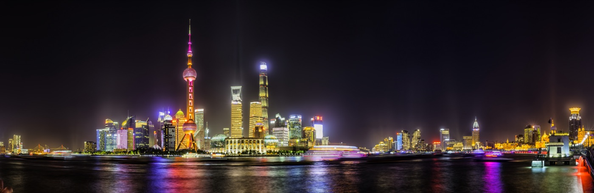
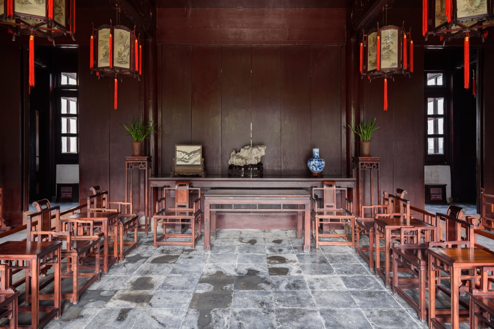
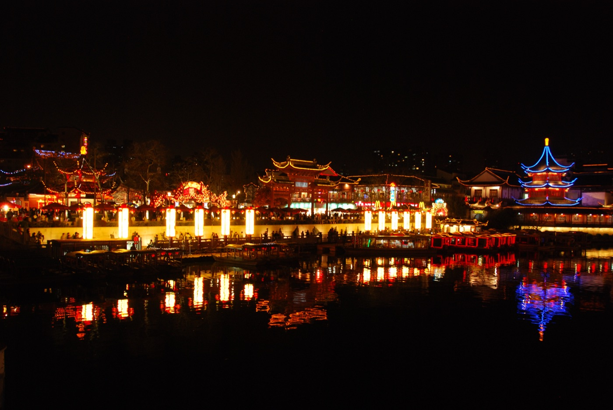
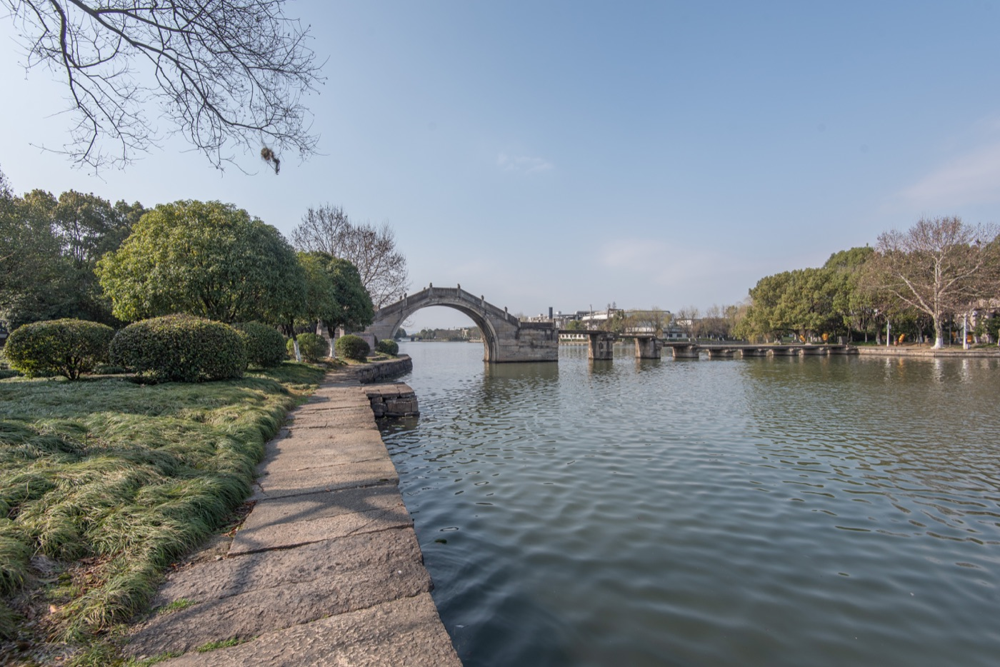
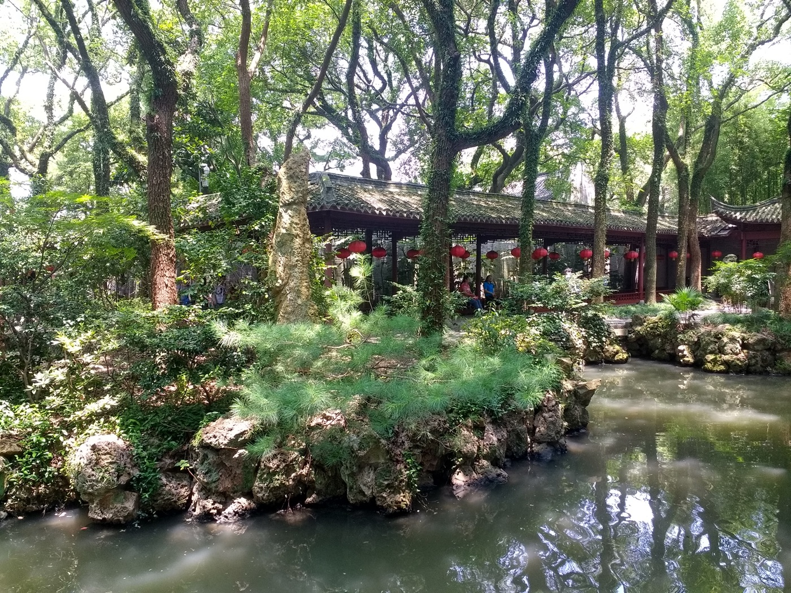
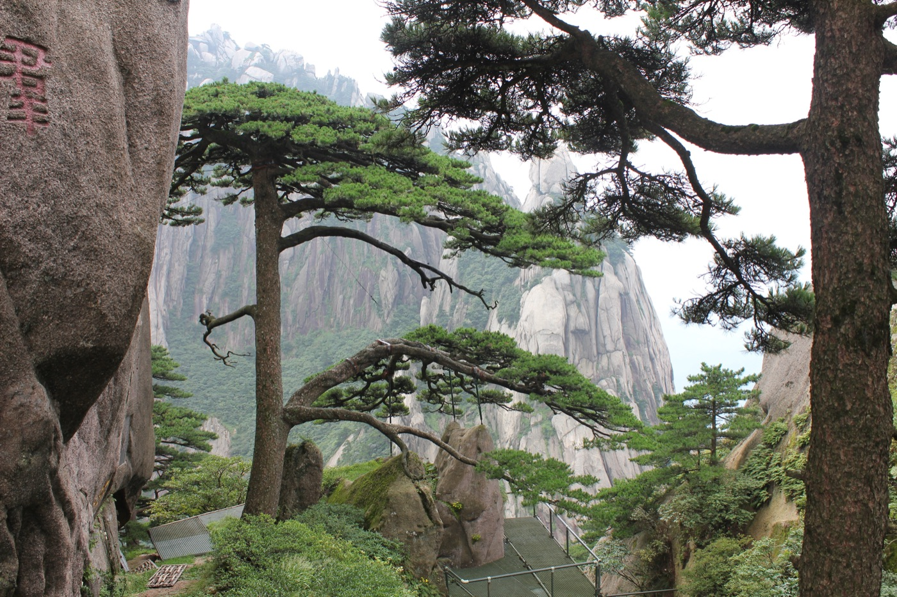

# 二 短途圈（1-2 小时）

短途圈是自杭州出发最具效率的时空半径。一小时左右的高铁车程，使周五傍晚的出行变得轻盈从容：搭乘下班后的高铁列车，抵达酒店安顿之后尚能从容享用地道夜宵；周日晚餐后启程返杭，入夜安顿歇息恰在夜阑人静之时。随身行李仅需一只双肩包：换洗衣物、便携相机、充电设备与一双适意行走的鞋履便足以应对。居停一晚与两晚的边际成本，几乎只取决于房费本身。

正因往返成本低廉，短途圈极宜用于错峰出行。在长假人潮汹涌之际，核心景观往往游人如织；但上海博物馆东馆、南京博物院、宁波天一阁（5A）等注重人文深度的场馆，依然能维持相对舒适的观览体验。若能利用周中淡季出游，不仅酒店价格显著回落，更能体会到苏州与绍兴水巷清幽的本真风貌。

短途圈各城市的风貌特质差异鲜明，各具不可替代的在地气韵。上海展现的是近代开埠与当代都会层叠演进的宏大立面；苏州专精于私家园林与枕河水巷的精巧营造；南京承载着六朝烟水与民国风云的厚重沧桑，看点深植于文博场馆与皇家陵寝；绍兴文脉绵长，凝聚着魏晋风流与近代文学大家的精神遗泽；宁波则是东南商埠的沉稳表达，藏书楼阁与丰饶海味交相辉映；黄山为这一圈中唯一的雄奇山岳，需换上登山行装细赏云海松石。将这些城市纳于同圈，纯因铁道里程相近，行旅体验则各擅胜场。

以下依城市逐一详述。

## 上海

{ width="640" .center }

上海与杭州的空间体验截然不同，核心在于密度的悬殊。杭州的湖山格局开阔疏朗，适宜从容慢行；上海则依托高密度路网展开，午后数小时即可连贯探访外滩建筑群、武康路历史街区与思南公馆。因此，上海适宜紧凑而清晰的漫步节奏：晨间出行，依街区肌理逐段品读，傍晚归宿休憩。上海街区漫步对体力有一定要求；同时，明清以前的历史遗存多已移入博物馆展陈。抵沪行旅的观察焦点十分明确：这里是探寻 1843 年开埠以来近两百年中西文化激荡与都市演进的最佳现场。

### 高铁

自杭州东站至上海虹桥站，最快车次仅需 45 分钟，常规车次约为 1 小时。清晨 6:30 起班次极为密集，直至夜间 22:30 末班。上海站（老北站）车次较少，多为途经停靠列车，耗时约 1 小时 20 分。除住宿锁定于静安寺以北或北外滩外，通常首选抵达虹桥站，换乘地铁 2 号线或 10 号线接入核心城区最为便捷。

座席选择方面，1 小时车程无需选乘商务座；一等座相较二等座空间更为舒展，靠窗置物从容；二等座性价比较高，足以满足短途所需。

### 万豪推荐

依综合体验与品质评测排序。

### 上海宝格丽酒店
**Bulgari Hotel Shanghai** · 静安苏州河北岸 · 携程 4.8 · ¥6000

坐落于苏州河畔，步行五分钟即可抵达外滩源。客房以经典黄铜与深色木质相融，全大理石卫浴配置独立浴缸与步入式淋浴间。一楼 Il Ristorante Niko Romito 意式餐厅出品精湛。适宜钟情外滩地段同时追求静谧私密的住客。注意事项：夜间沿苏州河步行需留意市政道路动线，选择网约接驳更为顺畅。

### 上海浦东丽思卡尔顿酒店
**The Ritz-Carlton Shanghai, Pudong** · 陆家嘴 IFC 53 楼以上 · 携程 4.7 · ¥3500

高踞陆家嘴国金中心高区，江景客房正对外滩万国建筑群天际线。适宜商务差旅顺道游览或看重云端景观的住客。58 层的 Flair 露台酒吧于黄昏时分视野开阔，可俯瞰浦江两岸黄昏华灯。注意事项：陆家嘴区域餐饮以大型商业综合体为主，若侧重市井烟火街区漫步，建议合理安排过江行程。

### 上海静安瑞吉酒店
**The St. Regis Shanghai Jingan** · 静安寺商圈 · 携程 4.7 · ¥2500

地处地铁 2 号线与 7 号线交汇枢纽，步行即可漫步至南京西路及巨鹿路、富民路、长乐路一带历史风貌街区。配备标志性瑞吉管家服务，行政酒廊服务成熟，客房尺度在静安核心区域优势明显。适宜深度探访街区风貌同时注重品牌礼遇的住客。

### 上海浦东文华东方酒店
**Mandarin Oriental Pudong, Shanghai** · 陆家嘴滨江 · 携程 4.7 · ¥3500

坐落于陆家嘴滨江绿地，与外滩隔江相望。承袭文华东方高水准的细腻服务，餐饮与水疗体验俱佳。江景房相较超高层酒店更为亲水近水。

### 上海艾迪逊酒店
**The Shanghai Edition** · 黄浦南京东路中段 · 携程 4.7 · ¥3000

建筑前身为 1929 年的历史保护建筑，内部空间呈现 Edition 标志性的克制低照度美学风格。步行三分钟即至外滩。顶层 Roof 酒吧坐拥开阔江景与陆家嘴全景；地下二层的 Hiya 日式餐厅出品考究。注意事项：临近南京东路一侧在晚间较为热闹，预订时建议优先选择高区或内院静谧房型。

### 上海波特曼丽思卡尔顿酒店
**The Portman Ritz-Carlton, Shanghai** · 静安南京西路 · 携程 4.7 · ¥2500

开业于 1990 年，为丽思卡尔顿进驻中国大陆的开篇之作。坐落于南京西路上海商城核心区位，底蕴深厚，经系统翻新后仍保持稳健质感。适宜看重经典地段与人文积淀的常客。

### 上海明天广场 JW 万豪酒店
**JW Marriott Hotel Shanghai at Tomorrow Square** · 黄浦人民广场 · 携程 4.7 · ¥1500

人民广场西侧的地标性尖顶建筑，38 层空中大堂视野开阔，俯瞰市中心天际线。探访人民广场文化设施及南京西路极为顺畅，客房居高临下，早餐与行政酒廊礼遇沉稳规整。

### 上海外滩瑞吉酒店
**The St. Regis on the Bund, Shanghai** · 黄浦外滩源 · 携程 4.7 · ¥3500

紧邻圆明园路近代历史建筑群，步行可达外滩源，兼具核心区位与瑞吉管家标准礼遇。部分行政套房饱览黄浦江景，适宜以外滩为核心游览轴线的行程。

### 上海威斯汀大饭店
**The Westin Bund Center, Shanghai** · 黄浦外滩延安东路 · 携程 4.6 · ¥1800

地处延安东路，步行五分钟可达外滩核心区，临近地铁 2 号线南京东路站。天梦之床睡眠体验稳定，出行接驳便捷，在外滩万豪系中具备良好性价比。

### 上海外滩 W 酒店
**W Shanghai - The Bund** · 北外滩苏州河口 · 携程 4.6 · ¥2000

坐落于北外滩苏州河口，直面陆家嘴现代天际线。Yen 中餐厅在沪上同品牌中水准出众，空间设计年轻前卫，适宜对江景视野与活力氛围有所偏好的旅客。

### 上海龙之梦万丽酒店
**Renaissance Shanghai Zhongshan Park Hotel** · 长宁中山公园地铁站上盖 · 携程 4.6 · ¥800

坐落于长宁路龙之梦商圈，雄踞地铁 2 号、3 号、4 号线交汇的中山公园站枢纽之上：至虹桥枢纽三站、至静安寺五站、直达陆家嘴，轨道交通接驳极为强劲。客房分布于 25 层以上，采光通透，楼下商业配套完善，适宜注重通勤效率与性价比的行者。

### 上海特色酒店

甄选万豪体系之外兼具深厚历史感与卓越设计审美的在地名所。

### 上海半岛酒店
**The Peninsula Shanghai** · 外滩源最北段 · 携程 4.6 · ¥4500

2009 年开业，为外滩近百年来极少数新建的古典复兴风貌酒店，空间营造克制优雅。客房尺度在外滩顶级奢华酒店中极为舒展，Sir Elly's 露台景观卓越，下午茶与餐饮水准稳定，适合体验经典外滩风华。

### 上海四季酒店
**Four Seasons Hotel Shanghai** · 静安威海路 · 携程 4.7 · ¥2800

地处威海路核心地段，闹中取静，客房空间开阔、隔音出众，为沪上经典奢华居所的代表之一。中餐厅出品扎实，受到本地食客广泛认可。

### 上海璞丽酒店
**The PuLi Hotel and Spa** · 静安公园对面 · 携程 4.6 · ¥2500

国内城市度假（Urban Resort）概念的早期践行者。长达 76 米的中央水廊与落地窗外的静安公园绿意构成了标志性的空间意境。室内设计融合当代极简与东方韵味，适宜追求静谧避世氛围的旅客。

### 上海安缦养云
**Amanyangyun** · 闵行马桥 · 携程 4.7 · ¥9000

将江西抚州明清古宅与古樟树群整体迁建复原，打造出宛如林泉隐逸的远郊度假胜地。坐落于市区西南，适宜作为专程静修与空间审美体验的目的地，享受古树环抱的静谧起居与水疗服务。

### 行程

从容规划，张弛有度。

**半日**：外滩源至武康路漫步。上午借清晨顺光游赏外滩万国建筑群与外白渡桥，随后乘地铁 10 号线至武康大楼，沿武康路、安福路林荫道徐行，午后于独立咖啡馆小憩。

**一日**：上午探访外滩源与苏州河北岸（中国邮政博物馆、四行仓库），中午转至静安寺商圈用餐；下午漫步巨鹿路、富民路与长乐路历史街区，黄昏时分重返滨江眺望陆家嘴华灯初上，晚间品味经典本帮菜肴。

**两日**：首日按上述一日路线游览。次日上午专程参观上海博物馆东馆（需提前预约），午后转赴徐汇滨江，参访龙美术馆西岸馆或西岸美术馆，傍晚沿黄浦江滨水步道漫步，领略近代工业遗存与当代艺术空间的对话。

### 景点详介

**外滩 + 苏州河**。自 1843 年开埠后逐步筑就，现存 52 栋近代历史建筑中，以原汇丰银行大楼（今浦发银行总行）与江海关大楼最具代表性，分别竣工于 1923 年与 1927 年，前者门厅天顶饰有精美的古典马赛克壁画。探访外滩的最佳时段为清晨 6:30 至 7:30，晨曦映照于石材立面之上，江风清凉，游人未聚。建议自外滩源向南漫步至金陵东路，全程约 1.5 公里；随后转入苏州河北岸，自外白渡桥西行至四行仓库，水岸静谧，近代里弄与仓储建筑林立。避坑提示：外滩核心观景平台在节假日午后人流极密，宜避开高峰或由北外滩错峰远眺。

**武康路 / 巨鹿路 / 安福路**。原法租界核心街区，成型于 20 世纪二三十年代。武康大楼作为诺曼底公寓旧址，地处五路交汇的楔形地块。探访此区宜避开周末拥堵时段，自安福路向西穿行至武康路中段，细细品味保存完好的近代里弄住宅、花园洋房与遮天蔽日的法国梧桐。沿途可探访巨鹿路 675 号（爱神花园）与各类人文空间。建议预留两至三小时徐徐步行。避坑提示：街区核心价值在于建筑形制与街巷肌理，不必局限于热门打卡点。

**上海博物馆（人民广场馆 + 东馆）**。人民广场馆落成于 1996 年，以商周青铜器与历代陶瓷陈列享誉学界，藏有大克鼎、子仲姜盘等重器；浦东花木新开放的东馆体量宏大，集中展陈历代书画、古籍与考古专题。两馆均实行免费预约制。观展建议将青铜与雕塑重点放在人民广场馆，瓷器、书画及大型专题展聚焦东馆。每馆建议预留两至三小时。避坑提示：节假日观展需提早线上预约入场时段。

**思南公馆 / 张园**。二者皆为近代洋房与石库门建筑更新的代表案例。思南公馆由数十栋成片的花园洋房修缮而成，保留了 20 世纪二三十年代的花园洋房空间尺度与绿树浓荫，漫步其间体感舒适。张园位于南京西路北侧，完整保留了多进式石库门里弄格局，引入了当代商业形态。漫步思南公馆宜在午后，感受法桐掩映下的庭院幽深。

**龙美术馆西岸馆 / 西岸美术馆**。均坐落于徐汇滨江，相距仅数百米。龙美术馆由原北票煤炭码头的"煤漏斗"工业遗存改造而来，保留了雄浑的清水混凝土伞拱结构；西岸美术馆则由戴卫·奇普菲尔德设计，与法国蓬皮杜中心展开长期展陈合作。两馆结合滨江公共绿道，构成华东地区最具品质的当代艺术漫游轴线。避坑提示：场馆周一闭馆，行前需确认开放及特展信息。

### 吃

- **苏浙汇（淮海中路店）**：出品成熟的本帮江浙菜，本帮红烧肉、油爆河虾、八宝鸭火候到位。
- **福 1088**：坐落于老洋房内的精品本帮菜，环境典雅静谧，需提前预约。
- **老吉士（天平路老店）**：深得本地食客青睐的传统本帮小馆，葱开煨面、红烧肉酱香浓郁。
- **席家花园**：独栋花园洋房餐饮，庭院环境清幽，菜式传承传统海派风味。
- **南兴园（巨鹿路店）**：粤菜与川粤风味融合，茶点精细，就餐环境考究。

### 最佳季节

10 月至 11 月秋高气爽、湿度宜人，为最佳漫步窗口；3 月下旬至 4 月上旬玉兰与早樱接连盛开，街区绿意渐浓。盛夏 7 至 8 月气温高且湿热，隆冬 12 至 1 月湿冷明显，出行宜做好温湿度调控；6 月中下旬梅雨季节雨水连绵，需备好雨具并多规划室内文博行程。

## 苏州

{ width="640" .center }

苏州的空间精髓在于私家园林。园林并非寻常城市公园，而是文人雅士于咫尺庭院中缩摹山水乾坤的精微营造，密度极高、寸步皆景。然而，私家园林的对景与借景极度依赖静谧的空间氛围；节假日人流密集之时，水榭回廊移步换景的幽深意境难免受损。因此，苏州行旅的关键在于精巧错峰：或于周中淡季探访，或于清晨 7:30 开园时入内、午前人潮涌入前尽兴而归。与上海的奔涌现代感相比，苏州更宜慢行细品，沉下心来倾听园中风穿竹林、水落池塘之声。老城区地势平缓、文博景点集中，非常适宜与长辈或家人同行。

### 高铁

自杭州东站至苏州北站，最快班次约 1 小时 20 分。苏州北站距老城区（拙政园、平江路一带）车程约 25 分钟；苏州站虽更贴近老城核心，但高铁直达车次相对较少。通常建议首选班次频密的苏州北站并衔接网约车出行。1 小时 20 分车程，选乘二等座即可获得舒适体面的出行体验。

### 万豪推荐

依综合品质与旅居体验排序。苏州的万豪体系多分布于工业园区与太湖沿岸，老城区内相对稀缺。

### 苏州福朋喜来登酒店
**Four Points by Sheraton Suzhou** · 工业园区月亮湾 · 携程 4.8 · ¥600

坐落于工业园区月亮湾畔，坐拥独墅湖一线湖景。硬件维护良好，早餐丰富，湖景开阔。适宜注重高性价比与湖畔静谧环境的旅客。注意事项：前往拙政园及老城核心区约需 25 分钟车程，需合理规划出行时间。

### 苏州万豪酒店
**Suzhou Marriott Hotel** · 高新狮山板块（干将西路 1296 号）· 携程 4.7 · ¥900

坐落于干将西路，地处姑苏古城与高新区交界处，临近地铁 1 号线狮子山站。为苏州万豪系中前往老城园林最为顺畅的标准五星级酒店，车程十分钟左右即可通达核心街区。客房硬件稳健，行政酒廊服务成熟，适宜以老城人文寻访为主线的旅客。

### 苏州工业园区 W 酒店
**W Suzhou** · 工业园区金鸡湖东岸 · 携程 4.7 · ¥1500

矗立于金鸡湖东岸，距老城区约 20 分钟车程。设计风格鲜明前卫，Yen 中餐厅粤菜水准稳定，高空泳池与金鸡湖夜景交相辉映。适宜追求时尚设计感与湖畔都市天际线的年轻客群。

### 苏州湾艾美酒店
**Le Méridien Suzhou, Suzhou Bay** · 吴江太湖新城 · 携程 4.8 · ¥800

坐落于吴江太湖新城，坐拥东太湖浩瀚水景，为太湖沿线口碑出众的度假酒店。285 间客房配设落地大窗，饱览太湖烟波。适宜专程前往太湖度假休养的住客。

### 苏州太湖万豪酒店
**Suzhou Marriott Hotel Taihu Lake** · 吴中区太湖边 · 携程 4.7 · ¥800

坐落于太湖东岸度假区，设施齐备、环境优美，为太湖休闲度假的稳妥居所。适宜以太湖山水为主要活动半径的休闲行程。

### 苏州万怡酒店
**Courtyard by Marriott Suzhou** · 工业园区星海街 188 号 · 携程 4.6 · ¥600

地处工业园区核心商务区，地下直通地铁 1 号线星海广场站，步行可达金鸡湖与苏州中心商圈。高层配有室内恒温泳池，出行交通极为便捷，为园区性价比出众的商务与旅行落脚点。

### 苏州特色酒店

深入老城街巷与湖山深处，体验独具姑苏韵味的精品居所。

### 阳澄湖君澜度假酒店
**Narada Resort Yangcheng Lake** · 阳澄湖南岸 · 携程 4.7 · ¥600

坐落于阳澄湖南岸，临水而筑。金秋十月至十一月阳澄湖大闸蟹上市之际为最佳入住窗口，可就近品尝鲜美丰腴的蟹粉小笼与应季湖鲜。

### 苏州拙政园书香府邸平江府
**Pingjiang Lodge Suzhou** · 拙政园 / 平江路一墙之隔 · 携程 4.7 · ¥1500

由明清宅院修缮改造而成，是深度融入姑苏老城肌理的精品酒店。步行三分钟即至平江路水巷，五分钟可达拙政园。庭院错落、幽静雅致，早餐现煮苏式汤面别具特色。房量有限，旺季宜提早预订。

### 苏州尼依格罗酒店
**Niccolo Suzhou** · 狮山金融区 · 携程 4.7 · ¥1500

高踞苏州国际金融中心超高层，115 层天际大堂尽览城市全景。欣厨中餐厅出品精美，适宜钟情现代天际景观与奢华摩登体验的旅客。

### 苏州安缦阳澄湖
**Aman Yangcheng Lake** · 阳澄湖半岛 · ¥8000+

坐落于阳澄湖半岛，将江南传统合院建筑的典雅尺度与当代度假美学融为一体，适宜作为专程体验东方空间美学的目的地居所。

### 行程

从容有致，品味江南雅韵。

**半日**：拙政园与平江路漫步。晨间 7:30 入园游赏拙政园，感受初阳下的亭台水榭；午前漫步平江路历史水巷，品尝一碗地道苏式面点，午后于水岸茶室品茗听评弹。

**一日**：上午联游拙政园与苏州博物馆本馆（贝聿铭封山之作，需提前预约）；中午前往嘉馀坊品味经典苏帮菜肴；下午沿平江路石板路徐行；傍晚前往网师园体验古典夜花园（4 月至 11 月开放，昆曲与丝竹实景演出）。

**两日**：首日依一日路线游览。次日上午参访留园与西园寺；午间转赴山塘街寻访地道市井风味；午后前往太湖东山或西山湖畔茶舍静坐观湖，傍晚返回古城品尝时令苏帮雅宴。

### 景点详介

**拙政园**。始建于明正德初年（1509 年），御史王献臣致仕后筑园，文徵明参与造园构思。全园占地 5.2 公顷，为江南私家园林规模之冠，分东、中、西三部分。中部为造园精髓所在，远香堂、香洲、小飞虹等景致水石相生、步移景异。造访拙政园的首要原则在清晨错峰，开园初入时游人稀少，方能领略粉墙黛瓦与疏朗水面构成的文人画意境。避坑提示：日间十点后人流集中，宜尽早入园；夜间人造灯光游览并非传统园林审美核心。

**留园**。始建于明万历年间，清代刘恕重修扩建。全园面积约 2.3 公顷，空间处理精妙绝伦，长廊、漏窗与厅堂交织变化，堪称造园手法之典范。园中冠云峰高 6.5 米，为江南三大太湖名石之一；五峰仙馆楠木殿堂陈设考究。留园空间更为幽邃，建议预留两小时细细品味。

**网师园**。始建于南宋，清乾隆年间彭启丰重修。占地仅约 0.6 公顷，为苏州古典园林中"以小见大"的极致代表。月到风来亭俯临清池，小山丛桂轩虚实相生。网师园最富特色的体验为其夜游项目（4 月至 11 月每晚开放），八座厅堂回廊间错落安排评弹、昆曲、古琴与笛箫表演，丝竹清音与水榭清风相融，极具东方意趣。避坑提示：黄金周夜游客流较大，建议选择常规平日前往。

**平江路 / 山塘街**。平江路沿平江河延伸 1.6 公里，河街相邻、水陆并行，完整保留了宋代《平江图》所绘的街巷水网格局；山塘街位于阊门之外，长达七里，自唐代白居易修筑以来便是繁华的商贸通道。初访者建议首选平江路漫步，体味水巷深处的文人闲趣；山塘街则宜于黄昏漫步，夕阳映照古桥石阶，别具水乡风韵。

**苏州博物馆（本馆 + 西馆）**。本馆由建筑大师贝聿铭操刀设计，与拙政园、忠王府紧密相依，巧妙借鉴了江南传统民居与古典园林的几何构图，本身即为当代建筑典范。馆藏五代秘色瓷莲花碗与北宋真珠舍利宝幢堪称国宝。高新区西馆体量宏大，系统陈列苏州通史与传统工艺。两馆均需提前线上预约，周一例行闭馆。

### 吃

- **新聚丰菜馆（嘉馀坊店）**：传统苏帮菜老字号，松鼠桂鱼外脆里嫩、甜酸适口，樱桃肉、响油鳝糊火候精到。
- **裕兴记**：经典苏式面馆，时令三虾面与秃黄油拌面浓郁鲜美。
- **同得兴（嘉馀坊店）**：苏式汤面代表，白汤焖肉面汤清味醇、焖肉酥烂。
- **吴门人家**：苏式庭院氛围浓郁，传统苏帮菜式清雅讲究，适宜宴请长辈。
- **桃花源记**：大众江南风味小吃，赤豆小圆子、生煎与面点出品扎实。

### 最佳季节

3 月下旬至 4 月中旬为最佳时令，海棠、紫藤与玉兰次第盛开，园林春色层次分明、气韵生动；9 月至 11 月金桂飘香、红枫点缀，气候干爽舒适。盛夏 7 至 8 月天气湿热，园林避暑需注意防晒；长假期间园林人潮汇聚，建议优先错峰造访。

## 南京

{ width="640" .center }

南京在短途圈中展现出独一无二的人文厚重。作为六朝古都与明初、民国之都，多重政治历史图景在同一座城市空间中交叠沉积。因此，南京的核心看点不在于零散景观，而在于宏大的空间体系：明孝陵与中山陵构成的皇家与国家陵寝体系、南京博物院浩瀚的国家级典藏体系，以及颐和路保存完好的民国公馆建筑群。这些体系均需半日乃至一日的从容游历，适宜偏好历史文脉、渴望深入展陈细节的行者。

### 高铁

自杭州东站至南京南站，最快车次仅需 1 小时 5 分，常规班次约 1 小时 15 分。早晚车次极密，半小时左右即有一班。南京南站为华东重要高铁枢纽，出站后无缝接入地铁 1 号线、3 号线，通达全城。1 小时余车程，二等座舒适从容。

### 万豪推荐

依综合体验与品质评测排序。

### 南京华泰万丽酒店
**Renaissance Nanjing Olympic Centre Hotel** · 建邺河西新城 · 携程 4.8 · ¥700

坐落于河西新城核心，步行可达奥体中心。双子塔建筑造型现代，客房享有开阔江景或城市景观，特色餐饮与客房维护水准优良，性价比在南京同档酒店中尤为突出。

### 南京丽思卡尔顿酒店
**The Ritz-Carlton, Nanjing** · 新街口中山路（德基二期）· 携程 4.7 · ¥2200

高踞新街口核心地段德基广场二期 38 层以上，直通地铁 1 号线与 2 号线。为南京万豪旅享家体系的旗舰奢华代表，客房陈设融合西方古典与金陵文雅，丽湖轩中餐厅出品出众，高空行政酒廊饱览紫金山与玄武湖辽阔全景。

### 南京金茂威斯汀大酒店
**The Westin Nanjing Xuanwu Lake** · 玄武湖畔 · 携程 4.7 · ¥900

地处玄武湖畔，交通便捷。客房空间开阔，行政酒廊坐拥秀丽湖景，标志性天梦之床保障高品质睡眠，适宜初访南京且注重核心区位的旅客。

### 南京金丝利喜来登酒店
**Sheraton Nanjing Kingsley Hotel & Towers** · 新街口汉中路 169 号 · 携程 4.6 · ¥800

坐落于汉中路，临近地铁 2 号线汉中门站，漫步可达新街口与总统府。作为南京历史悠久的国际五星级酒店，经全面翻新后设施稳健，中庭水景与早茶氛围深得常客青睐。

### 南京南万豪酒店
**Marriott Nanjing South Hotel** · 江宁科技园 · 携程 4.6 · ¥700

距南京南站高铁枢纽仅十分钟车程，商务出行与中转换乘极为顺畅。客房宽敞，商务配套完备，适宜高铁中转或以商旅为主的行程。

### 南京特色酒店

甄选南京兼具民国风华与江岸美学的特色居停之所。

### 南京颐和公馆
**The Yihe Mansions** · 鼓楼颐和路民国公馆区 · 携程 4.8 · ¥1800

坐落于颐和路民国风貌保护区内，由二十六栋修缮精良的民国老洋房组成，曾荣获联合国教科文组织亚太地区文化遗产保护奖。青砖灰瓦、庭院深沉，法餐厅与管家服务细致考究，是深度体验民国金陵生活美学的经典之作。

### 南京金奥费尔蒙酒店
**Fairmont Nanjing** · 建邺河西金奥中心 · ¥1200

坐落于河西中央商务区，建筑造型宛如巨型中国传统灯笼。高空视野开阔，前往禄口国际机场与南京南站交通极为便利。

### 南京香格里拉大酒店
**Shangri-La Hotel, Nanjing** · 鼓楼广场 · 携程 4.8 · ¥1000

雄踞鼓楼广场核心枢纽，地铁 1 号线与 4 号线交汇。客房硬件翻新完备，江南灶中餐厅由淮扬名厨主理，为南京高端淮扬菜的标杆之一。

### 南京涵碧楼酒店
**The Lalu Nanjing** · 浦口老山江岸 · 携程 4.7 · ¥1500

坐落于长江之滨，融合现代极简与东方禅意美学，独揽 270 度壮阔长江江景。适宜作为江畔静心度假的独立目的地。

### 行程

体系清晰，兼顾人文与自然。

**半日**：总统府历史建筑群漫步，随后于 1912 街区或周边茶舍小憩。

**一日**：清晨 7:30 探访明孝陵神道（自石象路行至四方城，秋季银杏金黄尤佳）；午间于紫金山麓用餐；下午游览中山陵博爱广场与音乐台；黄昏时分返回新街口享用金陵风味晚餐。

**两日**：首日依一日路线游览。次日上午专程参访南京博物院（预留三至四小时）；下午漫步颐和路民国公馆区林荫道；傍晚探访老门东历史街区，登临明城墙俯瞰老城夜色。

### 景点详介

**明孝陵**。始建于明洪武十四年（1381 年），为明太祖朱元璋与马皇后的合葬陵寝，确立了明清两代皇家陵寝形制的最高典范。其精髓在于长达 2.6 公里的神道演进：自下马坊、大金门、四方城，蜿蜒经石象路、翁仲路，过金水桥与文武方门，直抵方城明楼。神道两侧伫立的六种石兽与文武翁仲雕刻精绝，保存完整。每年 11 月中下旬，石象路两侧乌桕与银杏层林尽染，呈现金陵深秋的绝美图卷。建议由石象路步入，细品雕刻与古树之美。

**中山陵**。落成于 1929 年，由建筑师吕彦直设计。建筑群依紫金山南麓地势依山而筑，平面呈警钟形，自博爱坊至祭堂高差达 73 米，通连 392 级花岗岩石阶。其台阶设计暗含视觉透视巧思：自下仰瞻只见石阶不见平台，登顶俯瞰只见平台不见阶梯。全区庄严肃穆、气势恢宏。需提前预约参观。避坑提示：周一祭堂例行维护不开放。

**夫子庙与秦淮风光带**(5A)。始建于宋代，现存建筑多为近代重修。虽商业氛围较为浓厚，但大成殿、江南贡院与秦淮水岸依然承载着金陵旧时的市井记忆。晚间可选择搭乘秦淮画舫游弋于十里秦淮水上，眺望两岸明清照壁与近代民居灯影。避坑提示：街区周边小吃繁杂，品味地道风味建议转至老门东或老城老店。

**南京博物院**。前身为 1933 年蔡元培倡建的国立中央博物院，为我国现代博物馆事业的重要开拓地。院藏文物 43 万余件，体系完备。重点展厅涵盖历史馆（通史脉络清晰）、特展馆（常年引进重磅大展）、民国馆（全景式还原近代南京街市风貌）及艺术馆。东汉金缕玉衣、西汉错银铜牛灯等国宝级重器汇聚于此。深度观赏需预留三至四小时，周一闭馆，需提前预约。

**总统府**。建筑群原址曾先后作为明代汉王府、清代两江总督署、太平天国天王府及中华民国临时大总统府与国民政府办公地。走过子超楼、行政院办公厅舍及清代煦园（江南园林遗存），可清晰阅读近代中国百年政治风云的物质层叠。

**颐和路民国公馆区**。源自 1929 年《首都计划》规划的高级使馆与住宅区，现存近三百栋风格各异的独立近代花园洋房。漫步于颐和路、宁海路与琅琊路之间，法桐蔽日、青砖掩映，展现出与上海里弄洋房截然不同的近现代官邸规制与幽静氛围。

**老门东**。位于中华门城墙脚下，为旧时金陵南部传统民居聚落。经修缮更新后保留了江南街巷的肌理尺度，汇集了众多南京老字号与非遗工坊，入夜后城墙灯影与市井烟火相映成趣。

### 吃

- **南京大牌档**：大众金陵风味的稳妥之选，盐水鸭皮白肉嫩、金牌煎饺与桂花糖芋苗醇厚甜糯。
- **马祥兴菜馆**：百年清真名店，松鼠鳜鱼、美人肝与凤尾虾尽显老派刀工与火候。
- **绿柳居**：创立于 1912 年的清真与素食老字号，素烧鸭与素菜包工艺精深。
- **小郑酥烧饼**：老城传统酥饼，层层酥脆，葱油咸香与甜醇糖馅皆具特色。
- **尹氏鸡汁汤包**：金陵汤包代表，皮薄多汁，配一碗鸭血粉丝汤极为适口。

### 最佳季节

11 月中下旬至 12 月初为全年中南京视觉层次最丰富的时节，明孝陵石象路银杏满地金黄、栖霞山红枫绚烂、中山陵法桐如盖；3 月下旬鸡鸣寺路樱花盛开，但游人较为密集。盛夏 7 至 8 月天气闷热，需合理调控户外体力；冬季雨雪之日探访紫金山与城墙则具萧散幽意。

## 绍兴

{ width="640" .center }

## 绍兴

{ width="640" .center }

绍兴是一座文脉密度极高、市井生活保持原真风貌的江南名邑。鲁迅故里(5A)、兰亭、沈园、大禹陵与安昌古镇等历史地标散落于古城内外，分别对应着中国近现代文学、魏晋书法艺术、宋代文人词章、华夏上古传说与近代水乡市井等深厚脉络。相较于热门水乡，绍兴的日常体感深沉内敛，游人密度适中，街巷茶馆中常居者怡然自得。此地适宜放慢步调，在乌篷摇曳与黄酒温润中细品水乡人文。

### 高铁

自杭州东站至绍兴北站，最快车次仅需 18 分钟，常规车次约 25 分钟，为短途圈中时空距离最近的枢纽之一。自绍兴北站乘车至古城核心街区（鲁迅故里、沈园一带）约需 25 分钟车程。班次频密，选乘二等座即可迅速抵达。

### 万豪推荐

绍兴万豪体系目前主要分布于上虞区，老城核心区以特色精品酒店与历史宅院为主。

### 绍兴上虞喜来登酒店
**Sheraton Shaoxing Shangyu** · 上虞区 · 携程 4.6 · ¥600

坐落于上虞区，建筑体量宏大、设施齐备，适合注重国际品牌服务标准并顺道游历周边的旅客。距越城区老城核心区车程约 50 分钟。

### 绍兴特色酒店

深入老城街巷与会稽山麓，体验极具人文意趣的雅致居停。

### 兰亭安麓
**Ahn Luh Lanting** · 柯桥兰亭 · ¥3500

坐落于会稽山麓、兰亭幽径之畔，将多栋明清徽派与江南传统老宅精心迁建修复，与周边青山秀水融为一体。空间营造极具文人风骨，餐饮与水疗体验卓越，为浙东极具代表性的高品位度假胜地。

### 绍兴饭店
**Shaoxing Hotel** · 越城环山路 · 携程 4.7 · ¥500

始创于 1958 年，坐落于府山脚下，为经典的江南园林式国宾酒店。亭台楼阁依山而建，古木参天，经翻新后设施舒适稳健。早餐供应传统绍式米浆与茴香豆，距鲁迅故里仅十分钟车程，深具老派古城韵致。

### 鲁迅故里精品民宿
**故里里 / 圣麓 / 一宅等** · 越城老城 · ¥400-1000

仓桥直街、书圣故里与鲁迅故里周边分布着多处由清代台门民居修缮而成的精品客舍。青石板路、临河水阁与粉墙黛瓦交织，推窗即可体味真实的江南水巷日常。

### 行程

静心漫游，领略文脉风骨。

**半日**：鲁迅故里与沈园漫步。二者相距咫尺，半日即可从容领略近代文学记忆与宋词深情。

**一日**：上午探访鲁迅故里与沈园，午间品尝地道绍兴本色菜；下午乘车前往兰亭（距古城约 13 公里），探寻曲水流觞的魏晋风骨；傍晚返回古城，温一壶绍兴黄酒、配一碟茴香豆小酌。

**两日**：首日依一日路线游历。次日上午参访黄酒博物馆；下午转赴安昌古镇（距市区约 20 公里），漫步长廊水街，体验传统手工作坊与水乡风土。

### 景点详介

**兰亭**。东晋永和九年（353 年）三月初三，王羲之与谢安等四十一位名士修禊于此，写下被誉为"天下第一行书"的《兰亭集序》。现存园林为历代重修，汇集了鹅池、流觞亭、御碑亭与墨池等名胜。漫步曲水流觞渠畔，静观康熙、乾隆祖孙手书的双面御碑，是追寻中国书法精神源头的必访之地。

**沈园**。原为南宋沈氏私家园林，因陆游与唐婉的凄美重逢与题壁《钗头凤》而闻名遐迩。园林虽历经沧桑，但小桥流水、残池断垣仍存宋代池馆遗风。晚间沈园开放夜游堂会（19:30 至 20:30），堂前聆听越剧《钗头凤》折子戏，水榭间丝竹婉转，别具雅致。

**鲁迅故里**。包括鲁迅祖居（周家老台门）、鲁迅故居（周家新台门）、三味书屋与百草园，连同鲁迅纪念馆构成系统完整的人文园区。在此可直观阅读鲁迅早年生活的空间场景，纪念馆内丰富的手稿与版画展陈极具学术与历史价值。建议按纪念馆、故居、三味书屋至百草园的动线徐徐参访。

**安昌古镇**。明清绍兴师爷文化的重要发祥地。古镇依河成街，全长 1.7 公里，十七座明清石桥跨越河道，廊棚连绵。每逢冬至前后，两岸民居屋檐下挂满酱鸭、腊肠与霉干菜，展现出浓郁的水乡年俗风情。古镇原住民生活常态保存完好，市井气息醇厚。

**黄酒博物馆**。坐落于古城南部，为国内全面展示黄酒历史与酿造工艺的专题博物馆。馆内完整呈现传统手工酿造工序，其规模宏大的地下古酒窖贮藏万坛老酒，并设有多品种黄酒品鉴体验，是系统理解绍兴地域文化与酒乡风物的重要窗口。

**大禹陵**。坐落于会稽山麓，传为大禹大会诸侯、计功封赏及安葬之所。景区由禹陵、禹祠与禹庙组成，保留了历代祭禹的庄严礼制空间。拾级登临会稽山岗，俯瞰越中平原田畴水网，更觉苍茫开阔。

### 吃

- **咸亨酒店（鲁迅故里店）**：老字号名店，双臭、霉干菜烧肉、绍兴酱鸭风味醇厚，搭配温热的手工黄酒。
- **寻宝记**：大众绍兴菜代表，醉蟹、绍三鲜与黄酒布丁出品稳定。
- **状元楼**：古城老牌餐馆，传统绍式蒸菜与水产制作精良。
- **荣禄春（仓桥直街店）**：水巷深处的老店，霉千张蒸肉饼地道咸鲜。

### 最佳季节

10 月至 11 月秋高气爽，正逢立冬开酿新酒；3 月至 4 月春和景明，兰亭周边油菜花盛开；隆冬腊月前往安昌古镇，则能目睹沿河水岸腊味飘香的年俗景致。

## 宁波

{ width="640" .center }

宁波展现出东南海港都会低调而内敛的气质。其人文精髓深藏于历史肌理之中：天一阁作为我国现存最早的私家藏书楼，历经四百余载风雨，文脉巍然；老外滩自 1844 年开埠，近代海关与领事馆建筑保存完整，江风徐徐。整座城市干净从容，海鲜烹饪技艺高超，东钱湖烟波浩渺。非常适宜钟情深度人文、偏好舒缓节奏的行者。

### 高铁

自杭州东站至宁波站，最快仅需 50 分钟，常规车次约 1 小时。宁波站深处主城区，出站后乘车前往天一阁或老外滩均在十五分钟内。二等座舒适便捷，通勤极为高效。

### 万豪推荐

依综合体验与品质评测排序。

### 宁波万豪酒店
**Ningbo Marriott Hotel** · 海曙和义路 · 携程 4.7 · ¥800

坐落于海曙区姚江之滨，步行可至天一广场与天一阁，为宁波万豪系中地理区位极佳的一家。客房饱览江景或城市绿地，行政酒廊服务成熟，中餐厅烹制雪菜大汤黄鱼水准出众，适宜兼顾老城探访与高品质居停的旅客。

### 宁波东港喜来登酒店
**Sheraton Ningbo Hotel** · 鄞州彩虹北路 · 携程 4.7 · ¥700

作为宁波老牌国际五星级酒店，历经多次翻新，硬件维护扎实。早餐提供地道宁波水磨汤圆与雪菜黄鱼面，距老外滩车程仅十分钟。

### 宁波威斯汀酒店
**The Westin Ningbo** · 鄞州南部商务区 · ¥800

坐落于南部商务区，客房尺度开阔，天梦之床保障舒适安睡。适宜商务差旅或对新区硬件设施有所偏好的住客。

### 宁波鄞州万枫酒店
**Fairfield by Marriott Ningbo Yinzhou** · 鄞州区 · 携程 4.5 · ¥400

设施现代简洁，性价比优良，适宜注重商旅效率与基础品质的旅客。

### 宁波特色酒店

甄选东钱湖畔与老城核心的特色居所。

### 宁波柏悦酒店
**Park Hyatt Ningbo Resort and Spa** · 鄞州东钱湖 · 携程 4.6 · ¥2200

坐落于东钱湖畔，为大中华区首家柏悦度假酒店。建筑巧妙借取江南传统村落与徽派建筑语言，依山傍水、灰瓦白墙。钱湖渔港中餐厅以本地湖鲜海味著称，是浙东度假酒店中的卓越代表。

### 宁波东钱湖山水君澜度假酒店
**Narada Resort Dongqian Lake** · 鄞州东钱湖 · ¥800

坐落于东钱湖畔，配有依山而筑的天然温泉汤池，秋冬时节在此沐汤观湖，别具闲适意趣。

### 行程

湖海相映，斯文悠长。

**半日**：天一阁、月湖与鼓楼历史街区漫步。

**一日**：上午游览天一阁藏书楼与月湖景区；午间于鼓楼附近品尝地道风味；下午探访老外滩近代建筑群与和义大道；傍晚沿姚江水岸漫步观赏江岸夜景。

**两日**：首日依一日路线游览。次日前往东钱湖畔，沿湖畔绿道骑行或漫步，午后乘船登临陶公岛参访南宋石刻公园；或前往东郊参访阿育王寺与天童寺等千年古刹。

### 景点详介

**天一阁**。建于明嘉靖四十年（1561 年），由兵部右侍郎范钦主持修筑，为亚洲现存历史最悠久的私家藏书楼。阁内藏有明代地方志、科举录等珍罕古籍三十余万卷。建筑布局暗合"天一生水，地六成之"的传统防火哲理，东园与假山水池清幽典雅。建议预留两至三小时细读珍本展陈与园林构筑，周一闭馆。

**老外滩**。开埠于 1844 年，江岸现存近代海关大楼、英国领事馆旧址、江北天主教堂（哥特复兴风格，建于 1872 年）等十余处历史建筑。街区尺度宜人，商业布局克制，黄昏时分江畔华灯初上，建筑剪影倒映于三江交汇处，极具质感。

**鼓楼与月湖**。宁波鼓楼始建于唐长庆元年（821 年），现存城楼典雅古朴，周边连通着充满生活烟火气的街市；紧邻的月湖自宋代起即为文人讲学游憩之所，两岸绿树合抱、水榭依依。

**东钱湖**。浙江省内著名的天然淡水湖泊，面积广达 19.8 平方公里。湖岸线曲折优美，游人密度适中。陶公岛上的南宋石刻公园集中保存了南宋重臣史浩家族墓道石像生，为国内宋代石雕艺术之集大成者。

**阿育王寺 / 天童寺**。两座千年名刹坐落于宁波东郊山峦之间。阿育王寺始建于西晋，供奉释迦牟尼佛真身舍利；天童寺坐落于太白山麓，为禅宗五山十刹之一，亦为日本曹洞宗祖庭，群山环抱、古木苍翠，宗风肃穆。

### 吃

- **缸鸭狗**：创立百年的宁波汤圆名店，水磨糯米皮软糯细腻，黑芝麻猪油馅香甜流淌。
- **东福园**：传统甬菜代表老店，雪菜大汤黄鱼汤白汁浓、红膏炝蟹咸鲜咸甜、冰糖甲鱼软糯胶质丰富。
- **石浦大酒店**：主打象山港直供海鲜，清蒸带鱼、倒笃青蟹与白灼海瓜子原汁原味。
- **甬府**：高端新派甬菜标杆，选料严苛、做工极细。

### 最佳季节

10 月至 11 月秋高气爽，正值东海梭子蟹与各类海产丰收肥美之时；4 月至 5 月奉化桃花盛开、气候温润。盛夏需关注沿海台风预警；冬季海风较劲，宜添衣保暖。

## 黄山

{ width="640" .center }

黄山展现出名山大川雄浑奇绝的自然气象。以黄山风景区为主体，与周边的黟县古村落（西递、宏村）及屯溪老街共同构成了徽州山水人文的完整拼图：山巅胜在奇松、怪石与云海变幻；山下则精于明清宗族村落的理水与营造。本指南侧重从容舒适的游览方式：借助现代化索道登临核心观景台，将主要精力分配于西递、宏村及屯溪老街的徽州文化探访，有效调控体力负荷。

### 高铁

自杭州东站至黄山北站，最快车次约 1 小时 23 分。黄山北站距屯溪老街约 20 分钟车程，距黄山风景区南大门（汤口镇）约 50 分钟车程。全程高铁行驶平稳，二等座舒适适意。

### 万豪推荐

黄山风景区南大门汤口镇设有福朋喜来登酒店，适宜作为登山前后的起居枢纽。

### 黄山汤口福朋喜来登度假酒店
**Four Points by Sheraton Huangshan, Tangkou Resort** · 黄山风景区南大门汤口 · 携程 4.6 · ¥600

坐落于风景区南大门汤口镇核心区，距云谷索道换乘中心仅十五分钟车程。对于计划清晨搭乘首班索道上山的旅客，在此过夜可显著节省清晨通勤时间。

### 黄山特色酒店（山巅）

若计划在山巅观赏日落晚霞与翌日壮丽日出，需在山上留宿一晚。

### 黄山西海饭店
**Huangshan Xihai Hotel** · 西海景区 · 携程 4.8 · ¥1500

坐落于西海景区，临近丹霞峰与西海大峡谷北入口，为山顶硬件设施与服务水准极佳的宾馆之一，步行十分钟即可抵达丹霞峰俯瞰日落云海。

### 黄山白云宾馆
**Huangshan Baiyun Hotel** · 天海景区光明顶 · 携程 4.8 · ¥1500

坐落于天海景区核心，临近光明顶气象台，步行至光明顶观赏日出仅需十五分钟，区位便利。

### 黄山特色酒店（山下古村）

深入黟县古村与新安江畔，体验徽派古宅民居的独特意境。

### 西递归墟里·茶·民宿
**Xidi Boutique Inn** · 黟县西递镇 · 携程 4.9 · ¥600

坐落于西递古村内，由明清老宅修缮而成，保留了传统天井、雕花门窗与木构梁架，融合当代茶道与静心空间。

### 宏村巷往·轻奢度假民宿（月沼店）
**Hongcun Boutique Inn at Yuezhao** · 黟县宏村月沼 · 携程 4.9 · ¥800

坐落于宏村核心月沼水塘之畔，清晨推窗即见半月形水塘中倒映的白墙黛瓦与悠然游鸭，深具徽州画意。

### 行程

山水并重，张弛有度。

**一日（徽州古村与老街）**：自黄山北站乘车前往黟县宏村，游赏月沼、南湖与承志堂木雕；午后转赴西递探访宗祠与古街；傍晚返回屯溪老街享用徽州传统晚宴。

**两日（山岳风光与古村）**：首日探访西递与宏村，夜宿山下或汤口镇。次日清晨搭乘云谷索道直达白鹅岭，漫步始信峰观赏奇松巧石与群峰云海，午后乘索道下山返程。

**三日（全景从容版）**：首日入住屯溪老街；次日漫步黟县西递与宏村，入住古村精品客栈；第三日搭乘索道登临黄山核心观景区，完成自然奇观与人文建筑的深度行卷。

### 景点详介

**风景区索道（舒适型动线）**。黄山建有云谷（后山）、玉屏（前山）及太平索道。推荐搭乘云谷索道直达海拔 1670 米的白鹅岭，出站后沿平缓石阶步行即可抵达始信峰观景区，黑虎松、连理松等名松错落分布，远峰如屏，无需耗费过多体力即可尽览黄山峰峦松石之胜。提前线上预约分时段索道票。

**始信峰**。海拔 1683 米，相传明代文人黄习远登临此峰，叹为观止，始信黄山风景奇绝。环峰步道平缓舒展，奇松依壁而生、怪石巧夺天工，为领略黄山险峻与秀润兼备的绝佳视角。

**黟县古村落（西递、宏村）**。两处世界文化遗产展现了徽州传统聚落营造的最高水平。宏村巧妙运用人工水系，将清泉引入各家各户，月沼如弯月、南湖如如镜，被誉为"中国画里的乡村"；西递则以完整的明清宗祠与砖木石雕建筑群见长，敬爱堂、追慕堂规模宏大、规制严谨。建议避开节假日人潮高峰，于清晨或黄昏静心品读。

**屯溪老街**。坐落于新安江、横江与率水三江汇流处，全长 1.3 公里，两侧完整保存着数百栋明清及民国时期的徽派临街商铺。前店后坊、双层木构，老字号墨庄、茶庄鳞次栉比，为我国保存最完好的古代街市之一。

### 吃

- **老街第一楼**：徽州经典名店，传统徽州臭鳜鱼肉质呈蒜瓣状、醇香入味，毛豆腐煎至金黄焦脆。
- **徽州刀板香**：取腌制风干的五花肉置于香樟木板上蒸制，木香与脂香浑然一体。
- **问政山笋**：徽州传统名菜，春笋鲜脆清甜，配腊肉文火慢炖，汤清味醇。
- **黄山烧饼**：梅干菜猪肉馅烘烤酥饼，外壳金黄酥脆，为极佳的随行茶点。

### 最佳季节

10 月中旬至 11 月上旬为黄金季节，天高气爽、云海涌现概率极高，徽州秋色斑斓；4 月至 5 月漫山杜鹃花开、新茶飘香；隆冬时节若遇降雪，黄山银装素裹、雾凇晶莹，宛如琉璃仙境。盛夏雨季需注意防雷防滑。

## 嘉兴

{ width="640" .center }

嘉兴地处杭沪之间，高铁车程仅需半小时左右，却呈现出沉静从容的水乡底色。南湖在近代历史上具有深远象征意义，湖面烟波浩渺，烟雨楼掩映于绿柳深处；月河历史街区保存着江南水巷少有的市井原真风貌，毫无过度喧嚣的商业浮躁。此地亦为前往乌镇西栅、西塘等水乡古镇的重要中转枢纽。

### 高铁

自杭州东站至嘉兴站或嘉兴南站，最快车次约 25 分钟，常规车次在 30 分钟以内。嘉兴站位于主城区，出站乘车十分钟内即可通达南湖与月河街区，出行极为高效便捷。

### 酒店推荐

#### 嘉兴万豪酒店
**Jiaxing Marriott Hotel** · 南湖区太盛国际广场 · 携程 4.6 · ¥700

作为嘉兴核心区域的标准旗舰酒店，设施稳健完备，客房通透明亮，高层行政酒廊与湖景客房视野开阔，适宜注重品牌稳定性与舒适体验的旅客。

#### 月河精品客栈
**月河客栈 / 荷院等** · 月河历史街区 · ¥400-800

坐落于月河历史街区临水古宅内，庭院进深幽雅，推窗即见石桥流水与摇橹小舟，晨起步行至老街品尝热气腾腾的五芳斋粽子与豆腐脑，极具江南水乡意趣。

#### 嘉兴福朋喜来登酒店
**Four Points by Sheraton Jiaxing** · 秀洲区高铁南站附近 · 携程 4.5 · ¥400

紧邻嘉兴南站高铁枢纽，客房宽敞实用，适宜作为短暂停留或中转出行的高性价比居所。

### 行程

从容水乡，红船抚今。

**半日**：晨间探访南湖湖心岛烟雨楼与红船；午间转赴月河历史街区漫步，品尝地道江南小吃与传统卤味。

**一日**：上午游赏南湖与南湖革命纪念馆；午后乘车前往乌镇西栅或西塘古镇，感受水乡夜色与枕河风情，晚间返程或留宿古镇。

### 景点详介

**南湖**。南湖以其在中国近现代史上的重要转折而闻名于世，湖心岛上的烟雨楼始建于五代，明代迁建于此，董其昌、乾隆等文人帝王皆曾在此登临题咏。南湖水域开阔疏朗，承载着平原水乡的静穆气象。

**月河老街**。嘉兴保存最为完整的传统水巷街区，全长约一公里。老街沿河展开，青砖灰瓦、廊棚延绵，茶馆、百年酱园与特色点心铺依然延续着老街坊的生活日常，市井韵味醇厚悠长。

### 吃

- **五芳斋粽子**：江南粽艺代表，鲜肉粽选用上等糯米与五花肉，蒸透后肉汁浸润米粒，肥而不腻。
- **月河传统豆腐脑**：现磨现做，浇上鲜美酱汁与虾皮榨菜，咸鲜适口。
- **南湖太湖白鱼**：清蒸烹制，肉质细嫩清甜。

### 最佳季节

3 月至 5 月春水初生、两岸新柳垂金；9 月至 11 月秋高气爽、月河古意更浓。

## 湖州

{ width="640" .center }

湖州以太湖南岸的开阔水景与莫干山、安吉的浩瀚竹海闻名。莫干山作为国内精品度假民宿的开拓地，群山环抱、翠竹连绵，散落着数百栋近代避暑别墅与现代生态度假村；安吉大竹海则呈现出郁郁葱葱的山林野趣。整座城市的旅行节奏沉静从容，以山野居停与生态康养为核心主线。

### 高铁

自杭州东站至湖州站，高铁车次最快仅需 30 分钟，常规班次约 35 至 40 分钟。前往德清莫干山景区，可自杭州东乘高铁至德清站（约 15 分钟）后转乘接驳车上山，交通极为便利。

### 酒店推荐

#### 莫干山裸心谷
**naked Stables Private Reserve** · 德清莫干山 · 携程 4.8 · ¥2500

国内生态度假酒店的标杆之作，树顶木屋与夯土小屋掩映于竹林坡地之间，巧妙融入山野自然。食材源自有机农场，骑马、水疗与山林漫步设施完善，适宜专程前往享受隐逸山林之乐。

#### 莫干山郡安里
**Moganshan Retreats** · 德清莫干山 · 携程 4.7 · ¥1500

依山傍水而建，设计简约现代，配有户外无边际泳池与山野步道，性价比与空间舒适度兼备。

#### 湖州太湖喜来登温泉度假酒店
**Sheraton Huzhou Taihu Lake Hot Spring Resort & Spa** · 太湖南岸 · 携程 4.6 · ¥800

矗立于太湖南岸，标志性的环形建筑倒映于万顷湖波之中。客房尽览太湖落日余晖，配套温泉与室内水疗设施完善，为太湖沿线标志性度假酒店。

### 行程

林泉隐逸，竹海品茗。

**一日（莫干山静修）**：清晨出发前往莫干山，入住山间度假酒店；午后漫步于竹海溪谷之间，品饮一杯高山绿茶；夜宿山中聆听林涛竹语。

**两日（山水连游）**：首日于莫干山竹海度假休整；次日转赴太湖南岸漫步，品尝地道太湖湖鲜宴，傍晚搭乘高铁返杭。

### 景点详介

**莫干山**。地处德清县境内，主峰塔山海拔约 700 米，自清末民初起便是著名的山林避暑胜地，数百栋近代各式风格的别墅掩映于翠竹修林之间。莫干山的核心体验在于居停本身：清晨推窗观竹林流云，沿溪谷步道徐徐散步，感受山林草木的静谧气韵。

**安吉大竹海**。万亩毛竹连绵起伏，风过竹林如碧波万顷，电影《卧虎藏龙》曾于此取景。登临山顶观竹楼，俯瞰漫山翠绿，气象万千。

### 吃

- **太湖白鱼与三白**：清蒸太湖白鱼、白虾与银鱼羹，汤清味美。
- **莫干山传统农家菜**：时令雷笋煨土鸡、油焖春笋与野山菌炒肉，山林鲜味纯正。
- **安吉白茶**：氨基酸含量丰富，芽叶嫩绿、汤色清冽，回味甘甜生津。

### 最佳季节

4 月至 5 月正值春笋破土与新茶采摘之期，气候温润宜人；9 月至 11 月山色层次分明、秋高气爽。

## 金华 + 义乌

金华和义乌相距 20 公里，在高铁上大约 10 分钟。金华下属东阳的横店影视城是国内最大的影视拍摄基地，双龙洞是浙中典型喀斯特溶洞，武义有温泉。义乌国际商贸城则是完全不同的一种目的地 - 全球最大的小商品集散地，光是逛逛就是一种独特体验。

### 高铁

杭州东到金华站，G/D 字头，最快约 50 分钟，常规 55-60 分钟。杭州东到义乌站再快 10-15 分钟。两站都在市区内或近郊。横店影视城在东阳，从金华南站打车 40 分钟，或从义乌打车约 30 分钟。武义温泉从金华站打车约 50 分钟。

### 酒店推荐

#### 义乌万豪酒店
**Yiwu Marriott Hotel** · 义乌商贸城旁 · 携程 4.7 · ¥800

义乌 CBD 内，靠近国际商贸城，是义乌万豪系旗舰。客房 281 间，可看义乌 CBD 或湿地公园。餐厅和行政酒廊出品稳定。适合来义乌采购要住标准五星的客群。

#### 金华万豪酒店
**Jinhua Marriott Hotel** · 金华市区 · 携程 4.6 · ¥700

坐落于金华市区，为当地核心的万豪品牌酒店。设施稳健，适宜以此为据点兼顾双龙洞与武义温泉的游程。

#### 横店万枫酒店
**Fairfield by Marriott Hengdian** · 东阳横店影视城 · 携程 4.5 · ¥500

紧邻横店影视城核心区，设施简约实用，交通便利，适宜前往影视基地游览的高铁过夜旅客。

#### 义乌香格里拉大酒店
**Shangri-La Hotel, Yiwu** · 义乌商贸城附近 · 携程 4.7 · ¥900

地处义乌商贸城核心商圈，硬件扎实、服务成熟，餐饮出品优良，为商务采购与旅居的稳妥之选。

#### 武义唐风温泉度假村
**Wuyi Tangfeng Hot Spring Resort** · 武义温泉镇 · 携程 4.7 · ¥800

坐落于武义温泉名镇，户外汤池依山势竹林错落分布，秋冬时节在此沐汤别具闲趣，适宜舒缓身心的周末温泉之旅。

### 行程

动静相兼，商贸与山野并蓄。

**一日（影视与风味）**：自金华或义乌站乘车前往横店影视城，探访圆明新园或秦王宫等标志性实景基地；傍晚返回市区品尝经典金华火腿风味，随后搭乘高铁返杭。

**两日（泉石温润）**：首日前往武义温泉度假村，享受山野露天温泉；次日探访金华双龙洞奇观，午後漫步古街后乘高铁返程。

### 景点详介

**横店影视城**。始建于 1996 年，现已拓展为规模宏大的实景影视拍摄基地。圆明新园与秦王宫等景区规制宏伟，生动复原了不同历史时期的建筑气象，游览间常可邂逅影视剧组的实地拍摄场景。建议合理借助景区接驳车辆以节约体力。

**双龙洞**。坐落于金华北山南麓，为华东典型的喀斯特溶洞地貌。内外洞之间由长约十余米的水道相连，游客需仰卧于小舟之中缓缓滑入狭窄水洞，体验极具特色。

**义乌国际商贸城**。作为全球规模领先的小商品流通与批发枢纽，数以万计的商铺汇聚了来自世界各地的贸易商贾。即便仅作短暂漫步，亦能直观感受当代全球商品贸易的宏大脉动。

### 吃

- **金华火腿**：中国传统名产，皮色黄亮、肉红如火，清蒸切片或文火炖汤咸鲜醇厚、回味悠长。
- **金华酥饼**：传统干菜肉馅烘烤酥饼，外壳金黄酥脆，香气扑鼻。
- **武义宣莲羹**：粒大肉厚、软糯清甜，为极佳的滋补甜品。

### 最佳季节

10 月至 11 月秋高气爽，为武义温泉与户外游历的黄金时节；3 月至 4 月春暖花开，北山群芳竞秀。

## 无锡

{ width="640" .center }

无锡在环太湖人文版图中占据着极为秀丽的一角。鼋头渚独占太湖最佳水石胜景，每年三月末至四月上旬，樱花如云似雪掩映浩瀚太湖，景观层次极为开阔。灵山胜境与拈花湾小镇则呈现出别具一格的现代禅意园林意境。整座城市地势舒缓、河网纵横，老城风貌与太湖胜景车程相宜，非常适合家庭及长辈舒缓慢游。

### 高铁

自杭州东站至无锡站，直达高铁约需 1 小时 20 分至 1 小时 30 分。无锡站地处城市中心，地铁 1 号线无缝衔接主城核心。出站后乘车前往鼋头渚约需 25 分钟，前往灵山胜境约需 40 分钟。

### 酒店推荐

#### 无锡蠡湖万豪酒店
**Wuxi Marriott Hotel Lihu Lake** · 滨湖蠡湖新城 · 携程 4.7 · ¥900

坐落于蠡湖新城核心，湖景客房视野通透开阔，室内恒温泳池与健身设施一应俱全，距鼋头渚景区车程约 20 分钟，为无锡品质出众的万豪系度假之所。

#### 无锡滨湖喜来登酒店
**Sheraton Wuxi Binhu Hotel** · 滨湖区城中心 · 携程 4.6 · ¥700

紧邻地铁枢纽，步行可达蠡湖水岸，出行交通极为便捷，适宜兼顾商旅效率与观光游览的旅客。

#### 拈花湾波罗蜜多酒店
**Bodhi Hotel at Tucheng Lingshan** · 滨湖拈花湾景区 · 携程 4.8 · ¥1500

坐落于拈花湾景区内部，建筑融合现代极简与东方禅意，竹林环抱、光影清幽。住客可悠然漫步于小镇之中观赏夜间光影水秀，体验沉静闲雅的度假氛围。

#### 无锡君来湖滨饭店
**Junlai Lakeside Hotel Wuxi** · 滨湖鼋头渚附近 · 携程 4.7 · ¥800

坐落于太湖之滨，毗邻鼋头渚，历史底蕴深厚。中餐厅烹制无锡传统菜肴火候精深，湖景房饱览太湖烟波。

### 行程

太湖绝佳，烟波致爽。

**一日（太湖花影）**：清晨探访鼋头渚湖滨步道与樱花谷；午后转赴清名桥古运河街区漫步；傍晚于老城区品尝传统酱排骨与无锡小笼包，夜间搭乘高铁返杭。

**两日（禅韵湖光）**：首日游赏鼋头渚、蠡园与惠山古镇。次日参访灵山胜境与拈花湾，午后小憩品茗，黄昏尽览小镇夜色后返程。

### 景点详介

**鼋头渚**。太湖北岸向湖中延伸的半岛，因巨石突入湖中宛如神龟昂首而得名。郭沫若曾盛赞"太湖佳绝处，毕竟在鼋头"。春日染井吉野樱盛放之际，如云似雪的花海与碧波帆影交相辉映，构成江南春日极为壮美的图景。湖边长堤平缓舒展，极宜信步闲行。

**灵山大佛与拈花湾**。灵山大佛高 88 米，气势磅礴；邻近的拈花湾小镇依山傍水，营造出充满唐宋遗风的禅意街巷与合院景观。入夜后水幕与塔影交融的光影呈现，引人入胜。

**惠山古镇**。坐落于惠山脚下，保存着上百座唐代至民国时期的宗祠建筑群与古树名泉，被列入世界文化遗产预备名单。老街市井气息淳朴，惠山泥人非遗技艺薪火相传。

**清名桥古运河历史街区**。江南古运河保存极为完好的一段，明代单孔石拱桥清名桥横跨碧波之上。两岸青砖瓦房临河而建，黄昏时分红灯初上，水面倒映江南人家枕河而居的悠远风情。

### 吃

- **无锡酱排骨**：色泽酱红、肉质酥烂，咸甜醇厚、浓油赤酱的锡帮菜精髓。
- **无锡小笼馒头**：皮薄韧滑、汤汁丰盈，口感鲜甜甘美。
- **太湖三白**：清蒸白鱼、白灼白虾、银鱼炒蛋，尽显太湖水产之鲜嫩清雅。

### 最佳季节

3 月下旬至 4 月中旬樱花盛放，为太湖风光极盛之时；10 月至 11 月秋高气爽、水清鱼肥。

## 常州

{ width="640" .center }

常州以天目湖的山水秀色、天然温泉与砂锅鱼头闻名。自杭州出发乘高铁短途直达，在湖光山色间沐汤品鲜，为江南短途休养的高品质选择。

### 高铁

自杭州东站至常州站或溧阳站，直达高铁约需 1 小时 20 分。前往天目湖与南山竹海，建议优先选择直达溧阳站的高铁班次，出站后乘车 25 分钟即可抵达湖区度假核心。

### 酒店推荐

#### 常州万豪酒店
**Changzhou Marriott Hotel** · 常州市中心地标写字楼高区 · 携程 4.7 · ¥800

高踞常州主城区现代地标建筑高层，俯瞰城市繁华全景，设施完备稳健，适宜以主城区为基地的商旅与观光客群。

#### 天目湖御水温泉度假酒店
**Tianmu Lake Yushui Hot Spring Resort** · 溧阳天目湖 · 携程 4.7 · ¥1000

坐落于天目湖畔竹海山谷之间，温泉泡池依自然山势错落构筑，环境清幽静谧。中餐厅精烹天目湖砂锅鱼头，为温泉疗愈与品味珍馐的卓越度假之所。

### 行程

山水烹鲜，温泉涤尘。

**一日（天目湖沐汤）**：上午抵达溧阳天目湖，午间品尝原汁原味的砂锅鱼头，下午体验山谷天然温泉，黄昏眺望湖畔落日余晖后返程。

**两日（竹海连游）**：首日于天目湖畔休整、品鲜沐汤；次日探访南山竹海，漫步翠竹溪谷间呼吸清凉山风，午后乘高铁舒适返程。

### 景点详介

**天目湖**。坐落于溧阳南部，四面群山环抱，湖水澄澈碧绿。沿湖步道秀丽舒展，砂锅鱼头精选湖中大花鲢，配以纯净湖水文火慢炖，汤色如奶、鲜美绝伦。

**南山竹海**。万亩翠竹漫山遍野，溪流潺潺穿行其间。漫步于平缓的竹林木栈道上，修竹掩映、清泉流淌，极具深山隐逸之美。

### 吃

- **天目湖砂锅鱼头**：汤浓如乳、肉质细腻，鲜而不腥、醇厚温润。
- **溧阳扎肝**：传统乡土名菜，五花肉与猪肝以小肠细致捆扎慢卤，咸香入味。
- **常州大麻糕**：外形圆润、芝麻密布，皮酥层多、咸甜兼具。

### 最佳季节

10 月至 11 月天高云淡、竹林渐染秋色，正值秋冬温泉与品尝砂锅鱼头的绝佳时节；3 月至 4 月山间春笋萌发，春风拂面。

## 温州

{ width="640" .center }

温州展现出东南山海交融的雄浑气象。楠溪江完整保留了宋代以来的田园古村风貌与清冽溪水；雁荡山灵峰、灵岩则呈现出奇峰险嶂与断崖峭壁的造化神工。整座城市节奏从容舒缓，海鲜水产与山野清鲜交相辉映，是一处适宜避开喧嚣、亲近自然真山真水的行卷胜地。

### 高铁

自杭州东站至温州南站，最快车次约 1 小时 20 分至 1 小时 30 分。温州南站出站后前往瓯江两岸约 25 分钟车程，前往永嘉楠溪江核心古村约需 40 分钟车程。

### 酒店推荐

#### 温州万豪酒店
**Wenzhou Marriott Hotel** · 鹿城瓯江路 · 携程 4.6 · ¥700

坐落于瓯江南岸，部分客房享有开阔江景与江心屿远眺视野，设施现代完善，适宜商旅出行与休闲漫游。

#### 温州威斯汀酒店
**The Westin Wenzhou** · 鹿城锦绣路 · 携程 4.7 · ¥900

地处市区繁华地段，临近五马街历史商圈，标志性天梦之床与高空行政酒廊服务成熟，餐饮体验出众。

#### 温州香格里拉大酒店
**Shangri-La Hotel, Wenzhou** · 鹿城瓯江边 · 携程 4.7 · ¥900

坐拥瓯江一线壮阔江景，香宫中餐厅粤菜与瓯菜造诣精深，客房服务细致入微，为温州口碑稳健的五星级酒店。

#### 雁荡山精品度假酒店与楠溪江客栈
**雁荡山与楠溪江系列客舍** · 乐清与永嘉 · ¥500-1200

雁荡山景区内与楠溪江岩头、苍坡古村周边分布着多家依山临水而建的精品客栈，天井古雅、溪声悦耳，推窗即览奇峰清溪。

### 行程

山水行卷，云海踏歌。

**两日（奇峰与清溪）**：首日乘索道与平缓步道探访雁荡山灵峰与灵岩绝壁；次日转赴楠溪江体验竹筏漂流，漫步千年石砌古村，黄昏乘高铁返杭。

**三日（山江海城全景）**：首日漫步温州老城五马街与江心屿；次日深入楠溪江探访芙蓉与苍坡古村，夜宿山水客栈；第三日探访雁荡山奇石画卷，傍晚返程。

### 景点详介

**雁荡山（灵峰与灵岩）**。国家 5A 级风景区，以奇峰、巨嶂、飞瀑闻名于世。灵峰日夜景致各异，入夜后在月光与光影勾勒下峰峦幻化万千；灵岩屏霞嶂拔地而起、壁立千仞。山下步道地势平缓，仰观奇峰壮丽，无需耗费过多登山体力。

**楠溪江**。永嘉境内悠然流淌的清溪，水质澄澈见底。两岸散落着岩头、苍坡、芙蓉等宋代宗族古村落，石砌街巷、古井水渠依然延续着千年农耕田园风貌。搭乘传统竹筏顺流而下，远山如黛、两岸修竹摇曳，心旷神怡。

**江心屿**。横卧于瓯江之中的江心孤屿，东塔与西塔双塔隔江相望，宋代古刹江心寺掩映于古榕绿荫之中，为历代文人墨客行吟之所。

### 吃

- **温州敲鱼汤**：新鲜海鱼肉与淀粉以木槌反复敲打成薄片，切丝煮汤，入口爽滑脆嫩、汤清味鲜。
- **温州鱼丸与鱼饼**：选用鲜鱼肉打制，韧劲十足、鲜美纯正。
- **温州炒粉干**：细米粉配包菜、肉丝与海鲜旺火翻炒，镬气十足。

### 最佳季节

4 月至 6 月楠溪江春水充盈、山花烂漫；10 月至 11 月秋高气爽、气候宜人。盛夏沿海多雨台风，出行宜关注天气预警。

## 镇江

{ width="640" .center }

镇江雄踞长江与京杭大运河十字交汇处，自古为江防重镇与商贸通衢。金山寺的水漫金山传说、焦山碑林的翰墨法帖、北固山的三国英雄气概，以及西津渡沉淀的千载渡口记忆，共同构成了"三山一渡"的城市骨骼。整座城市散发着醇厚悠长的香醋气息与地道市井烟火，一日游历即可将历史文脉从容尽揽。

### 高铁

自杭州东站至镇江南站，高铁车次约 1 小时 50 分至 2 小时。镇江南站乘车前往金山寺约 20 分钟，前往西津渡历史街区约 15 分钟，交通顺畅便捷。

### 酒店推荐

#### 镇江喜来登酒店
**Sheraton Zhenjiang Hotel** · 镇江北府路 88 号万达广场旁 · 携程 4.5 · ¥600

坐落于市中心万达商圈，临近火车站，设施完备、交通通达，适宜需要稳健连锁服务的旅客。

#### 镇江南山美爵酒店
**Grand Mercure Zhenjiang Nanshan** · 润州区南山风景区入口 · 携程 4.6 · ¥600

背靠南山国家森林公园，环境幽静清新，客房宽敞明亮，前往老城各核心景点车程约 15 分钟。

### 行程

大江横陈，千载渡口。

**一日（三山一渡精粹）**：上午探访依山而建的金山寺与慈寿塔；午间于西津渡古街品尝地道镇江锅盖面与水晶肴肉；下午乘船登临焦山观摩摩崖碑林；黄昏登临北固山多景楼远眺大江东去，晚间搭乘高铁返杭。

### 景点详介

**金山寺**。始建于东晋，寺宇殿堂顺山势层叠构筑，远眺只见寺宇不见山形，形成"金山寺裹山"的独特建筑奇观。山顶慈寿塔耸立，登临凭栏可饱览江天开阔之象。

**焦山与焦山碑林**。焦山宛如碧玉浮于长江之中，需乘渡船登岛。焦山碑林为江南名碑荟萃之地，摩崖刻石《瘗鹤铭》被历代书家尊为"大字之祖"，书法气韵雄浑开张。

**北固山**。三国时期东吴重地，相传刘备招亲的故事便发生于此。登临山巅多景楼，"何处望神州，满眼风光北固楼"的千古词意跃然眼前，滚滚长江尽收眼底。

**西津渡历史街区**。自唐宋以来便是重要的长江渡口，依山临水延伸，完整保留了唐、宋、元、明、清五个朝代的道路与建筑叠压遗迹。元代建造的过街石塔保存完好，青石板路蜿蜒穿行于老式商铺与民居之间，古韵悠然。

### 吃

- **镇江锅盖面**：江南名面，大锅沸水中文火翻煮，面条劲道爽滑，浇头丰富多变。
- **镇江水晶肴肉**：猪蹄经特制腌制焖煮，肉质红白分明、晶莹剔透，蘸镇江香醋与姜丝食用，香酥软嫩。
- **镇江香醋**：酸而不涩、香而微甜，色浓味纯，为淮扬菜不可或缺的佐餐佳品。

### 最佳季节

3 月至 4 月春江水暖、江畔绿意初萌；10 月至 11 月秋江澄澈、登高远眺视野极佳。

## 扬州

{ width="640" .center }

扬州在华夏造园艺术与美食文化中享有独特声誉。瘦西湖以水为脉，将二十四桥、五亭桥、白塔与沿岸亭台楼阁串联为连绵四公里的步移景异长卷；个园以分峰叠石的"四季假山"展示了高超的构筑哲理；何园则以中西合璧的复道回廊开晚清园林新风。而扬州早茶与淮扬刀工，更将江南精细雅致的生活艺术推向巅峰。

### 高铁

自杭州东站至扬州东站，直达高铁约需 2 小时至 2 小时 20 分。扬州东站乘车至瘦西湖景区约 20 分钟，至东关街约 15 分钟。

### 酒店推荐

#### 扬州迎宾馆
**Yangzhou Guest House** · 扬州广陵瘦西湖边 · 携程 4.7 · ¥800

坐落于瘦西湖畔，园林式布局广阔优雅，古木参天、小桥流水。步行可达瘦西湖北门，中餐厅烹制淮扬经典雅宴造诣极高，是深度领略扬州慢生活美学的经典居停。

#### 扬州万怡酒店
**Courtyard by Marriott Yangzhou** · 邗江区文昌中路 · 携程 4.5 · ¥600

坐落于文昌商圈核心，客房宽敞明亮，前往瘦西湖与老城核心街区交通顺畅，为万豪旅享家会员的稳妥之选。

#### 扬州瘦西湖万枫酒店
**Fairfield by Marriott Yangzhou Slender West Lake** · 瘦西湖景区附近 · 携程 4.5 · ¥500

紧邻瘦西湖风景区，设施简洁明快，适宜以景区观光为核心的高性价比出行。

### 行程

春风十里，淮水名邦。

**两日（园林与早茶经典）**：首日清晨漫步瘦西湖，午前前往百年老店享用淮扬早茶；下午探访个园四季假山与东关街历史街区。次日上午游赏何园与大明寺平山堂，午后品尝淮扬菜后搭乘高铁返程。

**三日（文博与盐商寻幽）**：在两日基础上，增加扬州中国大运河博物馆参访，全面品读大运河与扬州盐商文明的沧桑演进。

### 景点详介

**瘦西湖**。清代乾隆盛世扬州盐商沿水竞筑园林，形成纵贯数里的狭长水上园林画卷。五亭桥形如莲花、横跨清波；白塔与钓鱼台框景对景精妙绝伦；二十四桥月夜更显空灵。清晨开园时入内漫步，薄雾轻笼、柳浪闻莺，极富文人画意。

**个园**。清嘉庆年间两淮盐总黄至筠所建，以遍植佳竹与奇石垒叠闻名。园中最为精绝者当属"四季假山"：春山笋石挺拔、夏山太湖石嵌空叠翠、秋山黄石雄浑峻拔、冬山宣石如雪生辉，四时气象于咫尺庭院中浑然天成。

**何园（寄啸山庄）**。建于晚清光绪年间，被誉为"晚清第一园"。长达千余米的二层复道回廊贯通全园，巧妙串联厅堂楼阁；水心亭宛如浮于池水之上，中西合璧的建筑形制展现出近代江南造园手法的演变。

**扬州中国大运河博物馆**。坐落于运河三湾生态文化公园，全景式展示了中国大运河的开凿历史、工程智慧与沿线风土，展陈体系宏大完备，为领略大运河水利文明的必访殿堂。需提前预约。

### 吃

- **富春茶社 / 冶春茶社**：百年淮扬早茶代表，蟹黄汤包皮薄汁浓、烫干丝细如发丝清鲜爽口、三丁包与翡翠烧卖面香馅美。
- **清炖蟹粉狮子头**：选料精严、细切粗斩，文火清炖至汤清如镜、入口即化。
- **大煮干丝与文思豆腐**：淮扬极致刀工的代表，豆腐丝与笋丝在清鸡汤中如云雾舒展，淡雅至味。
- **扬州经典炒饭**：米粒晶莹分明，配以火腿丁、海参丁、鲜虾与豌豆，香气四溢。

### 最佳季节

3 月下旬至 4 月中旬为黄金花期，烟花三月、琼花与桃花盛放；10 月至 11 月秋高气爽、园林秋色斑斓。盛夏较为闷热，出行宜注重防暑。

## 婺源

{ width="640" .center }

婺源被誉为中国传统徽派村落保存最为完好的乡野聚落群。行政虽隶属江西上饶，文脉与建筑则深植于古徽州一脉。与江南密集的水乡街市不同，婺源展现出丘陵盆地间宗族聚落的散布之美：白墙黛瓦、高耸的马头墙与溪流、农田、古樟交织，构成绵延生动的乡土长卷。此地旅行更宜以从容车程穿行于乡野山坞之间，在明清徽派老宅与梯田田埂上细细体会深沉的宗族文明与田园意趣。

### 高铁

自杭州东站至婺源站，直达高铁最快仅需 1 小时 30 分左右，常规车次约 1 小时 45 分至 2 小时。杭黄高铁延伸段与合福高铁在此交汇，班次频密。婺源站出站后乘车前往篁岭景区约需 45 分钟，前往思口镇与清华镇古村落群约需 25 至 35 分钟。

### 当地特色精品酒店

婺源的旅居魅力在于入住由明清徽派古宅精心修复的精品客栈与庄园，体验高深天井、雕花梁架与现代舒适设施的完美融合。

### 九思堂
**Jiusi Tang** · 清华镇花园村 · 携程 4.9 · ¥1800

建于 1902 年的清代徽商宅邸，由专业团队历经数年细致修缮。完整保留了砖木石雕与传统天井规制，融合当代雅致茶室与书斋空间，溪水环绕、村落清幽，为婺源古宅度假民宿的开拓典范。

### 明训堂
**Mingxun Tang** · 思口镇延村 · 携程 4.8 · ¥1500

坐落于国保级明清古村延村景区内，由清代宅院修缮而成。庭院幽深、回廊曲折，配备现代地暖与明亮采光。住客于晨昏时分漫步村落，独享青石板巷的静谧风韵。

### 将军府
**Jiangjun Fu** · 思口镇西冲村 · 携程 4.8 · ¥2200

清代乾隆年间茶商宅邸，为规格极高的三进三层大宅，门楼雕刻与藻井规制严谨。客房以独立庭院形态呈现，深具徽州深宅大院的幽深进深感与尊崇体验。

### 晓起揽月山居
**Xiaoqi Lanyue Shanju** · 江湾镇晓起村 · 携程 4.7 · ¥1100

坐落于东线晓起村旁坡地，客房视野开阔，正对葱郁茶山与层叠田畈，适宜以此为据点深入探访篁岭与江岭。

### 行程

乡土行卷，梯田晒秋。

**两日（经典山村与晒秋）**：首日抵婺源后前往篁岭景区，游览悬崖天街并观赏经典梯田与晒秋图景，入住东线或古村精品客栈；次日上午漫步思溪延村与汪口俞氏宗祠，下午乘高铁返杭。

**三日（深山古村探幽）**：在两日基础上，深入西北山区的理坑村，细读未经修饰的原生态明清官邸遗存，慢行于田垄古桥之间。

### 景点详介

**篁岭**。挂在山崖坡地上的数百载徽派古村落，因独特地形催生出家家户户利用木架晾晒农作物的"晒秋"景观。金黄玉米、红辣椒与皇菊在圆竹筛中错落排布，与层叠马头墙和山谷梯田交相辉映，构成极具视觉冲击力的乡土画卷。

**思溪延村**。思溪以明清富商大宅见长，延村则以清代官宦府邸著称。百寿花厅木雕精湛，九十六个不同字体的寿字雕刻惟妙惟肖。村落原住民生活常态完好延续，水渠穿村而过，宁静平和。

**汪口**。坐落于段莘水与乐安河交汇处的明清商埠村落。村中俞氏宗祠建于清乾隆年间，三进规制、梁枋雀替木雕繁密生动，被誉为徽州宗祠建筑的艺术巅峰。

**理坑**。位于婺源西北浙源乡深山谷地之中，自古崇文重教、官宦辈出，"理学渊源、九世同居"的石牌坊见证着宗族辉煌。村中明代尚书第、天宫府等宅邸雕工朴拙、气势恢宏，保留了难得的未雕琢原貌。

**江岭**。春季油菜花梯田景观的核心代表，万亩金黄花海自山顶层叠铺展至山谷村落，粉墙黛瓦掩映于花海之间，气象壮丽。

### 吃

- **婺源粉蒸肉**：上等五花肉裹以优质米粉文火长蒸，肉质酥烂入味、肥而不腻，底垫干菜或南瓜吸尽醇香。
- **婺源糊豆腐**：传统宴席名菜，嫩豆腐丁配香菇、虾米、笋丁与肉末烩制勾芡，撒熟猪油与葱花，咸鲜浓郁。
- **清炖荷包红鲤鱼**：婺源地理标志特产，鱼身通红似荷包，肉质细腻清甜、无泥腥味。
- **婺源汽糕与清明粿**：早市现蒸米浆薄糕撒虾米葱花，艾草糯米皮包裹香干肉丁，皆为地道乡土风味。

### 最佳季节

3 月中旬至 4 月上旬为油菜花极盛期，江岭与篁岭漫山金黄；11 月为深秋晒秋与红枫绚烂之时，色彩极为浓烈斑斓；初夏 6 月山野葱绿、溪水清凉，亦具闲适之美。盛夏多雨潮热，宜避开强降雨时段。
