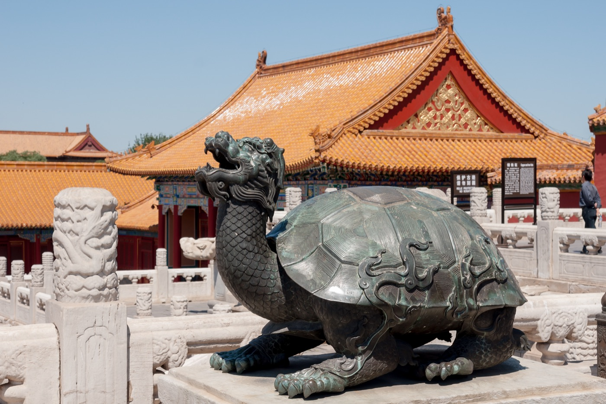
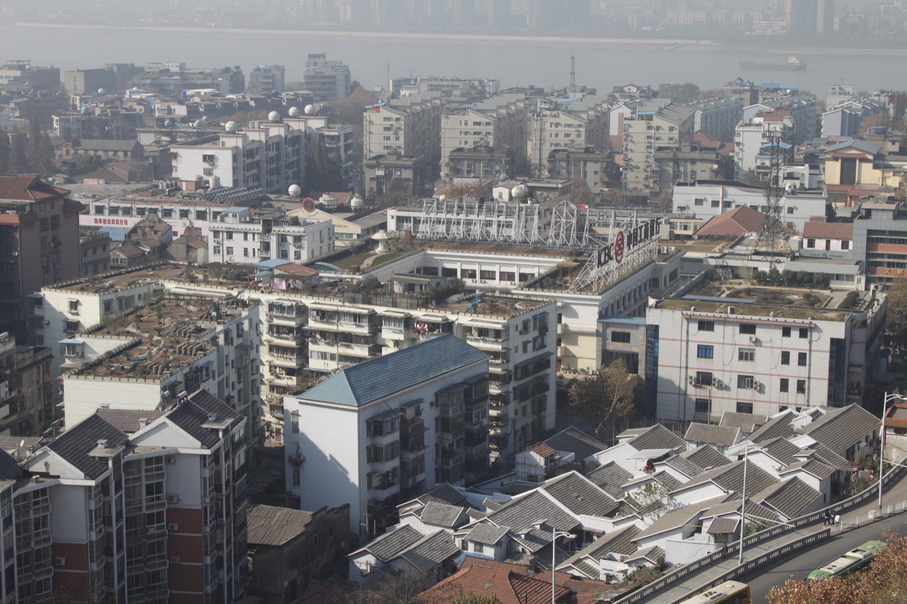
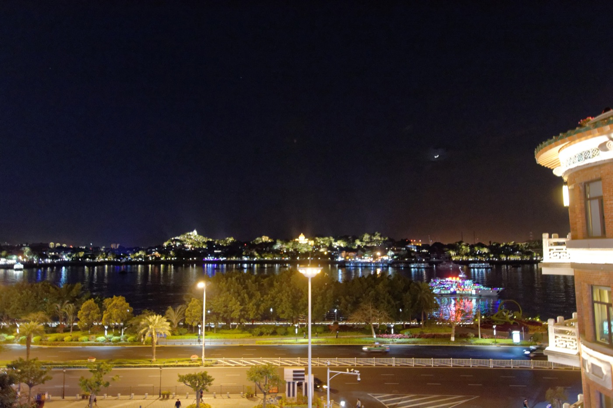
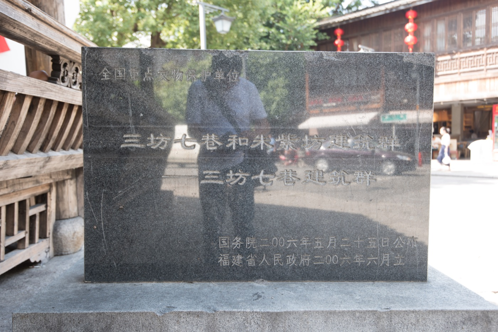
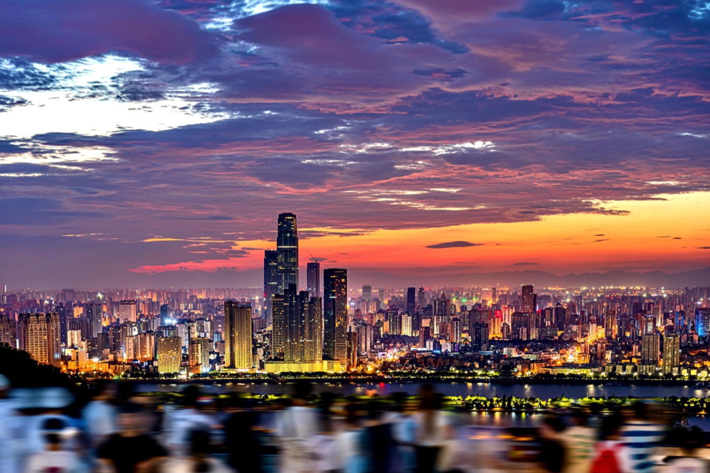

# 三 中途圈（3-4 小时）

中途圈是杭州出发体验感最完整的一档。3 小时往上不再当天来回，至少两晚起步，三天四天把节奏铺开。这一档对应小长假、连休周末，或年假切两段里较长的那一半。

座位上和短途圈拉开差距。1 小时车次二等座没区别，3 小时往上坐到第二个钟头腰开始酸，4 小时下车人是僵的。建议直接订一等座，价差 200-400 元，三天行程的预算里不显眼。北京方向 4.5 小时，商务座是真值的，能平躺，下车不疲。下面按城市分别说一等座和商务座的取舍。

行李也得换一档。三天起的行程要带一件正装或半正装，商务约见、好餐厅、酒店 club lounge 都用得上，比短途圈"运动鞋走天下"多一层考虑。28 寸箱不必，登机箱加一个软包是甜区。万豪系在中途圈五座城市覆盖很厚，白金以上会籍在这一档能换到的体验最划算，套房升级和早餐的边际效用最高。

这一档的五座城市差异很大。北京文化密度第一，但天气和人潮要算计。武汉是工业大城加江湖底色，吃和博物馆是支柱。厦门是海、是洋楼、是节奏放慢。福州低调，三坊七巷 (5A) 加平潭岛，被严重低估。长沙是这五个里最年轻、最市井的，吃和湖湘文化双主线。下面分别展开。

## 北京

{ width="640" .center }

杭州到北京 4 小时 28 分，是中途圈里最长的一段，但放在中途而不是长途，是因为车次密、商务座体验好、当天到当天就能进入状态。北京适合三天到四天，少于三天会很赶，多于四天体力跟不上。这是一座景点密度极高、但同样陷阱密度极高的城市，玩好的关键是知道哪些必去、哪些跳过、哪些时段最值。故宫 (5A)、长城、颐和园 (5A) 是绝对核心，国博和中国美术馆是文化中段，胡同和 798 是节奏调剂。最反直觉的一点是北京的"必去"清单里其实有几个大坑（八达岭长城 (5A)、南锣鼓巷、王府井），下面都会点出。季节上 4-5 月和 9-10 月是黄金窗，11 月到 3 月空气和天气都吃力，7-8 月又热又挤。

### 高铁

杭州东到北京南的常用车次是 G20、G40、G60、G2、G158 这一组，每天十几趟，发车时段从早上 7 点到下午 5 点都有。4.5 小时这个长度，二等座坐到第三个钟头腿没地方放，腰也累。一等座是基本盘，价差在 350 元上下，多一档腰托和椅距，下车状态完全不同。商务座单程 2300 元上下，能 180 度平躺，配餐和拖鞋齐全，对于打算下车直接去开会、或者追求"高铁也是行程一部分"的，这个钱花得值。京沪高铁是国内最高规格的线路之一，商务座的硬件和服务在中国所有线路里是天花板，比飞机商务舱的体验还稳。回程如果晚上 7 点之后的车，可以考虑商务座补一觉，半夜到杭州精神好。

### 酒店推荐

#### 北京宝格丽酒店
**Bulgari Hotel Beijing** · 朝阳使馆区亮马河 · 携程 4.8 · ¥5500

万豪管理但不参与 Bonvoy 积分（宝格丽为独立联营品牌，LVMH 旗下），北京硬件天花板。亮马河边地址，三里屯和工体步行可达，使馆区安静。房间起步 60 平米，硬装精致、细节密度高。Il Ristorante 意大利菜全城前三，适合商务餐。适合纪念性出行或预算不设限的行程，不适合只把酒店当落脚点的背包节奏。

#### 北京华贸JW万豪酒店
**JW Marriott Hotel Beijing** · 朝阳国贸华贸中心 · 携程 4.7 · ¥2200

华贸中心内，地铁 1 号线和 10 号线交汇，去故宫、国博 20 分钟。Flame 牛排馆稳，泳池偏大。比同片区的丽思低一档，白金升房率高，积分用在这里性价比最好。适合需要 CBD 位置又看重万豪积分的商务客。

#### 北京华贸丽思卡尔顿酒店
**The Ritz-Carlton Beijing** · 朝阳国贸华贸中心 · 携程 4.7 · ¥3200

经典美式风格，大堂吧下午茶在北京几家里属中上。位置和 JW 同一园区，公共区域比 JW 更安静，club lounge 服务更厚。出差需要正式接待场景可选这家而非 JW。地铁两线交汇，交通便利。

#### 北京金融街威斯汀大酒店
**The Westin Beijing Financial Street** · 西二环金融街 · 携程 4.7 · ¥1800

金融街核心，天梦之床做到稳定，泳池和健身房齐全。位置安静，去故宫、什刹海打车 15 分钟内，价格比朝阳区同档低一档。适合商务出行或不需要 CBD 位置但想要稳定硬件的旅客。避雷：金融街周边餐饮选择少，晚饭要提前查。

#### 北京瑰丽酒店
**Rosewood Beijing** · 朝阳CBD国贸三期旁 · 携程 4.6 · ¥3800

非万豪系，瑰丽独立品牌（新世界发展旗下），不参与万豪积分。硬装设计融合中式园林意象，"宅邸式"服务理念落地较好，Country Kitchen 京菜在外籍圈口碑高，下午茶老牌。地铁 10 号线国贸站步行可达。适合对设计感有要求、不赶万豪积分的行程。

#### 北京金融街丽思卡尔顿酒店
**The Ritz-Carlton Beijing, Financial Street** · 西二环金融街 · 携程 4.6 · ¥2800

金融圈和政务圈核心，比华贸店安静，商务感更强，接待规格稳定。距西单步行 15 分钟，故宫打车 15 分钟。适合纯商务行程，不适合以观光为主的旅游节奏。

#### 北京瑞吉酒店
**The St. Regis Beijing** · 朝阳建国门外使馆区 · 携程 4.6 · ¥2500

建国门外使馆区，是北京最早的国际顶级酒店之一，开业三十余年，客群以外资驻华高管和外交圈为主。Iridium Spa 是北京管理口碑最稳的 SPA 之一，中餐厅四合苑在外籍圈有长期口碑。距故宫打车 15 分钟，距长安街一步。适合注重瑞吉管家服务、偏重使馆区或CBD东段动线的行程。

#### 北京朝阳威斯汀大酒店
**The Westin Beijing Chaoyang** · 朝阳三里屯亮马河 · 携程 4.6 · ¥1500

三里屯亮马河商圈，距地铁 10 号线农展馆站步行五分钟，去工体、三里屯酒吧街和使馆区步行可达。天梦之床和健身房配置完整，是这一片区价格最实惠的国际五星选项。适合以三里屯为动线重心的行程，或出差北京兼顾社交的住法。

### 行程

**两天**：节奏紧但跑得通。第一天上午故宫（提前 7 天预约门票，从午门进、神武门出），下午景山公园看故宫全景再去什刹海，晚上烤鸭。第二天早上颐和园（8 点开门进），下午国博，晚上回。这种排法故宫和颐和园都只能走主线，长城省略。

**三天**：标准节奏。第一天故宫加景山，下午国博或天坛 (5A) 二选一，晚上前门或胡同。第二天慕田峪长城 (5A)（包车一天，9 点上山，下午 3 点下山，晚上回城），晚上吃涮羊肉。第三天颐和园上午，798 下午，晚上离京。

**四天**：松一档，能加深度。在三天基础上加一天，可以选：雍和宫加国子监一上午、中国美术馆加南锣周边一下午、或者直接给颐和园 + 圆明园一整天慢慢走。四天版本建议把长城放在第三天而不是第二天，前两天的步行量积累后再爬墙更可持续。

### 景点详介

**故宫**：明清两代皇宫，1420 年建成，世界现存最大木结构建筑群。常规走法是中轴线一条直路从午门到神武门，看三大殿和后三宫，但这条路游客最密、上午 10 点到下午 2 点几乎挤不动。值得做的是买"内务府路线"或者东西六宫的深度票，往珍宝馆、钟表馆、东六宫的延禧宫一带走，人流瞬间稀一半。光线最好的时段是下午 4 点之后，太阳偏西，金顶被打成蜜色，太和殿的丹陛石拍出来层次最厚。避雷点：所谓的"大水法"是圆明园的不是故宫的，故宫里没有；故宫角楼最好的拍摄点在筒子河外侧、不在故宫里，出神武门往东走 200 米就到。开放周一闭馆，节假日人流翻倍，强烈建议错峰。

**颐和园**：清代皇家园林，乾隆年间始建，慈禧扩建，1998 年世界遗产。万寿山和昆明湖加一起 290 公顷，整个走完需要 4-5 小时。早晨 8 点开门进是关键，前两小时基本只有本地晨练的老人，长廊（728 米的彩绘廊道）一个人慢慢走能拍出空景。从东宫门进、走仁寿殿、长廊、佛香阁，再下到苏州街，最后从北宫门出，是一条不回头的顺路。苏州街在万寿山北麓，是仿江南水街做的小景，本身一般，但 9 点前阳光斜射进来颜色很好。十七孔桥日落角度极好，但日落时段挤满拍照的人，要的话提前 1 小时占位。避雷点：南湖岛得划船过去，旺季排队很长，可省略；昆明湖游船是噱头，不如沿岸走。

**国博加中国美术馆**：国家博物馆在天安门广场东侧，免费但要预约（提前 7 天，每天上午 9 点放票）。馆藏 140 万件，重点是古代中国展厅（一层）和复兴之路（地下），司母戊鼎、四羊方尊、孔子像、《复兴之路》原作都在这里。半天看不完，建议直奔古代中国一条线，2 小时能看主线。中国美术馆在五四大街，离国博地铁两站，中国近现代美术的国家级收藏，齐白石、徐悲鸿、林风眠的常设厅是必看，特展年轮换。两个连着看是一整天的文化大餐，下午进美术馆人少光线舒服。避雷点：国博周一闭馆，国家博物馆和故宫博物院是两个不同的地方不要搞混，故宫里也有藏品但不在国博。

**798 艺术区**：原 718 联合厂的厂房群，2002 年艺术家进驻，现在是中国最早最有规模的当代艺术聚集区。整个园区上百家画廊，但真正有水平的是 UCCA 尤伦斯当代艺术中心、佩斯北京、常青画廊、空白空间这四家，其他大半是商业化的网红店和打卡墙。建议直奔这四家，每家看 30-60 分钟，半天就够。UCCA 是必去，每年三到四个高质量大展，门票 100 元上下。佩斯和常青都是国际画廊在北京的分部，免费。避雷点：周一大部分画廊闭馆，去之前查；798 北边的"草场地"才是更专业的画廊聚集区但偏冷门，进阶玩家可以加挂半天。

**雍和宫和法源寺**：雍和宫是雍正登基前的潜邸，乾隆九年改藏传佛教寺院，是北京香火最旺的寺。藏传佛教格鲁派的北京中心，万福阁的 18 米檀香木弥勒佛是镇寺，整木雕成。早 9 点到 10 点最值，光线好、人不算太挤、烟雾正好。法源寺在宣武门外，唐代悯忠寺旧址，比雍和宫安静十倍，丁香花 4 月底开，李敖那本《北京法源寺》就是写这里。两个寺一个属"看"，一个属"待"，连着排一上午是好的搭配，从雍和宫走到法源寺要打车 20 分钟，地铁不直达。避雷点：雍和宫周边卖香的小贩很多，寺内自带免费香，不要在外面买。

**钟鼓楼和什刹海胡同**：钟楼鼓楼在地安门外大街北端，元大都的报时中心，明清两代每天早晚撞钟击鼓。鼓楼能登顶，俯瞰整片老城屋顶，是北京少数能看到平的胡同肌理的高点之一。什刹海前海后海一带是真胡同，烟袋斜街、帽儿胡同、菊儿胡同往南走，老宅院密度最高。傍晚 5 点之后什刹海酒吧街开始热闹但俗气，建议下午去看胡同、晚上离开。避雷点：南锣鼓巷彻底跳过，已经是商业街不是胡同了，连一家本地店都没有，只有义乌小商品和奶茶店。要看胡同就去东四四条到八条、或者烟袋斜街以北。

**天坛**：明永乐十八年建，皇帝祭天的地方，1998 年世界遗产。占地 273 公顷，比故宫还大。核心是祈年殿、皇穹宇、圜丘三组建筑，沿中轴线一字排开。最值的时段是傍晚 5 点之后，西晒的光把祈年殿的蓝色琉璃瓦打成深紫加金色，正面构图非常厚重。早晨 8 点之前公园部分还没收门票，能看到本地老人在回音壁那一片打太极、唱京剧，是北京最市井的一面。建议买联票从北门进、南门出，把祈年殿、皇穹宇、圜丘一线走完，1.5 小时够。避雷点：神乐署和斋宫两个偏殿可以跳过，主轴看全就够。

**长城**：北京周边段最值得去的是慕田峪和司马台，绝对避开八达岭。八达岭离市区最近、名声最大、所以游客最多，旺季密度堪比早高峰地铁，几乎是排队上墙、排队下墙，看不到长城本来的样子。**慕田峪**距市区 70 公里，包车一小时四十分到，城墙保存好、敌楼密集、植被覆盖率高、有缆车上下，老人小孩友好，是综合最稳的选择。整段走完 2-3 小时。**司马台**离市区 120 公里，单程两小时半，是国内唯一保留明代原貌的长城段，险峻、未修缮、能看到真正的"野长城"，10 号敌楼以东对体力要求高。司马台脚下的古北水镇是另一回事，做成了乌镇模式的旅游小镇，有人喜欢有人觉得做作，可以顺路看看但别期待太高。慕田峪 + 城里两天，或者司马台 + 古北水镇住一晚，是两种主流玩法。避雷点：八达岭真的不要去，去过的人没有不后悔的。

### 吃

**全聚德前门店**：老字号烤鸭，旅游团聚集地，但前门总店的烤鸭水准依然在线，挂炉果木烤是老路子。鸭子点半只起，手撕鸭和夹饼上桌都是仪式，价格人均 300。要烤鸭体验这家是稳的，但若想躲开旅游团，**四季民福**（故宫店、什刹海店）是更聪明的选择，本地人多，下午 5 点开吃前要排队但翻台快。

**南门涮肉**：京味涮羊肉的代表，铜锅炭火，清汤一锅开锅，蘸麻酱。鲜羊肉切片是核心，"上脑"和"磨裆"是老饕首选。冬天来北京吃这个最对，夏天也能吃但少了点意思。人均 200 上下，多家分店，前门店和北新桥店都行。

**护国寺小吃**：北京老字号小吃集合，护国寺街总店是源头。豆汁、焦圈、驴打滚、艾窝窝、面茶一字摆开，自助式点单。豆汁是分水岭食物，第一次喝大概率不喜欢，但护国寺的豆汁是本地标准。早餐场景去最对。人均 30。

**新川面馆**：簋街以外北京少数能吃到地道四川担担面的小馆，西单那家是老店。面是手工的，红油是慢炖的，担担面 28 一碗、抄手 22 一份，简单但水准稳定。北京吃辣选择不多，这家是底牌。

**柴氏风味斋**：东四十条的老牌牛肉面，汤是清汤路线，牛肉是大块炖透的本地黄牛，跟兰州系完全两回事。不到 50 一碗，但要趁中午饭点去，下午 2 点收摊。北京老饕私藏，外地游客很少见。

### 最佳季节

4 月底到 5 月中、9 月底到 10 月中是绝对黄金期。4-5 月柳絮恼人但天高气爽，故宫和颐和园进入绿意状态。9-10 月秋高，香山红叶 10 月下旬到 11 月上旬最旺，但人也最多。11 月到 2 月是北京的"硬季"，雾霾和冷风都吃力，不推荐除非是看雪后故宫这种特殊目标。7-8 月又湿又热又挤，避开。

## 武汉

{ width="640" .center }

杭州到武汉 4 小时 10 分，是中途圈的中段。武汉的气质和北京、厦门完全不一样：码头城、九省通衢、近代工业重镇、辛亥首义之地，加上一江两岸的地理切割，整个城市的密度和市井感是中国大城里最饱和的一档。三天是甜区，两天太赶，四天可以加挂东湖深度。武汉的核心是吃、博物馆、和长江。黄鹤楼 (5A) 大半重建过、要带点距离感看；湖北省博的曾侯乙编钟是国宝级；东湖 (5A) 比西湖大五倍，但绿道做得很好；武大樱花是 3 月底的限时奇观。租界区（江汉路、黎黄陂路）是被低估的近代建筑富矿。这座城市的吃比景点更值得专程，热干面、豆皮、藕汤、武昌鱼是底层逻辑。

### 高铁

杭州东到武汉的常用车次是 G578、G584、G1772、G1736 这一组，每天 8-10 趟。4 小时 10 分的长度，二等座勉强能扛但下车累。一等座价差 250 元上下，强烈建议。这条线没有商务座的全程车次，部分车次只有少量商务座。如果是商务出差讲究状态，可以查 G578 或 G1772 这两班的商务座配置。武汉站在武汉东北郊，到市区（武昌或汉口）地铁需 40 分钟以上，建议提前查酒店所在区，落地直接打车更省时间。

### 酒店推荐

#### 武汉富力威斯汀酒店
**The Westin Wuhan Wuchang** · 武昌临江大道长江边 · 携程 4.7 · ¥1300

长江景观房直对江面，是武汉看两江三岸的最佳酒店位置。天梦之床稳定，健身房和泳池齐全。距黄鹤楼打车 8 分钟，距省博打车 15 分钟，距汉口黎黄陂路打车 20 分钟。适合把长江江景作为住宿核心的行程，比同档汉口方向的选择更靠近武昌景点主轴。

#### 武汉武昌万豪酒店
**Wuhan Marriott Hotel Wuchang** · 武昌中北路CCFC楼 · 携程 4.8 · ¥1100

位于武昌中北路 CCFC 大厦 45-66 层，东湖绿道打车 15 分钟，省博打车 10 分钟，黄鹤楼打车 10 分钟。标准万豪档，服务稳定。中餐厅湖北菜做得用心，藕汤和武昌鱼比同价位强。适合行程以武昌景点为主的、带长辈出行的稳妥选择。

#### 武汉光谷万豪酒店
**Wuhan Marriott Hotel Optics Valley** · 东湖高新区光谷 · 携程 4.8 · ¥1000

光谷商圈核心，适合行程在武昌东侧、东湖方向延伸的旅客。东湖绿道打车 20 分钟，光谷广场步行 5 分钟。商圈配套成熟，周边餐饮密度高。去汉口黎黄陂路或省博需打车 30 分钟以上，不适合以汉口为主场的行程。

#### 武汉光谷凯悦酒店
**Hyatt Regency Wuhan Optics Valley** · 东湖高新区光谷 · 携程 4.7 · ¥1200

非万豪系，凯悦体系，光谷区域本地评分最高一档。硬件比周边竞争对手新，大堂公共区域宽敞。适合商务会议或以东湖光谷为基地的休闲行程，不适合重点游览汉口和黄鹤楼的行程。

### 行程

**两天**：第一天上午黄鹤楼加户部巷不踩坑路线，下午湖北省博，晚上汉口租界区夜色。第二天东湖绿道半天加武大（季节合适的话），下午江汉路加吉庆街，晚上离汉。

**三天**：第一天黄鹤楼加长江大桥步行加户部巷晚饭。第二天湖北省博一上午（编钟演出场次提前查），下午东湖磨山楚文化园，晚上回汉口黎黄陂路。第三天武大或者集贤市场加吃豆皮，下午江汉路购物，晚上离汉。

**四天**：标准三天加一天，可以选东湖绿道全程骑行（绿道 100 公里、骑半圈 30 公里 4-5 小时）、或者顺路加挂荆州古城高铁 1 小时往返、或者去周边的木兰天池（半日往返）。

### 景点详介

**黄鹤楼**：始建三国吴黄武二年（223 年），原址在武昌蛇山，历史上烧毁重建过几十次。**现在看到的是 1985 年钢筋混凝土重建的，不是古建**。这点要先认清，否则去了会失望。但仍然值得上：站在主楼五层看长江一二桥、龟山电视塔、武昌江岸全景，这个视角是其他地方没有的。傍晚 5 点上去最值，西晒打过来江面金色，黄鹤楼飞檐有戏剧感。崔颢的"昔人已乘黄鹤去"那块碑就在景区内，李白"眼前有景道不得"的典故也是在这儿。门票 60，一小时够。避雷点：景区里的黄鹤酒、黄鹤茶都是商业噱头，不必。

**武大樱花**：武汉大学樱花大道在校内，3 月下旬到 4 月初盛开，前后只有 10-14 天的窗口。樱花本身是 1939 年日军侵占武大期间种的，战后保留并扩种，现在校园里上千棵。看樱花的最佳时段是清晨 7-8 点，人少光线好。盛花期校外人凭预约入校（武大微信公众号提前 7 天放预约），普通工作日比周末好抢。赏樱核心是樱顶（老斋舍上面）、樱园路、樱花大道这三段。避雷点：花期之外的武大没必要专门进，樱顶老建筑很美但不是花期人少氛围好不一样；预约抢不到的不要花高价找黄牛。

**湖北省博**：在东湖之滨，免费预约。镇馆三宝是越王勾践剑、曾侯乙编钟、元青花四爱图梅瓶。**曾侯乙编钟**是绝对必看，1978 年随州出土，65 件青铜编钟一字排开，2400 多年依然能演奏。馆内有编钟仿制件演奏厅，每天三场（10:00、11:30、14:30），15 分钟，是国内博物馆里最值得看的演出之一，演奏《楚商》《一路上有你》两曲。除了编钟，曾侯乙墓的整个出土组合（鼎、簋、尊盘、车马器）都在二楼专厅，是中国青铜器收藏最重要的一组。半天起步，仔细看一天都行。避雷点：周一闭馆；编钟演奏厅位置有限，开馆 9 点直接奔过去拿首场票。

**户部巷和真本地路线**：户部巷在武昌蛇山下，号称"汉味早点第一巷"，但早就是旅游一条街了，里面卖的热干面豆皮和外地小吃节没什么差别。**真本地早餐路线**是粮道街、司门口、雪松路、集贤村这一带：粮道街的赵师傅油饼包烧麦、雪松路的严氏熱干面、司门口的曾记豆皮、还有汉口三镇民生甜食馆的糊汤粉，都是本地人天天去的。要"吃武汉早点"户部巷可以走过看一眼，要真吃就奔本地路线。吉庆街晚上的大排档夜市也已经做成旅游版了，要吃宵夜不如去江汉路二马路。

**东湖和磨山楚文化园**：东湖 33 平方公里，是中国最大的城中湖，比西湖大 5 倍。东湖绿道 101 公里全长，分四段：听涛段、磨山段、湖中道、白马段。骑行最舒服，租车点很多，半天能骑磨山一圈 30 公里。**磨山楚文化园**在东湖东岸，是一座以楚国文化为主题的园林，楚天台是核心建筑，登上去能看东湖全景。楚文化博物馆和编钟乐宫都在里面，编钟乐宫每天有楚舞和编钟表演。东湖之美在于"大"和"绿"，跟西湖的精致小景完全不同的体验。避雷点：东湖游船和摩天轮可以跳过；磨山的人造楚天台亭台楼阁是新的、不是古迹，要带欣赏园林的眼光不要带欣赏古建的眼光看。

**江汉路和黎黄陂路**：江汉路步行街是 1860 年代以来汉口的主轴，两侧的老建筑大多是 1920-30 年代的银行和洋行。**黎黄陂路**是相对安静的一条横街，原名黎黄陂路，租界时代法租界、俄租界、英租界的边界地带，咖啡馆和小店密度高。两条街连着走能看到 20 多栋有挂牌保护的近代建筑，包括汇丰银行旧址、东方汇理银行、横滨正金银行旧址。傍晚 5 点之后江岸路一带的灯光起来，沿江步行最舒服。这一带是武汉被严重低估的板块，比上海外滩更生活化、比天津五大道更聚集。避雷点：江汉关博物馆值得进，但里面的很多展品是复制品，重点是建筑本身。

### 吃

**蔡林记**：百年老字号热干面，汉口和武昌都有店，户部巷里那家不要去，去江汉路总店。芝麻酱、辣萝卜、葱花、酸豆角混着拌，5 元一碗。早餐时段去最对，10 点之后面会变干。

**老通城豆皮**：武汉三大名小吃之一（豆皮、热干面、糊汤粉），三鲜豆皮是糯米加猪肉香菇笋丁，外面一层蛋皮油煎，切方块。前进一路总店是老地方。

**艳阳天酒家**：武汉本帮菜的代表，多家分店。武昌鱼、藕汤、洪山菜薹炒腊肉、粉蒸肉、清蒸鳊鱼是必点。藕汤要点排骨藕汤，武汉的藕是莲花湖产的粉藕，炖出来的汤奶白色，全国独一份。人均 120。

**赵师傅红油热干面**：粮道街，比蔡林记更小众但本地人更爱。红油版本和传统芝麻酱版本各有粉丝，赵师傅的红油是辣油加芝麻酱混的，更香。早 6 点开门，9 点就排长队。

**靓靓蒸虾**：武汉小龙虾的招牌，多家分店，水陆街总店原始。油焖大虾和清蒸蒜蓉两吃，5-7 月小龙虾季是高潮，宵夜场景配着冰啤酒。

### 最佳季节

3 月下旬到 4 月（樱花和油菜花）、10 月（凉爽，长江秋色）是甜区。5-6 月是小龙虾季和荷花季，但开始热。7-8 月武汉的"火炉"名声不假，35-40 度湿热，强烈不推荐。11-2 月阴冷，没有暖气，体感比北京冬天还冷，也不建议。

## 厦门

{ width="640" .center }

杭州到厦门北 4 小时 30 分，是中途圈的甜区。厦门和这一档其他几座城市完全是另一种气质：海岛感、慢节奏、洋楼、闽南菜、海风。两到三天最合适，四天会有点过。鼓浪屿 (5A)、厦门大学、南普陀寺是三大件，但更值得花时间的是沙坡尾、八市这类生活感重的地方。鼓浪屿要避开八卦楼那一带的网红打卡，厦大要看凤凰花季。最聪明的玩法是把泉州（高铁 30 分钟）顺路加挂半天到一天，闽南文化的真实底盘在泉州不在厦门。季节上厦门一年三季都好，唯独 7-9 月台风季要错开。

### 高铁

杭州东到厦门北的常用车次是 G1631、G1655、D3107、G1671 这一组。4.5 小时长度，二等座到第三个钟头开始难受。一等座价差 280 元，建议加。这条线没有 G 字头全程商务座，少数 D 字头动车有商务座但配置一般。下车后从厦门北到岛内（厦大、中山路那一带）地铁 30 分钟。如果住鼓浪屿，要加一段轮渡，过夜行李重的话不建议第一天就上岛，先在岛内住一晚再过去。

### 酒店推荐

#### 厦门艾美酒店
**Le Méridien Xiamen** · 思明区莲前西路岛内中心 · 携程 4.7 · ¥1500

厦门岛内综合评分最高一档。地铁 1 号线旁，厦大打车 10 分钟，鼓浪屿轮渡口打车 15 分钟。设计感比标准万豪强，早餐有沙茶面和海蛎煎，本地味做得用心。适合以厦大、鼓浪屿、沙坡尾为主场的行程，不需要住海景位置但要便利和品质的旅客。

#### 厦门喜来登酒店
**Sheraton Xiamen Hotel** · 思明区嘉禾路筼筜湖边 · 携程 4.6 · ¥1200

筼筜湖步行可达，去厦大、中山路打车 15 分钟。喜来登稳定档，房间宽敞，泳池和健身房齐全。位置偏商务区一些，周边安静，不在旅游核心但接驳方便。适合带家人或行程松节奏的旅客，中端预算里位置最实用一档。

#### 厦门威斯汀酒店
**The Westin Xiamen** · 思明区岛内 · 携程 4.6 · ¥1300

威斯汀标准档，天梦之床稳定，健身房设备齐全。岛内位置，去核心景区打车均 15-20 分钟内。比艾美设计感低一档但价格接近，适合更看重稳定硬件和品牌服务标准、对设计感要求不高的旅客。避雷：厦门岛内路窄停车难，酒店代客泊车建议提前确认。

### 行程

**两天**：第一天厦大加南普陀寺加沙坡尾老厦港晚餐。第二天鼓浪屿一日，傍晚轮渡回岛吃八市附近的海鲜，晚上离厦。

**三天**：第一天厦大加南普陀寺加沙坡尾。第二天鼓浪屿核心区，下午 4 点回岛、晚上中山路或者八市。第三天泉州一日（高铁 30 分钟到泉州，开元寺、西街、清净寺、洛阳桥），晚上回厦门离开。

**四天**：三天行程加一天集美学村或者环岛路骑行，节奏松一档。

### 景点详介

**鼓浪屿**：1.88 平方公里的小岛，1903 年设公共租界，全岛禁机动车，有 13 国领事馆和大批近代洋楼。2017 年世界遗产。**值得去的**：菽庄花园（园林叠石和望潮意境，大海和岩石的关系处理得极好）、八卦楼旁的风琴博物馆（全国最大风琴收藏，老演奏家每天有讲解）、黄家花园（典型华侨别墅）、三一堂。**可以跳过的**：日光岩（人最多、视野并不比菽庄好多少）、皓月园、整个龙头路一条街（卖鱿鱼丝和椰子鞋、跟厦门完全无关）。岛上住一晚是质变体验，傍晚 6 点之后游客退潮，整个岛只剩岛民和住客，洋楼亮灯，是另一个世界。半日游和一日游都不如住一晚。避雷点：龙头路、张三疯奶茶、马拉桑果汁、网红地标全都是坑；郑成功雕像所在的覆鼎岩天气好时值得登一次但不必排队。

**厦门大学**：1921 年陈嘉庚创办，校园在思明区南端，紧临大海。**预约**：周一到周五本科教学日要凭学生证或预约入校（厦大公众号），周末名额放宽。**最佳季节**：5-6 月凤凰花开，校园里几十棵凤凰树红得满满当当，是厦门最值得拍的季节。芙蓉湖、芙蓉隧道（学生涂鸦从入口画到出口的隧道）、上弦场、嘉庚楼群是必看。整个校园 2 小时够。避雷点：芙蓉隧道有部分新画作越来越商业化，但老画作仍然有意思；不要从厦大正门进等很久，从西校门或者从演武大桥那侧进更顺。

**南普陀寺**：唐代始建，1924 年闽南佛学院在此创办，是闽南佛教的中心。寺紧贴五老峰下，从厦大沿外围走 5 分钟到。寺内核心是天王殿、大雄宝殿、藏经阁，建筑本身闽南风格鲜明，瓦当滴水都是燕尾脊和剪粘。寺后五老峰可以登，1.5 小时往返，登顶能看厦大和厦门湾全景。寺内素斋馆是全国寺院素斋里水准前列的，提前预约。避雷点：放生池里的乌龟不要喂；寺外摆摊算命和卖香的不要理。

**沙坡尾和老厦港**：沙坡尾是厦港老渔港的最末端，1955 年填海前是船只入港的避风坞。现在是改造的文创区，但和田子坊那种过度商业化不同，沙坡尾保留了老渔民、修船厂、小吃摊、和文艺小店并存的状态。"避风坞"中间停着木船，岸边老房子改成咖啡馆和工作室，傍晚整片街区氛围非常好。值得做的：在沙坡尾找一家本地茶铺喝功夫茶（不是表演用的、就是日常的），吃一碗沙茶面、一份海蛎煎。避雷点：太多打卡店和奶茶店开始入侵，往老厦港社区里面走（不是游客最多那一段）才是本地。

**集美学村**：陈嘉庚 1913 年起在集美修建的一组校园建筑群，在岛外集美区，地铁 1 号线直达。建筑融合闽南红砖和西洋柱式，是中国近代校园建筑里最独特的一组。集美中学的南薰楼、道南楼，集美大学航海学院、嘉庚故居，都在一片连续区域内可以步行。**鳌园**是陈嘉庚墓地和纪念馆，整个园由花岗岩浮雕铺满，叙述中国历史和南洋华侨故事，建筑界称为"中国近代雕塑博物馆"。半日够。避雷点：龙舟池游船可跳过；集美学村本身免费但鳌园要门票。

**八市菜市场**：开禾路菜市场（俗称八市），厦门岛内最老最大的菜市场，海鲜每天从厦港新鲜运来。**真厦门感**就在这里：本地老人买菜、海鲜按筐摆、闽南话此起彼伏。可以买现切水果、点一份现做的海蛎煎或沙茶面，或者直接挑海鲜让附近的"海鲜代加工"小店做。避雷点：游客多了之后开始有"海鲜大排档"瞄准游客的店，找本地人最多的那家代加工，价格是双轨制要先问；不要在八市内部买香烟茶叶手信。

**泉州顺路加挂**：高铁 30 分钟到泉州，半天到一天可以加挂。泉州是闽南文化真正的源头：开元寺（唐代古刹，双塔是中国现存最高石塔）、西街（保留宋代街巷格局、苏廷玉故居一带）、清净寺（宋代伊斯兰教礼拜寺）、洛阳桥（北宋蔡襄主持修的跨海石桥）、府文庙、天后宫、关岳庙都在步行可达的老城区内。**早餐去西街吃面线糊**，是泉州人的日常。一天玩得动主线。如果时间紧，半天集中开元寺加西街最值。避雷点：泉州的古镇感比厦门浓 10 倍，但旅游配套不如厦门，规划要更紧凑；闽南话比厦门更难懂，但当地人对外地人很友好。

### 吃

**乌糖沙茶面**：思明北路民族路口，老厦门沙茶面的代表。沙茶酱熬到底浓郁，配料可加鱿鱼、虾、猪肝、大肠等。早 7 点开门，10 点之前去最好。20 元一碗。

**1980 烧肉粽**：思明北路总店，老字号烧肉粽。糯米加猪肉、香菇、蛋黄、栗子，竹叶包蒸到糯米油亮，蘸酱吃。一颗 12 元，早餐场景。

**月华沙茶面**：思明南路开元路口，比乌糖更家庭式的小馆。除了沙茶面还有海蛎煎、土笋冻、五香条。土笋冻是闽南独特的小吃，用海里的"星虫"熬冻成型，口感清弹，第一次吃要心理建设。

**佳味再添**：大同路民族路口，老厦门小吃合集，海蛎煎、面线糊、烧肉粽、卤面都做得稳。环境很本地、人很多、上菜快。人均 50。

**32 HOW 海鲜**：万达广场和会展中心都有店，新派闽南海鲜。比八市代加工更正式一档但保留闽南做法，沙茶炒蛤、葱姜炒花蟹、闽南封肉是招牌。人均 200。

### 最佳季节

3-5 月、10-11 月是绝对甜区。5-6 月凤凰花开是厦大最美的季节但天气开始热。7-9 月台风季要避开，台风季节经常停渡轮、停航班。12-2 月凉爽偶尔有冷风，洋楼背景的旅拍光线很好。

## 福州

{ width="640" .center }

杭州到福州 3 小时 50 分，中途圈中段。福州是这五座城市里最被低估的一座：作为福建省会，它的存在感被厦门和泉州盖过，但三坊七巷的老城肌理、烟台山的近代建筑群、平潭岛的"蓝眼泪"和海蚀地貌、加上一个安静干净的省级博物馆，构成了一个比厦门更深、比武汉更慢的体验。两天够、三天最合适。福州是闽都文化、近代海军摇篮、和当代台海前哨三重身份重叠的城市，节奏比厦门慢一档，吃比厦门更野。

### 高铁

杭州东到福州的常用车次是 G1635、G1651、D3105 这一组，每天 6-8 趟。3 小时 50 分的长度，二等座勉强、一等座舒服。一等座价差 220 元，建议加。这条线没有商务座的稳定配置。福州南站离市区 20 公里，地铁 1 号线 30 分钟到鼓楼区核心。

### 酒店推荐

#### 福州威斯汀酒店
**The Westin Fuzhou Minjiang** · 仓山区南江滨大道闽江边 · 携程 4.8 · ¥1200

闽江景观房视野直对闽江，是福州最值的江景房资源。距烟台山近代建筑群步行 10 分钟，是以烟台山为重点的行程首选基地。早餐有鱼丸、肉燕、扁肉等本地味，比同价位竞争对手做得更用心。去三坊七巷打车 15 分钟。适合把闽江和烟台山放在行程核心的旅客。

#### 福州喜来登酒店
**Sheraton Fuzhou Hotel** · 仓山区浦晓洲路闽江边 · 携程 4.7 · ¥1000

闽江南岸，毗邻海峡国际会展中心，是福州商务会议首选场地之一。396 间客房，会议设施完善。距烟台山步行可达，去三坊七巷打车 15 分钟，距福州南站约 15 分钟。适合商务出行或以仓山区为主场的行程，价格比威斯汀低一档，万豪积分同样适用。

#### 福州西湖大酒店
· 鼓楼区湖滨路西湖边 · 携程 4.8 · ¥900

福州本地特色首推。紧邻福州西湖公园，部分房间直对西湖景观，园林式布局。建筑和服务偏经典国宾馆风格，不是精品设计酒店，但是福州本土接待规格高的一档。距三坊七巷打车 10 分钟，距福建博物院步行 5 分钟。适合想感受福州本地气质而非连锁品牌标准的旅客，也是带长辈出行的稳妥选择。

### 行程

**两天**：第一天三坊七巷加于山加福建博物院，晚上烟台山。第二天平潭岛一日（高铁 1.5 小时往返），晚上离福。

**三天**：第一天三坊七巷一上午加福建博物院一下午加烟台山晚上。第二天鼓山涌泉寺一上午加西湖公园一下午加江滨晚饭。第三天平潭岛一日，晚上离开或者第二天早上离开。

### 景点详介

**三坊七巷**：从晋代起开始有住户、唐宋形成街巷格局、明清达到鼎盛，是中国保存最完整的古代街巷格局之一，三条横向的"坊"（衣锦坊、文儒坊、光禄坊）和七条纵向的"巷"（杨桥巷、郎官巷、塔巷、黄巷、安民巷、宫巷、吉庇巷）构成。**核心是郎官巷一带**：严复故居、林则徐祠堂、二梅书屋、水榭戏台、林觉民冰心故居都集中在这一带。**避雷区**：南侧南后街和东侧光禄坊一段是新装修过的商业街，全是星巴克和奶茶店，不必停留。建议从北面入口（郎官巷或杨桥巷）进，先看老宅院，最后再走南后街出。半天起步，认真看一天都行。

**鼓山和涌泉寺**：鼓山在晋安区东北，海拔 925 米，福州第一山。山上有摩崖石刻 600 多处，是中国南方最大的摩崖石刻群，宋代以来历代文人题刻一字排开。**涌泉寺**在鼓山半山，唐建、宋名"涌泉禅院"，清代鼓山十景之首。寺内有铁锅、铁树和陶塔（千佛陶塔，元代）三宝。爬山可以走十八景路线，全程 2-3 小时；或者坐索道直接到涌泉寺，1 小时游览即可。早晨上山雾气好、空气好。避雷点：山顶其实没什么，建议到涌泉寺为止；山下的鼓山温泉是商业项目，跳过。

**西湖公园**：注意是福州西湖、不是杭州西湖，规模和名气都没法比。但作为福州市民公园，免费，每天清晨都是本地老人晨练。湖中有开化寺（清代）和宛在堂（明代）两个亭。半天即可。这个景点的价值在于"福州本地人怎么过日子"，作为福州生活感的入口比作为景点更合适。和福建博物院在同一片区，可以连着安排。

**烟台山**：仓山区江南岸，鸦片战争后划为外国领事区，先后有 17 国领事馆设立。整座山头是一片近代洋楼建筑群：英国领事馆旧址（公园路 39 号）、汇丰银行旧址、爱国路 2 号石厝教堂、独立路圣公会教堂、烟台山旧领事馆群。**最值得做的是傍晚 4-6 点**沿乐群路、爱国路、公园路走一圈，老建筑在西晒下显得厚重。烟台山近年做了文创改造，咖啡馆和小店进驻，但比上海武康路或者厦门鼓浪屿都要安静。这是福州最被低估的一片区域。

**平潭岛和蓝眼泪**：从福州站坐高铁 1.5 小时到平潭站，可以当日往返。平潭是中国第五大岛、福建最大岛，距台湾 68 海里。岛上有海蚀地貌（北港文创村、长江澳风车阵、东海仙境）、跨海大桥、和**蓝眼泪**（夜光藻发光现象）。蓝眼泪只在 4-7 月出现，需要无月、风浪适中、水温合适，"看到的概率"在 20-40% 之间，要有心理准备。最容易看到的地点是龙凤头海滩、坛南湾、长江澳。白天可以走北港文创村（石头屋改造）、长江澳风车阵看夕阳。一天紧凑、两天松。避雷点：跟团一日游平潭节奏太赶看不到核心，建议自己包车一天玩。

**福建博物院**：在西湖公园北侧，免费。馆藏 17 万件，重点是闽越文物、宋元海上贸易（德化白瓷、漳州窑外销瓷）、和近代海军（船政学堂、马尾船政文化）。**镇馆之宝**是宋代福建漳浦印纹陶罐和昙石山遗址出土的彩陶。半天够。船政文化展厅是福州独一份，对中国近代海军史和洋务运动感兴趣的，必看。避雷点：周一闭馆。

### 吃

**安泰楼**：朱紫坊老字号，福州菜代表，佛跳墙是招牌。佛跳墙是福州官府菜的代表，三十多种食材慢炖，价格 200-1000 一例分档，旗舰版鲍参翅肚一例 1000 元起，普通版 200 元起就有像样的。荔枝肉、醉糟鸡、芋泥也是必点。

**永和鱼丸**：福州鱼丸的连锁老字号，鱼丸是包馅的（猪肉馅），汤清丸弹。十几家分店，三坊七巷店和津泰路店都行。10 元一碗。

**老福州肉燕**：肉燕是福州独有的小吃，用猪后腿肉打成皮、再包猪肉馅，形似馄饨但皮更薄更弹。福州话叫"扁肉"或"肉燕"。十字街一带的"同利肉燕"是百年老字号。

**沙县小吃**：注意，沙县小吃的总店和真正版本就在福州周边的沙县，市面上常见的"沙县小吃"是平民化的连锁版。福州市内的沙县小吃比一线城市看到的要正宗一档，扁肉、拌面、蒸饺加 sha 茶面这一套是底牌。

**聚春园**：福州老字号，1865 年开业，佛跳墙的发源地（一说），在鼓楼区东街口。比安泰楼更老牌、更正派，环境也更正式。佛跳墙、爆糟羊、太极芋泥是招牌。人均 250-400。

### 最佳季节

3-5 月、10-11 月是甜区。4-7 月平潭蓝眼泪季是加分项但要赌天气。6-9 月台风季要错开。12-2 月凉爽不冷，福州冬天比厦门稍冷一档但比武汉舒服得多。

## 长沙

{ width="640" .center }

杭州到长沙南 4 小时 20 分，是中途圈最远的一站。长沙是这五座城市里最年轻、最市井、最热闹的一座：橘子洲头 (5A)、岳麓山 (5A)、湖南省博、马王堆、太平街、文和友、加上一个无法绕开的"吃辣文化"。两天紧、三天合适、四天可以加挂韶山。长沙的特点是夜生活密度高、年轻人多、湘菜集中，**不是看古迹的城市**（古迹在长沙周围的常德、岳阳、衡阳更多），但作为湖湘文化的现代窗口，体验感独特。岳麓山和橘子洲头傍晚最值，省博的辛追夫人是国宝。

### 高铁

杭州东到长沙南的常用车次是 G1373、G1375、G1373 等。4 小时 20 分长度，一等座价差 240 元，建议加。这条线少数车次有商务座但不是每班都有。长沙南站离市区 6 公里，地铁 4 号线 20 分钟到五一广场。

### 酒店推荐

#### 长沙建鸿达JW万豪酒店
**JW Marriott Hotel Changsha** · 雨花区芙蓉中路二环内 · 携程 4.8 · ¥1600

2022 年开业，万豪体系顶配，房间 50 平起步，由新加坡 HBA 设计。地铁 1 号线涂家冲站步行 5 分钟，距橘子洲头打车 15 分钟，距五一广场 5 站地铁。中餐厅湘菜在长沙酒店里属高端一档，剁椒鱼头和小炒黄牛肉做得规整。适合以五一广场、省博、岳麓山为主场的行程，比北京同档低约 30%。

#### 长沙运达喜来登酒店
**Sheraton Changsha Hotel** · 开福区芙蓉中路 · 携程 4.8 · ¥1200

喜来登稳定档，服务一贯性好。距湖南省博打车 10 分钟，距橘子洲头 15 分钟，位置居中，两边都不远。泳池和健身房齐全。适合行程以省博和岳麓山为核心、要稳定品牌标准的旅客。

#### 长沙君悦酒店
**Grand Hyatt Changsha** · 天心区湘江中路湘江风光带 · 携程 4.8 · ¥1800

非万豪系，凯悦体系，长沙本地评分并列最高。江景房直对橘子洲，是长沙湘江景观最好的酒店之一。临太平街和坡子街，步行 10 分钟到坡子街吃火宫殿。中餐厅在长沙非万豪系里口碑前列。适合对位置和江景有要求、预算充足的旅客。

#### 长沙步步高福朋喜来登酒店
**Four Points by Sheraton Changsha, Meixi Lake** · 岳麓区梅溪湖步步高广场 · 携程 4.7 · ¥700

步步高梅溪湖新天地商圈内，地铁 4 号线直达长沙南站，方便高铁接驳。喜来登中端线，价格友好，品牌服务标准稳定。位置偏岳麓区西侧，去五一广场和省博需打车 30 分钟，适合以梅溪湖或岳麓山方向为主场的行程。

### 行程

**两天**：第一天湖南省博一上午加岳麓山下午加橘子洲头傍晚。第二天太平街加都正街半天加坡子街吃辣晚饭，下午离长。

**三天**：第一天湖南省博一天（认真看半天，加马王堆专厅一下午）。第二天岳麓山加岳麓书院加橘子洲头一天。第三天韶山往返一日（高铁 1 小时到韶山南），晚上离开或者第四天早上。

**四天**：三天加一天，可以走宁乡花明楼 (5A)（刘少奇故居、半日往返）或者加挂凤凰古城（高铁到怀化再转车 2 小时、住一晚最稳）。

### 景点详介

**橘子洲头加岳麓山**：橘子洲是湘江中的狭长沙洲，长 5 公里、宽 100-300 米，全是公园。最有名的是南端的青年毛泽东头像（32 米高，2009 年立），是网红打卡点。**最值的玩法**是傍晚 5 点之后从岳麓山下来，过湘江一桥步行到橘子洲、从北端走到南端，2-3 公里、1.5 小时。傍晚湘江日落配橘子洲，光线极好。岳麓山是南岳衡山七十二峰之一，海拔 300 米，山上有岳麓书院（1015 年建，中国四大书院之一，"惟楚有材、于斯为盛"那副对联就在这）、爱晚亭（袁枚命名、毛泽东少年读书处）、麓山寺（晋代古刹）、新民学会旧址。半天能玩，缆车上下省力。岳麓书院本身值 1.5 小时，是必看。避雷点：橘子洲烟花周六晚上 8:30 有，是收费在洲上预留区，远观（湘江两岸）就免费。

**湖南省博物院**：开福区东风路，免费预约。马王堆汉墓三大件在这里：辛追夫人遗体（1972 年出土，2100 年不腐，是世界考古史上最重要的发现之一）、T 形帛画（现存最完整的西汉帛画）、各种漆器和丝织品。**马王堆专厅是必看**，一整层楼讲完整考古和复原过程，半天起步。除了马王堆，湖南省博的青铜器（商代晚期人面方鼎、四羊方尊都从这一带出土）、长沙窑唐代外销瓷也很值。整馆细看一天。避雷点：周一闭馆；辛追遗体展厅光线很暗（保护需要），不允许拍照，建议先看完展板再去看遗体本身。

**太平街和都正街**：太平街是长沙古城中轴的最末段，靠近坡子街，明清时是商贾云集之处，现在改造成"古街"，但已经做成了商业一条街，从北到南卖臭豆腐、奶茶、龙虾、小吃打卡，全是连锁。**真正值得逛的是都正街**：在芙蓉区天心阁附近，规模小一半，但保留了大量原住民和老店，没什么打卡店。两条街不在一起、相距 1.5 公里步行 20 分钟。如果只能选一条，选都正街。

**黄兴路步行街**：长沙市中心五一广场南边的商业步行街，全长 800 米。**作为景点价值不大**，但作为体验长沙年轻人夜生活的入口很合适：晚上 8-10 点街上人最多、霓虹灯、小吃车、奶茶店、网红店全开张。茶颜悦色（长沙本地茶饮品牌、外地排队几小时这里随便买）的总店就在步行街上。**坡子街**是黄兴路边上的横巷，火宫殿（湘菜老字号）和很多小吃店在这。

**文和友**：长沙海信广场地下，2018 年开张的一家"复古市井主题餐饮综合体"，把整个 80-90 年代长沙街景搬进商场地下五层楼，里面有几十家长沙小吃和湘菜店。**作为景点**值得一去，作为吃饭主场不一定值（味道是中等偏上、不出色，价格被打卡溢价）。建议下午 4 点之前去，避开晚饭高峰；点一两个招牌（油爆虾、小龙虾），主要是看场景。营业时段排队 1-3 小时正常。

**韶山**：毛泽东故居所在地，距长沙 1 小时高铁到韶山南站，再换车 30 分钟到景区。免费，凭身份证预约入场。核心是毛泽东故居（土砖瓦房、原貌保留）、毛氏宗祠、滴水洞、毛泽东铜像广场。半日游可以看完核心，一日游加滴水洞和南岸私塾。是政治和历史意义很重的景点，对中国近代史感兴趣的可以走，否则可以跳过。避雷点：节假日预约爆满、人挤人，强烈建议工作日去。

**岳麓书院**：在岳麓山东麓，北宋开宝九年（976 年）建，中国"四大书院"之一（白鹿洞、岳麓、嵩阳、应天府）。现存建筑大多是清代重修，但格局保留宋代以来的儒家书院制度：大门、二门、讲堂、御书楼、文庙、湘水校经堂一字排开。"惟楚有材、于斯为盛"楹联在二门两侧。**讲堂里"实事求是"匾额挂了 200 多年**，是岳麓书院的精神核心。1.5 小时认真看够。避雷点：节假日全是研学团孩子，工作日早晨进最好。

### 吃

**火宫殿**：坡子街总店，湘菜老字号，1747 年开业，乾隆时期就有。臭豆腐、剁椒鱼头、口味虾、糖油粑粑是招牌。臭豆腐是火宫殿的"金字招牌"（毛泽东 1958 年来吃过）。环境是仿古戏楼，旅游团多但味道还在线。人均 120。

**冰火楼**：长沙湘菜的现代代表，多家分店，五一店和万家丽店是旗舰。剁椒鱼头、小炒黄牛肉、辣椒炒肉是基础三件套。冰火楼是带朋友长辈吃的稳妥选择，比火宫殿正式，比新派湘菜传统。人均 150。

**徐记海鲜**：长沙海鲜湘菜的代表，多家分店。把湖南湘菜手法用到海鲜上，沙茶炒蟹、辣椒炒带子、剁椒蒸石斑都做得猛。人均 200。

**坛宗剁椒鱼头**：剁椒鱼头主题店，人均 100。鱼头是雄鱼，剁椒铺满，蒸到肉嫩。剁椒鱼头是湘菜的招牌，长沙做得最稳的就是这家和冰火楼。

**口味虾大排档**：长沙夜宵的代表，6-9 月小龙虾季是高潮。**南门口靖港文君酒家**或者**南门口曹家厨房**是宵夜场景的本地选择，没有连锁、没有装修，但味道烈。人均 80-150。

### 最佳季节

3-5 月、9-11 月是甜区。6-9 月小龙虾季有加分但天气热。10-11 月秋高气爽、岳麓山红叶初起。12-2 月长沙湿冷无暖气，体感比北京冷，不建议。7-8 月超过 35 度湿热，避开。

---

## 合肥

杭州到合肥 2 小时 40 分到 3 小时 20 分，刚好压在中途圈门槛。合肥是徽皖两省合并后的省会，1952 年才升级，城市本身的历史厚度有限，值得专程去的核心是三件事：李鸿章故居为代表的淮系名臣老宅、安徽博物院的楚大鼎和新安画派、巢湖一带的湖光和三河古镇 (5A)。两天合适，三天可以加挂三河和巢湖。合肥被严重低估的一点是它作为长三角城市群第四城的现代化程度，滨湖新区的规划和万豪系覆盖度都远超它的外部声誉。吃的支柱是徽菜，臭鳜鱼、毛豆腐、李鸿章杂烩，加上合肥本地的"三国"叙事（逍遥津、教弩台）。

### 高铁

杭州东到合肥南的常用车次是 G7616、G324、G7574 这一组，每天十几趟。3 小时上下的长度，二等座可以接受，一等座价差 180 元，两人以上出行加一档舒服。这条线少数车次经合肥南、少数经合肥站，下车前确认。合肥南站离市区 15 公里，地铁 1 号线 25 分钟到城隍庙一带；合肥站在老城区北侧，离李鸿章故居打车 15 分钟。

### 酒店推荐

#### 合肥香格里拉大酒店
**Shangri-La Hotel, Hefei** · 政务区潜山路 · 携程 4.8 · ¥1100

非万豪系，香格里拉体系，合肥本地评分最高一档。政务区核心，房间宽敞，餐饮稳定，合肥商务接待常用。距政务区办公楼步行可达，去李鸿章故居打车 15 分钟，去市中心稍远。适合商务出行或需要稳定高端服务标准的旅客，不适合以老城区景点为主场的行程。

#### 合肥威斯汀酒店
**The Westin Hefei Baohe** · 包河区马鞍山路包公园旁 · 携程 4.7 · ¥1000

临包公园，部分房间能看包公园湖景。早餐有徽菜元素，毛豆腐和臭鳜鱼小份做得用心。距李鸿章故居打车 10 分钟，距合肥站 15 分钟。天梦之床和健身房稳定。适合以老城区为主场的行程，位置和价格综合在合肥万豪系里最实用一档。

### 行程

**两天**：第一天上午李鸿章故居加包公园（同一片区步行可达），下午安徽博物院（认真看半天），晚上城隍庙吃徽菜。第二天上午逍遥津公园加教弩台（三国旧迹），下午淮河路步行街，晚上离合肥。

**三天**：标准两天加一天三河古镇（高铁后转车 1 小时到三河，明清水乡、刘铭传故居、半日游够），或者改加巢湖一日（滨湖新区出发包车，姥山岛、中庙、姨山度假区一线）。

### 景点详介

**李鸿章故居**：淮河路步行街中段，是李鸿章在合肥的家族老宅，建于 1860 年代，原本占地数千平米，现存正厅、寝室、书房、过厅一组建筑。作为景点的核心价值是淮军档案陈列和李鸿章生平展，不是建筑本身（建筑是清末徽派民居标准做法）。展厅里有李鸿章出使欧美的手稿、与曾国藩、左宗棠的往来信件、淮军编制和装备的图谱、北洋水师早期的奏折影像。适合时段是上午开馆（8:30）后两小时人最少，光线打进天井最好。展厅安静、可以认真读两小时。避雷点：步行街本身已经全是连锁店和奶茶店，故居周边的"李府家宴""淮系小吃"全是商业噱头不必。这是合肥唯一一个真正承载近代史厚度的景点，不要走马观花。

**安徽博物院**：分新馆（蜀山区怀宁路）和老馆（庐阳区安庆路）两处，主馆是新馆，免费预约。馆藏 22 万件，重点是楚文化、新安画派、徽州文书、汉代画像石、文房四宝。镇馆三件：楚大鼎（1933 年寿县楚王墓出土，重 400 公斤、是楚国王室礼器、与司母戊鼎并列商周大鼎前列）、新安画派精品（弘仁、查士标、汪之瑞、孙逸的山水原作）、徽州文书（明清徽州民间契约、土地账册数千件、是研究中国古代社会经济史的一手材料）。半天够，认真看一天。新安画派展厅是必看，比一般博物馆的国画展厅水准高一档。适合时段：上午开馆 9 点直接进，避开旅行团。避雷点：周一闭馆；新安画派展厅光线偏暗（保护需要）、不允许使用闪光灯。

**三河古镇**：合肥南站坐火车或长途车 1 小时到三河，是肥西县南端的一座明清水乡，三条河（小南河、丰乐河、杭埠河）交汇得名。三河保留了大量明清民居和店铺，核心是刘铭传故居：刘铭传是李鸿章淮军大将、台湾首任巡抚、洋务运动重要人物，他的旧居和家族祠堂在三河南街。除刘铭传故居外，三河还有杨振宁旧居（杨振宁少年时在三河住过六年）、鹤庐（淮军另一名将刘秉璋的故居）、太平军三河大捷遗址。古镇半日够，搭配吃一顿三河土菜（米饺、米粉肉、土火腿）。避雷点：古镇南段近年开发了大量新仿古商业街，要往老南街和西街走才是真水乡。

**包公园**：包河区马鞍山路，由包孝肃公祠、包公墓、清风阁、浮庄四个景点合在一起的市民公园，免费开放（部分景点小额门票）。核心是包公墓：1973 年从合肥东郊大兴集迁葬于此，墓内出土的包拯遗骨和墓志铭都是真品（现存安徽博物院）。包孝肃公祠是清代重建的包氏家族祠堂，建筑普通但展陈讲清了包拯的历史和宋代廉吏文化。适合时段：早晨 8 点之前公园市民晨练时段，看本地老人是合肥日常感的入口。半天够。避雷点：清风阁内部装修过商业化，可以登顶看包河景观但展陈跳过。

**巢湖**：中国五大淡水湖之一，800 平方公里，比西湖大 130 倍。巢湖近年因蓝藻污染问题水质起伏，作为景点的玩法是滨湖新区出发，沿环湖大道开车，去姥山岛（湖中孤岛、有明代文峰塔）、中庙（湖滨千年古寺、相传为曹操所建）、姨山度假区这三点。半日游可以走完，包车一天最舒服。蓝藻问题需要留意：6-9 月夏季蓝藻爆发期水边能闻到腥臭味、不要靠太近；其他季节问题不大。冬季和早春湖水清澈、是最好的看湖时段。避雷点：环湖步道和"巢湖明月"夜游船是商业项目，跳过；姥山岛的文峰塔可以登顶但塔本身一般。

### 吃

**老乡村**：合肥本地徽菜代表，多家分店，包河区那家是老店。臭鳜鱼、毛豆腐、刀板香、李鸿章杂烩、徽州毛豆腐都做得稳。臭鳜鱼是徽菜招牌、用桶装腌过两三天的鲜鳜鱼，闻着臭吃着香。人均 100。

**庐州烤鸭店**：合肥老字号，多家分店。烤鸭是合肥版本（不是北京式果木烤）、皮酥肉香蘸甜面酱卷饼。除烤鸭外，徽菜一桌齐全。淮河路总店是老地方。人均 80。

**陶永祥炒货**：合肥老字号炒货店，瓜子、花生、栗子、蚕豆全套。早 7 点开门，本地人买茶配的小食。20-50 元一袋。

**刘鸿盛**：合肥老字号小吃，鸡丝面、淮南牛肉汤、小笼汤包、米饺是招牌。淮河路步行街总店是老地方。早午餐场景。人均 30。

**徽州人家**：徽菜专门店，做法更地道一档。臭鳜鱼、火腿炖甲鱼、黄山双石（石耳石鸡）、刀板香都做得规整。人均 150。

### 最佳季节

3-5 月、9-11 月是甜区。秋季巢湖水质最好、合肥本地银杏黄。

6-9 月闷热加蓝藻季避开。12-2 月合肥湿冷无暖气、不推荐除非有特殊安排。

---

## 郑州

杭州到郑州东 4 小时 10 分到 4 小时 30 分，是中途圈最长的几条线之一。郑州是中原腹地、中国八大古都之一（殷商前期都城）、铁路枢纽，但作为旅游城市它的吸引力不在郑州本市，而在于以郑州为基地的辐射圈：少林寺 (5A)（登封一日往返）、龙门石窟（洛阳半日转车）、安阳殷墟（更远但可加挂）。郑州本市值得看的是河南博物院和商城遗址，加上二七纪念塔的近代史意义。三天合适、四天可以挂洛阳。郑州是这一档里"过路属性最强"的一座，住一两晚把周边古都全打卡是聪明玩法。吃以面食为主，烩面、胡辣汤、羊肉汤是底牌。

### 高铁

杭州东到郑州东的常用车次是 G1820、G1818、G1822 这一组，每天 8-10 趟。4 小时 20 分长度，二等座坐到第三个钟头开始累。一等座价差 280 元，建议加。这条线少数车次有商务座。郑州东站在郑东新区，离市区（二七商圈、河南博物院）地铁 5 号线 25 分钟。如果第二天要去登封少林寺，可以从郑州东站打车直接走郑少高速 1 小时到登封，比回市区再出发省时间。

### 酒店推荐

#### 郑州丹尼斯洲际酒店
· 郑东新区CBD · 携程 4.8 · ¥1300

非万豪系，洲际体系，郑州本地携程评分最高一档。郑东新区 CBD 核心，位置居中，距郑州东站打车 10 分钟，距河南博物院打车 15 分钟。硬件和服务稳定，丹尼斯商圈配套完整。适合以郑东新区为基地、需要稳定高端标准的商务或旅游行程。

#### 郑州JW万豪酒店
**JW Marriott Hotel Zhengzhou** · 郑东新区商务内环路CBD千玺广场旁 · 携程 4.7 · ¥1400

万豪体系顶配，房间 50 平起步，可看 CBD 城景。中餐厅烩面和鲤鱼焙面做得规整，是郑州酒店餐厅里接待规格高的一档。距郑州东站打车 10 分钟，比北京同档低 40%。适合商务接待或以河南博物院、少林寺为目标的两三天行程，预算充足且在意品牌标准的旅客。

#### 郑州希尔顿酒店
· 郑东新区会展中心旁 · 携程 4.7 · ¥1100

非万豪系，希尔顿体系，郑州本地评分前列。国际会展中心步行可达，适合会展和商务。距郑州东站打车 15 分钟，去河南博物院 20 分钟。房间和服务稳定，价格比同区域 JW 万豪低一档，适合商务旅客或对积分品牌没有偏好的旅客。

### 行程

**两天**：第一天上午河南博物院（认真看大半天），下午商城遗址加二七纪念塔，晚上吃合记烩面。第二天少林寺一日（包车或跟车，往返 4 小时车程加 4 小时游览），晚上离郑州。

**三天**：第一天河南博物院加商城遗址。第二天少林寺加塔林加武僧表演加登封中岳庙。第三天洛阳半日加挂（高铁 35 分钟到洛阳龙门站），龙门石窟一上午，下午回程或继续白马寺。

**四天**：三天加一天，可以走开封一日（高铁到开封 30 分钟、清明上河园 (5A) 加大相国寺）或者安阳殷墟（高铁到安阳 1.5 小时、甲骨文出土地、半日往返紧、住一晚松）。

### 景点详介

**嵩山少林寺**：登封市嵩山五乳峰下，北魏太和十九年（495 年）孝文帝建，是中国汉传佛教禅宗祖庭、少林武术发源地。核心三件：寺院本身（常住院、天王殿、大雄宝殿、藏经阁、方丈室、立雪亭）、塔林（240 多座唐代以来历代高僧塔）、达摩洞（嵩山五乳峰半山、达摩面壁九年处）。武僧表演在少林寺武术馆每天 5 场（10:00、11:30、14:30、16:00、17:00），15-20 分钟，是表演性质但水准还在线，看一场作为体验合适。汉魏石刻：寺内"少林寺"匾额、唐"皇唐嵩岳少林寺碑"（武则天敕书）、宋"裕公碑"是核心。适合时段：早晨 8 点开园直接进、避开旅行团；下午 4 点之后人最少。从郑州出发包车合适，2 小时车程，全天往返。避雷点：少林寺外的"少林武术学校"群和"少林表演"街全是商业，要直接奔寺内；塔林是必看（被严重低估）、走完比看主寺有意思；中岳庙和嵩阳书院如果时间充裕可加挂半日。

**河南博物院**：金水区农业路，免费预约。馆藏 17 万件，是中国第一档省级博物馆。镇馆四件：妇好鸮尊（商代晚期、安阳殷墟妇好墓出土、是商代青铜器人格化造型的巅峰）、贾湖骨笛（新石器时代、舞阳贾湖遗址出土、距今 9000 年、是中国乃至世界最早的可吹奏乐器之一）、莲鹤方壶（春秋郑国祭器、新郑出土、青铜器从商周庄严风格转向春秋活泼风格的标志）、武则天金简（嵩山投放、唐代道教祭祀文物）。除了这四件、河南博物院的青铜器、玉器、甲骨、唐三彩都是中国博物馆顶配水平。华夏古乐团每天有古乐演奏（贾湖骨笛仿制件、编钟、编磬），三场（10:00、11:30、15:00），20 分钟，是必看演出。适合时段：开馆 9 点直接进，避开旅行团。一天起步、认真看两天都行。避雷点：周一闭馆；古乐演奏厅位置有限、开馆直接奔过去拿首场。

**二七纪念塔**：二七广场中心，1971 年建成，纪念 1923 年京汉铁路工人大罢工（"二七大罢工"）和林祥谦施洋两位烈士。塔高 63 米、双塔并联是设计特色。作为景点价值主要是郑州近代史和工人运动史的入口、内部展厅讲二七大罢工和京汉铁路史。作为城市地标它是郑州的"零公里点"、所有方位都从这里算起、值得登一次。适合时段：傍晚 5 点登塔、二七广场在西晒中是郑州市民聚集的核心。半小时够。避雷点：塔周边的"二七商圈"是郑州老商业区、可以转转买点小吃但不必停留太久。

**商城遗址**：管城区紫荆山路至顺城街一带，是殷商前期（公元前 1600 年前后）的商王都城遗存、比安阳殷墟早 300 年、面积 25 平方公里、城墙周长 7 公里。核心是城墙夯土遗址：现存城墙最高处 9 米、最厚处 32 米、是中国现存最早的大型城墙之一。墙体是分层夯筑、能看到清晰的夯层。城墙上现在有步道、可以沿城墙走 1-2 公里，是郑州市民日常散步的地方。遗址公园和商城博物馆配套展示出土青铜器、陶器、玉器，规模不大但讲了郑州的"早商都城"地位。半日够。适合时段：傍晚 5 点夕阳下城墙夯土纹理最清楚。避雷点：商城遗址周边的"商城遗址公园"部分是新建景观、不是原迹、要看原城墙就走顺城街南段最完整的一段。

**洛阳龙门石窟（半日加挂）**：高铁 35 分钟到洛阳龙门站、出站打车 15 分钟到龙门石窟，可以半日往返郑州。龙门石窟是中国三大石窟之一（敦煌、云冈、龙门）、北魏到唐代开凿、2300 多个窟龛、10 万尊造像。核心是奉先寺（唐高宗开凿、卢舍那大佛 17 米高、传为武则天面相）、宾阳三洞（北魏开凿、北朝石刻精品）、古阳洞（北魏最早开凿）、万佛洞。适合时段：上午 9-11 点、光线打到奉先寺正面最好；下午到 4 点之后人少。半日紧、3-4 小时合适。避雷点：龙门西山是核心、东山是配角、时间不够可以只走西山；龙门石窟夜场（晚上灯光照亮的石窟）是商业项目、效果一般、可以跳过。如果时间松、加挂白马寺（中国第一座佛寺、距龙门 30 分钟车程）一上午很值。

### 吃

**合记烩面**：郑州烩面老字号，1953 年开业，多家分店。烩面是河南面食招牌、宽面在羊肉骨汤里煮、加木耳、黄花、海带、香菜，用大瓷碗装。羊肉烩面 25 元一碗，份大。建国饭店总店是老地方。

**萧记三鲜烩面**：和合记并称的烩面老字号，做法略有不同（加了海参、鱿鱼、虾仁的"三鲜"版本）。人均 30。

**方中山胡辣汤**：郑州胡辣汤连锁，胡辣汤是河南早餐底牌，牛羊肉骨汤底加面筋、木耳、黄花、海带、粉条，用胡椒和辣椒煮成。配水煎包或油条，5-10 元一份。早 6 点到 9 点最对。

**老蔡记蒸饺**：郑州老字号蒸饺、1903 年开业，皮薄馅足。馅有牛肉、羊肉、三鲜几种。15 元一笼。早午餐场景。

**葛记焖饼**：郑州老字号焖饼，1907 年开业。焖饼是把烙好的饼切丝、加肉和菜在炒锅里焖透。葛记的招牌是坛子肉焖饼。人均 30。

### 最佳季节

4-5 月、9-10 月是甜区。秋季中原平原干爽、龙门石窟和少林寺光线最好。

7-8 月闷热避开。11-3 月华北雾霾季和冷风期、不推荐。

---

## 济南

杭州到济南西 4 小时 30 分到 5 小时，刚好压在中途圈和长途圈交界。济南是山东省会、"泉城"、老舍《济南的冬天》写的就是这。核心是泉、湖、山、儒：趵突泉 (5A)、大明湖 (5A)、千佛山是市内三大件，山东博物馆是文化中段，真正的高潮是高铁加挂的曲阜（济南西到曲阜东 40 分钟、孔庙孔府孔林一日）和泰山（高铁泰安站起爬、独立一日、强度高）。两天紧、三天合适、四天可以加曲阜泰山其中一处。济南本市气质是低调家常、不像青岛那样海派、但比青岛更厚重。吃的支柱是鲁菜（北方菜系之首）、九转大肠、把子肉、油旋是底牌。

### 高铁

杭州东到济南西的常用车次是 G54、G6、G398 这一组，每天 6-8 趟。4.5 小时长度、二等座勉强、一等座价差 290 元建议加。这条线少数车次（G54、G6 这种始发上海或杭州的高铁）有商务座。济南西站离市区 12 公里、地铁 1 号线 25 分钟到大明湖一带。如果加挂曲阜或泰山、从济南西站直接换车不必回市区。

### 酒店推荐

#### 济南喜来登酒店
**Sheraton Jinan Hotel** · 历下区龙奥北路奥体中心旁 · 携程 4.7 · ¥1100

喜来登稳定档，房间宽敞，泳池齐全。位于济南东部奥体片区，距山东博物馆打车 10 分钟，去千佛山 15 分钟，是以博物馆和文化景点为主场的行程最实用的基地。商务接待和家庭出行都合适。价格在济南高端酒店里中档，服务标准可预期。适合不想在住宿上花太多精力决策的旅客。

#### 济南香格里拉大酒店
**Shangri-La Hotel, Jinan** · 历下区龙鼎大道CBD核心 · 携程 4.7 · ¥1200

非万豪系，香格里拉体系，济南本地评分并列最高。CBD 核心，距山东博物馆步行可达，商务接待常用。房间和服务都稳，餐饮稳定。适合以商务或高端接待为主的行程，不适合以趵突泉和大明湖老城区为主的旅游节奏，从 CBD 去老城需打车 20 分钟。

### 行程

**两天**：第一天上午趵突泉加大明湖（同一片区步行可达），下午千佛山，晚上历下小吃街。第二天上午山东博物馆，下午曲阜半日（高铁 40 分钟到、孔庙孔府一线、孔林时间不够可省），晚上离济南。

**三天**：第一天趵突泉加大明湖加千佛山（节奏紧）、晚上吃鲁菜。第二天山东博物馆一上午加芙蓉街老街一下午、晚上回酒店。第三天曲阜或泰山一日（两选一：曲阜文化深、泰山体力高、看个人偏好）、晚上离济南。

**四天**：标准三天加一天，强烈建议曲阜和泰山都做：第三天曲阜（孔庙孔府孔林全套）、第四天泰山（凌晨上山看日出、午前下山）。这样把山东最核心的两个点都吃透。

### 景点详介

**趵突泉**：天下第一泉、济南名片，济南老城南端的泉群公园。核心是趵突泉本身：地下泉水从三个泉眼喷涌而出、高度依季节和地下水位变化、最高时三股泉水跃出水面 30-50 厘米、平均也有 10-20 厘米。最值的看点是趵突泉边的"漱玉泉"（李清照故居就在泉边）、"金线泉"（水面有一道金线状反光、在阳光下才看到）、"皇华泉"。整个公园泉群密集、近 30 个泉眼。适合时段：早晨 7-8 点公园开门、本地老人晨练、泉水气势最足。看泉要看"涌"的那个瞬间、需要有一定地下水位。避雷点：节假日趵突泉边围满拍照的人、看不到泉本身、强烈建议工作日去；近年因济南地铁施工地下水位偶有起伏、夏季 7-8 月是水位最低的、可能看不到喷涌、强烈建议春秋去。

**大明湖**：济南老城北端、济南三大名胜之一（趵突泉、大明湖、千佛山）、面积 86 公顷。"四面荷花三面柳、一城山色半城湖"是大明湖的标准描述。夏季 6-9 月是看大明湖最好的时段：荷花盛开、整片湖面被荷叶覆盖、是济南最江南的一面。湖中有历下亭（一座建于唐代的湖心亭、杜甫"海右此亭古、济南名士多"题在这）、铁公祠（明代铁铉祠堂）、曾堤（仿西湖苏堤）。环湖步道 4.5 公里、走一圈 1.5 小时。适合时段：夏季傍晚 5-7 点光线最好；其他季节可以看湖但少了荷花。避雷点：大明湖游船是商业噱头、跳过；湖东的"超然楼"晚上灯光秀是网红打卡点、可以远观但不必登。

**千佛山**：济南南郊、海拔 285 米、隋代开凿石佛而得名。核心是兴国禅寺和千佛崖：兴国禅寺是隋代古刹、寺内大雄宝殿和千佛殿是看点；千佛崖是隋开皇年间凿出的 60 多尊石佛、是中国现存早期石窟之一、年代比龙门石窟还早。山顶有万佛洞（是 1990 年代新建的人造石窟、不要和真正的隋代千佛崖混淆）。从山下到山顶步行 1 小时、有缆车 5 分钟。适合时段：山顶是看济南老城全景的最好高点、傍晚日落角度好。避雷点：万佛洞是新造的人造景观、不必停留；千佛崖隋代石佛是真品、要认真看；千佛山观音园等部分是新建的、跳过。

**山东博物馆**：经十路千佛山东侧，免费预约。馆藏 14 万件、重点是甲骨文、东平汉墓壁画、孔府文物。镇馆三件：甲骨文（殷墟出土、馆藏甲骨片万余、是中国甲骨文收藏前列的省级博物馆）、东平汉墓壁画（2007 年东平县出土、是中国现存东汉壁画里彩绘最完整、人物最丰富的一组）、孔府文物（孔子家族传世文物、明清孔府服饰、礼器、宗谱、家宴用器一系列）。适合时段：开馆 9 点直接进。半天起步、认真看一天。避雷点：周一闭馆；东平汉墓壁画展厅光线很暗、要给眼睛适应时间。

**曲阜（高铁加挂一日）**：济南西到曲阜东 40 分钟，孔子故里、儒家文化核心。孔庙孔府孔林"三孔"是必看：孔庙是中国规模最大的祭孔建筑群、占地 14 万平方米、9 进院落、大成殿是明代重建的最高规格祭祀建筑（与故宫太和殿、岱庙天贶殿并列中国三大宫殿）；孔府是孔子嫡系后裔的官邸、衍圣公的家、保留了大量明清孔府文物和家具；孔林是孔子家族墓地、占地 200 公顷、孔子墓、孔鲤墓、孔伋墓在最深处。适合一日游：上午孔庙（9-12 点）、午饭、下午孔府（13-15 点）、傍晚孔林（15-17 点）。避雷点：曲阜东站离市区 8 公里、出站打车 15 分钟到三孔；三孔联票 150 元、单买不划算；"夫子学院""孔庙夜游"等是商业项目、跳过。曲阜是中国最厚重的文化景点之一、不要把它当一日游凑数、要认真走完三孔。

### 吃

**草包包子**：济南老字号包子，1937 年开业、把子肉包子是招牌。把子肉是济南特色、五花肉用酱油慢炖到入口即化、加在包子里。早午餐场景。15 元一笼。

**便宜坊**：济南老字号锅贴、1933 年开业。锅贴是煎得底面焦脆的水饺、馅有猪肉大葱、三鲜、海鲜几种。一份 20 元。

**燕喜堂**：济南老字号鲁菜馆、1932 年开业、济南鲁菜的代表。九转大肠、糖醋黄河鲤鱼、爆炒腰花、奶汤蒲菜是必点。九转大肠是鲁菜招牌、把猪大肠经过煮、炸、烧三道工序、加九味调料"九转"而成。人均 200。

**伟豪烤全羊**：济南本地烤全羊连锁、是聚餐场景。一只全羊 1500-2000 元、能吃 6-8 人。

**油旋张**：济南油旋的代表小店、油旋是济南独有的层叉饼、油酥层层叠叠、酥脆带葱香。一个 5 元。早餐场景。

### 最佳季节

4-5 月、9-10 月是甜区。夏季 6-8 月是大明湖荷花季、是加分项、但要抗住北方暑热。秋季是泰山日出最容易看到的季节。

11-3 月济南冬天有雾霾和寒风、不推荐除非看雪后趵突泉这种特殊目标。

---

## 青岛

杭州东到青岛北 5 小时上下，是中途圈最远的几条线之一、刚好压在长途圈门槛。青岛是德式老城、海滨度假地、啤酒之都、北方最重要的港口之一。三天合适、四天可以加挂崂山或威海烟台。青岛的特点是层次感重：栈桥八大关一带是德占时期老建筑（1898-1914）、台东和市南是民国和现代商圈、西海岸新区（黄岛）是新城和高端度假酒店聚集地、崂山 (5A) 是道教文化和海岛山色。最好的玩法是把市内老城（栈桥、八大关、信号山）和西海岸（艾迪逊、丽思卡尔顿一带）分开两段住，各自体验。吃的支柱是海鲜、青岛啤酒、加上崂山和胶东半岛的家常做法。

### 高铁

杭州东到青岛北的常用车次是 G282、G224、G256 这一组、每天 4-6 趟。5 小时长度、二等座到第四个钟头开始僵、一等座价差 320 元强烈建议、有商务座的少数车次（G282 这种始发上海杭州的高铁）值得加。青岛北站在李沧区、离老城（栈桥、八大关）地铁 3 号线 30 分钟。注意：青岛站和青岛北站是两个不同的站、青岛站在老城区南端栈桥附近、是部分始发动车（不是高铁全程）的终点；高铁主要停青岛北。如果要去西海岸新区、青岛北换地铁 1 号线过海底隧道 50 分钟到。

### 酒店推荐

#### 青岛海天大酒店
· 市南区香港西路汇泉湾 · 携程 4.9 · ¥1500

青岛本地特色首推。1980 年代竖起的"海天大厦"双塔是青岛地标之一，临汇泉湾，是青岛本地接待规格最高的本土酒店。距八大关步行 15 分钟，距栈桥打车 10 分钟，老城核心区最近的高端选择。改造后设施已达到现代标准，住这里有在地感，不是连锁酒店的标准化体验。适合想感受青岛本地气质而非国际连锁风格的旅客。

#### 青岛瑞吉酒店
**The St. Regis Qingdao** · 市南区浮山湾奥帆中心 · 携程 4.8 · ¥2500

浮山湾海天中心，正对奥帆中心海景，五四广场步行可达。瑞吉管家服务标配，是青岛高端酒店里硬件和景观综合分最高的一家。57 层以上的海景套房能看到完整的浮山湾弧线。距栈桥打车 15 分钟，适合以五四广场和市南海滨为轴线的行程，或以青岛为目的地的纪念性出行。

#### 青岛胶州喜来登酒店
**Sheraton Qingdao Jiaozhou Hotel** · 胶州市新城区中心 · 携程 4.7 · ¥800

喜来登稳定档，房间宽敞，泳池和健身房齐全。位于胶州市（不是城阳区），距青岛胶东国际机场约 17 公里，去老城（栈桥、八大关）打车约 1 小时。不适合以老城景点为主的旅游行程，适合机场接驳、胶州方向商务会议、或以胶东机场为中转的短住。

#### 青岛威斯汀酒店
**The Westin Qingdao** · 市南区香港中路五四广场旁 · 携程 4.6 · ¥1000

54 层高楼，位于市南区 CBD 香港中路，步行可达五四广场和海边栈道，距栈桥打车 10 分钟，距八大关 10 分钟，是老城景点覆盖最居中的位置。天梦之床和健身房稳定。部分房间能看胶州湾。适合以栈桥、八大关、啤酒博物馆为主线的行程。

#### 青岛涵碧楼酒店
**The Lalu Qingdao** · 城阳区银海路胶州湾 · 携程 4.6 · ¥3500

非万豪系，台湾涵碧楼集团青岛分号，日月潭涵碧楼的姊妹店。低密度度假酒店，占地 28 万平方米，海景别墅起步 200 平米。这里住客是为了酒店本身，不是为了景点 - 去老城需要 50 分钟车程。适合以度假为主、不赶景点的行程，纪念性出行或特殊庆典场景的青岛首选。

### 行程

**两天**：第一天上午栈桥加海军博物馆、下午八大关加信号山，晚上台东吃饭。第二天上午青岛啤酒博物馆加青岛博物馆、下午海边慢走或者购物，晚上离青岛。

**三天**：第一天上午栈桥加海军博物馆、下午八大关、傍晚信号山看晚霞、晚上台东。第二天青岛啤酒博物馆加青岛博物馆一天、晚上小港湾或燕儿岛山公园看夜景。第三天崂山一日（仰口湾或巨峰、二选一、看体力）、晚上回市内或离开。

**四天**：三天加一天去西海岸新区、去艾迪逊或丽思住一晚、唐岛湾或银沙滩慢节奏。

### 景点详介

**栈桥**：青岛南端、入海 440 米的栈桥、1892 年建成（原为军用码头）、1931 年改建为现今形态、是青岛最早的旅游地标。栈桥末端的回澜阁是 1936 年加建的中式八角亭、是青岛的"零公里点"。适合时段：傍晚 4-6 点、太阳西斜、海面金光、栈桥剪影是青岛最经典的视觉。日落后港口灯光起来、栈桥另一种气氛。避雷点：栈桥本身已经是百年老栈桥、走一遍 20 分钟够、不必逗留太久；栈桥北的"中山路"是德占时期主干道、可以转转看老建筑；栈桥南的天后宫是唯一一座位于栈桥附近的真古迹（明代）、值得一看。

**八大关**：市南区、是中国最完整的"万国建筑群"之一、20 世纪初德、英、法、俄、日、美、丹麦、希腊、西班牙等 24 个国家风格的别墅汇聚一带、200 多栋。最值的玩法是傍晚步行、从韶关路、宁武关路、嘉峪关路这三条街开始、一路走到第二海水浴场。秋季 10-11 月是八大关的金黄季：街道两侧法国梧桐和银杏全黄、是青岛最美的季节。花石楼（蒋介石青岛旧居、希腊式建筑）和公主楼（丹麦风格建筑）是两栋开放参观的代表别墅、其他大多是住宅区只能从外看。适合时段：秋季傍晚 4-6 点光线最好；春夏也可以走但少了金黄底色。避雷点：八大关里很多别墅是私宅、不要进；游客密集的几栋别墅（花石楼、公主楼）排队拍照不必坚持、外面看建筑就够了。

**青岛啤酒博物馆**：市北区登州路、青岛啤酒一厂内（1903 年建成、是中国第一家啤酒厂）。博物馆分老厂房（保留 1903-1949 年的设备和工艺、是工业遗产）、新厂房（现代啤酒生产线、可以参观）、品酒区（每张门票送两杯鲜啤、原浆和黑啤各一）。核心看点是 1903 年的老酿酒罐、铜制冷却管、瓷砖发酵池、和一整套德国进口的早期啤酒设备。展厅讲了青岛啤酒从德国占领时期到现在的全过程。适合时段：上午 9-11 点最好、人少、品酒区光线好。展览 2 小时、加上品酒和买手信 3 小时够。避雷点：周一闭馆；登州路啤酒街（博物馆门口的啤酒街）是青岛啤酒节的主场、夜场氛围好、但平日空荡。

**信号山**：市南区、海拔 98 米、是青岛老城南端的最高点。核心是山顶的旋转观景台：360 度俯瞰整个青岛老城、能看到红顶绿瓦连成一片的德式建筑屋顶、加上栈桥、八大关、胶州湾全景。这是看老青岛红顶绿瓦肌理的唯一最佳高点、其他山头都看不到这个角度。山上有信号台旧址（德占时期的海军信号台、是青岛的命名来源之一）。适合时段：傍晚 5 点登山、看夕阳和老城灯火相接的时刻、是青岛最值得拍的视觉。半小时到 1 小时够。避雷点：山下电梯收费、走 10 分钟就上去了不必坐；山顶旋转观景台是老式机械、转一圈大概 8 分钟、要等位置。

**青岛博物馆**：崂山区梅岭东路、免费预约。馆藏 24 万件、重点是北朝石刻、青铜器、古代书画。镇馆两件：双丈八佛（北魏太兴二年/535 年、双躯立佛、是中国现存最大的一对北朝石佛）、商代亚伐方鼎（商代晚期、青铜礼器）。除了这两件、青岛博物馆的青铜器和清代书画展厅都是省级博物馆中等偏上水平。适合时段：开馆 9 点进。半天起步。避雷点：周一闭馆；位置在崂山区、不在老城，从市南打车 30 分钟。

**崂山**：青岛东郊、海拔 1133 米、是中国海岸线第一高峰、道教全真派"海上名山第一"。两条主线：仰口湾（崂山东麓、有华严寺和仰口风景区、海岛山色结合、适合一般游客、半日游）、巨峰（崂山主峰、徒步 4-6 小时上山、适合徒步爱好者）。仰口湾路线：从市内坐车 1.5 小时到仰口、坐索道上山、看华严寺（清代古刹、依山而建）、那罗延窟（道教洞窟、传为张三丰修炼处）、太清宫（崂山最大道观、宋代）。适合时段：4-5 月、9-10 月、海雾天数最少、视野好。避雷点：崂山门票套票分多档、要提前查清楚要去的景区是哪一个；不同景区之间的交通要单独安排、不是一票通。

**海军博物馆**：市南区莱阳路、临小青岛、栈桥东侧。核心是露天兵器展区：能登舰参观的有"鞍山舰"（中国海军第一艘导弹驱逐舰、1971 年服役）、"长城号潜艇"（中国第一艘核潜艇）、加上各种舰炮、鱼雷、导弹的展示。这是中国唯一一座海军主题博物馆、对军事感兴趣的必看。室内展厅讲中国海军从 1949 到现在的发展史。适合时段：上午 9-11 点开馆光线好、登舰看清楚。3-4 小时够。避雷点：周一闭馆；登舰要排队、节假日要提前。

### 吃

**春和楼**：青岛老字号鲁菜馆、1891 年开业、是青岛最老的中餐馆。葱烧海参、爆炒腰花、糖醋黄河鲤鱼是招牌。中山路总店是老地方、人均 150。

**胶州湾海鲜大排档**：市南区燕儿岛路一带的海鲜大排档群、每家都自带水池让客人挑、按斤称、加工费另算。基围虾、海蛎子、扇贝、鲜活皮皮虾、小鲍鱼是常规、人均 150-300。建议早 6 点之前的早市去、最新鲜。

**劈柴院**：中山路北端的老街区、清末就是青岛的小吃聚集地。李家饺子楼（百年老字号）、江宁会馆（青岛老字号鲁菜）、春合楼（与春和楼同名不同店、做胶东菜）都在这一带。是吃多种青岛地方菜的便利场所。人均 80-150。

**青岛啤酒街（登州路）**：青岛啤酒博物馆门口的啤酒街、夏季 5-9 月最热闹（青岛啤酒节）、各种海鲜大排档配青岛原浆鲜啤。烤生蚝、辣炒蛤蜊、煎海蛎子、清蒸虾是搭啤酒的标准菜。人均 150。

**青岛大虾米线**：青岛本地连锁、米线汤底用青岛大虾熬制、加海鲜（蛤蜊、鱿鱼）和米线。一碗 30-50 元、是青岛家常海鲜的代表。

### 最佳季节

5-6 月、9-10 月是绝对甜区。秋季 10-11 月八大关黄金树叶是青岛最美的季节。

7-8 月是海水浴场旺季但人最多、酒店价格翻倍。11-3 月青岛冬天海风大、不推荐除非看雪后栈桥这种特殊目标。

---

## 天津

杭州东到天津南或天津西 5 小时上下，是中途圈最长的一档（实际已接近长途圈）。天津的特点是它和北京的反差：和北京同属京津冀核心、地铁高铁 30 分钟可达、但气质完全是两回事。北京是政治和文化中心、天津是港口和租界传统加近代工业。核心是租界老城：五大道、意式风情区、解放北路金融街、加上海河两岸夜景。两天紧、三天合适、最聪明的玩法是跟北京拼着玩：北京三四天加天津两天是经典组合。吃的支柱是天津本帮菜（狗不理、煎饼果子、耳朵眼炸糕、八珍豆腐）和近代影响下的西式融合菜。

### 高铁

杭州东到天津南的常用车次是 G158、G220、G46 这一组、每天 4-6 趟。5 小时长度、二等座到第四个钟头明显疲、一等座价差 330 元、有商务座的少数车次值得加。京沪高铁是国内最高规格的线路之一、商务座体验是国内天花板。天津南站在西青区、离市区（五大道、解放北路）地铁 3 号线 25 分钟。注意：天津有几个高铁站、天津西站离市区更近、但杭州方向到天津南站的车次更多。如果先北京再天津或反过来、北京南到天津南只要 30 分钟、是城际级的接驳。

### 酒店推荐

#### 天津丽思卡尔顿酒店
**The Ritz-Carlton, Tianjin** · 和平区大沽北路（小白楼） · 携程 4.8 · ¥1800

天津硬件天花板。海河边小白楼商圈，离五大道步行 10 分钟，是逛租界区最便利的位置。房间起步 55 平，海河景房直对津湾广场夜景。Club lounge 服务厚，下午茶在天津前列。中餐厅做津菜和粤菜都稳。适合一次性把租界区和海河夜景吃透的行程。

#### 天津瑞吉酒店
**The St. Regis Tianjin** · 和平区张自忠路海河边 · 携程 4.7 · ¥1500

瑞吉标准旗舰，设计感比丽思更现代，管家服务到位。位置在海河边张自忠路（民国金融街一带），离五大道打车 10 分钟、意式风情区 15 分钟。海河景观房视野直接。适合想要安静商务感、不必凑五大道核心的旅客。

#### 天津利顺德大饭店
**The Astor Hotel Tianjin** · 和平区台儿庄路（海河边） · 携程 4.7 · ¥1100

非万豪系（2018 年已退出豪华精选体系，现由天津旅游集团独立运营）。1863 年开业，中国现存最老的现代化酒店之一。孙中山、爱因斯坦、张学良都住过。维多利亚式建筑保留完好，部分老房间和走廊是文物级，设 700 平米历史博物馆。硬件没法和丽思比，但住一晚是体验天津近代史的最直接方式。距五大道步行 15 分钟，意式风情区 10 分钟。适合把酒店本身当成景点看的旅客。

#### 天津滨海喜来登酒店
**Sheraton Tianjin Binhai Hotel** · 滨海新区天碱路 · 携程 4.6 · ¥700

海景房直对渤海，喜来登稳定档。位置在天津东端，距市内老城 1 小时车程，只适合做滨海方向的商务或航母公园配套。要走五大道、意式风情区这种老城景点不要选这家。

### 行程

**两天**：第一天上午五大道（步行或骑车 2-3 小时）、下午意式风情区加海河边、晚上海河夜景加意式风情区夜景。第二天上午天津博物馆加古文化街 (5A)、下午静园（溥仪旧居）和庆王府、晚上离天津。

**三天**：第一天五大道一上午加民园广场加先农大院（中段休息一下）、下午意式风情区加海河、傍晚海河乘船看夜景。第二天上午天津博物馆、下午古文化街加杨柳青、晚上瓷房子（外观）加津湾广场夜景。第三天上午静园加庆王府加张学良旧居（在五大道边）、下午滨海图书馆（科幻造型）、晚上离天津。

**四天**：三天加一天、可以加挂北京一日（高铁 30 分钟）或者天津滨海航母主题公园（半日往返）。

### 景点详介

**五大道**：和平区南端、由马场道、睦南道、大理道、常德道、重庆道五条平行的横街组成、是天津最完整的近代英式建筑群、保留 230 多栋小洋楼、大多是 1920-1930 年代英租界扩展时期的住宅。最值的玩法是骑共享单车或者租一辆三轮马车（一辆车 200-300 元、含讲解、1.5 小时一圈）、沿马场道、睦南道、大理道这三条主街走。重点建筑：颜惠庆旧居（民国国务总理）、孙殿英旧居、王占元旧居、林徽因旧居（梁启超带林徽因到天津住的几年）、林森旧居、徐世昌旧居。民园广场是五大道的核心广场、原是英国跑马场、现在是市民运动场地。适合时段：秋季 10-11 月树叶金黄、是五大道最美的季节；春夏花开也好。避雷点：五大道很多老宅是私宅、不要进；游客密集的几栋（瓷房子、张学良故居）排队拍照不必坚持、整片区域的建筑群本身比某一栋更值。

**意式风情区**：河北区与海河之间、是中国唯一一处保存完整的意大利租界区（1902-1947）、占地 0.4 平方公里、保留意式建筑 100 多栋。核心是马可波罗广场（一座意式喷泉广场）、梁启超饮冰室（梁启超晚年的工作室、有展厅）、冯国璋旧居、曹锟旧居、意大利领事馆旧址。这片区域比五大道更紧凑、街区步行 1 小时走完。建筑保留度高、餐厅和咖啡馆密度也高、是天津租界区最有"欧洲小镇"感的一片。适合时段：傍晚 5 点之后灯光起来、意式建筑在夜色下气氛最好；夏季夜市也热闹。避雷点：意式风情区也开始网红化、几家特别商业的店（"意大利冰淇淋""贡多拉船"）跳过；要看建筑就走小街。

**古文化街**：南开区东马路、海河边、是天津传统商业街、长 700 米。核心是天后宫（娘娘宫）：1326 年元代建、是中国北方最早的妈祖庙之一、比泉州天后宫晚但比上海天后宫早。店铺：杨柳青年画（杨柳青是天津西郊的小镇、明清以来年画名镇）、泥人张（清代雕塑大师张明山创立的泥塑艺术、几代传承）、风筝魏（天津风筝魏家族、传统风筝制作）。这三家是天津民间艺术的代表、店本身有展厅可以参观。适合时段：傍晚 4-6 点、可以看建筑也可以买手信。避雷点：古文化街南段近年商业化严重、北段（靠天后宫一侧）保留得更好。

**天津博物馆**：河西区平江道、免费预约。馆藏 21 万件、重点是玉器、清代官窑、古代书画。镇馆三件：北宋范宽《雪景寒林图》（中国传统山水画的高峰之一）、玉壶春瓶（明永乐青花、官窑精品）、商代玉璋（商代晚期玉礼器）。清代官窑展厅是天津博物馆的强项、康雍乾三代官窑代表器都有。适合时段：开馆 9 点进。半天起步、认真看一天。避雷点：周一闭馆。

**滨海图书馆**：滨海新区中央大道、2017 年开馆。核心看点是建筑本身：图书馆中庭是一个"地球"造型的大球体、四周是层层叠叠的书架阶梯、整体效果像科幻片场景、被称为"中国最美图书馆"。适合时段：上午 9-11 点开馆光线好、可以拍出建筑细节。1 小时够。避雷点：图书馆位置在滨海新区、距市内老城 1 小时车程；很多书架上的"书"实际上是装饰画（不是真书）、要心理准备；节假日游客密度极高、几乎排队进。

**静园加庆王府**：静园在和平区鞍山道、是溥仪 1929-1931 年间在天津的居所、英式带日式痕迹的小楼。作为景点的核心价值是溥仪在天津这两年的展示（从被赶出紫禁城到出关投奔满洲国之间的过渡期）、加上溥仪和婉容的家具陈设、御用器物。展厅讲了溥仪从废帝到伪满洲国皇帝的全过程、是民国近代史的一个重要切片。庆王府位于五大道附近、是清末庆亲王奕劻的家、建筑保留度高、是另一个民国近代史的入口。两个连着看半天合适。

### 吃

**狗不理**：天津老字号包子、1858 年开业、是中国最有名的包子品牌。狗不理包子的特点是 18 个褶、皮薄馅大、汤汁丰富。注意：狗不理总店在和平区山东路、其他分店良莠不齐、要去就去总店或者老字号挂牌的几家。人均 80-150。

**耳朵眼炸糕**：天津老字号、1900 年开业。炸糕是糯米皮包豆沙馅、油炸到外脆里糯。真本店在红桥区估衣街耳朵眼胡同（这就是名字来源）。一个 5 元。早餐场景。

**煎饼果子**：天津特色早餐、绿豆面糊在铁板上摊薄、加鸡蛋、油条或薄脆、加酱料和葱花卷起来。正宗天津煎饼果子只用绿豆面（不掺白面）、不加生菜不加香肠（这些是外地化的版本）。早 6-9 点最对、街边小摊比连锁店地道。15 元一份。

**起士林**：天津老字号西餐、1901 年开业、是中国最早的西餐馆之一。原是德国人 Albert Kiessling 1901 年在天津开的德式糕点店、后来发展成天津高端西餐代表。罗宋汤、牛排、奶油烤杂拌、栗子蛋糕是招牌。和平路总店是老地方、建筑本身是文物。人均 200。

**桂发祥十八街麻花**：天津麻花老字号、1927 年开业。麻花的特点是层层酥脆、加桂花和青红丝。真品在河西区大沽南路 18 街老厂、其他分店和外地代售点品质参差。一袋 30-80 元、是天津手信首选。

### 最佳季节

4-5 月、9-10 月是甜区。秋季 10-11 月五大道树叶金黄是天津最美的季节。和北京拼着玩的话、北京天津的最佳季节完全重合、4-5 月或 9-10 月一次走完两城最划算。

7-8 月闷热、海河边蚊虫多、避开。11-3 月华北雾霾季和冷风期、不推荐。

## 徐州

杭州东到徐州，3.5 小时，进入汉文化的腹地。徐州是两汉文化原点之一，刘邦的老家，楚汉相争的舞台。汉墓群、汉兵马俑、汉画像石三位一体，加上云龙湖 (5A) 的湖城格局和户部山的明清民居，是一座被大多数人路过却值得专程的城市。

### 高铁

杭州东到徐州东，G字头高速列车，3.5 小时左右。主要车次 G50、G52 系列，每天多趟。徐州东站在市区东部，到市中心打车 20 分钟，约 25 元，或地铁 3 号线。注意徐州有两个站：徐州站（老站，市区内）和徐州东站（高铁专用），杭州来的高铁停徐州东。

### 酒店推荐

#### 徐州万豪酒店
**Xuzhou Marriott Hotel Lakeview** · 泉山区云龙湖畔壶北路 · 携程 4.7 · ¥1000

徐州万豪体系唯一一家，位于云龙湖（5A）湖畔，半数房间直对湖景。距徐州博物馆打车 10 分钟，距龟山汉墓、汉兵马俑均在 15 分钟内。四个餐厅，健身房和室内泳池齐全。适合以汉文化主线为行程核心的旅客，是徐州住宿稳定性最高的选择。

#### 徐州绿地铂瑞酒店
**Primus Hotel Xuzhou Dalong Lake** · 云龙区彭祖大道大龙湖旁 · 携程 4.6 · ¥800

非万豪系，绿地铂瑞独立品牌。大龙湖景观位置，楚汉风格设计，房间宽敞，会议设施完善。距汉文化景区打车 15 分钟。适合只想要稳定出行标准、不需要万豪积分的安排，或商务会议场景。

### 行程

**两天**：Day1 徐州博物馆（汉画像石常设展）- 午饭把子肉 - 下午龟山汉墓 - 傍晚户部山古民居；Day2 上午汉兵马俑（狮子山楚王陵） - 下午云龙湖步行道 - 彭祖园快走。两天把汉文化主线和城市风貌都跑到了。

### 景点详介

**龟山汉墓**：西汉第六代楚襄王的夫妻合葬墓，凿山为陵，两条平行墓道各长 56 米，开凿精度极高，两条道的延长线误差不超过 5 毫米，在没有现代仪器的条件下属于工程奇迹。墓室内有储藏室、车马室、厨房格局，布局完整，是汉代贵族生活方式的实物还原。半天内。

**狮子山楚王陵及汉兵马俑**：狮子山汉墓是西汉第二代楚王的陵墓，出土汉代兵马俑 4000 余件，是继秦始皇兵马俑后规模最大的兵马俑坑。徐州汉俑和秦俑风格完全不同，更小、更灵动、釉色鲜艳，整体气质从秦的肃杀转向汉的生动。陵博物馆展陈整体合格，配套讲解清晰。一上午合适。

**汉画像石艺术馆（徐州博物馆）**：汉画像石是刻在汉墓石壁或石棺上的浮雕图案，题材涵盖神话、历史故事、日常生活、天文星象。徐州出土的汉画像石数量和质量全国第一，艺术馆单独成馆，是中国汉代视觉艺术最集中的收藏。对艺术史、民间图像有兴趣的人，这里比汉俑更值得花时间。免费。

**户部山古民居**：明清两代的民居群落，聚集了翟家大院、余家大院、崔家大院等数处院落，建筑密度高，屋顶轮廓有徐州本地风格。相比江南同类民居，这里更厚重、更少商业化，还能看到真实居住痕迹。傍晚光线好，适合散步型游览，一两小时够。

**云龙湖**：徐州主城西南的淡水湖，岸线约 15 公里，周边有步道和公园。云龙山在湖边，山顶可以俯瞰整个湖面。不是特别出挑的景点，但是徐州人的日常空间，可以看到城市生活气息。适合行程里留半天缓冲节奏用。

### 吃

**地锅鸡**：苏北鲁南交界一带的烹饪方式，土鸡切块在铸铁锅底加宽油慢煨，周围贴一圈面饼同步烙熟，鸡油渗入饼里，锅气足，收汁入味。徐州地锅鸡用料不花哨，吃的是本味。市内馆子很多，点餐指定"本地土鸡"的那几家最稳。

**把子肉**：徐州代表小吃，五花肉切厚片，用稻草扎把，老汤煨透，色深味厚，配白米饭。和苏州红烧肉路子不同，更咸、更柴香、更朴实。市区把子肉铺子从早营业到午后，早去比晚去好，早上汤头是最新鲜的。

**徐州烙馍**：薄面饼在铁板上烙出来，硬而脆，可以卷把子肉、卷蔬菜炒菜。口感比煎饼厚实，是徐州日常主食的一种，街边摊出来的最地道。外地人第一次吃往往觉得"就这？"，吃第二张就明白了。

### 最佳季节

3-5 月和 9-11 月。夏天闷热，徐州位于苏北，湿度和温度都偏高，7-8 月不推荐。春秋温度合适，户部山和云龙湖周边都在绿意状态。汉文化类景点室内为主，全年通用，但搭配云龙湖户外的话，春秋更舒适。

## 婺源（上饶）

婺源不通高铁，但离杭州最近的入口是上饶：杭州东到上饶约 3-3.5 小时，再换普速列车或大巴约 1 小时到婺源县城。路程有接驳，值得算进行程，因为婺源是中国保存最完整的徽派古村群之一，篁岭的晒秋和江岭的油菜花是两张全国级名片。

### 高铁

杭州东到上饶，G字头高铁，3-3.5 小时，每天多趟。上饶站在市区，出站后有大巴直达婺源县城，约 1 小时，票价约 30 元。也可以在上饶火车站（不是高铁站）乘普速列车，约 1.5 小时到婺源站。婺源县城本身很小，住在县城可以辐射各古村。如果只去篁岭，可以从上饶高铁站坐景区直通车，约 70 分钟。

### 酒店推荐

#### 婺源篁岭厢房
**Huangling Village Inn** · 篁岭景区内 · 携程 4.7 · ¥1200

住在景区内是婺源最难复制的体验，早晚光线好时能看到晒秋原貌，错开日间游客高峰。房间是改建徽派老屋，梁柱保留，白墙黑瓦，空间紧凑。需提前 1-2 周预订，3-4 月油菜花季需更早。

#### 上饶望仙谷望仙居
**Wangxian Valley Hotel Shangrao** · 上饶郊区望仙谷景区 · 携程 4.7 · ¥900

不在婺源县内，而是上饶郊区的山谷精品酒店，景区配套，环境静谧。适合不赶古村打卡、想要在地自然体验的节奏。从这里去婺源各村需要专车或包车，排程上要独立设计。

#### 婺源花满堂民宿
**Huamantang Inn** · 婺源县城附近 · 携程 4.5 · ¥600

县城附近的民宿，位置便于分天去各个古村。徽派老宅改建，院子里有老樟树，早餐是本地家常菜。价格合理，适合以古村游览为主轴、把住宿定在中心点的排法。

### 行程

**三天**（油菜花季 3-4 月）：Day1 下午到婺源，篁岭景区入园，傍晚看晒秋收摊，住景区内；Day2 早 7 点包车去江岭，油菜花梯田最佳时段是上午，下午回县城，顺路李坑看下午光；Day3 上午汪口古村，下午思溪延村，傍晚回上饶坐高铁。

**两天**（非花季）：Day1 篁岭全天，Day2 汪口+思溪延村+晓起。

### 景点详介

**篁岭**：婺源晒秋的代表地，海拔约 500 米，是整体搬迁后保护的传统村落。秋收时节（8-11 月），村民在圆形晒盘和挑出来的木架上晒辣椒、玉米、豆角，整个山坡像色彩浓烈的画布。春天油菜花围村，也极好看。有索道上山，游客量大，早晨 8 点前或下午 4 点后进景区人少很多。住在景区内是最值的选择，夜里村落静下来后完全变了气质。

**江岭**：婺源最壮观的油菜花梯田，3 月底至 4 月上旬盛花期，数千亩梯田从谷底蔓延到山顶，是中国油菜花景观密度最高的地方之一。最佳观景点在山上几个平台，上山可以步行（约 40 分钟）也可以坐景区电瓶车。早晨晨雾散开后的 1 小时是光线和能见度的黄金窗，下午光线平，晒感明显。非花季基本没看头，来婺源专门为江岭的话，只在 3-4 月规划。

**李坑**：宋代建村，村内水系完整，石板路、粉墙黛瓦、木雕廊桥，是徽派村落的典型样貌。比篁岭商业化程度低一些，有真实的居民生活。傍晚 4-6 点光线斜射进水面，拍摄出来层次好。一两小时可以走完，适合某天下午单独插进行程。

**汪口**：保存最完整的古徽州商业古镇之一，俞氏宗祠是精华，清代建筑，雕刻细节密集，被称为"婺源木雕第一宗祠"。人流比篁岭少很多，走起来更安静，适合对建筑细部感兴趣的人。半天合适。

**思溪延村**：两个相邻古村，明清商人故居聚集，庭院深深，厅堂摆设保留完整。"延村"保护更好，商业化更少。木构件、漏窗、天井采光，徽派民居的设计逻辑在这里看得最清楚。半天。

**晓起**：上晓起和下晓起，古香樟树成林，是婺源保存最古老植被的村落之一，有大樟树树龄超过千年。适合作为行程的开场或收尾，节奏缓，景色质朴。

### 吃

**荷包红鲤**：婺源特产淡水鱼，体型圆厚像荷包，肉质细腻。做法多为红烧，本地餐馆几乎家家都有，是婺源饭桌上的第一主角，没有理由跳过。

**糊豆腐**：婺源家常菜，豆腐碎加蔬菜、虾米、猪油一起炒到浓稠，口感介于豆腐汤和豆腐脑之间，配米饭吃，热腾腾上桌。是本地家庭日常菜，在县城小馆最容易吃到地道版本。

**清明粿**：艾草混入糯米粉制皮，包咸菜肉馅或芝麻糖馅，蒸熟，外表墨绿。清明前后是正季，但婺源全年都有售。手工做的皮有草香，工厂版本差很多。

**婺源蒸菜**：本地菜系，各种食材裹粉上锅蒸，粉料用米粉和香料混合。蒸腊肉、蒸排骨、蒸豆角，都是婺源日常饭桌的代表。味道朴实，和油菜花季满山的绿意很搭，有时差感会觉得很治愈。

### 最佳季节

3 月底至 4 月上旬是绝对高峰，江岭油菜花是全国级的奇观，这段时间来婺源的人非常多，酒店要提前一个月预订，景区内人流管控也会加密。8-11 月秋收晒秋是篁岭最好看的时段，人少很多，性价比更高。5-7 月梅雨季湿滑，古村石板路容易打滑，不是最舒适的时段。

## 开封

开封是北宋都城，《清明上河图》描绘的就是这里。从杭州东出发约 5 小时，是中途圈的上限，可以单独做一站，也可以和郑州（再多 20 分钟）合并为一趟两城行程。开封的城市气质是全中国宋文化密度最高的地方，加上鼓楼夜市的市井烟火，两天时间正合适。

### 高铁

杭州东到开封北，约 5 小时，需在郑州东换乘，总换乘和候车约 20-30 分钟，全程约 5.5 小时。也可以先到郑州，住一晚，次日再去开封（郑州到开封北 25 分钟）。开封北站在市区以北，到市中心打车约 20 分钟，30 元以内。如果和郑州联动，建议来程先到郑州，逛 1 天郑州（郑州博物馆/二七广场），第二天去开封，第三天回杭州。

### 酒店推荐

#### 开封建业铂尔曼大酒店
**Pullman Kaifeng Jianye** · 龙亭区 · 携程 4.7 · ¥900

开封硬件最高的酒店，距龙亭公园 (5A) 步行可达，到清明上河园打车 10 分钟。房间面积合理，餐厅稳，是开封做大型接待的首选场地。适合想要稳定标准的出行。

#### 开封皇家驿栈龙亭店
**Royal Inn Longting** · 龙亭区景区旁 · 携程 4.6 · ¥500

位置是三家里最便利的，紧邻龙亭公园和包公祠，步行出门直接进景区。建筑仿宋风格，公共区域有设计感。价格是三家里最低的，性价比高，适合把重心放在景点和吃上的行程。

#### 开封东京艺术酒店
**Dongjing Art Hotel** · 鼓楼区 · 携程 4.4 · ¥600

鼓楼区位置，夜市步行可达。以宋文化艺术为主题，大堂陈设有细节，适合对在地文化氛围有要求的住客。到清明上河园和龙亭需打车，约 15 分钟。

### 行程

**两天**：Day1 清明上河园（安排一整天，分上下午慢慢走），傍晚回鼓楼夜市，吃灌汤包加炒凉粉；Day2 开封府上午（2 小时），午饭第一楼灌汤包，下午龙亭公园+潘杨湖，大相国寺（1 小时），傍晚铁塔公园 (5A) 快走，晚上宋都御街。

**三天（含郑州）**：郑州 1 天，开封 2 天，从郑州坐动车 25 分钟切换，来回一张票。郑州博物馆（青铜器、甲骨文）+ 郑州二七纪念塔 + 附近烩面，第二天开封。

### 景点详介

**清明上河图主题园 - 清明上河园**：以北宋《清明上河图》为蓝本 1:1 复原的主题公园，再现汴京街市、码头、酒楼、虹桥格局，古装演员、街头杂耍、车马出行常设演出。最值钱的是晚间的"大宋·东京梦华"实景演出（需单独购票，约 200-300 元），光影和宋代故事结合，效果在同类里属上游。白天走一遍，晚上看演出，一整天安排满。避雷点：节假日人极多，建议避开五一黄金周；白天演出间隙可以在园内找安静角落，不必跟着大部队一直移动。

**开封府**：北宋时期中央机关的官署复建，包公祠、正殿、偏殿展示北宋官制和司法制度。主要展示围绕包拯（包公）展开，包括传说中的铜铡、朝案和金腰带，历史真实性和传说成分都有，但整体展陈做得清晰，文字说明完整。2 小时走完，适合对北宋历史有基本兴趣的人，对历史无感的话可压缩为 1 小时。

**龙亭公园**：建于宋代皇宫遗址之上，现为公园形态。主体建筑是一座高台，登上可俯瞰潘家湖和杨家湖（即"潘杨湖"），湖水碧绿，对称格局。历史价值高于景观价值，了解这里是宋代御街和宫城的位置后，游览有更多层次感。荷花 6-8 月开，是额外的视觉加成。1 小时。

**大相国寺**：创建于南北朝时期的寺院，宋代是东京最重要的皇家寺院，《水浒传》中鲁智深的故事发生地。现存建筑为清代重建，主院落格局完整，有正殿、偏殿、千手观音殿（千手观音木雕是镇寺，明代作品，一体雕成，四面各有不同姿态）。开封市内最活跃的寺院，常有法事，香火真实。1 小时。

**铁塔公园**：铁塔建于宋仁宗年间（1049 年），实为琉璃砖仿木结构八角形塔，13 层，高 55 米。外壁布满佛像浮雕和花卉纹样，瓦色因年代而显深棕，故称"铁塔"。是北宋建筑工艺的代表，保存状态比想象中完整。下午光线斜射时，塔身纹理最立体。半小时够。

**鼓楼夜市**：开封最热闹的夜间市集，鼓楼广场周边，入夜后摊铺密度极高。以小吃为主：炒凉粉、羊肉炕馍、花生糕、馍夹菜。空气里混着煎烤香，人群摩肩接踵，嘈杂但有生气。第一晚必去，第二晚可以换换步。

### 吃

**灌汤包（第一楼）**：开封灌汤包最老牌的馆子，楼上楼下均有座，一笼八只，皮薄如纸，汤汁在皮内，咬破前先用吸管或筷子戳破放汤，是标准吃法。人均 50-80，早中饭时段排队，下午 2 点后相对空。第一楼总店在鼓楼区。

**桶子鸡（马豫兴）**：开封卤味老字号，创立于清同治三年（1864 年），整鸡去骨卤制，皮色金黄，入味均匀，冷吃为佳。马豫兴总店在中山路，是开封最知名的熟食铺之一。买半只或整只，配馍，就是一顿正餐。

**鲤鱼焙面**：黄河鲤鱼糖醋做，底下垫一层油炸细面，让面条在浓汁里泡软又保留一部分脆感，是开封官府菜。老牌馆子在市中心，人均 150 左右，适合一顿正式的地方风味晚餐。

**炒凉粉（鼓楼夜市）**：绿豆凉粉切块，铁板大火爆炒，加郫县豆瓣和葱花，焦边带脆，是鼓楼夜市最平价最普遍的小吃，一份约 10-15 元。

**羊肉炕馍**：厚面馍切片，两面煎到金焦，配炖羊肉上桌，馍吸肉汤后更有嚼劲。开封街边摊和小馆都有，是早饭和宵夜都成立的吃法。

### 最佳季节

3-5 月和 9-11 月。开封位于中原，夏季（6-8 月）高温超过 35 度，湿热；冬季干冷多风，体感差。春秋两季温度适宜，龙亭潘杨湖的荷花 6 月开始、8 月盛放，若专程看荷花可选 7-8 月，但要做好应对暑热的准备。和郑州联动的话，两城气候相同，一次行程统一安排即可。
