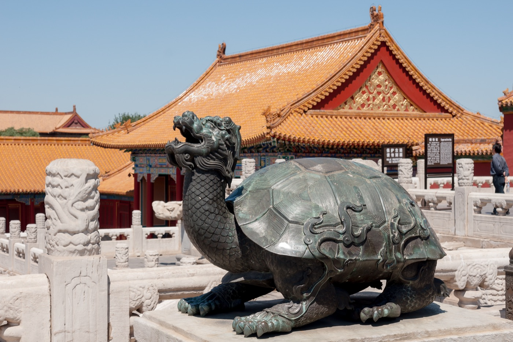
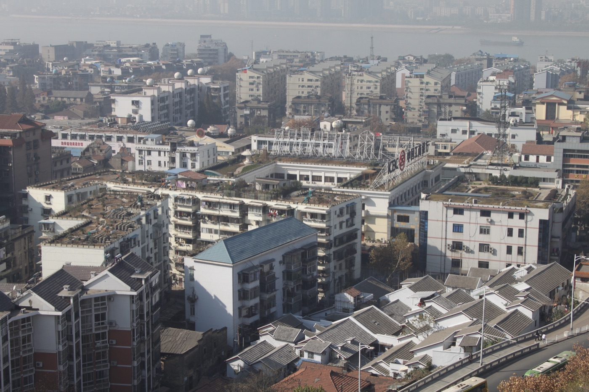
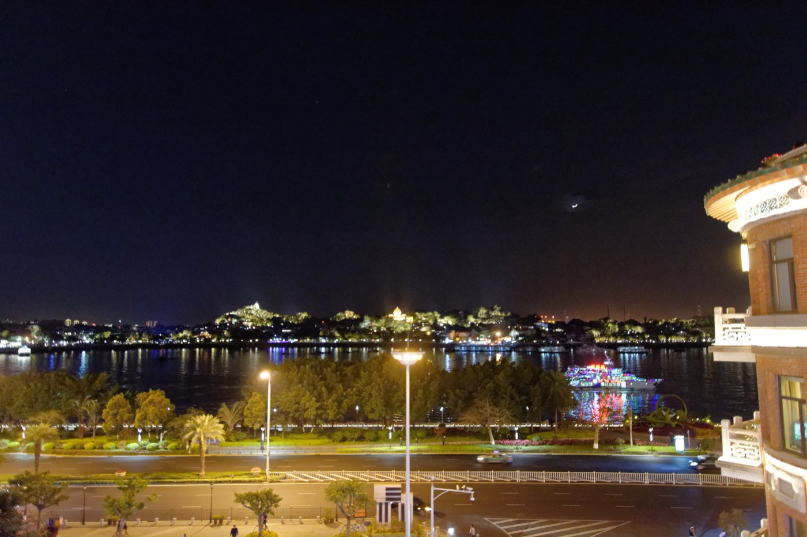
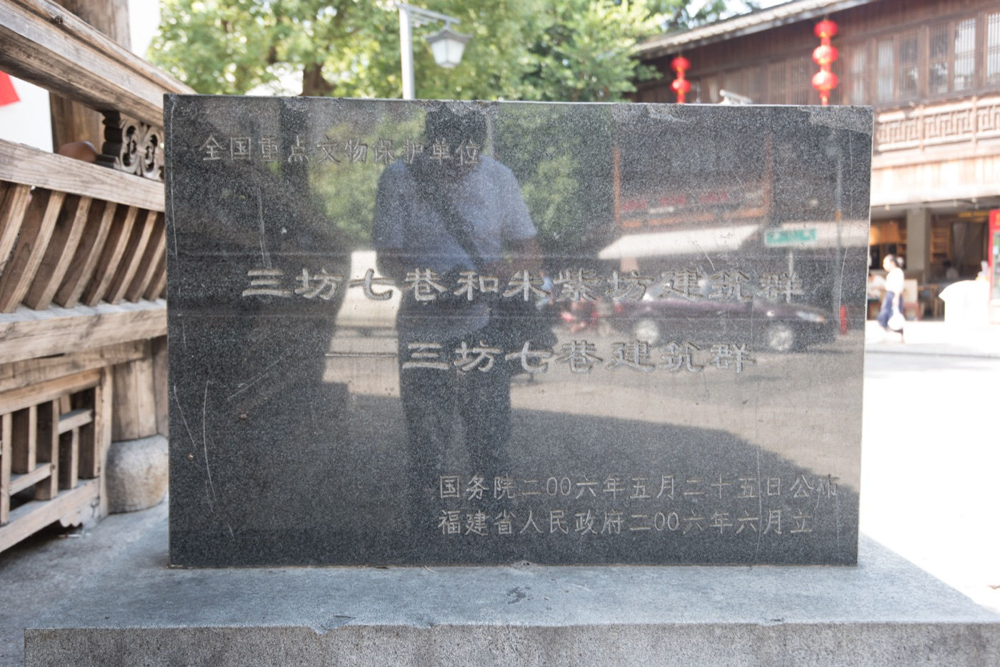
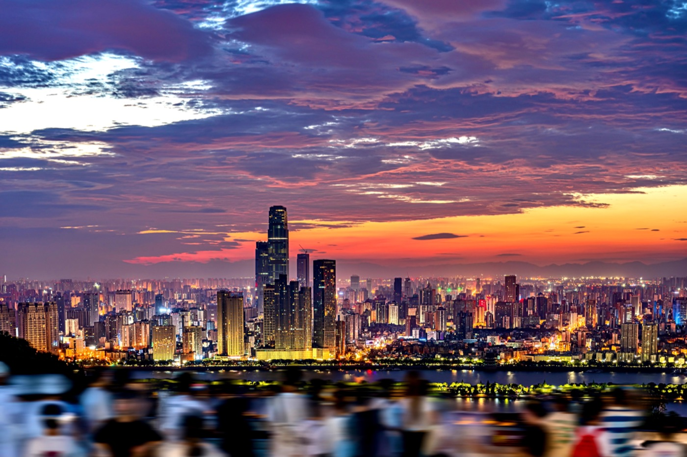

# 三 中途圈（3-5 小时）

中途圈是从杭州东站出发时空体验极为完整的一档距离。车程进入三至五小时区间后，不再适宜单日往返，通常需安排两晚及以上居停，最为理想的节奏是铺排为三至四日的从容行卷。这一档行程极为契合小长假、连休周末或年假拆分后的深度探索。

在这一距离区间，高铁座席的舒适度差异开始显著显现。一小时以内的短途行程中，各席别体感差异有限；而车程一旦超过三小时，宽敞的腿部空间与符合人体工程学的腰部支撑便成为维持旅行精力的关键。通常建议优先选乘一等座，椅距开阔、旅途从容；京沪干线等主力通道上的商务座更支持全平躺调节，并配备完备的静音与餐饮服务，极适宜商务差旅或希望抵离即刻投入行程的旅客。

行李配置亦宜随行程深度同步调优。三日以上的旅程，除随身轻便装束外，宜备一套得体的半正式服饰，以应对高规格文博参访、特色剧院、品质餐厅或酒店行政酒廊等场合。万豪旅享家体系在中途圈核心枢纽城市布局极为完善，高阶会员可在此充分体验空间升档与行政礼遇的综合价值。

本圈层涵盖华北帝都、华中枢纽、东南海港及中原齐鲁等多元地域风貌。北京汇聚了极高密度的国家级文博与皇家庭院；武汉彰显出江汉交汇处的雄浑江湖意气与辛亥近代风云；厦门与福州依山傍海，展现闽南与闽江口独特的近代侨乡建筑与慢调生活；长沙兼具楚汉名胜与市井烟火；合肥、郑州、济南、青岛、天津、徐州、景德镇、曲阜与开封等地，则各自在工业巨变、运河咽喉、陶瓷工艺及儒家道统的地理脉络中占据核心篇章。以下逐一展开。

## 北京

{ width="640" .center }

自杭州东站至北京南站最快仅需 4 小时 28 分，依托京沪高铁极高密度的标杆车次，使得北方首都的高铁直达体验兼具高效与舒适。北京适宜安排三至四天的深度游历：故宫博物院(5A)、慕田峪长城与颐和园(5A)构成了皇家礼制与山水营建的核心骨架；国家博物馆与中国美术馆承载着国家典藏与近代艺术史的重器；胡同肌理与当代艺术园区则提供了城市空间的丰富切片。游历北京的核心在于精细规划时段、主动错峰，方能领略古都大气的建筑格局与深沉的人文气象。

### 高铁

杭州东至北京南的标杆大站直达列车（如 G2、G20、G40 等车次）行驶极为平稳。四小时余的车程，一等座提供了充裕的腿部伸展与静谧环境；商务座配备可 180 度平躺的独立座舱，出站即可从容投入公务或游览。

### 酒店推荐

#### 北京宝格丽酒店
**Bulgari Hotel Beijing** · 朝阳使馆区亮马河 · 携程 4.8 · ¥5500

坐落于亮马河畔使馆区，紧邻三里屯与工体商圈，闹中取静。客房起步面积达 60 平方米，石材与意式木作细节考究，Il Ristorante 意式中餐厅出品卓越。为北京当代奢华酒店的品质代表。

#### 北京华贸JW万豪酒店
**JW Marriott Hotel Beijing** · 朝阳国贸华贸中心 · 携程 4.7 · ¥2200

坐落于华贸中心核心区，地下无缝连通地铁 1 号线与 10 号线。Flame 扒房出品稳定，室内采光泳池开阔，地理区位优越，为商务差旅与家庭出行的稳健之选。

#### 北京华贸丽思卡尔顿酒店
**The Ritz-Carlton Beijing** · 朝阳国贸华贸中心 · 携程 4.7 · ¥3200

典雅英伦庄园风格设计，与 JW 万豪同处华贸核心园区。行政酒廊服务细致周到，大堂吧下午茶极具口碑，适宜偏好经典奢华氛围的旅客。

#### 北京金融街威斯汀大酒店
**The Westin Beijing Financial Street** · 西二环金融街 · 携程 4.7 · ¥1800

坐落于金融街核心腹地，距故宫、什刹海等西城核心区车程约 15 分钟。天梦之床与水疗设施完备，环境清幽宁静。注意事项：金融街区域晚间商业餐饮较为商务化，建议提前规划晚餐去处。

#### 北京瑰丽酒店
**Rosewood Beijing** · 朝阳CBD国贸三期旁 · 携程 4.6 · ¥3800

坐落于朝阳门外大街，客房营造兼具当代宅邸温度与东方意境，乡民中餐厅（Country Kitchen）京味菜肴口碑卓著，高空视野纵览央视总部大楼天际线。

#### 北京金融街丽思卡尔顿酒店
**The Ritz-Carlton Beijing, Financial Street** · 西二环金融街 · 携程 4.6 · ¥2800

地处西二环金融街，设计融合现代简约与中式内敛风雅，商务会议与政务接待规格成熟，毗邻西单商圈。

#### 北京瑞吉酒店
**The St. Regis Beijing** · 朝阳建国门外使馆区 · 携程 4.6 · ¥2500

坐落于建国门外使馆区，为北京老牌奢华饭店代表。经典瑞吉管家服务细致入微，拥有天然温泉水疗与花园景致，出行紧邻长安街。

#### 北京朝阳威斯汀大酒店
**The Westin Beijing Chaoyang** · 朝阳三里屯亮马河 · 携程 4.6 · ¥1500

临近地铁 10 号线亮马桥站，步行可通达三里屯与亮马河国际风情水岸，硬件设施齐备，交通出行顺畅。

#### 北京JW万豪宣武酒店
**JW Marriott Hotel Beijing Central** · 西城宣武门外大街 · 携程 4.6 · ¥1400

坐落于宣武门外大街，临近地铁 2 号线宣武门站，乘车十分钟内即可通达天安门、故宫与天坛，为深入探访南城与老城核心区的优选居所。

### 行程

体系严整，纵贯古今。

**两日（皇城文博精粹）**：首日上午参访故宫博物院（需提前预约，自午门入、神武门出），午后登临景山万春亭俯瞰紫禁城中轴全景，黄昏漫步什刹海；次日上午探访颐和园万寿山与昆明湖，午后参访中国国家博物馆古代中国通史陈列。

**三日（长城与古都全景）**：首日故宫与景山；次日前往怀柔慕田峪长城（索道登临、漫步敌楼），傍晚返回市区享用传统铜锅涮肉；第三日上午漫步天坛祈年殿与圜丘，午后参访 798 艺术区当代艺术机构。

**四日（深度文脉巡礼）**：在三日基础上，增设雍和宫、国子监与中国美术馆的系统探访，或于东四、西四完整保存的四合院胡同街巷中徐徐漫步。

### 景点详介

**故宫博物院**。始建于明永乐四年（1406 年），为世界上规模最大、保存最完好的古代木结构宫殿建筑群。游览时建议除中轴线三大殿与后三宫外，重点探寻东西六宫、珍宝馆（宁寿宫区）与雕塑馆。午后四点以后，斜阳映照金色琉璃瓦顶与太和殿汉白玉丹陛，光影极为深邃雄浑。注意事项：全网提前实名预约门票，周一例行闭馆；角楼拍摄最佳点位于神武门外筒子河畔。

**颐和园**。晚清皇家园林营造的集大成者，集万寿山、昆明湖山水于一体。清晨开园时自东宫门步入，沿 728 米彩绘长廊徐行，清风徐来、湖平如镜；随后登临佛香阁俯瞰昆明湖全景，经后山苏州街水岸漫步而出。傍晚时分十七孔桥落日余晖金光穿洞，气象万千。

**中国国家博物馆与中国美术馆**。国家博物馆坐落于天安门广场东侧，"古代中国"基本陈列汇集了后母戊鼎、四羊方尊等国宝级青铜重器；中国美术馆位于五四大街，系统收藏了近现代书画大家经典之作。两馆相距不远，适合作为全天系统文博体验的主线。需提前实名预约，周一闭馆。

**798 艺术区**。由原 718 联合厂大跨度锯齿形包豪斯式工业厂房更新改造而来，汇聚了 UCCA 尤伦斯当代艺术中心、佩斯画廊、常青画廊等国际一流当代艺术机构，为体验中国当代艺术与工业遗产活化空间的必访之地。

**雍和宫与法源寺**。雍和宫原为清世宗雍正帝即位前潜邸，后辟为藏传佛教皇家寺院，万福阁内整根白檀木雕成的巨型弥勒大佛庄严巍峨；法源寺隐于宣武门外老城街巷，唐代始建，庭院古树参天、碑刻林立，幽深沉静。

**天坛公园**。明清两代帝王祭天祈谷的圣地，祈年殿圆形三重檐蓝瓦金顶暗合古代天圆地方的宇宙构想，皇穹宇回音壁与圜丘规制严整、气势肃穆。傍晚斜阳穿过古柏林照耀祈年殿，极具庄严之美。

**慕田峪长城**。坐落于怀柔山峦之间，植被覆盖率高，敌楼密集、城墙依山势蜿蜒起伏。配有索道与滑道设施，相较于八达岭人流更为舒缓，能完整领略万里长城依山筑障的雄浑气魄。

### 吃

- **全聚德（前门总店）/ 四季民福烤鸭店**：传统挂炉果木烤鸭，鸭皮酥脆化渣、鸭肉鲜嫩多汁，配手工荷叶饼与甜面酱风味地道。
- **南门涮肉**：传统京味铜锅涮炭火清汤，鲜切羊上脑与羊磨裆肉质细嫩，蘸传统芝麻酱与韭菜花调料，醇香温润。
- **护国寺小吃**：老字号清真小吃集萃，豌豆黄细腻甜润、面茶麻酱咸香、艾窝窝软糯。
- **新川面馆**：经典麻酱凉面与担担面，酱香浓郁、面条劲道。

### 最佳季节

9 月下旬至 10 月下旬为北京一年中最为宜人的金秋时节，秋高气爽、天朗气清，银杏金黄、香山红叶层林尽染；4 月下旬至 5 月中旬春和景明，花开满城。盛夏 7 至 8 月天气炎热且游人密集；隆冬若逢瑞雪，紫禁城与皇家园林银装素裹，展现古都别样风骨。

## 武汉

{ width="640" .center }

## 武汉

{ width="640" .center }

自杭州东站至武汉站高铁车程约 4 小时 10 分，地处中途圈的核心交汇点。武汉展现出与海滨及北方古都截然不同的雄浑江城气质：九省通衢的枢纽地理、近代工业与汉口开埠的历史层叠、辛亥首义的革命烽烟，以及长江与汉水交汇切割出的三镇鼎立格局，赋予了这座大都会极其饱满的市井活力。三日行程最为适度：湖北省博物馆的曾侯乙编钟与越王勾践剑为国家殿堂级重器；黄鹤楼(5A)与长江大桥勾勒出极具辨识度的江天胜概；东湖(5A)烟波浩渺，绿道骑行极尽开阔；汉口江汉路与黎黄陂路一带则完整保留了近现代租界街区的折衷主义建筑风貌。

### 高铁

杭州东至武汉站每天开行多趟高速列车（如 G578、G584、G1772 等车次）。4 小时余的车程，建议选乘一等座以获得舒适的腿部空间与静谧环境；部分标杆车次配置有商务座。武汉站位于主城东北部，出站后换乘地铁或网约车前往武昌或汉口核心区约需 40 分钟车程。

### 酒店推荐

#### 武汉富力威斯汀酒店
**The Westin Wuhan Wuchang** · 武昌临江大道长江边 · 携程 4.7 · ¥1300

坐落于武昌临江大道，一线临江。江景客房直面长江主航道与对岸汉口天际线，天梦之床与水疗设施完备，乘车前往黄鹤楼约 8 分钟，前往湖北省博约 15 分钟，为兼顾江景体验与武昌核心动线的优选居所。

#### 武汉武昌万豪酒店
**Wuhan Marriott Hotel Wuchang** · 武昌中北路CCFC楼 · 携程 4.8 · ¥1100

位于武昌中北路核心地段，高空视野开阔，前往东湖绿道与湖北省博物馆交通顺畅。餐饮出品注重融入本地特色，客房维护稳健。

#### 武汉光谷万豪酒店
**Wuhan Marriott Hotel Optics Valley** · 东湖高新区光谷 · 携程 4.8 · ¥1000

地处光谷核心商圈，商贸餐饮配套齐备，适宜行程重心偏向东湖高新区与光谷片区的旅客。

#### 武汉汉阳威斯汀酒店
**The Westin Wuhan Hanyang** · 汉阳龙阳湖东路 · 携程 4.7 · ¥1100

坐落于汉阳区，临近地铁 3 号线与 4 号线枢纽王家湾站。前往归元禅寺仅十分钟车程，过江前往黄鹤楼约 15 分钟，为串联汉阳与武昌动线的高性价比之选。

#### 武汉光谷凯悦酒店
**Hyatt Regency Wuhan Optics Valley** · 东湖高新区光谷 · 携程 4.7 · ¥1200

公共区域设计沉稳雅致，融合东方极简风尚，适宜以光谷与东湖为主要活动半径的商务与休闲行程。

### 行程

江汉奔涌，文博厚重。

**两日（江城精粹）**：首日上午登临黄鹤楼并漫步长江大桥引桥，午后参访湖北省博物馆（重点观赏曾侯乙编钟与古乐演奏）；次日漫步东湖听涛或磨山景区，午后前往汉口黎黄陂路近代建筑群探幽，黄昏漫步江滩公园。

**三日（三镇全景）**：首日探访黄鹤楼、长江大桥与武昌老街；次日专程深入湖北省博物馆与东湖磨山楚风园林；第三日漫步汉口江汉路、黎黄陂路与江汉关博物馆，品尝地道汉味早点与江湖风味。

### 景点详介

**黄鹤楼**。始建于三国东吴黄武二年（223 年），历代屡毁屡建。现存主楼于 1985 年依清代同治楼形制重修落成，巍峨耸立于武昌蛇山之上。登临主楼五层极目远眺，滚滚长江、武汉长江大桥与两岸三镇全景尽收眼底，气势雄浑。黄昏时分夕阳映照飞檐与江面，尽显盛唐气象与千古文韵。

**湖北省博物馆**。坐落于东湖之滨，为国家级重点博物馆。镇馆国宝涵盖曾侯乙编钟（战国早期 65 件青铜编钟，工艺精绝、音律完备）、越王勾践剑（寒光凌厉、纹饰精细）以及元青花四爱图梅瓶。馆内编钟演奏厅每日定时举行实景古乐演奏，气韵庄严古朴，建议提前线上实名预约。

**东湖生态旅游风景区**。水域辽阔，面积达 33 平方公里，为全国著名的城市湖泊。全长百公里的东湖绿道串联起听涛、磨山、落雁等核心景区。适宜租借自行车沿湖滨绿道徐徐骑行，磨山楚天台依山临湖，为俯瞰浩瀚东湖全景的极佳视角。

**江汉路与黎黄陂路近代建筑群**。江汉路与黎黄陂路一带为汉口近代开埠历史的重要见证地。街道两侧整齐分布着近代海关大楼、外国洋行、银行与领事馆旧址，折衷主义、新古典主义与巴洛克风格建筑林立。黄昏时分沿街漫步，梧桐掩映、街灯柔和，极富历史层次感。

### 吃

- **蔡林记**：百年老字号热干面，选用优质碱水面，淋浓郁黑芝麻酱与香脆酸豆角、辣萝卜丁拌匀，香气扑鼻。
- **老通城传统豆皮**：以优质糯米配香菇、鲜笋与鲜肉丁为馅，外裹金黄蛋皮文火慢煎，外脆内糯、油润咸香。
- **排骨煨藕汤**：湖北传统瓦罐煨汤代表，选用当地粉藕配排骨文火慢炖数小时，汤色奶白醇厚、莲藕拉丝粉糯。
- **清蒸武昌鱼**：毛泽东诗词"才饮长沙水，又食武昌鱼"盛赞之佳品，肉质细嫩清甜。

### 最佳季节

3 月下旬至 4 月中旬为江城春意最浓之时，樱花盛开、湖光秀丽；10 月至 11 月秋高气爽、气候干爽宜人。盛夏 7 至 8 月天气较为闷热，需合理安排户外行程。

## 厦门

{ width="640" .center }

自杭州东站至厦门北站高铁车程约 4 小时 30 分。厦门展现出东南沿海温馨沉静的海岛气质与近代中西文化融合的人文图景。鼓浪屿(5A)的近代万国建筑、厦门大学红砖坡顶的嘉庚风格楼群、南普陀寺的香火梵音，与沙坡尾避风坞、八市海鲜街巷的市井烟火交织相映。更可顺路接驳高铁半小时通达千年古城泉州，将闽南历史文脉与滨海休闲完美融为一体。

### 高铁

杭州东至厦门北班次较为丰富。4.5 小时车程，推荐选乘一等座以保持旅途精力。抵达厦门北站后，可乘地铁 1 号线直通岛内主城区。前往鼓浪屿需自指定轮渡码头搭乘渡轮上岛。

### 酒店推荐

#### 厦门艾美酒店
**Le Méridien Xiamen** · 湖里观音山海边 · 携程 4.7 · ¥1500

坐落于湖里区观音山海岸，设计风格融入现代艺术，部分客房享有开阔海景。适宜注重海景视野与宁静度假氛围的旅客。

#### 厦门喜来登酒店
**Sheraton Xiamen Hotel** · 思明区嘉禾路筼筜湖边 · 携程 4.6 · ¥1200

临近筼筜湖水岸，距厦门大学与中山路历史街区车程约 15 分钟。客房宽敞明亮，交通顺畅，为兼顾家庭度假与城市游览的稳健居所。

#### 厦门威斯汀酒店
**The Westin Xiamen** · 思明区岛内 · 携程 4.6 · ¥1300

地处思明区岛内交通枢纽，天梦之床与健身配套成熟，前往岛内主要文博景区车程均在 20 分钟以内。

### 行程

琴岛听涛，海丝寻幽。

**两日（海岛与文教）**：首日上午参访南普陀寺并漫步厦门大学校园；午后探访沙坡尾避风坞与艺术街区；次日全天游览鼓浪屿近代建筑群与菽庄花园，黄昏乘轮渡返岛品味地道闽南风味。

**三日（厦泉联游）**：首日与次日游赏厦门主城与鼓浪屿；第三日搭乘高铁半小时前往世遗古城泉州，参访开元寺东西塔、西街古巷与清净寺，晚间返程。

### 景点详介

**鼓浪屿**。面积仅 1.88 平方公里的小岛，2017 年列入世界文化遗产名录。岛上禁止机动车通行，完好保存着数十座 19 世纪末至 20 世纪初建造的领事馆旧址、华侨洋楼、教堂与私家园林。菽庄花园巧借海涛之险垒叠太湖石假山，园在海中、海在园中；风琴博物馆珍藏有浩瀚的历史管风琴艺术瑰宝。若时间充裕，在岛上留宿一晚，于清晨或黄昏避开人潮漫步幽深琴巷，更能领略其沉静意境。

**厦门大学与南普陀寺**。厦门大学由爱国华侨领袖陈嘉庚先生于 1921 年创办，其标志性的"穿西装、戴斗笠"的嘉庚风格建筑群中西合璧；初夏时节凤凰花开如火，映衬着红砖白墙。相邻的南普陀寺始建于唐代，依五老峰而筑，重檐飞翘、燕尾出脊，为闽南著名古刹。

**沙坡尾与老厦港**。沙坡尾曾为厦门港最为核心的避风坞，保留着老式渔船修造厂与红砖民居的肌理。经有机更新后引入了众多咖啡馆与艺术工坊，渔港水波与文创空间共生，展现出老厦港悠然的生活节奏。

**泉州古城（拓展游）**。宋元中国的世界海洋商贸中心，距厦门仅需半小时高铁。开元寺建于唐代，大雄宝殿百柱撑梁，东塔镇国塔与西塔仁寿塔为我国现存最高的宋代仿木构石塔；西街两侧保留着完整的宋代街巷尺度与红砖古厝，文化底蕴极为深厚。

### 吃

- **传统沙茶面**：以沙茶酱、花生酱与高汤文火熬制浓郁汤底，配鲜虾、鱿鱼、猪肝与水面，鲜甜浓郁、微辣醇香。
- **闽南海蛎煎**：选用新鲜海蛎拌红薯粉与青蒜，平底锅煎至金黄酥脆，蘸厦门甜辣酱食用。
- **闽南烧肉粽**：糯米拌卤汁与香菇、五花肉、咸蛋黄、板栗同蒸，软糯鲜香。
- **泉州面线糊**：细如发丝的面线于清汤中滚熟勾薄芡，配油条与各色卤料，清鲜暖胃。

### 最佳季节

10 月至 11 月秋高气爽、温度宜人，为全年中游赏厦门的黄金窗口；3 月至 5 月春风拂面、万木吐翠。盛夏需关注台风预警信息。

## 福州

{ width="640" .center }

自杭州东站至福州站或福州南站高铁车程约 3 小时 50 分。福州作为福建省会，展现出深沉内敛的历史人文积淀：三坊七巷完整保存了自唐宋以来的坊巷格局与明清民居规制；烟台山近代使馆与洋楼建筑群掩映于闽江南岸绿荫之间；闽江浩荡东流，平潭岛的海蚀地貌与海洋风光辽阔壮美。整座城市节奏舒缓闲雅，福州菜以其独特的红糟烹调与鲜美汤品独树一帜。

### 高铁

杭州东至福州每天开行多趟高速列车（如 G1635、G1651 等）。3 小时 50 分车程，选乘一等座即可获得从容舒适的乘车体验。福州南站出站后乘坐地铁 1 号线半小时内即可通达鼓楼区核心。

### 酒店推荐

#### 福州威斯汀酒店
**The Westin Fuzhou Minjiang** · 台江江滨中大道闽江北岸 · 携程 4.8 · ¥1200

坐落于闽江北岸江滨大道，客房享有开阔江景与南岸烟台山远眺视野。距三坊七巷车程约 10 分钟，前往烟台山过桥即达，为兼顾老城人文与江岸景观的高品质居停。

#### 福州喜来登酒店
**Sheraton Fuzhou Hotel** · 仓山区浦晓洲路闽江边 · 携程 4.7 · ¥1000

毗邻海峡国际会展中心，客房宽敞、商务配套完善，前往烟台山历史风貌区交通便利。

#### 福州西湖大酒店
**Fuzhou Lakeside Hotel** · 鼓楼区湖滨路西湖边 · 携程 4.8 · ¥900

紧邻福州西湖公园，拥有优雅的园林庭院环境，部分客房直面西湖碧波，步行可达福建博物院，深具老派国宾级饭店的从容风雅。

### 行程

闽都斯文，烟台枕江。

**两日（古城与江岸）**：首日上午深入探访三坊七巷名人故居建筑群，午后参访福建博物院；傍晚前往仓山烟台山漫步观赏近代洋楼与落日江景；次日可乘高铁专程前往平潭岛体验海蚀奇观与海风吹拂。

**三日（人文山水全景）**：在两日基础上，增设鼓山涌泉寺摩崖石刻与西湖公园的晨间慢行，细细品味福州慢调生活。

### 景点详介

**三坊七巷**。由衣锦坊、文儒坊、光禄坊三坊与杨桥巷、郎官巷、塔巷、黄巷、安民巷、宫巷、吉庇巷七巷组成，为中国古代城市里坊制度的珍贵遗存。严复故居、林则徐祠堂、水榭戏台、林觉民与冰心故居错落其间。白墙灰瓦、马鞍形风火墙线条优美，建议自北侧巷陌步入，静心品读明清文人官宦宅院的营造精髓。

**烟台山历史风貌区**。位于仓山区闽江南岸，近代先后有十余国在此设立领事馆与洋行。乐群路、爱国路与公园路一带绿树掩映，石厝教堂、原英国领事馆旧址等西式近代建筑依山筑就。黄昏时分夕阳透过古榕照亮红砖石墙，漫步其间别具幽思。

**鼓山与涌泉寺**。鼓山耸立于福州东郊，海拔 925 米，为闽东名胜。涌泉寺建于半山之间，群山环抱、古刹幽深，寺内千佛陶塔为元代艺术珍品；登山古道两侧保存着历代名家题写的六百余处摩崖石刻，为东南书法艺术渊薮。

**平潭岛**。我国第五大岛，自福州乘坐城际列车半小时即可通达。岛上海蚀地貌奇特发育，长江澳风车田、北港石头厝与海坛天神展现出海岛粗犷纯粹的自然伟力。

**福建博物院**。坐落于西湖公园北岸，系统陈列闽越文化青铜器、宋元海上丝绸之路外销瓷与近代船政文化珍罕文物，展陈严谨详实。需提前预约，周一闭馆。

### 吃

- **聚春园 / 安泰楼**：百年老字号，经典佛跳墙汇聚鲍鱼、海参、花胶等数十种珍贵食材文火慢煨，汤浓味厚、荤香四溢；传统荔枝肉甜酸爽脆、醉糟鸡酒香清冽。
- **同利肉燕**：百年非遗小吃，以精选猪后腿肉反复捶打制成轻薄燕皮，包入肉馅煮汤，口感滑润爽脆。
- **永和鱼丸**：选用优质海鱼肉打茸为皮，内包鲜猪肉馅，汤清味美、弹性十足。
- **太极芋泥**：传统闽菜甜品，选用槟榔芋蒸熟压泥，调以熟猪油与白糖文火炒制，细腻温润。

### 最佳季节

3 月至 5 月春意和煦；10 月至 11 月秋高气爽、舒适宜人；4 月至 6 月前往平潭岛可关注夜间海洋浮游生物发光景观。盛夏需防范台风降雨。

## 长沙

{ width="640" .center }

自杭州东站至长沙南站高铁车程约 4 小时 20 分。长沙展现出湖湘文化奔放热烈与市井烟火交融的鲜明个性。橘子洲头的湘江北去与岳麓山的儒家书院道统构成其自然人文脊梁；湖南博物院所藏马王堆汉墓瑰宝名扬海内外；太平老街与都正街的青石板路上，夜市灯火通明、湘菜热辣浓烈。

### 高铁

杭州东至长沙南高铁直达车次频密（如 G1373 等车次）。4 小时余车程，一等座空间宽敞；长沙南站乘地铁 2 号线或 4 号线 20 分钟内即可直通市中心五一广场商圈。

### 酒店推荐

#### 长沙建鸿达JW万豪酒店
**JW Marriott Hotel Changsha** · 雨花区芙蓉中路二环内 · 携程 4.8 · ¥1600

2022 年开业，客房起步面积 50 平方米，设计融合现代奢华与湖湘文化意象。中餐厅精烹传统高端湘菜，乘车前往橘子洲头约 15 分钟，设施现代完善。

#### 长沙运达喜来登酒店
**Sheraton Changsha Hotel** · 开福区芙蓉中路 · 携程 4.8 · ¥1200

坐落于市中心芙蓉中路金融商务区，距湖南博物院车程仅 10 分钟，服务规范成熟，出行通达顺畅。

#### 长沙君悦酒店
**Grand Hyatt Changsha** · 天心区湘江中路湘江风光带 · 携程 4.8 · ¥1800

高踞湘江风光带超高层，直面橘子洲与湘江全景，步行可达太平街历史街区，客房景观出众。

#### 长沙步步高福朋喜来登酒店
**Four Points by Sheraton Changsha, Meixi Lake** · 岳麓区梅溪湖 · 携程 4.7 · ¥700

地处岳麓区梅溪湖新天地商圈，地铁无缝接驳高铁长沙南站，适宜偏好河西静谧环境与岳麓山动线的旅客。

### 行程

楚汉名胜，心忧天下。

**两日（文博与山水）**：首日上午专程参访湖南博物院马王堆汉墓陈列；下午登临岳麓山、参访岳麓书院与爱晚亭；傍晚漫步橘子洲头观赏湘江落日；次日漫步都正街历史街区，品尝地道湘菜与市井茶饮。

**三日（湖湘深度之旅）**：在两日基础上，可乘高铁 1 小时前往韶山参访毛泽东同志故居与纪念馆，追寻近代历史足迹。

### 景点详介

**岳麓书院与岳麓山**。岳麓书院始建于北宋开宝九年（976 年），为中国古代四大书院之一。"惟楚有材，于斯为盛"的大门楹联彰显着湖湘文脉的底蕴；讲堂内高悬的"实事求是"匾额见证了宋代理学至近代思潮的薪火相传。沿山道漫步，清代爱晚亭依山傍溪，掩映于古枫修竹之间。

**橘子洲头**。横卧于湘江之中的狭长沙洲，毛泽东《沁园春·长沙》"独立寒秋，湘江北去，橘子洲头"的千古名篇诞生于此。洲头伫立着青年毛泽东大型花岗岩雕塑，傍晚沿江堤步道徐行，江风拂面、晚霞映水，视野极为开阔。

**湖南博物院**。马王堆汉墓出土文物为该院核心瑰宝：保存完好的辛哀夫人西汉遗体、轻若烟雾的素纱襌衣、色彩绚烂的 T 形帛画，以及成套成组的汉代漆器与织绣，全方位再现了汉初高级贵族的物质文明。此外，商周青铜器与唐代长沙窑瓷器亦极富看点。需提前线上预约，周一闭馆。

**都正街与天心阁**。都正街位于天心阁古城墙脚下，相较于过度商业化的太平老街，保留了更多传统长沙老街坊的青砖瓦房与生活肌理；紧邻的天心阁为长沙古城仅存的古城墙与城楼遗存，登楼远眺，古今风貌交相辉映。

### 吃

- **火宫殿 / 冰火楼**：传统湘菜老字号，经典剁椒鱼头鱼肉鲜嫩、双色剁椒鲜辣开胃；传统辣椒炒肉与红烧肉镬气十足。
- **长沙传统臭豆腐**：选用黄豆胚以特制卤水浸泡发酵，炸至外皮焦脆鼓起、内里细嫩如凝脂，灌入香辣蒜汁与辣椒油，焦香四溢。
- **糖油粑粑**：糯米粉团油炸后裹以红糖浆文火慢熬，金黄软糯、甜而不腻。
- **徐记海鲜**：将湖湘爆炒与剁椒技法融入海鲜烹制，辣炒花蟹与剁椒蒸石斑鱼别具风味。

### 最佳季节

9 月至 11 月秋高气爽，岳麓山枫叶初染红霜，为漫步湘江两岸的最佳时令；3 月至 5 月春意萌发、气候适宜。盛夏 7 至 8 月天气炎热；深冬湿冷，出行需备足保暖衣物。

---

## 合肥

{ width="640" .center }

自杭州东站至合肥南站高铁车程约 2 小时 40 分至 3 小时 20 分。合肥坐落于巢湖之滨，既是皖中交通枢纽，亦汇聚了深厚的近代人文脉络。李鸿章故居与淮系名臣遗存记录了晚清洋务自强的探索；安徽博物院的楚大鼎、新安画派真迹与明清徽州契约文书构成了江淮文明的重器华章；三河古镇(5A)的小桥流水与巢湖烟波则展现了皖中水乡的秀丽明澈。

### 高铁

杭州东至合肥南车次十分密集（如 G7616、G324 等车次）。车程约三小时，一等座舒适宽敞。合肥南站出站后乘坐地铁 1 号线约 25 分钟即可直达市中心与老城区。

### 酒店推荐

#### 合肥香格里拉大酒店
**Shangri-La Hotel, Hefei** · 政务区潜山路 · 携程 4.8 · ¥1100

坐落于政务区核心地段，毗邻天鹅湖，客房视野开阔，餐饮与商务接待规格稳定，出行通达。

#### 合肥威斯汀酒店
**The Westin Hefei Baohe** · 包河区马鞍山路包公园旁 · 携程 4.7 · ¥1000

紧邻包公园绿意水系，客房环境清幽，距李鸿章故居车程约 10 分钟，为深入老城人文动线的优选居停。

### 行程

淮系风云，江淮胜概。

**两日（人文与文博）**：首日上午探访李鸿章故居与包公园，午后专程参访安徽博物院新馆（重点观赏楚大鼎与新安画派书画）；次日漫步逍遥津公园三国遗迹，午后品尝传统徽菜。

**三日（水乡与湖光）**：在两日基础上，增设三河古镇或巢湖姥山岛一日游，探寻水乡古街与湖山风光。

### 景点详介

**李鸿章故居**。坐落于淮河路，建于 1860 年代，为晚清重臣李鸿章家族故居。建筑保留了典型的江淮合院形制，展厅系统陈列了淮军文献、出使档案与奏折手稿，是深入了解晚清洋务运动与近代外交史的重要实物空间。

**安徽博物院**。位于蜀山区，为国家级重点博物馆。镇馆重器包括寿县楚幽王墓出土的楚大鼎（铸造宏丽，为战国青铜重器）、明清清雅脱俗的新安画派名家真迹，以及浩瀚翔实的明清徽州文书契约，系统展现了皖江与徽州文化的精神深度。

**三河古镇**。位于肥西县南端，小南河、丰乐河与杭埠河三水交汇。镇内保留着青石板古街与众多晚清民居，晚清名将刘铭传故居与鹤庐错落其间，水网纵横、风貌淳朴。

**包公园**。为纪念北宋名臣包拯而建，由包公祠、包公墓与清风阁组成。古树参天、荷塘微波，宋代廉吏风骨于此世代相传。

### 吃

- **老乡村 / 徽州人家**：传统徽菜名馆，红烧臭鳜鱼肉质紧致呈蒜瓣状、闻之特殊而入口醇香；传统刀板香咸肉蒸笋鲜美油润。
- **庐州烤鸭店**：老字号传统烤鸭，外皮金黄酥脆、肉质细嫩，配特制甜面酱与薄饼食用。
- **三河传统米饺**：以早籼米粉为皮，包入鲜豆腐、五花肉与香葱，入锅油炸至外皮金黄松脆、内馅鲜嫩。

### 最佳季节

3 月至 5 月春光融融；9 月至 11 月秋高气爽，巢湖湖平如镜，为游历合肥的最佳时节。

---

## 郑州

{ width="640" .center }

自杭州东站至郑州东站高铁车程约 4 小时 10 分至 4 小时 30 分。郑州地处中原腹地，为中国八大古都之一与铁路黄金大十字枢纽。河南博物院汇聚了黄河流域数千年的灿烂文明遗存；商都早期城墙夯土见证了早商三千六百年的帝都规制；以此为枢纽更可向西接驳洛阳龙门石窟、向西南联通登封嵩山少林寺(5A)，纵览中原文明的浩荡长卷。

### 高铁

杭州东至郑州东车次频密（如 G1820、G1818 等车次）。4 小时余车程，选乘一等座更为从容；郑州东站出站后搭乘地铁 5 号线可直达郑东新区与市中心。

### 酒店推荐

#### 郑州丹尼斯洲际酒店
**InterContinental Zhengzhou** · 郑东新区CBD · 携程 4.8 · ¥1300

坐落于郑东新区 CBD 核心，距郑州东站车程仅 10 分钟，客房硬件现代考究，服务成熟周到。

#### 郑州JW万豪酒店
**JW Marriott Hotel Zhengzhou** · 郑东新区商务内环路千玺广场 · 携程 4.7 · ¥1400

坐落于郑东新区地标"大玉米"千玺广场，俯瞰如意湖开阔景观，餐饮出品严谨，商务与休闲出行皆宜。

### 行程

中原大观，寻根溯源。

**两日（文博与商都）**：首日全天深入参访河南博物院九大镇院之宝；次日探寻早商城墙遗址与二七纪念塔，品尝地道河南羊肉烩面。

**三日（嵩山少林与洛阳接驳）**：首日河南博物院；次日前往登封少林寺参访古刹常住院与塔林；第三日可顺路搭乘高铁 35 分钟前往洛阳游览龙门石窟。

### 景点详介

**河南博物院**。国家级重点博物馆，展陈极富中原文物代表性。镇院重器包括距今九千年的贾湖骨笛、商代晚期妇好鸮尊、春秋莲鹤方壶与武则天除罪金简。馆内华夏古乐团定期复原演奏古代礼乐，古音悠扬，建议提前预约。

**嵩山少林寺**。坐落于登封嵩山五乳峰下，始建于北魏太和十九年（495 年），为汉传佛教禅宗祖庭。常住院殿宇庄严，塔林依山错落有致，保存着唐代至清代两百余座高僧灵塔，石雕砖雕精美绝伦。

**商代都城遗址**。位于管城区，为距今 3600 年前商代早期都城夯土城墙遗存。巍峨高耸的古城垣横贯城市之中，遗址博物馆系统阐释了早商青铜文明与城邑格局。

**洛阳龙门石窟（延伸参访）**。自郑州东站乘坐高铁 35 分钟即可抵达洛阳龙门。龙门石窟依伊河两岸东、西山崖壁开凿，始于北魏孝文帝年间，历经唐宋。西山奉先寺卢舍那大佛慈悲庄严、气宇轩昂，为中国石刻艺术的巅峰之作。

### 吃

- **合记烩面 / 萧记三鲜烩面**：传统烩面以鲜羊肉、羊骨浓汤文火熬制，手工扯面筋韧爽滑，配羊肉片、千张丝与香菜，热气腾腾、鲜美暖腹。
- **方中山胡辣汤**：传统中原早点底牌，选用牛羊肉高汤融汇黑胡椒、花椒与各色香料，搭配牛肉粒、面筋与木耳慢熬，配刚出锅的葱花油饼或水煎包，辛香醇厚。
- **老蔡记蒸饺**：百年老字号，皮薄透亮、肉馅鲜美多汁。

### 最佳季节

4 月至 5 月春意和暖；9 月至 10 月秋高气爽，为中原大地游历与石窟参访的黄金季节。

---

## 济南

{ width="640" .center }

自杭州东站至济南西站高铁车程约 4 小时 30 分。济南素享"泉城"美誉，北临黄河、南依泰山，老舍笔下温润的泉水与远山赋予其独特的平实与风雅。趵突泉(5A)三股水喷涌跃动，大明湖(5A)碧波荡漾，千佛山松柏叠翠；山东博物馆藏甲骨与汉画像石重器云集；更可依托京沪高铁向南快速接驳曲阜三孔(5A)与东岳泰山(5A)，构成齐鲁文化与自然崇高的宏大篇章。

### 高铁

杭州东至济南西每天开行多趟高速列车（如 G54、G6 等标杆车次）。4.5 小时车程，一等座出行体验舒适；济南西站乘坐地铁 1 号线转接即可通达大明湖与老城泉群核心区。

### 酒店推荐

#### 济南喜来登酒店
**Sheraton Jinan Hotel** · 历下区龙奥北路奥体中心旁 · 携程 4.7 · ¥1100

坐落于东部奥体商圈，距山东博物馆车程约 10 分钟，客房宽敞明亮，商务接待与家庭出游皆具良好体验。

#### 济南香格里拉大酒店
**Shangri-La Hotel, Jinan** · 历下区泺源大街 · 携程 4.7 · ¥1200

位于市中心核心地段，距趵突泉、大明湖步行可达，香格里拉经典服务与中餐厅鲁菜出品成熟，为深入探访老城泉水的理想之所。

### 行程

泉涌古城，齐鲁道统。

**两日（泉城与文博）**：首日上午漫步趵突泉公园与大明湖畔，午后登临千佛山俯瞰古城全景；次日上午专程参访山东博物馆（重点观赏甲骨文与汉代壁画），午后品尝传统鲁菜名品。

**三日（齐鲁文化巡礼）**：在两日基础上，搭乘高铁 40 分钟前往曲阜，全天系统参访孔庙、孔府与孔林。

### 景点详介

**趵突泉**。被誉为"天下第一泉"，三股清泉常年自地下石灰岩溶洞喷涌而出、雪浪翻滚；李清照故居漱玉堂临水而建，周遭散布金线泉、漱玉泉等数十处泉眼，幽泉古柏交相成趣。

**大明湖**。"四面荷花三面柳，一城山色半城湖"，大明湖由城内众泉汇流而成。漫步湖畔长堤，历下亭古意盎然，夏季湖面菡萏连天，远眺千佛山倒影，尽显济南山水相依之胜。

**山东博物馆**。坐落于经十路，为宏伟的现代化文博殿堂。镇馆典藏包括大批商代殷墟出土甲骨文、东平东汉墓室彩色壁画、以及明代鲁荒王九旒冕等国宝级珍品，展陈气魄宏大。

**千佛山**。古称历山，漫山苍翠。隋唐时期依山崖凿刻千佛崖造像，山腰兴国禅寺香火袅袅；登临山巅极目远眺，济南全城风貌与滔滔黄河尽收眼底。

**曲阜三孔（高铁接驳延伸）**。曲阜为孔子故里。孔庙九进院落规制宏大，大成殿龙柱飞檐，为中国三大古殿之一；孔府保存着传承千年的衍圣公府第建筑与珍贵礼乐遗物；孔林古木参天，为世所罕见的家族墓地圣域。

### 吃

- **燕喜堂 / 聚丰德**：经典鲁菜老字号，传统九转大肠酸甜苦辣咸五味俱全、色泽红润；糖醋黄河鲤鱼外焦里嫩、酸甜适口；爆炒腰花刀工精细、脆嫩爽口。
- **草包包子铺**：传统老字号，把子肉包子与鲜肉汤包面皮松软、肉馅鲜美油润。
- **油旋**：济南特有传统面点，层层油酥裹以葱花，烘烤至外酥内软、香气扑鼻。

### 最佳季节

4 月至 5 月春和景明；9 月至 10 月秋高气爽、泉水水位丰盈喷涌，为游览济南的最佳时令。

---

## 青岛

{ width="640" .center }

自杭州东站至青岛北站或青岛站高铁车程约 5 小时。青岛依山傍海，展现出独特的近代红瓦绿树海洋风情。栈桥如长龙卧波，八大关汇聚了二十余国风格各异的近代别墅建筑；信号山俯瞰老城红顶绿树与胶州湾海波相映；青岛啤酒博物馆见证了百年工业酿造传奇；向东延伸的崂山(5A)更有"海上名山第一"的雄浑道教山海图景。

### 高铁

杭州东至青岛每天开行多趟高速列车（如 G282 等车次）。5 小时车程，建议选乘一等座或商务座。青岛北站出站后乘地铁 3 号线即可直通市南区老城滨海核心区。

### 酒店推荐

#### 青岛瑞吉酒店
**The St. Regis Qingdao** · 市南区浮山湾奥帆中心 · 携程 4.8 · ¥2500

高耸于浮山湾海天中心超高层，全海景客房俯瞰奥帆中心与浮山湾辽阔海岸线，经典管家服务与高空视野极为出众。

#### 青岛海天大酒店
**Haitian Hotel Qingdao** · 市南区香港西路汇泉湾 · 携程 4.9 · ¥1500

坐落于汇泉湾畔，紧邻八大关风景区，承载着青岛老派高端接待的深厚底蕴，客房设施现代优雅。

#### 青岛威斯汀酒店
**The Westin Qingdao** · 市南区香港中路五四广场旁 · 携程 4.6 · ¥1000

地处市南区核心商圈，步行可至五四广场与滨海木栈道，出行交通便利，天梦之床保障良好休憩。

### 行程

红瓦绿树，碧海蓝天。

**两日（海滨老城）**：首日上午漫步栈桥并参访中国人民解放军海军博物馆；午后探访八大关近代建筑群与第二海水浴场，傍晚登信号山观日落老城；次日上午参观青岛啤酒博物馆与品尝原浆鲜啤，午后漫步小青岛公园。

**三日（山海全景）**：在两日基础上，增设崂山仰口或太清宫一日游，体验山海相依之道教名胜。

### 景点详介

**八大关近代建筑群**。位于市南区海滨，集中分布着数百座英、德、法、俄、丹麦等不同流派的近代单体别墅建筑。秋季银杏金黄、法国梧桐落叶铺地，漫步居庸关路、韶关路等幽静街道，绿荫掩映下的花石楼与公主楼别具异国情调。

**青岛啤酒博物馆**。坐落于登州路青岛啤酒早期发源厂区内。展馆完好保存了 1903 年建厂时期的德制铜糖化锅、发酵木桶与早期酿造生产线，展现了中国现代啤酒工业的百年发展史，游览中可品尝刚下线的原浆鲜啤与黑啤。

**信号山公园**。海拔 98 米，原为近代港口导航信号台所在地。山顶设有三座红色蘑菇形观景楼，登楼 360 度俯瞰，青岛老城区红瓦坡顶、绿树成荫、碧海蓝天的经典城市肌理尽收眼底。

**海军博物馆**。坐落于市南区莱阳路，东邻小青岛。露天装备展区停泊着我国第一艘驱逐舰"鞍山舰"、核潜艇以及多型功勋舰艇，展陈生动展现了人民海军劈波斩浪的发展历程。

**崂山风景区**。耸立于黄海之滨，主峰巨峰海拔 1133 米，为我国海岸线第一高峰。太清宫依山临海，苍松翠柏环绕，为道教全真派圣地；仰口景区怪石嶙峋、山海相接，乘索道凌空远眺，海天一色。

### 吃

- **春和楼**：创建于 1891 年的鲁菜名店，香酥鸡外皮焦脆、肉质脱骨酥烂；葱烧海参浓油赤酱、软糯入味。
- **胶东海鲜家常菜**：辣炒红岛蛤蜊肉质细嫩清甜、蒜蓉粉丝蒸扇贝鲜嫩多汁、清蒸海捕大虾鲜甜弹牙，配一杯清冽纯正的青岛原浆鲜啤，极具海滨风味。
- **劈柴院与台东夜市小吃**：鲅鱼水饺皮薄馅大、汤汁清鲜，烤生蚝与烤鱿鱼镬气十足。

### 最佳季节

5 月至 6 月海风轻柔、气温适中；9 月至 10 月秋高气爽、海鲜肥美，八大关秋色如画，为游历青岛的黄金时期。盛夏 7 至 8 月适宜海滨避暑度假。

---

## 天津

杭州东到天津南或天津西 5 小时上下，是中途圈最长的一档（实际已接近长途圈）。天津的特点是它和北京的反差：和北京同属京津冀核心、地铁高铁 30 分钟可达、但气质完全是两回事。北京是政治和文化中心、天津是港口和租界传统加近代工业。核心是租界老城：五大道、意式风情区、解放北路金融街、加上海河两岸夜景。两天紧、三天合适、最聪明的玩法是跟北京拼着玩：北京三四天加天津两天是经典组合。吃的支柱是天津本帮菜（狗不理、煎饼果子、耳朵眼炸糕、八珍豆腐）和近代影响下的西式融合菜。

### 高铁

杭州东到天津南的常用车次是 G158、G220、G46 这一组、每天 4-6 趟。5 小时长度、二等座到第四个钟头明显疲、一等座价差 330 元、有商务座的少数车次值得加。京沪高铁是国内最高规格的线路之一、商务座体验是国内天花板。天津南站在西青区、离市区（五大道、解放北路）地铁 3 号线 25 分钟。注意：天津有几个高铁站、天津西站离市区更近、但杭州方向到天津南站的车次更多。如果先北京再天津或反过来、北京南到天津南只要 30 分钟、是城际级的接驳。

### 酒店推荐

#### 天津丽思卡尔顿酒店
**The Ritz-Carlton, Tianjin** · 和平区大沽北路（小白楼） · 携程 4.8 · ¥1800

天津硬件天花板。海河边小白楼商圈，离五大道步行 10 分钟，是逛租界区最便利的位置。房间起步 55 平，海河景房直对津湾广场夜景。Club lounge 服务厚，下午茶在天津前列。中餐厅做津菜和粤菜都稳。适合一次性把租界区和海河夜景吃透的行程。

#### 天津瑞吉酒店
#### 天津瑞吉酒店
**The St. Regis Tianjin** · 和平区张自忠路海河边 · 携程 4.7 · ¥1500

坐落于海河之滨张自忠路，临近金融街，客房视野开阔直面海河水岸，瑞吉管家服务细致周到，乘车前往五大道历史街区约 10 分钟。

#### 天津利顺德大饭店
**The Astor Hotel Tianjin** · 和平区台儿庄路海河边 · 携程 4.7 · ¥1100

始建于 1863 年，为中国近代开业最早的涉外饭店之一。建筑完好保留了维多利亚时期的红砖与木作风貌，内设专属历史博物馆，下榻其间宛如置身近代历史现场。

#### 天津滨海喜来登酒店
**Sheraton Tianjin Binhai Hotel** · 滨海新区天碱路 · 携程 4.6 · ¥700

客房直面渤海湾景致，会议与商务设施完备，适宜以滨海新区为主场的公务或滨海休闲行程。

### 行程

九河下梢，近代津门。

**两日（租界风貌与海河）**：首日上午漫步五大道英式建筑群与民园广场；午后漫步意式风情区，黄昏乘船漫游海河观赏两岸夜景；次日上午参访天津博物馆与古文化街天后宫，午后探访溥仪旧居静园。

**三日（津门历史纵深）**：在两日基础上，增设庆王府、张学良旧居的深度探访，或搭乘城际列车前往滨海新区探访特色文化场馆。

### 景点详介

**五大道历史文化街区**。由马场道、睦南道、大理道、常德道与重庆道组成，为我国保存规模最大、最为完整的近代英式洋楼建筑群，汇聚了两百余栋风格各异的独立别墅。秋季行道树银杏金黄，骑行或漫步其间，严修、颜惠庆等近代风云人物的宅邸掩映在红砖庭院之间，极富历史层次感。

**意式风情区**。位于河北区海河之滨，为近代意大利租界旧址，完整保留了一百余栋地中海风格建筑。以马可波罗广场为核心，梁启超饮冰室书斋幽雅别致，街道两侧意式回廊与花砖小巷纵横交错，黄昏街灯初上时最为从容雅致。

**古文化街与天后宫**。古文化街沿海河西岸展开，街口牌坊古色古香。核心天后宫始建于元泰定三年（1326 年），为我国北方现存年代最早的妈祖庙宇。街内汇聚了杨柳青年画、泥人张彩塑等传统民间非遗工艺名铺，展现出津门深厚的乡土艺术根基。

**天津博物馆**。坐落于河西区文化中心，馆藏极其丰富。镇馆国宝包括北宋范宽名作《雪景寒林图》真迹、西周克镈以及明清清雅官窑瓷器，展陈体系严密详实。需提前预约，周一闭馆。

**静园与庆王府**。静园为清逊帝溥仪 1929 至 1931 年居留天津时的宅邸，西班牙风格砖木小楼完整复原了当年的起居场景；庆王府位于五大道，为清末庆亲王奕劻之子载振的府邸，中西合璧的罗马柱廊与中式琉璃栏杆独具特色。

### 吃

- **狗不理传统包子**：老字号名品，水馅半发面，十八个褶花均匀美观，肉馅鲜嫩饱满、咬之汤汁充盈。
- **正宗煎饼果子**：选用纯绿豆面摊成薄饼，打入鲜鸡蛋，裹以酥脆果子（油条）或果箅（薄脆），刷甜面酱与辣酱，撒葱花，外软内脆、豆香扑鼻。
- **起士林西餐厅**：百年老字号西餐，奶油烤杂拌奶香浓郁，传统罗宋汤酸甜开胃。
- **耳朵眼炸糕 / 桂发祥十八街麻花**：传统津味小吃，炸糕金黄酥脆、豆沙馅细甜软糯；麻花香脆酥软、久放不绵。

### 最佳季节

4 月至 5 月春风拂面；9 月至 10 月秋高气爽、五大道落叶铺地，为漫步津门老城的最佳时令。盛夏天气炎热，隆冬海风凛冽。

---

## 徐州

{ width="640" .center }

自杭州东站至徐州东站高铁车程约 3.5 小时。徐州地处苏鲁豫皖四省交界，为两汉文化的重要发祥地与汉高祖刘邦故里。地下汉墓群、汉兵马俑与汉画像石被誉为"汉代三绝"；云龙湖(5A)三面环山、一湖明澈，户部山明清古民居依山筑建，是一座历史厚重、雄健质朴的历史文化名城。

### 高铁

杭州东至徐州东每天开行多趟高速列车（如 G50、G52 等车次）。3.5 小时车程，一等座舒适平稳。徐州东站出站后搭乘地铁 1 号线转接即可通达市中心。

### 酒店推荐

#### 徐州万豪酒店
**Xuzhou Marriott Hotel Lakeview** · 泉山区云龙湖畔 · 携程 4.7 · ¥1000

坐落于云龙湖风景区湖畔，部分客房直面湖光山色，距徐州博物馆与龟山汉墓车程均在 15 分钟以内，为探访汉文化名胜的品质居停。

#### 徐州绿地铂瑞酒店
**Primus Hotel Xuzhou Dalong Lake** · 云龙区大龙湖旁 · 携程 4.6 · ¥800

地处大龙湖畔，设计融合楚汉文化意象，会议配套完善，视野辽阔。

### 行程

两汉风华，山湖胜境。

**两日（汉文化与山湖）**：首日上午参访徐州博物馆汉画像石陈列与户部山古民居，午后探访龟山汉墓开凿奇观；次日上午探访狮子山楚王陵与汉兵马俑博物馆，午后漫步云龙湖滨水栈道，品尝地道地锅鸡与把子肉。

### 景点详介

**龟山汉墓**。为西汉第六代楚王刘注夫妇的合葬墓，依山凿石而成。两条并列的墓道长达 56 米，精度极高，中轴线几乎完全平行。墓内设车马房、客厅、内室与武库，完整展现了汉代贵族"事死如事生"的丧葬规制。

**狮子山楚王陵与汉兵马俑**。狮子山楚王陵出土了四千余件汉代彩绘兵马俑，面部神态各异、阵列严整，相较于秦俑的肃穆威武，汉俑身形虽小却更为灵动生动，为研究西汉军阵与雕塑艺术的珍贵实物。

**汉画像石艺术馆（徐州博物馆）**。徐州出土的汉代画像石数量与艺术造诣居全国前列。石刻浮雕题材广涉神话仙境、车马出行、乐舞百戏与农耕狩猎，线条古拙雄健、气魄深沉宏大。

**户部山明清古民居群**。坐落于老城高处，保存着翟家大院、余家大院等依山构筑的四合院建筑群，青砖灰瓦、布局严谨，见证了明清商贸重镇的民间生活风貌。

### 吃

- **传统地锅鸡**：以土鸡切块文火慢炖，铁锅沿边贴满手工面饼，鸡肉鲜嫩多汁、锅贴面饼吸饱浓稠鸡汁，焦脆与软糯兼备。
- **徐州把子肉**：精选五花肉以草绳捆扎，老卤文火慢煨数小时，色泽红亮、肥而不腻、入口融化。
- **徐州烙馍卷馓子**：未发酵面团擀至薄如蝉翼烙熟，卷入金黄香脆的油炸馓子与炒青椒，香脆劲道。

### 最佳季节

3 月至 5 月与 9 月至 11 月气候干爽宜人，为游历徐州两汉名胜与漫步云龙湖的最佳窗口。

---

## 景德镇

{ width="640" .center }

自杭州东站至景德镇北站高铁最快仅需 2 小时 45 分。景德镇自宋代设官窑以来，历经元、明、清各代御窑制度的薪火相传，构成了举世无双的千年瓷都文脉。御窑厂国家考古遗址公园与御窑博物馆记录了皇家官窑的严谨营造；陶溪川文创街区与三宝国际陶艺村将包豪斯工业遗产与当代艺术家工坊融为一体；山谷绿水间的手作窑炉与窑火余温，展现出传统手工艺在当代的蓬勃生机。

### 高铁

杭州东至景德镇北经由杭昌高铁开行多趟高速列车。不到三小时车程，一等座舒适平稳。景德镇北站出站后乘坐网约车约 20 分钟即可通达陶溪川与御窑厂核心区。

### 酒店推荐

#### 景德镇陶溪川凯悦臻选酒店
**Taoxichuan Hotel, JdH by Hyatt** · 陶溪川文创街区二期 · 携程 4.8 · ¥1200

由知名建筑师大卫·奇普菲尔德事务所操刀设计，建筑外立面大量采用传统手工窑砖砌筑，与陶溪川老厂房肌理完美呼应。内部陈设大量当代陶艺佳作，出门即达陶溪川文创街区，为深度体验瓷都艺术氛围的标杆之选。

#### 行山樨园精品民宿（三宝村）
**Xingshan Xiyuan** · 三宝艺术聚落 · 携程 4.8 · ¥1500

隐于三宝村溪流山谷之中，庭院布局疏朗雅致，茶器与陈设皆为艺术家手作陶品，清晨林泉相伴，极富幽远意境。

#### 景德镇饭店
**Jingdezhen Hotel** · 珠山区莲社北路 · 携程 4.6 · ¥500

坐落于老城区核心，步行可达御窑厂国家考古遗址公园，环境整洁质朴，出行便利。

### 行程

瓷国胜概，抟土成器。

**两日（御窑与当代艺术）**：首日上午参访御窑厂国家考古遗址公园与御窑博物馆；午后探访陶溪川文创街区与当代艺术工作室，傍晚漫步陶溪川周末艺术市集；次日上午探寻三宝国际陶艺村山谷聚落，午后参访中国陶瓷博物馆或雕塑瓷厂。

**三日（瓷都全景之旅）**：在两日基础上，增设古窑民俗博览区传统柴窑营造体验与湖田古窑北宋影青瓷遗址寻幽。

### 景点详介

**御窑厂国家考古遗址公园与御窑博物馆**。御窑厂自明洪武二年（1369 年）创设，为明清两代皇家御用瓷器专烧官窑。御窑博物馆由建筑师朱锫主持设计，八座倒扣窑炉形状的拱券建筑由新旧窑砖相间筑就，屡获国际建筑大奖；馆内系统展出历代御窑落选打碎深埋的珍稀瓷片修复器，还原了明清皇家官瓷的严苛品控与极致工艺。

**陶溪川文创街区**。由原国营宇宙瓷厂的红砖锯齿形厂房与高耸烟囱活化更新而来。街区汇聚了数百家当代陶艺工坊、国际艺术展厅与独立设计品牌，每逢周末汇聚大批青年艺术创作者开展原创手作交流，展现出老工业遗产的当代活力。

**三宝国际陶艺村**。坐落于市区南侧长达数里的幽深山谷中，溪流潺潺、林木葱郁。三十余年来吸引了全球各地的陶艺家驻留创作，沿溪分布着大量手工作坊、柴窑与艺术茶舍，可近距离观摩拉坯、施釉与烧造过程。

**雕塑瓷厂与乐天集市**。保留着朴素的计划经济时代老厂房风貌，每周六上午举办的乐天陶艺集市汇聚了前沿的当代陶瓷实验创意作品，充满自由浓郁的艺术创作氛围。

### 吃

- **景德镇冷粉**：以特制粗米粉煮熟过凉，拌以特制辣椒油、陈皮末、碎榨菜、香葱与小磨香油，劲道滑爽、香辣开胃。
- **传统饺子粑**：以早米磨粉揉团包馅，分辣味萝卜丝豆腐馅与清鲜韭菜豆干馅两种，蒸熟后皮薄透亮、软糯适口。
- **瓷泥煨鸡**：选用优质土鸡填入肉馅与名贵香料，以鲜荷叶包裹，外裹瓷泥放入窑渣炭火中慢煨数小时，开坛骨肉酥烂、香气四溢。

### 最佳季节

4 月至 5 月春意萌发、草木清幽；10 月至 11 月秋高气爽，常年举办国际陶瓷艺术节与春秋大集，为探访瓷都工坊与文博的最佳时令。盛夏与深冬山区气候较为潮湿。

## 曲阜（含邹城）

曲阜在中国旅行版图上的位置不太容易被定义。它的地级行政归属是济宁市下面的一个县级市，常住人口不到七十万，从城市规模来看属于鲁西南小城。但作为孔子的出生地与归葬地，孔氏家族两千五百年聚居的祖地，它在文化坐标上是一个独立的原点。1994 年孔庙、孔府、孔林作为整体被列入世界文化遗产，理由是这一组建筑群完整保留了中国古代最高规格的祭祀礼制以及一个家族跨越两千年的居住与丧葬传统，地球上只有这一处。

曲阜与同属山东的泰安、济南是两条不同的旅行线索。泰安的核心是登山与封禅，济南是省会城市的综合体验，曲阜的内容则集中在一座县城里的礼制秩序：祭典如何陈设、家族如何延续、墓地如何按代际排列。它不依赖自然景观，也不依赖现代城市配套，看的全部是人为造出来的制度物证。

适合的人是想认真理解儒家文化在地面留下了什么的旅行者，对历史建筑、碑刻、家族档案、礼乐制度有耐心，愿意花两到三天慢看的人。不适合的人是只想拍照打卡、对古建筑没有兴趣、或者把曲阜与泰山串成一日游硬塞的人 - 这种行程会让三孔变成走过场，曲阜本身的厚度完全展不开。

### 高铁

杭州东到曲阜东的直达高铁每天约 4 到 5 班，最快车次 3 小时 50 分钟左右，G172 是早班的代表车次，早上 7 点前从杭州东发车，上午十点多抵达曲阜东，下午足够安排一处景点。中午前后还有一两班直达，下午另有一班直达。其余时段可以走京沪高铁在徐州东或南京南中转，全程多花一到一个半小时，灵活性更高。

座位档次方面，曲阜东方向的车型以 CR400 复兴号长编组为主，二等座空间较新干线宽，单程四小时左右的二等座并不算难捱，预算紧可以接受。一等座是稳妥选项，商务座非必需，性价比一般。返程时段建议优先选下午三点到五点之间的直达班次，避开晚高峰沪杭段的拥堵风险，回到杭州东时间在晚上八九点之间。

曲阜东高铁站位于市区东南约 12 公里处，不在三孔景区步行范围内。出站后最常用的接驳是 K01 路旅游公交，单程票价 2 元，每 15 到 20 分钟一班，约 35 分钟抵达孔庙南门站，下车再走 1 公里左右到景区核心入口。打车更直接，正常时段二十多元，二十分钟内到达。带行李或多人同行时打车明显更舒服，公交需要在乡道与城区之间反复停靠。

### 万豪推荐 / 当地特色酒店

曲阜本地真正符合 Bonvoy 体系的酒店只有一家。济宁市区方向没有喜来登或万怡，希尔顿欢朋属于中端品牌不计入万豪，因此本地住宿的现实选择就是 JW 万豪加上几家文化主题的精品院落。

#### 曲阜鲁能JW万豪酒店
**JW Marriott Hotel Qufu** · 明故城半壁街 · 携程 4.8 · ¥900

地址在半壁街 99 号，物理位置就在明故城里头，走到孔庙北门约六到十分钟，走到孔府东侧也是十分钟内。建筑采用庭院式仿古布局，一楼全部带独立庭院，二楼带观景阳台，部分客房可以远远望见孔庙屋脊。大堂的镂空银杏树和水景设计是 LTW 操刀，硬件水平在山东万豪体系里属于头部，房型偏大，多数房间在 45 平方米以上。

实际入住的优点是无可替代的位置 - 国内任何一座万豪都没有这种紧贴世界遗产核心区的选址，清晨开门前可以慢慢走到孔庙门口，避开旅行团高峰。早餐有孔府菜元素，行政酒廊比预期克制。缺点是服务节奏明显比一线城市旗舰店慢，部分客人反映前台与餐饮的反应时间偏长，对 Titanium 升房不算大方。给积分用户的判断是：值得为位置住，不要带一线城市 JW 的服务期望。

#### 曲阜尼山书院酒店（尼山圣境店）
**Nishan Academy Hotel** · 尼山圣境 · 携程 4.8 · ¥1500

非万豪体系，但是曲阜本地最强的精品住宿，写进来作为补充。酒店在尼山圣境景区里头，地址圣水湖北路 199 号，距曲阜东高铁站约 30 公里，距三孔景区车程 40 分钟。70 间客房与套房，全部是独栋设计带私家庭院，建筑形制取自传统书院，2016 年开业是中国第一家以儒家文化为主题的精品酒店。

适合的住法是把曲阜行程拆成两段：前两晚住 JW 万豪贴着明故城看三孔，最后一晚转过来住尼山书院，把尼山圣境与金声玉振演出整合在一天，第二天早上吃完早餐直接退房走人。酒店的茶室、书房空间在国内文化主题酒店里属于设计完成度最高的一档。缺点是离任何交通节点都远，没有车就只能靠酒店班车和打车，住期间脱不开尼山这一个区域。

#### 曲阜阙里宾舍
**Queli Hotel** · 孔府东墙外 · 携程 4.4 · ¥500

国营老字号，四星，1985 年开业的老酒店，物理位置紧贴孔府东墙，与孔庙仅一墙之隔。建筑采用四合院布局通过回廊串联，整体融入明故城的天际线，从空中看几乎分不清哪里是孔府哪里是阙里宾舍。装修是上世纪八九十年代的传统中式风格，硬件早已不能与 JW 万豪比较，房间偏旧，床品一般。

值得提的理由是它的餐厅是国内研究孔府菜复原最系统的一家，菜单按孔府家宴的礼制级别分级，鲁壁藏书、阳关三叠、书香银杏几道是招牌。住宿可以跳过，吃饭值得专门安排一顿，提前预订晚餐包间，正餐配解说，是把孔府菜的制度内容当作一次完整体验来对待的方式。

### 行程

休闲版，不爬山。曲阜的常规节奏是两天，深度版三天加邹城与尼山。

**两天（紧凑核心）**：

- D1 早班 G172 抵达曲阜东，午餐后入住 JW 万豪。下午孔庙加孔府连游，三个多小时刚好走完。傍晚明故城内吃晚饭。
- D2 上午孔林，下午孔子博物馆。傍晚返程，选下午四点前后的直达车回杭州东。

**三天（推荐起点）**：

- D1 中午到，下午孔庙加孔府，傍晚明故城散步。
- D2 上午孔林，下午孔子博物馆。
- D3 一早动身去尼山圣境看大学堂与金声玉振演出，下午转邹城孟府孟庙，傍晚回曲阜东返程，或当晚住尼山书院酒店第二天上午走。

**四天（彻底版）**：

- D1 抵达，下午周公庙加颜庙，避开三孔人群。
- D2 三孔一整天。
- D3 邹城孟府孟庙加明鲁王陵半天，下午回曲阜参观孔子博物馆。
- D4 尼山圣境一整天加金声玉振演出，返程。

### 景点详介

**孔庙**

中国规模最大的孔庙，与北京故宫、承德避暑山庄并列为中国三大古建筑群之一。整体建筑沿南北中轴线纵深排列九进院落，门坊牌楼依次为金声玉振坊、棂星门、太和元气坊、至圣庙坊、圣时门、弘道门、大中门、同文门、奎文阁、十三碑亭、大成门、大成殿、寝殿、圣迹殿。核心建筑大成殿是清雍正年间重建，重檐九脊，殿前十根浮雕龙柱是中国现存最精的明代石雕之一，皇帝来祭时这些龙柱要用红绫包起来避免逾越皇家规制。

碑刻是孔庙不可替代的内容，自汉代到清代两千多块碑文按时代分布在各院落，十三碑亭区集中了元明清三代御制祭文碑。看孔庙不要只盯建筑，要把碑刻当成主线，按时代走一圈相当于翻一遍中国官方对儒家的态度变化史。

参访须知：节假日和暑假上午十点之后旅行团密集，建议早上八点开门即进，先把大成殿与十三碑亭走完，团客高峰到来时已往后院移步。景区设有定时免费讲解服务（上午十点与下午两点），亦可通过"文博曲阜"或"曲阜三孔景区"官方平台提前预约三孔联票。

**孔府**

孔氏嫡裔历代衍圣公的官署兼私邸，"天下第一家"的实体。前为官衙后为内宅，再后为花园，三部分用过厅串联。官衙部分保留着清代衍圣公办公的全套陈设，公文簿册、契约文书、礼制器物都是原件。内宅部分能看到明清两代孔府家族的居住实景，赐书楼、忠恕堂、安怀堂的家具与匾额还在原位。

孔府最值得花时间的地方是后花园北墙根那块"五柏抱槐"古树以及内宅墙上的"贪"字壁画，这是孔府家训的一处明喻，传说是衍圣公出门必经处的警示。整个孔府走一遍约 1.5 小时，不要赶。这里收藏的孔府档案是世界上保存最完整的私家档案，纸本不公开展览，但博物馆里能看到选刊。

**孔林**

孔氏家族墓地，世界上延时最长、规模最大、保存最完整的家族墓地，从孔子下葬到今天连续使用两千五百年，占地约 200 公顷，葬有十万余人。神道两侧古柏夹道，从林门走到孔子墓前约 1.5 公里，建议步行慢游。

走神道时不要急，沿途的"于氏坊"、子贡庐墓处、楷亭、洙水桥、享殿是按礼制依次铺开的祭祀序列。孔子墓在最深处，墓前有子贡所植楷树残桩与"大成至圣文宣王墓"碑，碑文中的"王"字被一块石栏挡住下半部分，传说是为了避朱元璋"王不在前"的忌讳。墓南侧依次是孔鲤墓、孔伋墓，三代祖孙南北排列称"携子抱孙"。

走孔林最好的时间是清晨开园后的第一个小时，神道无人，只有古柏与鸟声。冬天有薄雪时整片墓林的氛围远超夏天。参访建议：节假日下午孔林游客密度上升，建议错开高峰时段。

**孔子博物馆**

2018 年开馆的现代博物馆，距明故城约 4 公里在曲阜东南方向，与三孔不是同一片区。这是孔府旧藏的总收藏地，孔府历代积累下来的家族档案、典籍、礼器、服饰、画像、文物全部移至此处统一陈展，是理解三孔背后家族史的关键一环。

镇馆之宝是"商周十供"，乾隆三十六年御赐孔府的十件商周青铜礼器，鼎、觚、卣、豆、甗、牺尊、簋、簠齐全，摆成一组完整礼器陈列时是国内独一无二的视觉冲击。另一组重器是《明版彩绘孔子圣迹图》，一百多幅彩图绘出孔子一生主要事迹，是国内最早的一套孔子图像志。

参观时间 2.5 到 3 小时为宜，免费但需提前预约。主要时间分配在二楼的孔府家藏文物与三楼的祭孔礼制专题。

**尼山圣境**

距明故城约 30 公里，曲阜东高铁站约 30 公里，是 2018 年完工的大型文化主题园区，核心是 72 米高的孔子青铜立像、大学堂建筑群以及鲁源小镇。这里不属于世界遗产范围，定位是当代文化体验项目而非历史古迹，进去要带着另一套预期。

主体内容是大学堂内的金声玉振演出，五幕大型礼乐表演，运用全息投影、机械舞台、数字灯光，时长约一小时。演出制作水准在同类文旅演出里表现突出。园区内还有手读论语、拓片体验、传统服饰拍摄等若干互动项目。

参访须知：尼山圣境与三孔在性质上完全不同，若行程仅有两日建议优先保障三孔；若有三日可将尼山单独安排一日，演出场次需提前在景区官方平台预约。鲁源小镇为配套的仿古商业街区，餐饮选择较为丰富。

**周公庙**

在曲阜东北约一公里处，祭祀周公旦的庙宇，曲阜古城外圈的另一个礼制建筑节点。规模远小于孔庙，但建筑形制完整，元代建筑的木构原件还在，碑刻数量在百余块以内，时间宽裕的话适合作为三孔之后的延伸阅读。游客量小，几乎没有团队，体验比三孔安静许多。

**邹城孟府孟庙**

邹城是孟子的故里，在曲阜南面约 23 公里，高铁两站之间或打车 30 分钟可达。孟庙始建于北宋景祐四年（1037 年），孟府在孟庙西侧仅一路之隔，两处合称"亚圣庙府"。孟庙规模次于孔庙但形制相近，五进院落，亚圣殿是核心，殿内塑孟子像。孟庙的古柏与古槐数量惊人，"洞槐望月"是唐代古槐树干形成的天然圆洞，月夜从洞中看月是孟庙古树四奇之一。

孟府的看点在世恩堂、赐书楼、习儒馆这一组生活与礼制建筑，整体比孔府小一号，但完成度依然很高，碑刻 350 余块。游客量明显比三孔少，可以更安静地走一遍。半天时间足够，配合上午半天的明鲁王陵刚好凑成一日往返。门票免费但需在公众号预约。

**明鲁王陵（九龙山）**

邹城东北约 12.5 公里九龙山南麓，明太祖朱元璋第十子鲁荒王朱檀的墓园，国家 4A 景区，免费开放。九龙山一带集中了西汉鲁王墓群与明代鲁王墓，是中国延续时间最长的鲁地王陵区。明鲁王陵地宫在 1970 年由考古发掘开启，墓内出土的九旒冕、九缝皮弁是明代亲王礼制服饰的孤品，文物现藏山东博物馆，景区里能看到地宫原状与复制品。

地宫规模不及明十三陵中的定陵，但作为现存少数对外开放的明代亲王地宫，建筑与排水构造完整。地面建筑只剩享殿基址与神道石像生。半天行程，与孟府孟庙串成邹城一日游较顺。

### 曲阜吃什么

曲阜的饮食内容由两条线索构成：孔府菜与鲁西南乡土菜。孔府菜是孔府历代家宴菜谱传下来的一套高端鲁菜分支，特点是讲究礼制次序、注重原料品质、菜名多带典故。代表菜有诗礼银杏（白果加糖与桂花熬制）、阳关三叠（三层蛋皮包馅）、孔门豆腐（熏豆腐的孔府做法）、烤花揽鳜鱼（整鱼烤制配花椒油）、鲁壁藏书（卷饼包炒制内馅）。阙里宾舍餐厅是孔府菜复原最系统的一家，正餐人均 200 到 400 元，建议提前订包间。

乡土一面则是鲁西南的硬菜与小吃。曲阜熏豆腐是当地最有辨识度的一品，以本地老豆腐用木屑或谷糠熏制至外皮焦黄发亮，凉拌、爆炒、炖煮皆可，地摊上一两块钱一块切开夹辣酱即吃，是本地早餐的常态。煎饼卷大葱是鲁地标准搭配，曲阜版本面饼略厚一些，蘸面酱配大葱直接卷。济宁糁汤（音 sá）是早餐主力，麦仁加牛肉或羊肉慢炖一夜，浓白汤里浮一层胡椒油，配油条吃。邹城的川味牛尾是当地一道异军，邹城煤矿历史上有大量四川移民，留下的川菜底子做出的牛尾偏重麻辣，与孔府菜系统完全不同，可以在邹城一日游时作为一顿调剂。麻辣鸡架在济宁城区夜宵摊较多，曲阜本城少见。

### 最佳季节

四月下旬到五月上旬是曲阜最舒服的窗口，明故城内的国槐与古柏开始放叶，孔林神道上的光线呈半透状态，全天温度二十度上下，旅行团尚未集中放大。九月二十六日到十月十日是孔子诞辰祭典窗口，每年公历 9 月 28 日上午在孔庙举行公祭大典，按清制释奠礼复原，规模与制度完整度是国内孔庙之冠，对礼制感兴趣的人值得专程对准这一天，但要接受当周所有住宿价格翻倍、三孔人流压顶的代价，需提前两到三个月订房与门票。

十一月到次年二月是淡季，三孔旅行团消失，孔林神道清晨可以独走一段，光线斜长，碑刻阴刻在低角度阳光下层次最清晰。曲阜的冬天气温在零下五度到八度之间，干冷少雪，室外可以走，三孔与孔子博物馆都有暖气，进出感受落差不大。十二月偶有薄雪，孔林墓区与古柏配雪是国内难得的礼制建筑冬景，摄影意义上是全年最佳的窗口。要避开的是七八月的暑假高峰加上山东内陆 35 度以上的高温，孔庙院落树荫密但碑亭以外缺乏遮挡，孔林神道一公里走下来等同于一次烤验。

## 开封

开封是北宋都城，《清明上河图》描绘的就是这里。从杭州东出发约 5 小时，是中途圈的上限，可以单独做一站，也可以和郑州（再多 20 分钟）合并为一趟两城行程。开封的城市气质是全中国宋文化密度最高的地方，加上鼓楼夜市的市井烟火，两天时间正合适。

### 高铁

杭州东到开封北，约 5 小时，需在郑州东换乘，总换乘和候车约 20-30 分钟，全程约 5.5 小时。也可以先到郑州，住一晚，次日再去开封（郑州到开封北 25 分钟）。开封北站在市区以北，到市中心打车约 20 分钟，30 元以内。如果和郑州联动，建议来程先到郑州，逛 1 天郑州（郑州博物馆/二七广场），第二天去开封，第三天回杭州。

### 酒店推荐

#### 开封建业铂尔曼大酒店
**Pullman Kaifeng Jianye** · 龙亭区 · 携程 4.7 · ¥900

开封硬件最高的酒店，距龙亭公园 (5A) 步行可达，到清明上河园打车 10 分钟。房间面积合理，餐厅稳，是开封做大型接待的首选场地。适合想要稳定标准的出行。

#### 开封皇家驿栈龙亭店
**Royal Inn Longting** · 龙亭区景区旁 · 携程 4.6 · ¥500

位置是三家里最便利的，紧邻龙亭公园和包公祠，步行出门直接进景区。建筑仿宋风格，公共区域有设计感。价格是三家里最低的，性价比高，适合把重心放在景点和吃上的行程。

#### 开封东京艺术酒店
**Dongjing Art Hotel** · 鼓楼区 · 携程 4.4 · ¥600

鼓楼区位置，夜市步行可达。以宋文化艺术为主题，大堂陈设有细节，适合对在地文化氛围有要求的住客。到清明上河园和龙亭需打车，约 15 分钟。

### 行程

**两天**：Day1 清明上河园（安排一整天，分上下午慢慢走），傍晚回鼓楼夜市，吃灌汤包加炒凉粉；Day2 开封府上午（2 小时），午饭第一楼灌汤包，下午龙亭公园+潘杨湖，大相国寺（1 小时），傍晚铁塔公园 (5A) 快走，晚上宋都御街。

**三天（含郑州）**：郑州 1 天，开封 2 天，从郑州坐动车 25 分钟切换，来回一张票。郑州博物馆（青铜器、甲骨文）+ 郑州二七纪念塔 + 附近烩面，第二天开封。

### 景点详介

**清明上河图主题园 - 清明上河园**：以北宋《清明上河图》为蓝本 1:1 复原的主题公园，再现汴京街市、码头、酒楼、虹桥格局，古装演员、街头杂耍、车马出行常设演出。晚间的"大宋·东京梦华"实景演出（需单独购票），将光影科技与宋代词章故事深度交融，水准在同类演出中颇具看点。参访须知：节假日游客较多，建议避开国庆与五一客流高峰；园内面积开阔，演出间隙可漫步于水榭幽静处细品宋韵。

**开封府**：北宋时期中央机关的官署复建，包公祠、正殿、偏殿展示北宋官制和司法制度。主要展示围绕包拯（包公）展开，包括传说中的铜铡、朝案和金腰带，历史真实性和传说成分都有，但整体展陈做得清晰，文字说明完整。2 小时走完，适合对北宋历史有基本兴趣的人，对历史无感的话可压缩为 1 小时。

**龙亭公园**：建于宋代皇宫遗址之上，现为公园形态。主体建筑是一座高台，登上可俯瞰潘家湖和杨家湖（即"潘杨湖"），湖水碧绿，对称格局。历史价值高于景观价值，了解这里是宋代御街和宫城的位置后，游览有更多层次感。荷花 6-8 月开，是额外的视觉加成。1 小时。

**大相国寺**：创建于南北朝时期的寺院，宋代是东京最重要的皇家寺院，《水浒传》中鲁智深的故事发生地。现存建筑为清代重建，主院落格局完整，有正殿、偏殿、千手观音殿（千手观音木雕是镇寺，明代作品，一体雕成，四面各有不同姿态）。开封市内最活跃的寺院，常有法事，香火真实。1 小时。

**铁塔公园**：铁塔建于宋仁宗年间（1049 年），实为琉璃砖仿木结构八角形塔，13 层，高 55 米。外壁布满佛像浮雕和花卉纹样，瓦色因年代而显深棕，故称"铁塔"。是北宋建筑工艺的代表，保存状态比想象中完整。下午光线斜射时，塔身纹理最立体。半小时够。

**鼓楼夜市**：开封最热闹的夜间市集，鼓楼广场周边，入夜后摊铺密度极高。以小吃为主：炒凉粉、羊肉炕馍、花生糕、馍夹菜。空气里混着煎烤香，人群摩肩接踵，嘈杂但有生气。第一晚必去，第二晚可以换换步。

### 吃

**灌汤包（第一楼）**：开封灌汤包最老牌的馆子，楼上楼下均有座，一笼八只，皮薄如纸，汤汁在皮内，咬破前先用吸管或筷子戳破放汤，是标准吃法。人均 50-80，早中饭时段排队，下午 2 点后相对空。第一楼总店在鼓楼区。

**桶子鸡（马豫兴）**：开封卤味老字号，创立于清同治三年（1864 年），整鸡去骨卤制，皮色金黄，入味均匀，冷吃为佳。马豫兴总店在中山路，是开封最知名的熟食铺之一。买半只或整只，配馍，就是一顿正餐。

**鲤鱼焙面**：黄河鲤鱼糖醋做，底下垫一层油炸细面，让面条在浓汁里泡软又保留一部分脆感，是开封官府菜。老牌馆子在市中心，人均 150 左右，适合一顿正式的地方风味晚餐。

**炒凉粉（鼓楼夜市）**：绿豆凉粉切块，铁板大火爆炒，加郫县豆瓣和葱花，焦边带脆，是鼓楼夜市最平价最普遍的小吃，一份约 10-15 元。

**羊肉炕馍**：厚面馍切片，两面煎到金焦，配炖羊肉上桌，馍吸肉汤后更有嚼劲。开封街边摊和小馆都有，是早饭和宵夜都成立的吃法。

### 最佳季节

3-5 月和 9-11 月。开封位于中原，夏季（6-8 月）高温超过 35 度，湿热；冬季干冷多风，体感差。春秋两季温度适宜，龙亭潘杨湖的荷花 6 月开始、8 月盛放，若专程看荷花可选 7-8 月，但要做好应对暑热的准备。和郑州联动的话，两城气候相同，一次行程统一安排即可。
