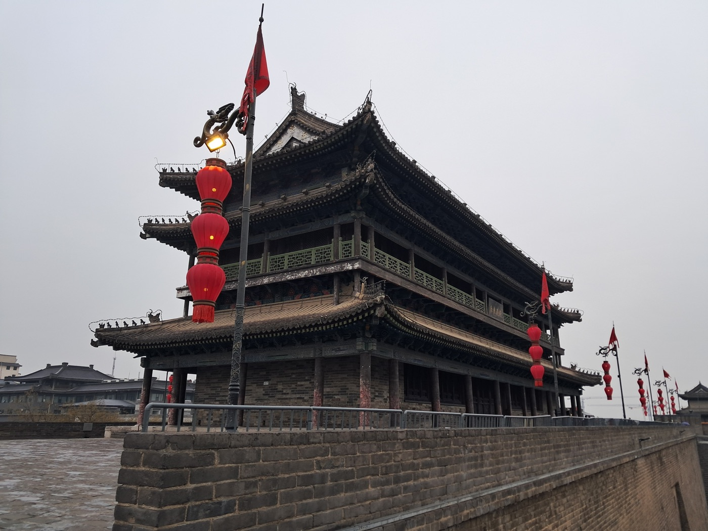
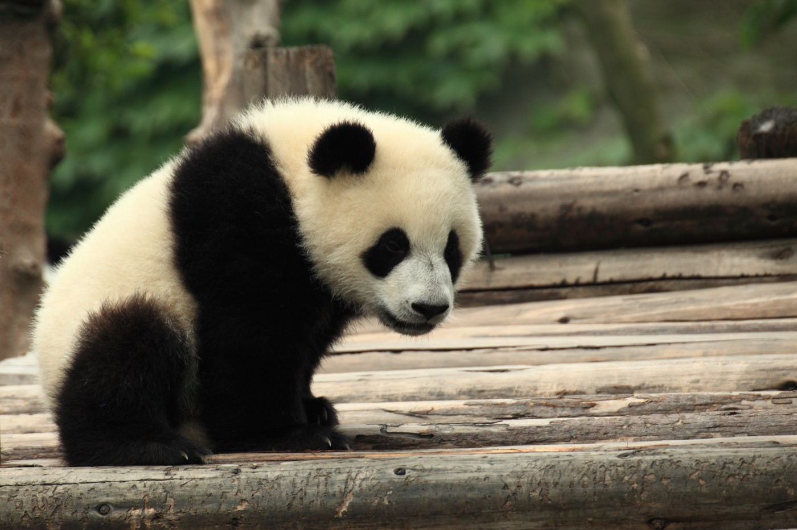
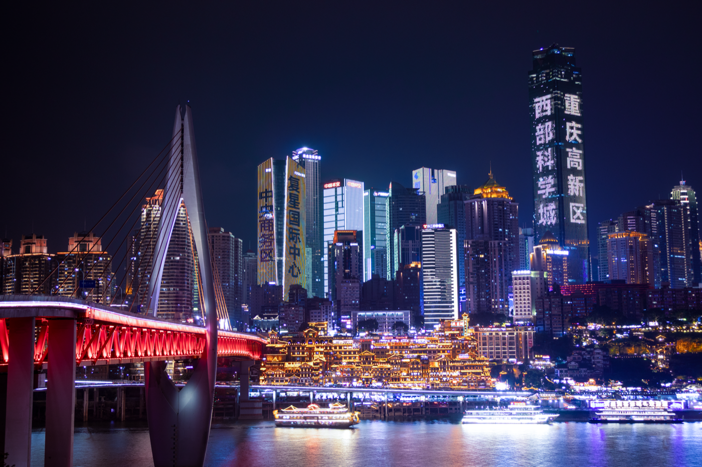
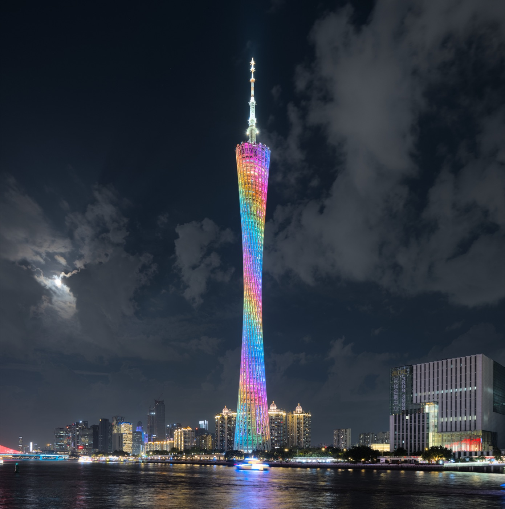
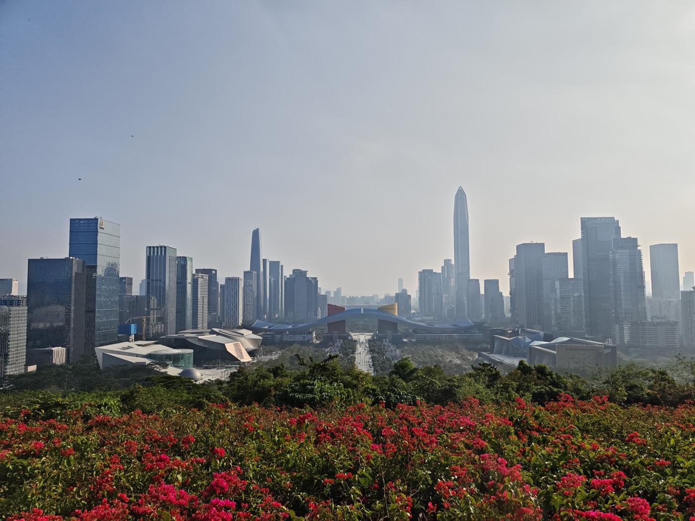
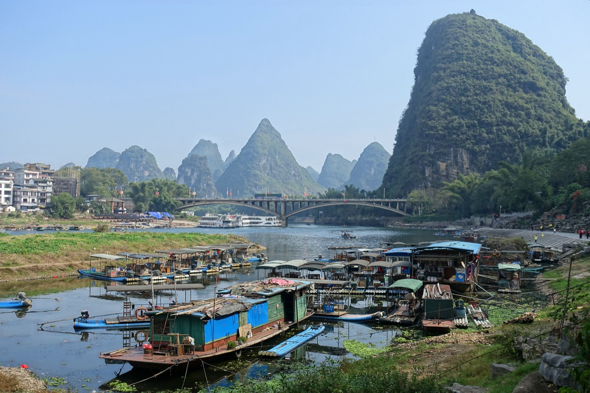

# 四 长途圈（5-7 小时）

长途圈不是周末能办的事。杭州东到西安北最快 5 小时 20 分，到成都东 6 小时 40 分，到桂林北接近 7 小时；坐过去坐回来就是一整天。这一档要按 4-5 天起算，3 天会变成赶路 + 走马观花，性价比反而比中途圈差。

座位上长途圈基本是商务座刚需。二等座 7 小时下来腰会废，一等座可以但腿伸不直；商务座 1 + 2 布局，可放平的座椅，全程供餐，到了酒店还能干活吃饭。从杭州到这一档城市单程商务座普遍 1500-2200 元，听起来贵，按 6-7 小时算时薪还是值的，省下来的恢复时间能多换半天行程。

班次选早班车。杭州东 7 点前后那班直达高铁是黄金车次，到目的地正好午饭后，下午能干一件事，晚上能睡个完整觉。下午发车的车次到目的地已经晚上 10 点，第一晚相当于浪费。

动卧是长途圈的隐藏选项。杭州到西安、广州、深圳都有 D 字头动卧，晚上 8-9 点上车，早上 7-8 点到，省一晚酒店，省一整天白天。动卧软卧包厢 4 人间约 1100-1500 元，价格比商务座便宜，时间利用率更高。缺点是睡眠质量不如酒店床，且只有部分线路开行，要在 12306 提前查实时车次。建议组合用：去程坐白天高铁看风景、回程坐动卧把白天留给城市；或者反过来。

返程别压最后一班。长途圈晚点风险比短途大，留出 1-2 小时缓冲，不然误车成本是一晚酒店 + 改签差价。

## 西安

{ width="640" .center }

西安是长途圈最值得去的一座，没有之一。秦汉唐三朝故都，地下文物密度全国第一，地面留下来的城墙是国内唯一一座完整的明城墙。这座城市的好不在景观漂亮，而在历史的厚度可以伸手摸到 - 兵马俑坑里那些两千两百年前烧出来的陶俑，每一个的脸都不一样。

气候上西安春秋短、夏热冬冷且干。最佳时段是 4 月（樱花 + 城墙绿）和 10 月（秋高气爽，能见度好）。夏天 35 度以上，且博物馆排队全在户外暴晒，体感很差。冬天没有暖气进了博物馆才暖和，但雾霾期能见度低，城墙上看不远。

行程上西安要 4 天起：兵马俑半天到一天，陕博半天，市内城墙 + 大雁塔区一天，加一个外围（华清池或法门寺）。想认真看就 5 天。

### 高铁

杭州东到西安北直达班次约 5h20m-6h，G1872 / G1838 / G1916 是常用早班车。商务座必备，二等座 6 小时腰受不了。

动卧：D310 / D314 杭州到西安，晚上 9 点前后发车，早上 7 点多到，正好赶第一天兵马俑。返程也有动卧。

到了西安北后，机场城际或地铁 14 号 + 4 号线进城，约 40 分钟到钟楼。

### 万豪推荐

- **西安威斯汀 (The Westin Xi'an, Anning Manor)**：曲江大唐西市片区，景观房可见大雁塔。床和早餐稳定，适合度假节奏。去钟楼回民街要打车。
- **西安 W 酒店 (W Xi'an)**：大唐芙蓉园边，设计感最强、年轻化，房型跳脱。位置同曲江圈，离老城稍远。
- **西安瑞吉 (The St. Regis Xi'an)**：高奢档，管家服务和 SPA 是亮点，硬件新。位置在新区，主要景点都得打车。
- **西安建国 JW 万豪 (JW Marriott Hotel Xi'an)**：高新区商务向，房型大、行政酒廊好。离老城远，旅游用价值一般。
- **西安喜来登 (Sheraton Xi'an North City Hotel)**：西安北站附近，地铁到北门和钟楼方便。性价比好，适合第一晚或中转。
- **西安艾美 (Le Meridien Xi'an Chanba)**：浐灞片区，离世博园近。设计活泼，但离老城和兵马俑都不算近，要靠地铁。
- 西安雅乐轩在高新或浐灞片区，年轻向 select 系，价格亲民。

旅游优先看老城近的喜来登，或度假感的威斯汀。

### 当地特色酒店

- **西安宾馆**：1958 年建的国宾馆，位置在小寨南郊，园林式格局，老树老楼，接待过各国元首。住一次像走进当代史。
- **西安索菲特人民大厦**：北大街民国老建筑改造，1953 年苏式风格主楼，内部翻新过。位置在钟楼附近，逛老城最方便。

### 行程

**3 天（不推荐，但能塞下核心）**：

- D1 早班车到，下午陕博 + 大雁塔
- D2 兵马俑 + 华清池一天
- D3 上午城墙 + 回民街，下午回杭

**4 天（推荐起点）**：

- D1 中午到，下午大明宫 + 永兴坊
- D2 兵马俑 + 华清池
- D3 陕博（提前预约）+ 城墙骑行 + 大唐不夜城夜景
- D4 上午大雁塔 / 小雁塔，午后回杭

**5 天（彻底）**：

D4 多加一个法门寺一天往返，或汉阳陵 + 茂陵半天 + 碑林博物馆半天。

### 景点详介

**兵马俑（秦始皇帝陵博物院）**

国内最值得排队的一个景点。三个坑里站着 8000 多个陶俑，1974 年农民打井挖出来到现在还在挖。一号坑最大，纵深感最震撼；二号坑是混编军阵但保存最差；三号坑小但是是指挥部。看完三个坑出来是铜车马陈列，大多数人略过那里赶班车其实那才是工艺天花板。

避雷：节假日（五一 / 国庆 / 春节）人流密度到下不了脚，且有些团抢了位置就走不动；非节假日工作日上午 10 点前进园人少。门票要在"秦始皇帝陵博物院"公众号或官网提前一天预约，无现场票。

精品仓：可以付费预约一号坑下坑参观，2 万一位左右且需提前申请，普通人不必。但坑里近距离看陶俑的脸部刻画的确比远观震撼一个量级。

到达：地铁 9 号线华清池站下转 614 路；或西安北 / 西安站坐游 5（306 路）直达。打车单程约 80 元。

时间安排：早 8 点开门进，看到 12 点出来吃午饭；下午接华清池或骊山。整个景区一天打满。

**陕西历史博物馆**

国内顶级博物馆里，陕博的文物质量在前三。镇馆四件：兽首玛瑙杯、鎏金银竹节熏炉、舞马衔杯纹银壶、皇后之玺。基本陈列是周秦汉唐时间线，逛一遍等于把这座城市的几千年快速梳理一次。

最关键的事：必须提前 7 天预约，且周一闭馆。微信搜"陕西历史博物馆"小程序，每天提前 7 天放票，整点放，慢一分钟就抢光。普通票免费但要预约号。"大唐遗宝展"和"壁画馆"是单独票需另外付费，很值得，尤其是壁画馆，唐墓壁画原件，全国仅见。

游览节奏：基本陈列 2 小时起，加上大唐遗宝和壁画馆一共 3.5-4 小时。早上去，下午脑子受不了。

**大明宫国家遗址公园**

唐代大明宫是当时世界上最大的宫殿群，比故宫还大 4 倍。现在是个遗址公园，地面只剩夯土台基和考古出来的柱础石，但走在含元殿的夯土台上，往下看丹凤门那个轴线，唐代的尺度感是真的。

不能期待看到建筑。这是个空间感的景点，你需要用想象力，配合园内的微缩复原模型理解它当年的样子。考古博物馆（IMAX 影院里的那部唐代大明宫纪录片）能补很多上下文，强烈建议进园先看完那部片再走遗址。

最佳时段：傍晚日落前，光线斜照丹凤门，氛围最好。

**大雁塔 + 大唐不夜城**

大雁塔本身白天 20 分钟看完，玄奘那座塔登顶要爬 7 层，腿不好别上去，看完外观即可。塔下的大慈恩寺正经古寺，可以待一会。

大唐不夜城是塔南面的一条仿唐步行街。白天巨丑，建议跳过。晚上 7 点开灯之后整条街唐风建筑、表演、音乐喷泉一起上，是西安夜生活地标。"不倒翁小姐姐"等网红节目在固定点位，看一眼就行别凑热闹。北广场音乐喷泉每晚有场次（冬季减场），亚洲最大喷泉，水柱配秦腔，俗但震撼。

避雷：节假日和暑假晚上 8 点之后人挤人，呼吸都困难。要去就 7 点开灯前到位，找好位置。

**古城墙骑行**

西安城墙周长 13.7 公里，是国内唯一保存完整的明代府城墙。城墙上租自行车骑一圈，1.5-2 小时，是认识这座城市最好的方式。墙顶宽 12-14 米，又平又宽，骑起来不累。

南门（永宁门）是主入口，仪式感最强；东门、北门、西门也都能上下，可以买一张票上下不限次。单人车 45 元 / 100 分钟，双人车 90 元，一般 100 分钟够骑一圈含拍照休息。

最佳时段：日落前后。傍晚 5 点上墙，骑到 7 点墙上灯亮起来，红灯笼一线串过去，回望整条城墙，和白天完全两个景观。冬天 5 点天就黑，时间往前调。雨天和大雾不要上，地面湿滑且什么都看不见。

**回民街取舍 + 永兴坊 + 真本地餐**

回民街（北院门 + 化觉巷）是游客地标，历史是真的（明清以来回民聚居），现在的店是假的（90% 是外地游客向连锁，且各种宰）。整条街值得走一次看建筑和氛围，但在那里吃饭基本踩雷。

永兴坊在城墙东北角小寨子里，是西安官方搞的"非遗美食一条街"，集合了陕西各地市的代表小吃（biangbiang 面、石子馍、汉中热米皮、潼关肉夹馍、摔碗酒），品质比回民街稳，价格透明。氛围比回民街轻松。摔碗酒那家网红打卡点排队，跳过即可。

真正的本地饭：

- **老孙家泡馍**（东大街总店）：羊肉泡馍国营老字号，馍要自己掰碎，掰得越小越入味，掰完递回去煮。本地人去东大街老店不去回民街分店。
- **子午路张记肉夹馍**：本地连锁，皮薄肉多，比袁记好。
- **樊记腊汁肉夹馍**（竹笆市店）：百年老字号，肉肥香。
- **永明岐山面**：碗小油大，醋酸辣，正宗岐山臊子面。

**华清池 + 骊山**

兵马俑下午接的最佳路线。华清池在临潼，唐玄宗杨贵妃赐浴的地方，加上 1936 年西安事变发生地（"兵谏亭"在骊山半山），双重历史。园内有汤池遗址（看古代浴池构造）和五间厅（蒋介石被抓的地方）。

骊山从华清池后门可以坐缆车上去，半山腰有西安事变兵谏亭，山顶烽火台是周幽王"烽火戏诸侯"的传说所在地。爬山费体力，缆车上下含徒步约 2 小时。

夜场《长恨歌》实景演出在华清池九龙湖，杨贵妃故事改编，水上舞台 + 灯光 + 真人，是西安最好的实景演出。门票 300-1000 元，提前一周买票。如果时间安排得开，4-10 月在华清池待一天看到夜场再回市区。

**法门寺（一天往返）**

法门寺在西安西北扶风县，离市区 110 公里，要一天。西安北坐高铁到法门寺站约 50 分钟，下站坐区间车到景区。

去这里只为一件事：看地宫出土的释迦牟尼真身指骨舍利和唐代皇室供奉的金银器、丝绸、秘色瓷。法门寺地宫是 1987 年炸塌真身宝塔时偶然发现的，里面藏着唐懿宗时代封存的全套皇家供奉，文物等级和数量在国内排前五。法门寺博物馆和合十舍利塔分别在景区两端，舍利每月初一、十五公开瞻礼，平时只展不出。

如果不是对佛教或唐代金银器有兴趣，可以跳过。但去过的人基本都说值。

### 吃

- **老孙家泡馍**（东大街）
- **樊记腊汁肉夹馍**（竹笆市）
- **永明岐山面**
- **大皮院老白家羊肉小炒泡馍**（小炒泡馍是回坊本地做法）
- **天下第一面**（biangbiang 面专门店，南院门）
- **西安饭庄**（钟鼓楼广场，国营老字号，葫芦鸡、温拌腰丝）
- **同盛祥**（钟楼，泡馍另一家百年）
- **魏家凉皮**（本地连锁，方便简餐用）

### 最佳季节

4 月（樱花、城墙、气候），10 月（秋高、博物馆季）。避开 7-8 月（35 度高温暴晒）和 12-2 月（雾霾期能见度低、户外冷）。

## 成都

{ width="640" .center }

成都是长途圈里最适合 4-5 天慢节奏的城市。整座城市的气质是"巴适"，节奏比北上深慢一拍，火锅、茶馆、熊猫、博物馆密度都高，外加广汉三星堆和都江堰青城山两个一日往返的强点。文化深度比一般城市厚两层 - 三国 + 蜀文化（三星堆 / 金沙）+ 唐宋诗人（杜甫 / 薛涛）+ 明清园林。

气候是潮湿盆地，全年阴天为主，太阳少。最舒服 4-5 月和 9-10 月。夏天闷热但不极端，冬天 5-10 度但湿冷。注意成都很少下雪，但常年 70% 以上湿度，怕湿的人冬天会难受。

行程 4-5 天起。3 天只能做核心三件套（武侯祠 / 杜甫草堂 / 熊猫），三星堆和青城山都要砍。

### 高铁

杭州东到成都东最快 G1976 / G1370 直达约 6h40m，多数班次 7-8 小时。商务座必备。

动卧：Z 字头普速直达车每晚有，但 20 多小时不实用。D 字头动卧到成都没有直达，要中转，不推荐。

成都东站到市中心打车约 25 元 15 分钟，地铁 2 号线 / 7 号线 / 18 号线都到。

### 万豪推荐

- **成都瑞吉 (The St. Regis Chengdu)**：锦江老城，紧邻春熙路。管家服务和下午茶是招牌，房间宽敞。综合体验最稳。
- **成都 JW 万豪 (JW Marriott Hotel Chengdu)**：中海国际中心，新南天地片区。商务向硬件，行政酒廊不错，离太古里要打车。
- **成都丽思卡尔顿 (The Ritz-Carlton, Chengdu)**：市中心人民南路，1 站地铁到春熙路太古里。27 楼酒廊看天际线，下午茶招待人合适。
- **成都 W 酒店 (W Chengdu)**：金融城新区，造型跳脱。年轻设计向，位置离老城远。
- **成都艾美 (Le Meridien Chengdu, Chengdu Pidu)**：郫都区，离市区远，主要服务高新西区商务客。旅游不推荐。
- **成都威斯汀 (The Westin Chengdu)**：高新区天府大道，新城区商务向。床品和健身设施好，但离老城远。

旅游首选瑞吉或丽思（位置 + 综合）。

### 当地特色酒店

- **成都博舍 (The Temple House)**：太古里里面，由清代古建筑笔帖式衙门改造，融合了寺院庭院和当代设计。安静，离大慈寺、太古里都是几步路。
- **成都钓鱼台精品酒店**：宽窄巷子里，把清代四合院改成低层精品。客房围合天井，泡茶听雨的氛围一流，位置无可替代。

### 行程

**3 天（紧）**：

- D1 中午到，下午武侯祠 + 锦里
- D2 早上熊猫基地，下午杜甫草堂 + 宽窄巷子
- D3 上午太古里 / 文殊院，午后回杭

**4 天（推荐）**：

- D1 中午到，下午武侯祠 + 锦里夜
- D2 熊猫基地（早 7:30 进园）+ 杜甫草堂下午
- D3 三星堆一天（高铁广汉北 21 分钟）
- D4 上午宽窄巷子 / 文殊院，午后回杭

**5 天（充分）**：

D4 加都江堰 + 青城山一日，D5 太古里 + 望江楼半天后回杭。

### 景点详介

**武侯祠 + 锦里**

武侯祠是中国唯一一座君臣合祀祠（刘备的惠陵 + 诸葛亮的武侯祠在一起），三国迷必去。园子不大，重点是诸葛亮殿、刘备殿、文臣武将廊（28 尊塑像）、惠陵（刘备墓）。武侯祠的好不在建筑（清代重建），在那种历史沉淀感。文物商店里"出师表"碑拓片可以带一份。

锦里在武侯祠出口边上，是仿古商业街，吃喝玩乐的旅游街。白天人多无趣，傍晚 6 点之后红灯笼亮起，有川剧变脸、糖画、皮影等表演穿插，氛围最好。30 分钟逛完。吃别在这里吃，定价旅游价。

时间：武侯祠 1.5 小时，锦里 1 小时，傍晚一起做。

**杜甫草堂**

杜甫晚年在成都流亡 4 年盖的茅屋复建，更准确说是个园林。园子大、植被密、安静，是成都市中心难得的清静地。重点：茅屋故居（《茅屋为秋风所破歌》就是这写的）、工部祠（杜甫的祭祠）、唐代遗址。

杜甫草堂的看点不在文物（没什么真文物），在氛围。竹林、流水、石板路，江南园林的疏密 + 蜀地的湿润，走 1.5-2 小时。园子里有杜甫诗碑廊，可以慢慢看。

最佳时段：上午 9-11 点，光线好且人少。下午常下雨。

**宽窄巷子**

成都名片之一，三条平行的清代胡同（宽巷子 / 窄巷子 / 井巷子）改造的步行街。有几栋是真清末民初老建筑，多数是新仿。

避雷：周末和节假日 11 点之后挤到走不动；商铺定价旅游价；店铺多为连锁伴手礼。

正确打开：工作日早晨 9-10 点去，看建筑细节（门头、瓦檐、砖雕），泡一杯老茶馆 30 元的盖碗茶坐 1 小时听蝉看光影，然后离开。别试图在这里吃饭。井巷子最少游客，氛围最舒服。

整体 1 小时即可，但是个值得短暂体验的地方。

**太古里 + 大慈寺**

成都最不像旅游景点的旅游景点。远洋集团 2014 年开的开放式商业街区，把大慈寺（唐代皇家寺庙）保留在中央，周围是 LV / 爱马仕 / 三联书店 / 方所书店 + 米其林餐厅。

来这里两个理由：一看建筑（隈研吾 / 郝伯曦设计的灰瓦坡顶低密度群落，国内商业地产的设计天花板）；二看人（成都的潮人浓度全国第一，街拍水平 + 时尚密度比上海徐家汇还高）。

不买东西也要走一趟。方所书店在地下，建筑师朱志康设计，国内最美书店之一，进去坐 1 小时看书。三联韬奋书店、MUJI 旗舰店都在里面。

吃饭：太古里里面的米芝莲 / 颐和小馆 / 玉芝兰这种价位高，但是好吃。预算紧的隔条街就有便宜小馆。

**大熊猫繁育研究基地**

成都名片，国内看大熊猫密度最高的地方（比北京动物园多 3 倍）。园区分太阳产房 / 月亮产房 / 成年熊猫别墅 / 红熊猫园几个区。

关键时点：必须早上 7:30-9:00 进园。熊猫早上凉快活跃，吃竹子打架爬树，9 点之后躺平睡觉，整天不动。下午去就只能看八只憨憨睡姿。

地铁 3 号线熊猫大道站下转园区接驳；或打车从市中心 30 分钟。门票 55 元，公众号"成都大熊猫繁育研究基地"提前预约。园子大，建议租电瓶车（10 元 / 人）省脚。

新生熊猫宝宝在月亮产房，但能不能看到取决于运气和年份产仔情况。

3-4 小时游览。

**三星堆博物馆（广汉北一日）**

四川长途圈隐藏的最大宝藏。三星堆遗址是 1986 年和 2019 年两次大规模出土的古蜀文明遗址（距今 3000-5000 年），出土了那个全国知道的青铜大立人、青铜神树、纵目面具、黄金面罩。和中原文明完全不同的造型语言，看一次脑子被打开。

新馆 2023 年 7 月开馆，常设展把 1986 年坑和 2019-2022 年新坑的文物全展开，展陈和叙事在国内顶级。

到法：成都东站 → 高铁广汉北 21 分钟（每天数十班次），下站门口坐 10 路或打车到博物馆 15 分钟。门票 72 元，公众号"三星堆博物馆"提前预约。一日往返完全可行：早 9 点出门，10 点到馆，看到 14-15 点回程，下午回成都。

逛馆 4-5 小时。馆外的青铜神树主题园林可以略过。

值得说一遍：三星堆是这一档城市群里单点文物震撼度最高的，超过陕博和兵马俑。

**都江堰 + 青城山（一日）**

李冰父子公元前 256 年修的水利工程，到现在还在用，已经 2280 年。这点本身就值得来一趟。重点看鱼嘴 / 飞沙堰 / 宝瓶口的分水原理（园区里有水利模型解释），以及二王庙（祭李冰的）和秦堰楼。沿江的安澜索桥可以走一段，江水颜色翠绿。

青城山是道教圣地，分前山（道观文化为主，缆车 + 步行 2-3 小时）和后山（自然景观为主，徒步 5-6 小时）。一日游配都江堰建议前山。山上的"老君阁""上清宫"是可看点。山下青城后山的"又一村""泰安古镇"可以吃午饭，腊肉饭很好。

到法：成都西站坐到都江堰的城际高铁 30 分钟，1 小时一班。都江堰景区出来打车去青城山前山 30 分钟。一天紧凑，建议都江堰半天 + 青城前山半天。

**文殊院（早茶）**

清代禅宗丛林，是成都市中心保存最好的古寺。免费进。重点不是看殿堂（普通），是去寺内或周边的茶馆喝早茶 - 这是成都人最日常的消遣方式。

文殊院禅茶坐院子里 1 小时 30-50 元一杯盖碗茶续水免费，配上面摊 + 凉粉 + 抄手吃早饭，看本地老人遛鸟下棋打长牌。这是成都最"成都"的体验。

最佳：周末早上 8-10 点。

**望江楼公园**

锦江边的小园林，纪念唐代女诗人薛涛。清代建筑薛涛井 + 望江楼是地标，但这园子真正的价值是 - 国内最全的竹品种园，160 多种竹子。园子安静游客少，散步极佳。1 小时即可。

旁边四川大学望江校区可以顺路逛，老校区民国建筑多。

### 吃

- **陈麻婆豆腐**（青华路总店）：百年老字号，正宗麻婆豆腐发源地。汤汁拌饭一绝。
- **皇城老妈火锅**（二环店）：老牌成都火锅，环境贵价但锅底正宗。
- **小龙翻大江**（春熙店）：高端火锅，环境好招待人。
- **马旺子川菜**（太古里店）：精致改良川菜，蒜泥白肉、口水鸡很好。
- **明婷饭店**（玉林）：苍蝇馆子，脑花豆腐 + 干煸排骨经典。位置不好找。
- **甘记肥肠粉**（红星路）：本地早餐肥肠粉天花板。
- **龙抄手**（春熙路）：老字号小吃综合店，方便一次性把成都小吃吃到。
- **王妈手撕烤兔**（玉林）：本地夜宵兔头 + 烤兔。

火锅是成都饮食基本盘，预算够直接皇城老妈或小龙翻大江；预算紧蜀大侠 / 小龙坎 / 大龙燚都行。

### 最佳季节

4-5 月（最舒服）和 9-10 月（成都最值得）。避开 7-8 月（湿热闷）和 12-2 月（湿冷不见太阳）。3 月 / 11 月也可以，会下雨多但人少。

## 重庆

{ width="640" .center }

重庆是地形决定一切的一座城市。建在两江交汇的山岭上，天然立体，没有平地。这座城市的看点 80% 是夜景 + 山城肌理 + 火锅，20% 是博物馆和历史遗迹。来重庆要做心理准备：地图上 200 米可能要爬 5 层楼梯，导航上的"步行 5 分钟"可能要走 20 分钟。

最佳时段是 10-11 月（秋高气爽，江上能见度好）和 4 月（春天）。夏天 7-8 月号称四大火炉之一，40 度高温日常，户外暴走会中暑。冬天 5-10 度阴冷少阳光。

行程 3-4 天最合适。3 天能装下市内核心，4 天可以加大足石刻或武隆。5 天就有点撑了，重庆景点深度不如西安成都。

### 高铁

杭州东到重庆北最快 G2891 / G53 约 6h-7h，部分车次到重庆西。商务座必备。

到了重庆北或重庆西后，地铁 4 号 / 10 号或 5 号 / 环线进城，约 30-40 分钟到解放碑或江北。

### 万豪推荐

- **重庆万豪 (Marriott Chongqing)**：渝中区邹容路，离解放碑步行 5 分钟。老牌商务酒店，硬件略旧但位置无敌，旺季性价比好。
- **重庆 JW 万豪侯爵 (JW Marriott Marquis Chongqing)**：南滨路弹子石，江对岸看渝中半岛灯火，新开业房间最大。打车过桥到解放碑约 15 分钟。
- **重庆丽思卡尔顿 (The Ritz-Carlton Chongqing)**：江北嘴 IFS，2024 开业，高度市内第一档。江景房对着两江交汇，综合体验最好。
- **重庆喜来登 (Sheraton Chongqing Hotel)**：南岸南滨路双子塔，江景好，价格比 JW / 丽思亲民。位置偏，去解放碑要过隧道。
- 重庆雅乐轩在江北或两路口附近，年轻向，预算紧的稳妥选择。

夜景是重庆酒店的核心价值，江北嘴或南滨路高层江景房值得多花钱。

### 当地特色酒店

- **重庆嘉佩乐 (Capella Chongqing)**：江北区域，2023 开业的奢华小型酒店，套房起步，私人管家。设计糅合巴渝山水和现代雅奢，是城市侧的小奢华备选。

### 行程

**3 天（核心）**：

- D1 中午到，下午长江索道 + 解放碑 + 洪崖洞夜景
- D2 上午鹅岭二厂 + 山城步道，下午三峡博物馆，晚上南山一棵树看夜景
- D3 上午磁器口或弹子石老街，午后回杭

**4 天（推荐）**：

D3 加大足石刻一天往返；D4 上午李子坝 / 鹅岭，午后回杭。

**5 天**：

D3 加武隆天生三桥一天，回程当天住武隆。

### 景点详介

**洪崖洞**

重庆地标。吊脚楼建筑群依崖而建，11 层楼上下，下面是嘉陵江。白天看是个仿古商业楼，晚上 7 点开灯之后整栋楼亮起来，配上对岸江北嘴的天际线，确实是网红打卡地标。

避雷：节假日和周末晚上 8 点之后人挤人，桥上想拍照都站不下脚。要么 6 点前到位（看天黑前的景观），要么 9:30 之后人潮散后再看。

最佳拍摄机位有三个：千厮门嘉陵江大桥（拍洪崖洞 + 江北嘴对岸），洪崖洞对岸江北嘴亲水平台（拍洪崖洞正脸），洪崖洞内部 11 楼出来直接走上千厮门桥。

里面的店都是连锁伴手礼，可以略过。整体 30-60 分钟即可。

**解放碑 + 长江索道**

解放碑是渝中半岛步行街中心，1947 年立的抗战胜利纪念碑 + 现在的商业中心。白天逛街晚上看灯。"八一好吃街"在背面，晚上小吃多。

长江索道是当年市民通勤工具，现在变成观光索道，从渝中区新华路站到南岸区上新街站，跨长江单程约 5 分钟。空中俯瞰长江 + 渝中天际线，体验值。运行时间早 7:30 - 晚 22:00，旺季排队 30 分钟以上。建议早 9 点开门或下午 5 点傍晚去，避开正午高峰。门票 30 元单程，用支付宝扫码。

**磁器口（避雷）vs 弹子石老街**

磁器口是嘉陵江边的明清古镇，1500 年建镇史。问题是 2010 年之后过度商业化，整条街全是连锁伴手礼（陈麻花 + 烤鱼 + 熟食），且节假日挤到无法呼吸。如果是第一次来重庆且时间紧，跳过。

弹子石老街在南岸，2018 年改造完，是个新仿古街区，但人少、设计感更好、对岸江景视野直对洪崖洞 + 江北嘴 + 朝天门，三线齐看，比磁器口性价比高得多。傍晚去，看天黑灯亮，待 1.5-2 小时。

**三峡博物馆（重庆中国三峡博物馆）**

人民广场对面，外形是个白色穹顶。馆藏分四块：古巴渝（巴文化、汉代陶俑）、远古巴渝（恐龙、化石）、抗战岁月（重庆作为陪都的史料和文物）、三峡（三峡工程库区抢救出来的文物）。

看点：抗战厅是国内讲抗战陪都最完整的展厅，蒋介石的钢笔、蒋夫人的礼服、各国大使馆的牌子。三峡厅看库区淹没前从涪陵 / 巫山等地抢救的文物，包括汉代石阙原件。

时间：3-4 小时。免费但要预约，公众号"重庆中国三峡博物馆"。和人民大礼堂在一起，看完博物馆出门正对大礼堂广场，民国仿明清宫殿建筑，必拍。

**大足石刻（一天往返）**

重庆长途圈第一外围景点。世界文化遗产，唐宋时期的石窟造像，与敦煌、云冈、龙门并称中国四大石窟。重点是宝顶山和北山两处。

宝顶山是大型造像群（千手观音、卧佛、地狱变相、父母恩重经变），南宋作品，规模大、保存好、宗教叙事完整。北山是大量小龛 + 心神车窟，唐末五代到南宋跨度长。

最大看点是千手观音，830 只手，2008 年用了 8 年修复完成。卧佛长 31 米，是国内最大半身卧佛之一。

到法：重庆北 / 沙坪坝坐高铁到大足南站约 50 分钟，下站坐景区接驳约 30 分钟到宝顶山。一日往返完全可行：早 7:30 出门，10 点到宝顶山，看到 14:00 转北山或回程。门票宝顶 + 北山联票约 170 元。

不是石窟控可以单看宝顶山。

**武隆天生三桥（半天到一天）**

喀斯特地貌奇观，三座天然石桥串联的峡谷。《满城尽带黄金甲》和《变形金刚 4》都在这里取景。三座桥（天龙桥 / 青龙桥 / 黑龙桥）规模大，桥下深 200 米，走在峡谷底部抬头，几个时代的地质年轮压在你头顶。

到法：重庆北坐高铁到武隆站约 1.5 小时，景区接驳。门票 + 观光车约 135 元。一日往返不轻松，建议武隆住一晚（仙女山或县城），第二天加上仙女山草原或芙蓉洞。

**山城步道（第三步道）**

重庆有 8 条山城步道，第三步道（领事巷 - 法国大使馆 - 望江花园 - 厚庐 - 山城巷）是保存最完整、最有民国味道的一条。从渝中半岛下行到长江岸边，沿途有抗战时期外国使馆遗址、老石板路、吊脚楼民居、悬空小路，能看到老重庆没改造前的样子。

走完单程约 2 小时，建议从领事巷起步，沿步道下到长江边。穿运动鞋。下雨别走（青苔湿滑）。

最佳时段：早晨 8-10 点光线好且人少，或下午 4-6 点斜光。

### 吃

- **小天鹅火锅**（解放碑）：重庆老牌火锅之一，毛肚黄喉传统派。
- **晓宇火锅**（枇杷山店）：本地老火锅，环境老破小，味道地道。
- **大队长火锅**（解放碑 / 沙坪坝）：年轻向网红火锅，锅底过得去。
- **周记小面**（沙坪坝）：本地小面之一，麻辣鲜香的代表。
- **胖妹面庄**（红旗河沟）：本地小面排队户。
- **乡村基**（连锁）：起源重庆的连锁，鸡腿饭和酸汤面是社区基础口味，便宜方便。
- **江湖菜**：找一家正宗的吃酸菜鱼 / 辣子鸡 / 来凤鱼 / 歌乐山辣子鸡，建议蓝湖村或歌乐山附近的本地店。
- **山城汤圆**：早餐试一次。

### 最佳季节

10-11 月（秋天江景能见度最好）和 4 月。避开 7-8 月（40 度高温）和 1-2 月（阴冷无阳光）。

## 广州

{ width="640" .center }

广州是岭南文化首府，也是中国最被低估的旅游城市之一。这座城市的好不在地标，在街区肌理：东山口的民国洋楼、西关的骑楼老街、沙面的租界建筑、永庆坊的更新改造，每一片都是不同时代的广州。加上珠江边的天际线和粤菜密度，是个 3-4 天会越住越喜欢的城市。

气候是亚热带，全年温暖湿润。最佳 10-12 月（凉爽干燥）和 3 月（春暖花开）。夏天 6-9 月又热又有台风。冬天 1-2 月最舒服 15-20 度。和北方比，没有真正的冷季。

行程 3-4 天合适。3 天能装下核心。4 天能加佛山或开平碉楼一日。

### 高铁

杭州东到广州南直达约 6h30m-7h，G99 / G2381 是常用早班车。商务座必备。

动卧：D923 / D917 杭州东到广州南，晚上 8-9 点发车，早上 7-8 点到，省一晚酒店 + 一整天白天。返程也有动卧，性价比高。

广州南到市区珠江新城地铁约 30 分钟（2 号 / 7 号 / 22 号线组合）。

### 万豪推荐

- **广州 JW 万豪 (JW Marriott Hotel Guangzhou)**：天河 CBD 富力盈凯，紧邻太古汇。商务和购物两便，房间硬件新。综合体验稳。
- **广州丽思卡尔顿 (The Ritz-Carlton, Guangzhou)**：珠江新城 CBD，房间正对小蛮腰，去太古汇 / 花城广场步行可达。位置最好。
- **广州天河喜来登 (Sheraton Guangzhou Hotel)**：天河北体育中心边，地铁多线交汇，去老城和 CBD 都方便。性价比好。
- **广州 W 酒店 (W Guangzhou)**：珠江新城紧邻 CBD，扎眼设计 + 楼顶泳池，年轻向。位置同丽思。
- **广州天河艾美 (Le Méridien Guangzhou)**：天河区中信广场附近，地段在老 CBD，房型偏紧凑，胜在交通便利。

旅游住珠江新城选丽思或 W；想兼顾老城选喜来登。

### 当地特色酒店

- **广州花园酒店**：环市东 1985 开业，老牌五星，岭南园林布局，宴会和早茶有口皆碑，本地人办喜事都来。
- **广州东方宾馆**：流花 1961 开业，国宾馆出身，老式宾馆园林感。改造保留了民国到当代的层叠肌理。
- **广州白天鹅宾馆**：沙面岛上，1983 开业，珠江景一线，正门那座飞瀑大堂是几代人的广州记忆。
- **广州文华东方酒店**：太古汇里面，奢华系标杆，下午茶和 SPA 全市顶配。位置和 JW 同片区。

### 行程

**3 天（核心）**：

- D1 中午到，下午陈家祠 + 沙面，晚上珠江夜游
- D2 上午越秀公园（五羊雕塑），下午广东省博 / 广州博物馆，晚上广州塔
- D3 上午永庆坊 / 上下九，早茶后回杭

**4 天（推荐）**：

D3 加佛山祖庙 + 顺德吃一日；D4 早茶 + 红专厂 / 海心沙，午后回杭。

**5 天**：

D3 加开平碉楼一日（高铁到台山或江门，再转车）。

### 景点详介

**白鹅潭 + 沙面**

沙面是珠江中的一个小岛，鸦片战争后划给英法做租界。整个岛保留了 150 多栋民国时期的西洋建筑（领事馆、教堂、银行、洋行），是国内保存最完整的近代租界建筑群之一。岛不大，1.5 小时可以走一圈。重点：露德圣母堂、英国领事馆、汇丰银行旧址、白宫宾馆。

岛上是步行街，咖啡馆和酒吧改造在老建筑里，氛围休闲。沙面公园西头看白鹅潭（珠江三江汇合处）江景很好。

最佳时段：傍晚 5-7 点，斜阳照在花岗岩柱廊上，光影最美。傍晚后江边吹风很舒服。

地铁 1 号或 6 号线黄沙站下，过沙基涌桥即到。

**陈家祠（陈氏书院）**

中国传统建筑装饰艺术天花板。1894 年建成，原是陈氏宗族子弟读书的场所，现在是广东民间工艺博物馆。

来这里看一件事：装饰。陈家祠用尽了广东民间所有装饰工艺 - 砖雕、石雕、木雕、灰塑、陶塑、铁铸、彩绘 - 屋顶上、廊柱上、屏门上密密麻麻铺满，工艺密度国内独一份。重点看屋脊上的石湾陶塑（戏曲故事场面）和木雕（封神演义、三国题材）。

里面附设的"广东民间工艺博物馆"展广东各地的工艺品，可以一并看。

时间：2 小时。地铁 1 号线陈家祠站下。

**越秀公园（五羊雕塑）**

广州城市原点。"五羊衔穗"是广州的图腾传说，1959 年立的五羊石雕在越秀山顶，是广州最经典地标之一。

公园本身大且免费，里面有镇海楼（明代广州古城楼，现广州博物馆所在）、四方炮台、明代古城墙残段。爬山到镇海楼顶层能看广州老城天际线，免费。

走法：东门进，先到五羊石像，再上镇海楼看广州博物馆，从西门或北门出。3 小时。

**永庆坊 + 上下九**

永庆坊在荔湾，是 2016 年改造的西关老街区，保留了岭南骑楼形态加现代商业改造。比上下九游客少、设计感强、有李小龙故居（早年祖屋）和粤剧博物馆在里面。

上下九是西关老街的步行街，骑楼连片，但商业过度且老化，店铺多是廉价小吃和服装店。除非要打卡纯老广州街景，可以略过，永庆坊更值。

北京路步行街是广州第一条步行街，定位类似但更老（隋唐古城轴线，地下还有古道遗址展示），可以看一眼但不必久留。

最佳：永庆坊傍晚去，走 1-2 小时即可。

**广东省博物馆 + 广州博物馆**

广东省博物馆在珠江新城花城广场边，建筑是个白色巨型方盒（其实是个木雕珠宝盒造型）。馆藏分历史馆、自然馆、艺术馆。重点：广彩瓷器（清代广州外销瓷）、潮州金漆木雕、海上丝绸之路文物。

广州博物馆在越秀公园镇海楼里，规模小，重点是城市考古和广州城市史。两馆择一。

省博需要预约，公众号"广东省博物馆"。3-4 小时。

**广州塔（小蛮腰）**

600 米高观光塔，俗称小蛮腰因为造型扭转。看广州夜景的标准点位。

观光层 433 米和 488 米（户外摩天轮）。摩天轮 16 个观光球缓慢绕一圈 20 分钟，看珠江夜景天花板。

正确打开：日落前 1 小时上塔，看天黑过程，天黑后看灯亮。塔上吃饭很贵不必。门票 150-228 元。地铁 3 号线 / APM 线广州塔站。

如果不上塔，对面海心沙广场是免费拍小蛮腰的最佳点位，晚上 8 点小蛮腰彩色灯光秀很好看。

**海心沙 + 花城广场**

广州中轴线 CBD，2010 亚运会主会场。花城广场是国内最大城市广场之一，南到海心沙北到天河体育中心，两边是广州东塔西塔（432 米和 530 米）和广州歌剧院（扎哈设计）+ 广东省博。

晚上是城市天际线最好的拍摄点。海心沙桥过去看小蛮腰正脸，无须门票。

**早茶（广州的核心仪式）**

来广州不喝一次早茶等于没来。广式早茶是这座城市最日常、最骄傲的饮食仪式。广州人喝茶要喝到中午，三个人四个人围坐一桌，点一壶普洱或铁观音，配 8-10 笼点心慢慢吃慢慢聊，是广州人最重要的社交方式。

老字号选三家：

- **陶陶居**（第十甫店）：1880 年开业，西关传统老字号，建筑是西关风格大楼，鲜虾饺 + 蜜汁叉烧包 + 陶陶居招牌包，性价比高。
- **莲香楼**（第十甫店）：1889 年开业，名声同陶陶居，月饼出名。
- **点都德**（连锁）：现代化连锁早茶馆，环境新，出品稳定，外地游客好上手。多家分店，太古汇 / 北京路 / 江南西都有。

吃早茶要点：早上 7-10 点是黄金时段，10:30 之后开始过渡到午市。点心要"虾饺王 + 烧卖 + 流沙包 + 凤爪 + 肠粉 + 萝卜糕 + 豉汁排骨 + 叉烧包"这套基础八件 + 一壶普洱。

### 吃

- **陶陶居**（西关）：早茶老字号
- **点都德**（连锁）：早茶现代化版
- **炳胜**（员村总店）：粤菜中坚，烧鹅 + 豉油皇乳鸽。
- **炳胜公馆**（同集团高端）：商务招待用。
- **山外山酒家**（农林下路）：传统粤菜老字号。
- **海皇粥店**（连锁）：广式生滚粥宵夜首选。
- **银记肠粉**（连锁）：本地肠粉品牌。
- **林记云吞**（西关）：西关云吞面老牌。
- **兄妹小吃**（小巷子里找）：西关糖水 + 双皮奶 + 姜撞奶。

### 最佳季节

10-12 月（最佳，凉爽）和 3 月。避开 6-9 月（湿热 + 台风）。1-2 月也行但部分日子阴冷。

## 深圳

{ width="640" .center }

深圳是中国最年轻的一线城市，1980 年才建立特区。所以来深圳不要找古迹（基本没有）和老城（基本没有），来看的是城市本身 - 现代主义建筑密度全国最高、商业区密度最高、人口平均年龄最年轻、改革开放四十年的物理样本。深圳的核心体验是城市感、设计感、未来感，加上一日跨境去香港。

气候同广州，亚热带海洋。10-12 月最舒服。夏天 6-9 月台风季湿热。

行程 3-4 天合适。3 天市内 + 1 天香港往返是最佳组合。

### 高铁

杭州东到深圳北直达约 7h，部分车次到深圳福田。商务座必备。

动卧：D923 杭州东到深圳北，约 11 小时夕发朝至，性价比好。

到达后地铁 5 号 / 11 号线进城。

### 万豪推荐

- **深圳益田威斯汀 (The Westin Shenzhen)**：南山益田假日广场，地铁直达欢乐海岸和深圳湾。商场内联通，购物吃饭很方便，床品稳。
- **深圳前海华侨城瑞吉 (The St. Regis Shenzhen)**：罗湖京基 100 大厦 75-100 楼，深圳最高酒店之一，景观无敌。罗湖老城商圈，去福田要地铁。
- **深圳 JW 万豪 (JW Marriott Hotel Shenzhen)**：福田 CBD 中心商务向，紧邻购物公园和地铁多线，房型偏商务紧凑。
- **深圳丽思卡尔顿 (The Ritz-Carlton, Shenzhen)**：福田 CBD 紧邻华润万象天地，景观房可见市民中心 + 平安。综合体验最优。
- **深圳 W 盐田 (W Shenzhen Yantian)**：盐田海湾，是度假酒店不是城市酒店。要看海 + 沙滩 + 设计感选这家。
- **深圳福田喜来登 (Sheraton Shenzhen Futian Hotel)**：福田 CBD 性价比之选，位置好、价格合理，硬件中规中矩。

旅游首选丽思（综合）或瑞吉（景观）。

### 当地特色酒店

- **深圳文华东方酒店**：福田香蜜湖深业上城对面，奢华系标杆，SPA 和服务在全市第一档。万豪以外的首选。
- **深圳福田香格里拉**：福田 CBD 老牌，离会展中心近，商务客熟门熟路，硬件略旧但执行稳。
- **深圳华侨城洲际酒店**：华侨城欢乐谷边，欧式园林感强，是深圳最早的度假型城市酒店之一，亲子住宿合适。

### 行程

**3 天（市内 + 香港）**：

- D1 中午到，下午福田市民中心 + 莲花山看夜景
- D2 香港一日（西九龙过境，走中环 - 太平山 - 尖沙咀）
- D3 上午华侨城 OCT-LOFT 创意园，午后回杭

**4 天（推荐）**：

D3 蛇口海上世界 + 深圳博物馆；D4 大鹏所城（远但值），晚上回。

**5 天**：

D4 加香港多一日（迪士尼或大屿山），D5 上午福田 CBD 拍天际线后回杭。

### 景点详介

**蛇口 + 海上世界**

蛇口是深圳的发源地（1979 年第一个工业区），现在改造完后是个海湾区休闲商业带。海上世界中心是个改造的巨型邮轮（明华轮，原法国邮轮），周围围着海上世界商圈，餐饮、酒吧、设计酒店、街头艺术。

步行 1.5-2 小时。重点是建筑感和氛围 - 这里是深圳最早接触世界的地方，蛇口"时间就是金钱，效率就是生命"标语就在这里立起来的（仿制原标语在女娲补天广场）。

晚上去最好，10 月之后凉快。海面看落日 + 灯光秀。

**华侨城 + OCT-LOFT 创意园**

OCT-LOFT 创意园是深圳设计圈聚集地，由旧厂房改造（1980 年代华侨城工业区），现在是设计公司、独立书店、设计酒店、咖啡馆 + 不定期艺术展。建筑改造水准是国内园区里第一档。

里面的 **旧天堂书店** 是深圳最好的独立书店之一，**侨城 1.0** 是好咖啡馆，**深圳生活美学馆** 不定期有设计展。

整体 2-3 小时步行。地铁 11 号或 1 号线侨城东站。

旁边的 **华侨城洲际酒店** 不是万豪但也是设计酒店。

旁边的 **深圳何香凝美术馆** 和 **OCAT 当代艺术中心**（深圳）有不定期展，免费。

**深圳博物馆**

历史民俗馆在福田市民中心 A 区，是深圳最大博物馆。展品分四大块：古代深圳（南越国到明清的历史，包括宝安县文物）、近代深圳（开埠到改革开放）、改革开放史（最大块，深圳速度的物证）、民俗馆（客家文化）。

最有意思的是改革开放展厅 - 国内唯一一座专门讲改革开放史的博物馆，可以看到 1980 年代第一张特区身份证、第一支股票、深圳速度的纪录片。是了解这座城市为什么是这座城市最好的入口。

免费，公众号预约。3 小时。

**大鹏所城（远但值）**

深圳唯一的明清古城。明洪武 27 年（1394 年）建的海防卫所，"深圳"地名就源于此处，"鹏城"也是这里来的。古城保存完整，城墙、街巷、民居、将军第（赖恩爵将军第）原汁原味，是深圳唯一活的历史。

到法：地铁 8 号线（最远）或 11 号线 + 公交，单程 1.5-2 小时。也可以打车从市区 1 小时。

游览 2-3 小时古城本身 + 下午到大鹏半岛沙鱼涌或西冲海边走走，可以一天。

**莲花山公园**

深圳市民最常爬的山。山顶有邓小平铜像，立在深圳改革开放总设计师位置上。从山顶可以俯瞰深圳市中心 - 福田 CBD 的天际线 + 市民中心 + 莲花山之间的中轴线，是深圳官方明信片机位。

爬山 30-45 分钟，缓坡，老人都行。晚上夜景比白天好。

**香港跳一日（西九龙过境）**

广深港高铁福田站到香港西九龙站只需 14 分钟，是这一档最值得做的事。

通关：一地两检，在西九龙站完成内地出境 + 香港入境，约 30-40 分钟。回程同。要带港澳通行证 + 有效签注。预约 12306 选 G99 / G80 等班次。

一日香港路线：

- 早 8 点深圳出发 → 西九龙到达 → 弥敦道走到尖沙咀海边 → 中环（半山扶梯 / 兰桂坊）→ 中午饮茶（陆羽 / 镛记）→ 太平山顶（缆车 + 山顶看维港）→ 中环坐天星小轮过维港 → 尖沙咀晚上（1881 商场 / 海港城）→ 22 点之前回西九龙。

带港币现金或开通银联卡境外功能（八达通也可以扫码）。

**福田 CBD 看天际线**

福田是深圳最现代主义的天际线。站在 **市民中心广场** 中轴线上，往南看是 **平安金融中心**（118 层 600 米）+ **赛格广场** + **深业上城** + 莲花山的轮廓。这条中轴线晚上 8 点灯光秀（市民中心 LED 屋顶 + 平安塔灯光）是深圳最值得看的城市景观，免费，每天 19:30 / 20:30 各一场。

平安金融中心 116 层有云际观光层，门票 200+，看深圳全景。

### 吃

深圳没有真正的本地菜（所有人都是外地人）。但深圳是中国最好的"吃全国"的城市，川湘粤鲁淮扬都有顶级店。

- **乐凯撒榴莲披萨**（连锁）：本土起家披萨，榴莲是名菜。
- **巴蜀风**（南山店）：连锁川菜里的水准之上。
- **东海海鲜酒家**（联合广场）：粤菜老牌，海鲜 + 早茶。
- **客语客家菜**（连锁）：深圳客家人多，盐焗鸡 + 酿豆腐。
- **湘鄂情**（连锁）：湘菜代表。
- **池记云吞面**（深圳分店，源自香港）：方便港式。
- **Hi 厨**（市民中心海岸城店）：高端创意菜。

饮食上深圳推荐"按预算 + 心情选品类"，没有非吃不可的本地名菜。

### 最佳季节

10-12 月（最佳）和 3 月。避开 6-9 月（台风 + 闷热）。

## 桂林

{ width="640" .center }

桂林是这一档里唯一一座以自然景观为核心的城市。漓江两岸喀斯特峰林是世界级地貌，国内独一档。但桂林市区本身一般，看头在阳朔 + 漓江段 + 龙脊梯田，所以来桂林等于来桂林 + 阳朔 + 龙胜组合。

气候是亚热带湿润季风，全年雨多。最佳 4-5 月（漓江水量大、山色翠绿）和 9-10 月（雨少能见度高）。夏天 7-8 月暴雨频繁，且热。冬天 12-2 月山水萧瑟、水量低，不推荐。

行程 4-5 天起。3 天太赶，砍掉龙脊和龙胜就只剩漓江 + 阳朔，体验缩水。

### 高铁

杭州东到桂林北直达约 7h，G2363 / G3072 是常用班次，时间偏长。商务座必备。

可考虑：杭州东 → 长沙南或南宁东中转，组合票价不一定便宜但可以选硬班次。

桂林北到市区打车约 30 元 20 分钟。如果直接去阳朔，桂林北 → 阳朔站高铁 30 分钟（这一段很方便）。

### 万豪推荐

桂林万豪系选项有限：

- **桂林喜来登 (Sheraton Guilin Hotel)**：市中心滨江路正中，房间正对漓江和象鼻山。老牌五星，硬件略旧但位置无可替代，江景房一线观山。
- **阳朔喜来登 (Sheraton Yangshuo Hotel)**：阳朔县城外围，遇龙河方向，离西街车程 10 分钟。房间宽敞，山景房对喀斯特山形，亲子家庭合适。

桂林 / 阳朔万豪系不多，建议跳出体系组合住。

### 当地特色酒店

- **阳朔糖舍 (Alila Yangshuo)**：旧糖厂改造的设计酒店，遇龙河边，建筑由直向团队操刀，把工业糖厂的桁架水泥和喀斯特山景揉到一起。来阳朔强推住一晚。
- **桂林漓江大瀑布饭店**：市中心榕湖边，老牌五星，门口那道亚洲最大人工瀑布是地标，每天定点放水。位置好，去两江四湖码头步行。

### 行程

**3 天（最低）**：

- D1 中午到桂林，下午两江四湖（夜游）+ 象鼻山
- D2 漓江竹筏（杨堤 - 兴坪段）+ 阳朔西街
- D3 上午遇龙河 + 月亮山，午后回杭

**4 天（推荐）**：

D3 加龙脊梯田一天往返；D4 阳朔遇龙河 + 月亮山，下午回杭。

**5 天**：

D3 龙脊梯田，D4 全天阳朔（遇龙河 + 月亮山 + 印象刘三姐看夜场），D5 桂林市内回杭。

### 景点详介

**漓江竹筏（杨堤到兴坪段）**

漓江精华段必看的一段。20 元人民币背景图就是这一段（兴坪元宝山）。漓江全长 437 公里，但精华就在杨堤到兴坪这 18 公里。喀斯特峰丛沿江排列，江水清浅、倒影完整，竹筏漂流体验对得上"江山如画"四个字（这是桂林少有可以这么说的地方）。

避雷：

- **不要做桂林到阳朔的全程游船**（4-5 小时）。开头一段进山慢、中段景观一般，且船封闭式不能上下，体验差。
- **漓江竹筏分官方筏（电动筏）和私人筏（撑竹竿）**。坐官方筏（杨堤码头出发，兴坪码头下），4 人一筏，价格 200-300 元 / 人，1.5 小时。私人筏便宜但路线短，到不了精华段。
- **西街 - 阳朔船段不要坐**，那段景观平平，骗游客的。

正确打开：早晨 8-9 点从阳朔出发，到杨堤码头（车程 40 分钟）上筏，到兴坪下筏，回阳朔 3-4 小时全套。也可以从兴坪反向开始。雨季后水量大景观最佳。

筏上保持安静，听水声 + 看山。

**阳朔西街（取舍）**

西街是阳朔老城步行街，1980-90 年代外国背包客聚集地（"洋人街"），现在严重商业化。整条街全是连锁烧烤 + 啤酒鱼餐厅 + 民俗服装店 + 酒吧。

值得做：傍晚 6-8 点走一遍看灯光氛围，30 分钟够。

不值得做：在西街吃饭（价高质差），住西街中心（吵到 2 点）。

阳朔住外围（遇龙河边或老县城外的精品民宿），晚上来西街走 30 分钟即可。

**遇龙河 + 月亮山**

阳朔的另一面。遇龙河是漓江支流，比漓江安静、景观更秀气、游客密度低 70%。

正确做法：**遇龙河漂流不坐竹筏，租自行车骑行遇龙河边骑行道**。从阳朔骑到遇龙河边，沿河边乡村公路骑 2-3 小时，能停能拍照能吃农家饭，自由度比竹筏高得多。竹筏（动力的）是给团队游客准备的，60 元一段坐 30 分钟下船，体验差且贵。

如果一定要坐筏，选 **木筏** 不要电动筏，选 **金龙桥到旧县段** 或 **富里桥到工农桥段**，景观最好。

月亮山是阳朔标志，山中央有个天然圆洞。看一眼即可，不用爬。

骑行路线推荐：阳朔县城 → 工农桥 → 遇龙河边 → 旧县 → 月亮山 → 大榕树 → 阳朔。30 公里，全天。

**银子岩 / 龙脊梯田 / 大圩古镇**

银子岩在荔浦县，是个钟乳石溶洞。号称"桂林最好的溶洞"，但本质上和国内其他溶洞差不多，且团队游客超多。除非是溶洞控，否则跳过。

**龙脊梯田**强烈推荐。梯田壮美，从山脚到山顶层叠，国内梯田景观第一档。重点：平安壮族梯田（七星伴月 + 九龙五虎景观）和金坑红瑶梯田（千层天梯 + 西山韶乐）。最佳季节是 5 月（灌水期，水面反光像镜子）和 9-10 月（金黄稻浪）。

到法：桂林市区 → 龙脊景区车程 2-2.5 小时。一日往返累，建议在山上民宿住一晚。

**大圩古镇** 是漓江边的明清古镇，距桂林 23 公里，相比阳朔西街游客少 90%，老街、青石板、明清石桥、码头都在。半天即可。

**象鼻山 + 两江四湖（夜游）**

象鼻山是桂林市区地标，桂林山水标志。山形如大象伸鼻饮水。爱拍照的可以登山看漓江全景；如果时间紧，从滨江路对岸看一眼 + 拍照即可。

**两江四湖**夜游是桂林市内最好的夜游项目。漓江 + 桃花江 + 杉湖 + 榕湖 + 桂湖 + 木龙湖串联游船一圈，2 小时。重点是日月双塔（杉湖里的金塔银塔）和湖边各种主题桥（仿欧洲不同时期）。游船晚上 7:30 左右开始，价格 200 元左右。

俗气但晚上确实美。第一晚到桂林做这个项目最合适。

**七星公园**

桂林市内最大的园林，七座山头围合的景区，有七星岩（溶洞）、骆驼山、月牙山、花桥（宋代石桥）。园子大，2-3 小时。

如果时间紧可以跳过。

**龙胜温泉**

龙胜县龙脊镇有个温泉景区，可以和龙脊梯田一日组合：早上去梯田，下午泡温泉。温泉水质好（弱碱性硫磺泉），但景区改造一般，氛围比汤山温泉差一档。

非泡汤控可以跳过。

### 吃

- **崇善米粉**（桂林市区，连锁）：桂林米粉本地连锁，卤菜粉 + 牛腩粉是基础款。
- **石记米粉**（桂林本地小馆）：本地老牌米粉。
- **椿记烧鹅**（桂林）：广式烧鹅，性价比好。
- **滕兴艳啤酒鱼**（阳朔）：阳朔啤酒鱼老字号，多家假冒，认正店。但啤酒鱼整体是个改良菜，不必神化。
- **阿甘啤酒鱼**（阳朔）：另一家本地啤酒鱼。
- **三姐田螺**（阳朔县城）：田螺酿值得试一次，桂林十大名菜之一。
- **桂林粉店常见菜**：卤菜粉 + 牛腩粉 + 马肉米粉，早餐 10 元一碗管饱。
- **甑子饭**（阳朔民宿提供）：本地竹筒饭。

桂林饮食整体不算亮点，啤酒鱼期待值要降低。米粉是基本盘，每天可以吃。

### 最佳季节

4-5 月（水大 + 山绿，最佳）和 9-10 月（雨少 + 能见度高 + 梯田金黄）。避开 12-2 月（水少 + 山色萧瑟）和 7-8 月（暴雨频）。

---

## 太原

太原本身只是这一档的过路站，真正的看点是平遥古城、晋祠、大同，加上更远的五台山。山西是中国地上文物最密集的省份，木构、彩塑、壁画、石窟从北魏一路堆到明清，密度高过任何邻省，国保单位数量全国第一。太原作为入口的好处是高铁通达 - 杭州东直达 6 小时多，落地后省内继续走高铁或租车都顺。

气候上太原春秋短、夏不热、冬干冷。最佳 5 月（晋祠槐花、天气稳）和 9-10 月（秋高气爽，平遥城墙拍照最佳）。冬天 12-2 月零下，但平遥古城雪景值得去一次。夏天 7-8 月雨多但不闷。

行程不能压在太原市内，要按晋中山西线规划，4 天起步。3 天勉强是太原 + 平遥，砍掉大同和五台。

### 高铁

杭州东到太原南直达约 6h-6h30m，G2604 / G1908 是常用班次。商务座必备，二等座 6 小时受不了。

到了太原南后，太原南 → 平遥古城高铁 30 分钟（每天数十班次），太原南 → 大同南 1.5-2 小时。这两段省内高铁是这条线的关键，建议把住宿在太原 + 平遥拆开。

太原南到市中心打车约 40 元 25 分钟，地铁 2 号线接驳。

### 万豪推荐

- **太原 JW 万豪 (JW Marriott Hotel Taiyuan)**：长风街 CBD，省政府新区方向。开业较新，房型大、行政酒廊好，硬件是太原顶配。离老城迎泽公园打车 15 分钟，旅游用要倒车，但综合体验最稳。
- **太原万豪 (Taiyuan Marriott Hotel)**：万达广场内，长风商务区，连通商场吃饭购物方便。床品和早餐稳定，比 JW 价格亲民，旺季性价比好。
- **太原万怡 (Courtyard Taiyuan)**：长风街片区，万豪体系内的商务向，房型紧凑但够用。预算紧时的稳妥选择。
- **太原雅乐轩 (Aloft Taiyuan)**：年轻向 select 系，价格亲民，主要服务商务客和短住。旅游不是首选但够用。

太原万豪系扎堆在长风新区，离老城都不近，旅游住哪家差别不大，挑硬件最新的 JW 即可。

### 当地特色酒店

- **平遥洪善驿客栈**：平遥古城东门内，明清四合院改造，正房抬梁式木构，土炕加现代被褥。古城里必须住一晚，不是体验问题，是夜里 8 点游客散去之后古城才真正属于你，住外面的人看不到。
- **平遥云锦成民俗酒店**：古城南大街附近，老宅院落改造，七进院子加戏台，比洪善驿规格更高。山西富商旧宅样板，砖雕木雕保留完好。
- **太原温德姆至尊豪廷大酒店**：迎泽大街老牌五星，地段在老城核心，对外地客的位置便利度比长风新区那一堆万豪都好，但硬件偏旧。

平遥古城内住一晚是这条线的硬性安排，不在城里过夜等于没去过平遥。

### 行程

**3 天（紧）**：

- D1 早班车到太原，下午晋祠 + 山西博物院
- D2 高铁去平遥古城，住古城内一晚，下午城墙 + 县衙 + 票号，晚上夜景
- D3 上午王家大院或乔家大院，下午回太原坐高铁回杭

**4 天（推荐起点）**：

- D1 早到太原，下午晋祠 + 山西博物院
- D2 高铁到平遥住古城内，全天古城（城墙、县衙、日昇昌、镖局博物馆、城隍庙）
- D3 上午王家大院 / 乔家大院，下午回太原，晚上双塔寺
- D4 上午太原府城 + 纯阳宫或大同南一日（如果取大同就要 5 天起），午后回杭

**5 天（含大同）**：

- D1 太原（晋祠 + 山西博物院）
- D2-D3 平遥古城两晚 + 王家大院
- D4 大同一日（云冈石窟 + 悬空寺，建议大同住一晚）
- D5 太原回杭

**6 天（含五台山）**：

D5 加五台山一日（汽车 4 小时单程，建议山上住一晚），D6 回程。

### 景点详介

**平遥古城**

中国保存最完整的明清县城，1370 年建。来山西如果只能挑一个地方就是这里。古城方圆 2.25 平方公里，城墙完整、街巷格局完整、明清商业街完整、明清民居成片，是一座活着的县城（城里现在还住着 2 万本地人）。

核心要看四件事：城墙、县衙、票号、民居。**城墙**周长 6 公里，可以登城步行，最佳是日落前从北门上墙，绕到南门下，看夕阳照在瓦顶上。**平遥县衙**是国内保存最完整的县级官署衙门，从大门、仪门到大堂、二堂、三堂、内宅一进一进延续，明清官制空间样本。**日昇昌票号**是中国第一家票号（1823 年），现代银行业前身，馆里展原票号经营档案、汇票样本、金库结构，看一遍就知道明清商业资本怎么跨地区流通。**民居**重点看雷履泰故居、协同庆票号博物馆、镖局博物馆。

避雷：节假日和暑假人流密度极大，住古城内才能错峰。古城门票 130 元，含 22 个景点联票，三天有效。订住宿时认准是城内还是城外，价格差不多但体验差一截。

夜景必看。晚上 9 点之后游客散去，红灯笼亮起，整条南大街红光铺地，和故宫午门夜景是两种但同等的氛围。

**晋祠**

太原西南 25 公里，纪念西周第一代晋侯唐叔虞的祠庙。最早可上溯到北魏，现存建筑以宋代圣母殿为核心。

来这里看四件国宝：**圣母殿**（北宋天圣年间建，1023-1032 年间，殿内 43 尊宋代彩塑侍女像，是国内宋代彩塑代表作，每尊神态衣纹手势都不同，看一次会被打到）、**献殿**（金代建筑，全国现存最古献殿之一，纯木榫卯无一钉）、**鱼沼飞梁**（十字形石桥，宋代建筑构件，国内仅见）、**周柏**（圣母殿前一棵 3000 年柏树，斜倚生长）。

晋祠的好不在面积大（其实不大，2 小时够走完），在四件国宝在一片院落里高密度堆叠，这种密度国内只此一处。彩塑在圣母殿内不能拍照、光线暗，需要凑近看，建议租讲解器或跟讲解团一段。

到法：太原市区打车 40 分钟约 60 元，或公交 308 / 856。门票 80 元。

**山西博物院**

国内顶级博物馆。山西作为地下文物大省，省博的青铜器和北魏佛教造像是两大重头戏。

镇馆级文物：**晋侯鸟尊**（西周晋国早期青铜器，出土自曲沃晋侯墓地，造型一鸟回首身上立小鸟，山西博物院 logo 来源）、**晋公盘**（春秋晋文公或晋平公时期，盘内 19 处 38 个动物水族图案能动）、**司马金龙墓木板漆画**（北魏，家具上的漆画，《列女传》故事，国内现存最早大型木板漆画）。

基本陈列分七个主题厅：文明摇篮、夏商踪迹、晋国霸业、民族熔炉（北魏佛教 + 鲜卑文物）、戏曲故乡、佛风遗韵、明清晋商。每个厅独立成线，看完整体把山西史摸一遍。

预约：公众号"山西博物院"，提前 7 天放票，免费但限流。周一闭馆。3-4 小时游览。

**大同（云冈石窟 + 悬空寺）**

太原往北高铁 1.5-2 小时到大同南。大同是辽金陪都加北魏旧都，老城肌理 + 云冈石窟 + 悬空寺组成铁三角，是华北古建史看点最密的城市之一。

**云冈石窟**是中国三大石窟之一（与敦煌、龙门并列），北魏皇家开凿，公元 460-525 年间。45 个主洞窟、252 个龛、5.1 万尊造像，以第 20 窟露天大佛（北魏开凿首期昙曜五窟之一）和第 5、6 窟双窟最震撼。云冈造像融合犍陀罗与中原汉风，造型雄浑，体量比龙门大、保存比敦煌好接触面广。3-4 小时。

**悬空寺**在浑源县翠屏山悬崖上，建在 50 米高崖壁上，木构架嵌入岩壁，以横梁和立柱支撑，1500 年没塌。寺内三教合一（佛道儒），唯一国内现存。游览 1.5 小时但要爬上去站在悬空木栈道上，有恐高的人会发抖。

大同从太原一日往返累，建议大同住一晚（大同古城内或云冈附近），第二天早上看石窟下午看悬空寺再回太原。

**王家大院（晋中大院群代表）**

平遥再往南 30 公里灵石县静升镇，是王氏家族明清五百年起家修起来的住宅群，现存 25 万平方米中开放 12 万。规模上是国内现存最大私家民居建筑群，比乔家大院大 4 倍。

看法：王家大院分高家崖和红门堡两部分，重点看高家崖（更精致），看砖雕、木雕、石雕这"三雕"，每一处门头窗棱都是雕的故事场面，工艺密度国内一档。"民间故宫"称号没有夸张。

乔家大院在祁县，因《大红灯笼高高挂》和电视剧《乔家大院》出名，规模比王家大院小，但商业气更重。如果时间紧两个二选一选王家大院。

平遥到王家大院打车 40 分钟 80 元，或包车整天约 400 元含乔家。

**五台山**

中国佛教四大名山之首（文殊菩萨道场），五座台顶围合成中央台怀镇，历代皇家供奉的祖庭。台怀镇集中了显通寺、塔院寺、菩萨顶、殊像寺、罗睺寺等几十座寺院，是国内单地点寺院密度最高的地方。

重点：**显通寺**（五台山最大最早的寺，东汉建寺，铜殿和无梁殿是看点）、**塔院寺**（白塔是五台地标，藏式覆钵塔）、**菩萨顶**（黄庙之首，康熙乾隆驻跸地，台阶 108 级）、**殊像寺**（文殊菩萨主道场之一）。

五座台顶（东南西北中）各有一座顶寺，五台连转传统上要徒步几天，现在有专车，一天五顶完整跑下来要起早 5 点，回来天黑。**大朝台**（五顶都拜）和**小朝台**（只去黛螺顶顶替五顶）两种走法。

到法：太原汽车东客站发五台山班车 4 小时，或太原南高铁到忻州西转汽车也是 4 小时左右。建议台怀镇住一晚，第二天朝台再回太原。冬天大雪封山要查路况。

**双塔寺 + 太原府城 + 纯阳宫（市内补充）**

太原市内三个补充景点：

**双塔寺**（永祚寺）在太原东南郊，双塔是明代砖塔，太原地标，登塔能看老城。寺院本身一般，看双塔即可。

**太原府城**老城肌理在迎泽大街以南鼓楼街附近，零散保留了几处清代建筑（比如老宁化府益源庆的醋坊、纯阳宫古玩市场），半天逛逛吃醋买醋。

**纯阳宫**是道教全真宫观，明代建，规模小但雕梁画栋，是太原市内唯一保存完整的道观古建。1 小时。

### 吃

- **认一力饺子**（柳巷店）：1930 年开业的太原老字号清真饺子，羊肉胡萝卜馅是招牌。
- **清和元头脑**（钟楼街）：太原本地早餐"头脑"，傅山发明的羊肉黄酒药膳汤，清晨 6 点就开门，配帽盒和稍麦。一定要早上去。
- **认一力的稍麦** + **林香斋的过油肉**：太原传统名菜过油肉，林香斋是国营老字号。
- **山西会馆**（迎泽大街）：山西菜综合店，旅游客向但稳，刀削面 + 过油肉 + 莜面栲栳栳一桌。
- **王萍面馆**（小店区）：本地刀削面老店。
- **平遥牛肉**（古城里冠云老字号）：平遥牛肉是山西十大名吃之一，真空包装可带回。
- **平遥古城里晋升炉食铺**：平遥泡泡油糕和碗托。
- **太原老醋坊（宁化府益源庆）**：买一瓶老陈醋带回杭州，山西本地醋比超市强一档。

山西饮食以面食为主，过油肉和刀削面是基本盘。早餐头脑是必试一次的本地特色。

### 最佳季节

5 月（晋祠槐花 + 平遥气候稳）和 9-10 月（秋高、平遥拍照最佳）。1-2 月平遥雪景值得专程，但要扛得住零下。避开 7-8 月下雨频。

---

## 洛阳

洛阳是十三朝古都，从夏商周到隋唐五代都做过都城。这座城市的厚度在地下 - 龙门石窟、隋唐洛阳城遗址、白马寺、关林一线，都是国宝级历史遗存。地面留下的不如西安完整（洛阳老城拆得比西安狠），但单点深度仍然顶级，尤其龙门石窟和白马寺。

气候上洛阳春短夏热秋好冬冷，最佳是 4 月中旬牡丹花会（10 天窗口期）和 9-10 月。4 月初到 4 月中王城公园牡丹盛开，是洛阳一年一度的高峰，但人流也最大。夏天 7-8 月闷热，冬天 12-2 月干冷。

行程 3-4 天合适。3 天能塞下龙门 + 白马寺 + 博物院核心，4 天可以加嵩山少林（建议从郑州出发更顺）。

### 高铁

杭州东到洛阳龙门直达约 6h，G3138 / G1972 是常用班次。商务座必备。

到了洛阳龙门站后，地铁 1 号线进城约 20 分钟到老城核心。或者站外打车去酒店 30 元 15 分钟。洛阳龙门站本身就在龙门石窟附近，第一天下车直接看龙门下午场也可以。

### 万豪推荐

- **洛阳万豪 (Luoyang Marriott Hotel)**：洛龙区开元大道，新城区中心。开业较新，房型大、早餐稳。位置离龙门石窟车程 15 分钟，去老城打车 20 分钟。综合是洛阳万豪体系最优。
- **洛阳万怡 (Courtyard by Marriott Luoyang)**：洛龙区，万豪体系商务向，房型紧凑但够用。预算紧时的稳妥选择。
- **洛阳福朋喜来登 (Four Points by Sheraton Luoyang)**：洛龙区龙门大道，离龙门石窟近，去老城稍远。性价比好，硬件中规中矩。

洛阳的万豪扎堆在洛龙新区，去老城和白马寺都要倒车，但去龙门方便。挑万豪硬件最新即可。

### 当地特色酒店

- **洛阳新友谊大酒店**：老城涧西区中州中路，1956 年建的国营老牌饭店，毛苏式风格主楼，接待过几代外宾。位置在老城核心，去老君山景区或洛邑古城都方便。硬件偏旧但有时代感。

洛阳的住宿没有真正的特色精品酒店选项，住万豪体系是最稳的。

### 行程

**3 天（核心）**：

- D1 中午到，下午龙门石窟（傍晚光线柔，从东山看西山奉先寺）
- D2 上午白马寺 + 关林，下午洛阳博物馆
- D3 上午隋唐洛阳城遗址（应天门 + 明堂天堂）+ 洛邑古城，午后回杭

**4 天（推荐）**：

- D1 中午到，下午龙门石窟
- D2 全天嵩山少林一日（建议从郑州中转，洛阳到登封打车 1.5 小时单程）或全天白马寺 + 关林 + 洛阳博物馆
- D3 上午隋唐洛阳城遗址，下午洛邑古城逛街
- D4 上午老城十字街吃水席 + 王城公园（牡丹季），午后回杭

**牡丹季（4 月 5-25 日）**：

D1 加王城公园看牡丹一上午，其余日程相同。牡丹季酒店和高铁要提前 3 周订。

### 景点详介

**龙门石窟**

中国三大石窟之一，与敦煌、云冈并列，北魏到唐代陆续开凿 400 年。沿伊河两岸石壁开凿石窟 2300 多个，造像 11 万尊，规模上是中国石窟之最。重点全在西山，东山只看奉先寺反看视角。

核心是**奉先寺**（西山中段，唐高宗咸亨三年建，公元 672-675 年完工）。奉先寺主尊**卢舍那大佛**高 17.14 米，是龙门体量最大的造像，唐代写实造像代表作，传武则天为模特，面部圆满威严，是唐代石刻最高水平。两侧文殊普贤、迦叶阿难、二天王二力士，整窟 11 尊雕像构成完整说法场景，是唐代官方造像格局样本。

其他必看：**宾阳三洞**（北魏皇家窟，主尊瘦骨清像，北魏汉化造像代表）、**万佛洞**（南壁满壁千佛，初唐）、**潜溪寺**（西山入口第一窟）、**古阳洞**（北魏开凿最早，造像题记是魏碑书法精华）。

游览正确打开：**下午 3-5 点从东山先看一眼宾阳三洞 + 古阳洞这些西山入口窟，4 点过桥到东山，从东山香山寺方向反看西山奉先寺**。这个时段太阳从西边斜照在卢舍那脸上，光线最柔和也最戏剧，比正午顺光震撼。看完东山下来回西山再补漏。

避雷：节假日尤其五一国庆人潮密集到无法停脚拍照，工作日下午 3 点之后人最少。门票 90 元，含西山东山香山寺白园。预约：公众号"龙门石窟"提前一天。

时间：3-4 小时。穿运动鞋（坡道阶梯多）。

**白马寺**

中国第一座官办佛教寺院，东汉永平十一年（公元 68 年）建，有"中国佛教祖庭"之称。寺前两匹白马石雕（明代雕作）纪念据传从印度驮回佛经的两匹白马。

寺院核心五重院落：天王殿、大佛殿、大雄殿、接引殿、毗卢阁。**齐云塔**在寺东南角，金代密檐式砖塔，是河南最古老的砖塔之一，洛阳塔类古建第一。

新看点：**国际佛殿苑**是 21 世纪后白马寺扩建的国际佛教园区，分**印度风格佛殿**（印度政府援建，仿桑奇大塔造型）、**泰国风格佛殿**（泰国政府援建，仿大皇宫风格）、**缅甸风格佛殿**（仿仰光大金塔）。三国官方援建是白马寺独有，国内寺院里只此一家。

游览 2-3 小时。门票 35 元。地铁或打车 30 分钟从市区。

**关林**

关羽墓园 + 关帝庙合一的国家级文物保护单位，国内三大关庙之一（另两座是山西解州关帝庙、湖北当阳关陵），规格上是唯一一座有"林"字称号的关公祭祀地（"林"古代专指圣人墓，孔林、关林两处）。

关羽首级埋在这里（身躯葬当阳）。建筑群明清重修，建筑等级按王侯规格，红墙黄瓦五重院落 + 古柏 800 多棵。重点看舞楼（戏台）、大门、仪门、拜殿、大殿、二殿、关冢。冢前石坊"汉寿亭侯墓"是明代立碑。

关林在洛阳南郊，从市区打车 20 分钟。门票 40 元。游览 1.5-2 小时。

**洛阳博物馆**

新馆在洛阳新区开元大道，2011 年建成，馆藏 40 万件。展厅分**史前展厅、夏商展厅、西周展厅、汉唐展厅、宋元明清展厅、河洛文明展厅**六大块，加上**唐三彩馆**和**石刻艺术馆**两个专题馆。

镇馆级文物：**北魏永宁寺塔基出土泥塑佛头**（永宁寺是北魏洛阳第一大寺，500 多尊残塑出土，工艺水平和北魏汉化转折期代表性都顶级）、**唐三彩黑釉马**（唐三彩通常黄白绿，黑釉极少见）、**夏代青铜爵**（中国最早青铜礼器之一）、**石辟邪**（东汉石刻，墓前神道石兽）。

唐三彩馆是国内唐三彩最集中的展厅之一，看过这个馆就不用再去其他地方专门看唐三彩。

预约：公众号"洛阳博物馆"，免费。3-4 小时。

**隋唐洛阳城遗址（应天门 + 明堂 + 天堂）**

隋唐洛阳城是隋大业元年（605 年）杨广迁都洛阳后建的都城，唐代继续作为东都，规模比长安略小但更为精致。整座皇城遗址在今天洛阳市中心，遗址公园分**应天门、明堂天堂、九洲池**几大节点。

**应天门**是宫城正门，相当于长安的承天门、北京的天安门。今天看到的是 2019 年完成的复原建筑（不是原物，原物只剩夯土基），按隋唐宫殿规制复建，体量巨大、屋顶斗拱繁复，夜间灯光秀打开后是洛阳新地标。爬上城楼俯瞰中轴线视野开阔。

**明堂天堂**复原区在应天门北侧，**明堂**是武则天时代建的皇家礼制建筑（685 年建，万象神宫），唐代天子祭天告祖之所，原建筑高 90 米，现复原版以遗址玻璃罩 + 上部建筑形式呈现，里面展明堂礼制和遗址考古成果。**天堂**是武则天礼佛的地方，原建筑高 150 米（隋唐世界第一高楼），现复原 9 层，登顶能看洛阳新城。

游览 2-3 小时。门票 120 元含三处。建议傍晚去，看夜景灯光秀。

**洛邑古城**

老城东大街附近的仿古商业街区，2017 年改造完，设计水准在国内仿古街区第一档。把文峰塔（金代砖塔，洛阳老城地标）保留作为核心，周围按隋唐街巷格局重建。

来这里两个理由：一是看建筑（明清风格的连片仿古建筑加水系，比国内大多数仿古街区精致），二是穿汉服拍照（洛阳是汉服文化最浓的城市之一，街头汉服人数密度仅次于西安大唐不夜城，大量汉服租赁化妆店，白天傍晚都能拍）。

晚上灯光最美，文峰塔打灯后水面倒影是机位。商铺多是连锁，吃别在这里吃。1.5-2 小时。免费进。

**牡丹（4 月中旬王城公园 + 神州牡丹园）**

洛阳牡丹文化节每年 4 月 5 日 - 5 月 5 日，牡丹盛花期通常在 4 月 10-25 日（具体看年份气温）。这是洛阳一年中最贵也最值得来的窗口期。

**王城公园**是看牡丹首选，洛阳老城中心，牡丹品种最多最齐全。**神州牡丹园**在白马寺附近，是私营观赏园，温室控温所以花期更稳定。**国家牡丹园**和**国际牡丹园**也都集中开放在花会期间。

避雷：花会期酒店价格翻倍且一房难求，要提前 3 周订。工作日上午 8-10 点人少。下雨天牡丹会被打落，看天气。

**嵩山少林（一天，但建议从郑州出发）**

嵩山少林寺在登封市，距洛阳 80 公里，距郑州 70 公里。从洛阳一日往返打车单程 1.5 小时偏远，回来时间紧；从郑州出发顺很多。如果是洛阳 + 郑州联游，嵩山放在郑州那一段。

少林寺核心：**山门**（清代建）、**天王殿、大雄宝殿**、**藏经阁**（少林武术发源地）、**塔林**（历代少林高僧灵塔 200 余座，金代到清代跨度，塔林本身是国保单位）、**初祖庵**（达摩面壁 9 年的初祖庵，宋代建筑，国内现存最古宋代砖石仿木建筑之一）。

武术表演每天定时几场，固定在少林武术馆。表演武僧基本功，旅游向但精彩。

游览 4-6 小时。门票 80 元加索道 + 武术馆 + 嵩阳书院联票约 200 元。

### 吃

- **真不同饭店**（中州东路）：洛阳水席的国营老字号，1895 年开业。"洛阳水席"是 24 道菜全汤汤水水的传统宴席，必试一次，单人不吃单点，2-3 人起 800 元一桌起。
- **管记水席**（老城十字街）：本地老字号水席，比真不同便宜，本地人去这里。
- **不翻汤**（老城十字街，老姚不翻汤）：洛阳最有名的小吃，绿豆粉摊薄饼浇胡辣汤，5 元一碗，是洛阳人的早餐。
- **十字街夜市**（老城）：洛阳本地夜市，集小吃 + 烧烤 + 大排档，水席 + 不翻汤 + 浆面条 + 牛肉汤 + 羊肉汤都有。
- **洛阳浆面条**（连锁，浆爷家）：发酵的绿豆浆做的酸面，是洛阳本地人的家常面。
- **百年老店牛肉汤**（中州中路）：洛阳一日三汤里的早餐，牛肉汤 + 烧饼。
- **杜甫故里牡丹宴**（牡丹季限定）：花会期间多家酒楼推出，牡丹花瓣入菜，旅游噱头但试一次也行。

洛阳水席是洛阳饮食的核心标志，三天里至少吃一次。早餐尝一次不翻汤或牛肉汤是地道体验。

### 最佳季节

4 月 10-25 日（牡丹花会，最值得来但人最多）和 9-10 月（秋高 + 龙门光线最好）。避开 7-8 月（35 度以上闷热）和 12-2 月（干冷且光秃）。

---

## 南昌

南昌是江西省会，旅游上有点尴尬 - 市内拿得出手的就一座滕王阁加一个八一系列纪念馆，但作为高铁枢纽辐射庐山、婺源、景德镇，是江西旅游的入口城市。来南昌的人多数是冲着省内三个目的地：庐山看山看会议旧址、婺源看古村油菜花、景德镇看瓷器。市内本身 1-2 天够，剩下时间放在外围。

气候是亚热带湿润，全年雨多。最佳 9-10 月（秋高雨少能见度好），4-5 月（春天 + 婺源油菜花 + 庐山新绿）。夏天 7-8 月号称"四大火炉"之一，40 度高温家常便饭，户外旅游会中暑。冬天 1-2 月湿冷，5 度以上但体感很难受。

行程要按"南昌 1-2 天 + 庐山 / 婺源 2-3 天"的组合来排，4-5 天起步合适。3 天只能塞下南昌市内，外围都砍。

### 高铁

杭州东到南昌西直达约 4h-5h（南昌已经接近这一档下限），G2389 / G1407 是常用班次。商务座可选可不选，二等座 4 小时还能扛。

到南昌西后，地铁 2 号线进城约 30 分钟到八一广场。如果直接去庐山，南昌西转高铁到九江站约 1.5 小时（含等车 2.5 小时），九江到庐山牯岭镇大巴 1 小时。婺源走南昌西 → 上饶北约 1.5 小时，上饶北转汽车到婺源县城 1 小时。景德镇南昌西 → 景德镇北高铁约 1.5 小时。

### 万豪推荐

- **南昌喜来登 (Sheraton Nanchang Hotel)**：红谷滩新区，赣江西岸，房间江景对着滕王阁。位置好，走路到秋水广场看夜景灯光秀，去老城打车过桥 15 分钟。综合体验最优。
- **南昌万怡 (Courtyard Nanchang)**：红谷滩或东湖区，万豪体系商务向，硬件较新但房型紧凑。性价比好。
- **南昌雅乐轩 (Aloft Nanchang)**：年轻向 select 系，价格亲民，主要服务商务客和周末短住。
- **南昌万达喜来登 (Sheraton Nanchang Wanda Hotel)**：九龙湖南部新区，万达茂内，离市中心远但和万达茂连通购物吃饭方便。亲子家庭可以考虑。

南昌万豪体系不算多，旅游住红谷滩喜来登（江景 + 位置）是最稳的选择。

### 当地特色酒店

- **庐山宾馆**（庐山牯岭镇）：1936 年开业的老牌饭店，民国风格主楼保留完好，蒋介石宋美龄住过。位置在牯岭镇核心步行 10 分钟到庐山会议旧址和美庐。住一晚像走进民国。
- **庐山饭店**（庐山牯岭镇）：另一家老牌山上饭店，1937 年建，欧式洋楼，林彪也住过。位置和庐山宾馆相当。

庐山要住山上一晚才完整，山下九江开车上山 1 小时光路费就够呛，且第二天看日出和云海必须山上过夜。

### 行程

**3 天（市内 + 一外围）**：

- D1 中午到南昌，下午滕王阁 + 八一广场
- D2 上午江西省博物馆，下午八一起义纪念馆 + 八大山人纪念馆
- D3 上午绳金塔 + 万寿宫历史文化街区，午后回杭

**4 天（推荐：南昌 + 庐山）**：

- D1 中午到南昌，下午滕王阁 + 八一广场，晚上秋水广场看赣江夜景
- D2 上午江西省博物馆 + 八一起义纪念馆，下午高铁到九江上庐山，住山上
- D3 庐山一日（庐山会议旧址、美庐、锦绣谷、含鄱口、五老峰），下午下山到九江
- D4 上午九江 → 南昌，午后回杭

**5 天（南昌 + 婺源）**：

- D1 南昌（滕王阁 + 八一广场）
- D2 江西省博物馆 + 八一起义纪念馆，傍晚高铁到上饶北转车进婺源
- D3-D4 婺源两天（江湾、晓起、李坑、月亮湾、篁岭，晒秋季节加篁岭天街）
- D5 婺源回程经南昌回杭

**6 天（南昌 + 庐山 + 婺源）**：

D2-D3 庐山，D4-D5 婺源，D6 回。

### 景点详介

**滕王阁**

王勃《滕王阁序》写的就是这座楼，"落霞与孤鹜齐飞，秋水共长天一色"，是中国古代最有名的散文之一。原建唐永徽四年（653 年），历代毁建 28 次，现存建筑是 1989 年第 29 次重建（按宋代李诚《营造法式》和宋画《滕王阁图》复原），仿宋仿得很到位 - 9 层重檐歇山顶 + 抬梁式斗拱 + 楼阁回廊，体量宏大。

来这里两件事：一是登顶看赣江全景（北望梅岭，东望抚河，南望秋水广场，西望红谷滩天际线），二是了解长江中游名楼文化（与黄鹤楼、岳阳楼、蓬莱阁并称四大名楼，从看《滕王阁序》文字和现场建筑空间的对应）。

正确打开：**傍晚 5-7 点登顶**。日落前赣江反光金黄，天黑后红谷滩对岸的现代天际线灯光打开，滕王阁本身也亮灯，新老两组天际线对望，是南昌最值得拍的一张照片。秋水广场在对岸，每天 19:30-21:00 之间有亚洲最大喷泉群（音乐喷泉 + 灯光秀），20 分钟一场，免费看。

避雷：周末和节假日下午 4 点之后排队登顶。门票 50 元。

游览 2 小时（含登顶 + 下层滕王阁文化展）。

**八一起义纪念馆 + 八一广场**

八一起义纪念馆是中国近代革命的关键地标 - 1927 年 8 月 1 日南昌起义打响第一枪，标志中国共产党武装斗争开始。所以南昌叫"军旗升起的地方"，"八一"也就是建军节由此而来。

纪念馆原址是 1927 年起义指挥部所在的江西大旅社（民国老建筑），保留了周恩来、贺龙、叶挺、朱德、刘伯承等当时下榻的房间和会议室，还有起义详细沙盘和史料展。建筑本身就是文物，民国饭店内部装饰原汁原味。

游览 1.5-2 小时。免费但要预约（公众号"南昌八一起义纪念馆"）。周一闭馆。

**八一广场**是市中心地标，广场中央是八一起义纪念塔（1977 年立，35.7 米），八一军徽 + 红旗造型。每天升降国旗仪式准点（早 7 点、晚 17:30 左右），可以看一次。广场周围是省政府、百货大楼、地铁交汇点，南昌城市原点。

**江西省博物馆**

省博新馆在红谷滩九龙湖凤凰中大道，2020 年开馆，馆藏 50 万件，是中部地区规模最大省博之一。来这里只为一件事：**海昏侯刘贺墓出土文物**。

南昌海昏侯墓 2011-2016 年出土，是国内保存最完整的西汉列侯墓，刘贺（汉武帝之孙、汉宣帝叔父，做过 27 天皇帝即被废）下葬规格按列侯但部分仍按帝王规制。出土文物 1 万多件，金器 478 件（金饼、马蹄金、麟趾金，是国内单一墓葬出土黄金最多的），加上玉器、漆器、青铜器、竹简（《论语·齐论》失传两千年突然出现）、五铢钱 200 万枚（10 余吨铜钱）。

镇馆级：**主棺**（黑漆髹漆金光纹饰，棺内刘贺玉衣痕迹和五铢钱、金器）、**金饼金板**（西汉黄金量级实证）、**竹简《论语·齐论》**、**蒸馏器**（中国最早酒类蒸馏器，比之前认为的元代提前一千年）、**编钟编磬**（一套完整西汉编钟磬乐器）。

海昏侯展厅独立成块，是省博最大看点。其他展厅讲江西史（吴头楚尾、陶瓷之乡、临川文化、井冈山革命）。

预约：公众号"江西省博物馆"。免费。3-4 小时。周一闭馆。

**庐山（一晚 + 一天最少）**

庐山是中国近代史和地质地貌双重标志地，世界文化遗产 + 世界地质公园双标。庐山的好不在自然秀美（自然景色国内中等），在山上有 800 多栋民国别墅 + 1959 年和 1970 年两次中央政治局扩大会议（庐山会议）的历史现场，加上白居易草堂、东林寺远公禅院（净土宗祖庭）等文化层。

核心景点：

- **庐山会议旧址**（原蒋介石的"庐山图书馆"，1959 年彭德怀在这里上万言书被批，1970 年陈伯达在这里被打倒）：内部是会议会场原貌 + 当年文献展，馆方有专人讲解，是来庐山必看一站。
- **美庐**（蒋介石宋美龄夫妇庐山别墅）：1903 年建，蒋宋夫妇 1934 年起每年在此避暑办公，"美庐"是宋美龄起的名（"美的庐子"）。1959 年起毛泽东也住这里开庐山会议。两代领导人共住一栋别墅在中国近代史上独此一例。
- **锦绣谷**：庐山西线徒步路线，从天桥到仙人洞 3 公里，是庐山自然风景精华段（悬崖、瀑布、奇松）。**仙人洞**（毛泽东"无限风光在险峰"诗的地点）、**好运石**等节点。
- **含鄱口**：东线观鄱阳湖最好机位，看日出云海。
- **五老峰**：庐山东侧五座山峰，李白诗里"庐山东南五老峰，青天削出金芙蓉"。
- **白鹿洞书院**：山南，朱熹讲学之地，宋代四大书院之一。

到法：南昌西高铁到九江站约 1.5 小时，九江汽车站坐到牯岭镇大巴 1 小时（路过山门换观光车，门票 160 元含上山交通）。庐山山上交通靠观光车，单程站点之间用车票，建议买一日通票。

行程：上山一晚，第一天下午牯岭镇 + 庐山会议旧址 + 美庐，第二天早起含鄱口看日出（4-5 月、9-10 月最佳）+ 锦绣谷一日，下午下山。

避雷：庐山雾多，能见度看运气。夏天牯岭镇是避暑胜地，住宿暑期翻倍且要订满。冬天部分景点关闭。最佳 5 月（杜鹃花）+ 9-10 月（云海能见度高）。

**婺源（旺季 4-5 月油菜花 / 9-10 月晒秋）**

婺源行政上属江西上饶，地理上处徽州古文化核心圈，古代是徽州六县之一（后划归江西）。所以婺源全境是徽州古村样板，白墙黑瓦马头墙，加上山田水系，是国内古村落保存最完整的县级单位之一，4-5 月油菜花季和 9-10 月晒秋是国内乡村摄影圣地。

主要村落：

- **江湾**（婺源东线，5A 景区，江氏家族祖籍地，包含江泽民同志祖居）
- **晓起**（东线，水口、古樟树、明清民居最完整村之一）
- **李坑**（东线，水街村落，国内古村摄影 top10 机位）
- **月亮湾**（东线途中，弯曲河道+油菜花田经典机位）
- **篁岭**（东线，2014 年开发的"晒秋"主题景区，梯田式悬挂村落，10 月份村民在屋顶晒辣椒玉米南瓜，色彩绚烂，是婺源现在最大网红打卡点。但是商业化最重的村）
- **理坑**（北线，婺源传统徽派古村，明清官宦故居最多，没有改造，最原汁原味，但游客少基础设施差）
- **庆源**（北线，深山古村，徒步 3 小时进入，氛围最静）

行程建议：到上饶北高铁站转汽车到婺源县城（紫阳镇）住下，第二天东线一日（江湾 + 晓起 + 李坑 + 月亮湾 + 篁岭，景区联票 210 元含 12 个村）。第三天北线（理坑 + 思口 + 沱川），北线深度游古村控更喜欢。

到法：南昌 → 上饶北高铁 1.5 小时，上饶北 → 婺源县城汽车 1 小时。婺源县城内打车或包车去各村，包车一天 400-500 元。

避雷：4 月 5-20 日油菜花高峰期 + 节假日，篁岭和月亮湾人挤人。10 月 10-30 日晒秋期最佳但人也最多。3 月底和 5 月初是错峰窗口。下雨天古村拍照氛围反而好（黑瓦白墙湿了对比强烈）。

**万寿宫历史文化街区 + 绳金塔 + 八大山人纪念馆**

南昌市内补充景点：

**万寿宫历史文化街区**是南昌老城商业核心区改造，2020 年开放，保留了少量清代万寿宫遗迹（江西商帮总会馆所在地），周围按民国风格重建商铺。是南昌目前最热闹的步行 + 美食街区，本地人下班后聚集地。逛 1-2 小时，傍晚去看灯。

**绳金塔**是南昌老城地标，南唐建塔（始建 940 年），现存塔身明代重建，七级八面砖塔。塔下绳金塔公园是南昌老百姓晨练遛娃的园子，免费。塔本身 30 分钟够看。

**八大山人纪念馆**在青云谱，是清初画家朱耷（八大山人）出家修道的青云谱道院旧址改造。朱耷是明朝皇室后裔，明亡后出家，画作"墨点无多泪点多"，鱼鸟翻白眼是他个人符号，影响齐白石、吴昌硕、张大千一脉文人画。馆内有朱耷真迹和复制品，加上道院园林。1.5 小时。免费但预约。

### 吃

- **小蓝鲸江西菜**（连锁，万达茂或红谷滩店）：江西菜连锁正餐里水准最稳的一家，三杯鸡 + 永修盐焗鸡 + 藜蒿炒腊肉 + 米粉肉系列。
- **南昌瓦罐汤**（连锁，廖记瓦罐汤、煌上煌瓦罐汤都行）：南昌人早餐基础款，瓦罐放炭火灶里煨一晚，肉饼汤 + 鸡蛋汤 + 排骨汤几十种，配拌粉 + 馒头 7-15 元一份。一定要早上吃。
- **拌粉**（瓦罐汤店都有）：江西米粉和广西米粉桂林米粉不是一回事，江西拌粉是干拌，辣椒酱 + 葱姜 + 萝卜干，是南昌人的国民早餐。
- **三杯鸡**（江西菜代表）：江西名菜，一杯酱油一杯酒一杯麻油焖出来，下饭神器。
- **藜蒿炒腊肉**（江西名菜）：藜蒿是鄱阳湖滩涂野生水草，江西特色，初春最嫩。
- **熊家米粉**（南昌本地连锁）：本地拌粉老牌之一。
- **绳金塔万寿宫白糖糕 + 米果**：南昌老城传统小吃。
- **庐山石鸡 + 三石宴**（庐山住宿提供）：庐山特色"三石"（石鸡 / 石鱼 / 石耳），高山本地食材。

南昌饮食以瓦罐汤 + 拌粉为基本盘，每天可以吃。江西菜偏辣偏咸口味重，与湖南菜、湖北菜邻近但有自己一套。

### 最佳季节

9-10 月（秋高 + 庐山云海 + 婺源晒秋）和 4 月（春天 + 婺源油菜花 + 庐山新绿）。避开 7-8 月（40 度高温，户外要命）和 12-2 月（湿冷无阳光）。

