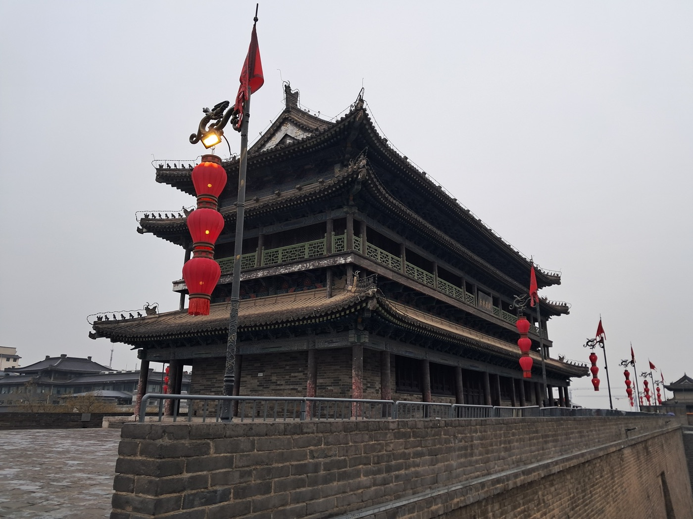
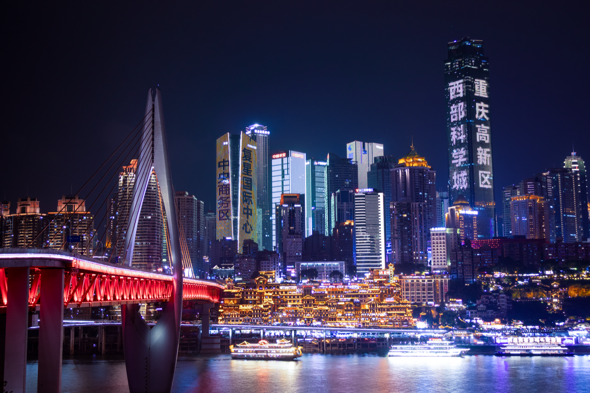
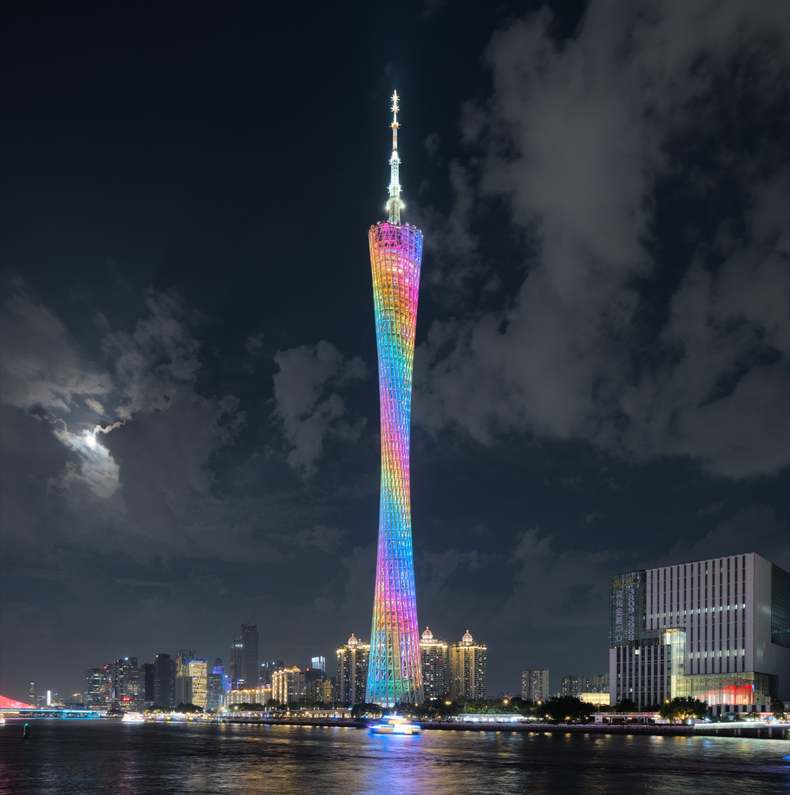
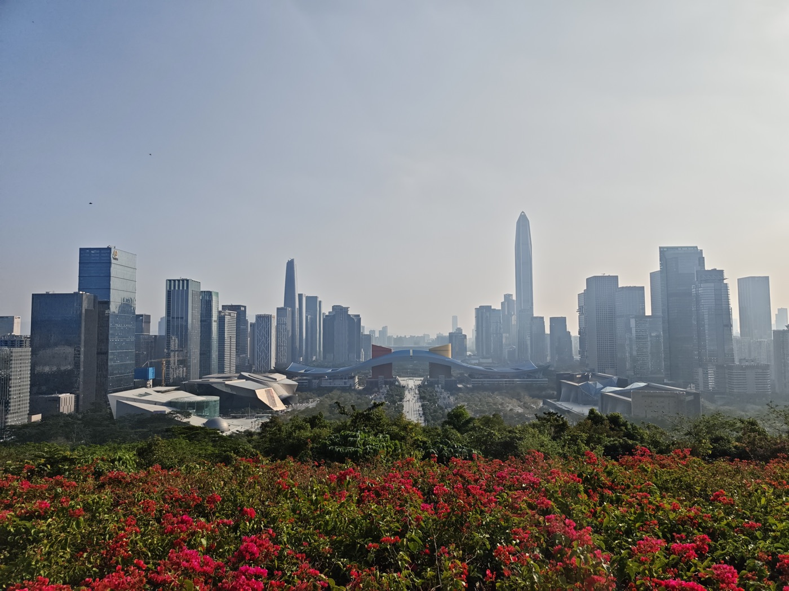
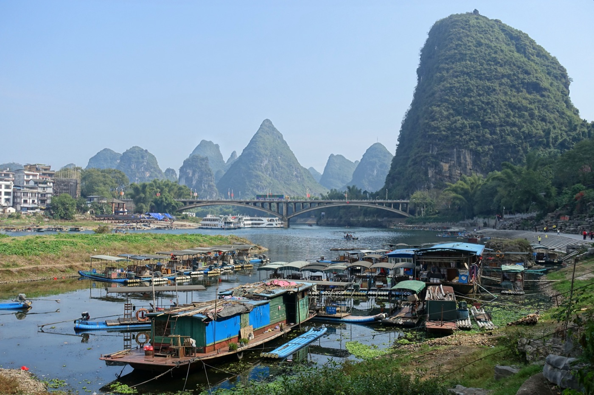

# 四 长途圈（5-7 小时）

五至七小时的高铁半径，标志着行旅版图从华东平原向广袤腹地的深刻延展。自杭州东站启程，铁轨穿越平原与丘陵，越过江河分水岭与秦岭山脉，直抵关中腹地（西安）、巴蜀盆地（成都、重庆）、岭南门户（广州、深圳）、西南山水画卷（桂林）、晋中高原（太原）、河洛古都（洛阳）以及赣江枢纽（南昌）。这一尺度的空间跨度，已超越单一周末的承载极限，行程规划宜以四至五日为基准，方能在从容起居中体味各大文明重镇与地理板块的深层肌理。

在座席配置层面，长途铁道旅程对身心状态提出了更高要求。连续五小时以上的乘坐极易产生身体疲惫，二等座的空间限制往往折损初抵目的地时的敏锐兴致；一等座虽具舒适度，但在长途奔波中仍显拘谨。商务座采用 1+2 布局，宽绰的独立空间与近乎平躺的调节功能，配合全程餐食与静谧氛围，使车厢转化为移动的起居室与休整书房。单程票价虽有一定溢价，但换取的是饱满充沛的精力与毫无损耗的行程体验。

班次规划以清晨早班直达列车为上选。清晨七时左右自杭州东站发车的黄金车次，多在午后一时前后抵埠，既能从容享用在地午餐，亦为下午留出半日的行游空间。此外，夕发朝至的动卧列车（D 字头）亦为不可忽视的优质选择：晚间八至九时发车，次日清晨抵埠，将漫长路途转化为安稳睡眠，兼具时间效率与旅途仪式感。行前建议于铁路 12306 预先核验班次，返程时亦需预留充足时间裕量，以确保从容衔接。

## 西安

{ width="640" .center }

作为十三朝古都与丝绸之路的东方起点，西安在华夏文明版图上占据着无可替代的枢纽地位。自西周丰镐、秦阿房宫、汉未央宫至唐长安城，层层叠压的文明遗存在这片关中沃土上留下了密度罕见的典章文物。城垣环抱之内，明代府城格局井然；城阙原野之上，秦陵兵马俑的写实雕塑至今仍具摄人心魄的力量。行旅西安，不在于走马观花地追逐图景，而在于沉入其深厚的历史肌理，于陶俑面容、汉唐遗宝与巍峨城垣之间，触摸文明演进的坚实脉搏。

关中气候四季分明，春秋短促而温和，冬夏温差显著。四月春和景明，古城墙畔新柳初发，樱花与古建交映生辉；十月秋高气爽，天宇澄澈，正是巡礼文博古迹与登高望远的黄金时节。盛夏七八月间气温较高，隆冬时节气候干燥，行游需合理规划室内展陈与户外参访节奏。

游憩周期以四至五日为宜：两日留予秦始皇帝陵与陕西历史博物馆，一日漫步明城墙、大雁塔与大明宫遗址，余下一至两日则可从容延展至临潼华清池或扶风法门寺。

### 高铁

杭州东站至西安北站设有数趟直达高速列车，行车时间约 5 小时 20 分至 6 小时，G1872、G1838 及 G1916 等早班车次为理想之选，建议优先选乘商务座以保持充沛体力。

夜间开行的动卧列车（如 D310、D314）晚间自杭州启程，次日清晨抵埠，适合希望最大化利用白天行程的行者。

抵西安北站后，可换乘城市轨道交通 2 号线或 14 号线接驳 4 号线便捷进城，约 40 分钟即可抵达钟楼核心商圈。

### 酒店推荐

### 西安赛瑞喜来登大酒店
**Sheraton Xi'an North City Hotel** · 未央北客站 · 携程 4.8 · ¥600

坐落于老城北门外，紧邻地铁 2 号线龙首原站，四站即可直达钟楼核心区。酒店设施维护良好，早餐出品扎实稳定。北向区位使其在前往西安北站及兵马俑等北线、东线景点时具备显著交通优势，动线流畅且性价比极高。

### 西安高新JW万豪酒店
**JW Marriott Hotel Xi'an Southwest** · 高新科技二路地铁站 · 携程 4.8 · ¥800

坐落于高新区核心商务区，地铁 6 号线直达。整体空间设计沉稳大气，客房宽敞且硬件配备考究，行政酒廊服务细致周到。适合偏好现代商务质感、兼顾商旅与深度游憩的宾客。

### 西安索菲特人民大厦
**Sofitel Legend People's Grand Hotel Xi'an** · 新城东新街 · 携程 4.7 · ¥1200

依托具有深厚历史底蕴的苏式老建筑群翻新落成，法式奢华雅致与近代建筑风貌相融互映。地处老城东新街，步行可达钟鼓楼与老城街区。其经典法餐厅与绿意庭院散发典雅的历史质感，适宜钟情近代人文风貌的行者。

### 西安威斯汀大酒店
**The Westin Xi'an** · 曲江大雁塔 · 携程 4.8 · ¥1000

坐落于曲江新区慈恩路，正对大雁塔南广场。客房坐拥大雁塔景观，傍晚凭窗眺望夕阳斜照塔刹，气象万千。酒店自带地下博物展馆，步行即达大唐不夜城与大慈恩寺，为曲江文化核心区的优质下榻之选。

### 西安W酒店
**W Xi'an** · 曲江池东路 · 携程 4.8 · ¥1500

坐落于曲江池畔，设计手法将盛唐气象的大胆意象与当代先锋美学融汇一体。公区视觉张力极强，室内恒温泳池与高品质餐饮体验独具特色。适合注重空间设计感与活力氛围的行旅者。

### 西安丽思卡尔顿酒店
**The Ritz-Carlton, Xi'an** · 高新区科技二路 · 携程 4.7 · ¥1800

坐落于高新区核心腹地，硬件设施典雅考究，服务细节延续丽思卡尔顿一贯的细致水准。客房尺度开阔，视野辽远。适合将酒店作为静心疗愈居所、追求极致服务品质的宾客。

### 西安浐灞艾美酒店
**Le Méridien Xi'an, Chanba** · 浐灞生态区 · 携程 4.6 · ¥700

坐落于浐灞生态区两河交汇处，临水而居，视野开阔。酒店拥有宽绰客房与高品质水疗设施，度假氛围静谧悠然。适合亲子度假或偏好远离闹市喧嚣的慢调旅居者。

### 行程

**三日（经典精粹）**：
- D1：早班列车抵埠，午后参访陕西历史博物馆，傍晚漫步大雁塔与曲江池。
- D2：全天专程探访秦始皇帝陵博物院（兵马俑）与华清池。
- D3：上午登临明城墙骑行，午后漫步老城历史街区，傍晚乘高铁返程。

**四日（文博深度，推荐）**：
- D1：午后抵埠，探访大明宫国家遗址公园与永兴坊。
- D2：全天探访秦始皇帝陵博物院与华清宫。
- D3：参访陕西历史博物馆（提前预约壁画馆与大唐遗宝展），傍晚明城墙环城漫步，晚间观赏大唐不夜城夜景。
- D4：上午寻访大雁塔、大慈恩寺或小雁塔西安博物院，午后品尝传统关中风味后返程。

**五日（全景通览）**：
在四日基础上，第四日安排扶风法门寺一日专线参访，深入领略盛唐皇家金银法器与地宫瑰宝。

### 景点详介

**秦始皇帝陵博物院（兵马俑）**

作为世界文化遗产，秦兵马俑坑以宏阔的军阵规模与精湛的写实技艺震撼世人。一号坑最为雄浑，数千件陶俑陶马按战阵排列，步兵、车兵错落有致，气势磅礴；二号坑为多兵种混编曲阵，出土有跪射俑等稀世珍品；三号坑则为统领全军的指挥枢纽。

参访时除三大俑坑外，切莫遗漏文物陈列厅内展出的秦陵彩绘铜车马。两乘铜车马以青铜铸造、金银错饰，构件精密、工艺精绝，堪称古代青铜铸造与机械加工工艺之巅峰。

参访须知：节假日客流密集，建议优先预约工作日清晨首批入园，并提前于官方渠道实名预约。参访全程宜预留 3 至 4 小时，午后可顺路接驳临潼华清池景区。

**陕西历史博物馆**

陕西历史博物馆典藏之宏富、品阶之高超，在全国文博机构中名列前茅。基本陈列以周、秦、汉、唐历史演进为脉络，系统呈现关中平原数千年文明精粹。镇馆瑰宝包括西汉皇后之玺、唐鎏金舞马衔杯纹银壶、兽首玛瑙杯及鎏金银竹节铜熏炉等。

除基本陈列外，特展"大唐遗宝：何家村窖藏出土文物展"与"唐代壁画珍品馆"不容错过。壁画馆集中展出章怀太子墓、懿德太子墓等唐代皇室墓葬壁画原件，线条生动、设色典雅，是领略大唐宫廷生活与绘画艺术的绝佳窗口。博物馆需提前通过官方小程序实名预约，建议预留半日静心品赏。

**大明宫国家遗址公园**

唐代大明宫为盛唐时期的政治中枢，其规制尺度远胜后世明清紫禁城。如今遗址公园完整保留了宏阔的宫城格局与夯土基址。伫立于含元殿高台之上，极目南望丹凤门轴线，盛唐宫阙的宏大空间尺度跃然眼前。建议入园后先至考古探索中心或展馆观赏数字还原纪录片，建立空间认知后再漫步遗址，黄昏夕照丹凤门之时尤显苍劲开阔。

**大雁塔与大慈恩寺**

大雁塔坐落于大慈恩寺内，始建于唐永徽三年（652 年），为玄奘法师为保存由天竺取回之经卷佛像而亲自主持修造。七层砖塔古朴巍然，融合了中原传统木构楼阁形式与印度窣堵坡塔型特征。寺内古木参天，幽静肃穆。塔南的大唐不夜城在入夜后华灯齐放，仿唐街区与演艺活动交织，展现出现代都会重构盛唐图景的热烈氛围。

**明代府城墙**

西安城墙周长 13.74 公里，是我国现存规模最大、保存最完整的古代府城城垣体系。城顶宽阔平坦，护城河、吊桥、闸楼、箭楼、正楼与角楼构筑起严密的古代城防网络。

租借自行车作环城骑行是品读这座古城空间肌理的绝佳方式。最佳时段为傍晚日落前后，自南门（永宁门）登城，夕阳斜照女儿墙与雉堞，暮色四合时城楼红灯次第亮起，古城内外新旧图景于车轮流转间徐徐展开。

**华清宫与骊山**

华清宫坐落于临潼骊山北麓，自周秦汉唐皆为皇家温泉行宫，以唐玄宗与杨贵妃的游居胜迹名垂史册。园内完好保存了唐代海棠汤、莲花汤等皇家温泉遗址，兼具 1936 年西安事变历史现场（五间厅）。后山骊山绿树葱茏，索道可直达半山兵谏亭。晚间于九龙湖畔上演的大型实景历史舞剧《长恨歌》，借助现代声光电与真实山水背景，生动再现盛唐气象与历史悲欢，艺术水准极高。

**法门寺**

法门寺坐落于宝鸡扶风县，始建于东汉，被誉为"关中塔庙之祖"。1987 年法门寺唐代地宫考古发掘，出土了释迦牟尼佛指真身舍利以及数千件唐代皇室供奉的稀世珍宝，涵盖成组的金银法器、秘色瓷器与华丽丝绸，全面展现了盛唐皇家密宗佛教仪轨与手工业巅峰水准。法门寺博物馆典藏价值无可估量，专程一日参访极具精神与审美震撼。

### 吃

- **老孙家泡馍 / 同盛祥**：关中清真泡馍百年老字号，羊肉汤醇厚浓郁，手工掰馍细致入微，煮就后汤汁与馍粒交融，鲜香适口。
- **樊记腊汁肉夹馍（竹笆市店）**：传统腊汁肉选料精良、文火慢煨，白吉馍外皮焦脆、内层绵软，肉质肥不腻口、瘦不塞齿。
- **永明岐山面**：正宗西府风味，面条细长筋道，臊子鲜香酸辣，汪油覆面，酸辣回甘。
- **西安饭庄**：传统陕菜代表名店，葫芦鸡皮酥肉嫩、筷触骨离，温拌腰丝刀工精细、脆嫩清爽。
- **大皮院老白家羊肉小炒**：回坊地道小炒泡馍代表，酸辣鲜香、镬气十足。
- **天下第一面**：传统手工 biangbiang 面与裤带面，油泼辣子香气四溢。

### 最佳季节

4 月春暖花开、城墙绿意盎然，10 月秋高气爽、能见度优良，为行游西安的最佳时节。盛夏 7 至 8 月高温炎热，隆冬 12 至 2 月气候干燥偏冷，出行宜避开极端气候区间。

## 成都

{ width="640" .center }

作为天府之国的核心，成都以其舒缓从容的城市节律与深厚繁复的文化层次见长。自古蜀三星堆与金沙的奇崛文明、三国蜀汉之君臣际会，至唐宋杜甫、薛涛之文脉流风，历史在此层层积淀。当代都会的时尚街区与千年古刹大慈寺比邻而居，茶社市井与深厚文博相互浸润，极适宜以四至五日的慢节奏从容品读。

成都地处四川盆地腹地，气候常年温和湿润，多阴云而少烈日。春秋两季最为舒爽怡人：四至五月春和景明，九至十月秋色宜人。盛夏七八月间虽有闷热，但林木苍翠；隆冬时节气温多在五至十度之间，湿冷感明显。

行程规划建议四至五日起步：两日流连于市内武侯祠、杜甫草堂、文殊院与文博场馆；一日专程探访广汉三星堆博物馆；余下一日则可前往都江堰与青城前山，领略古代水利工程与道家名山胜境。

### 高铁

杭州东站至成都东站开行有数趟直达高铁，以 G1976、G1370 等车次最为快捷，运行时间约 6 小时 40 分至 7 小时余。长途旅程建议优先选择商务座，确保旅途舒适度。

抵集成都东站后，无缝接入城市轨道交通 2 号线、7 号线与 18 号线，约 15 至 20 分钟即可抵达市中心春熙路与天府广场商圈。

### 酒店推荐

### 成都博舍
**The Temple House** · 太古里大慈寺旁 · 携程 4.8 · ¥2500

依托清代笔帖式衙门古建修缮落成，紧邻千年古刹大慈寺与太古里街区。古朴典雅的砖雕门楼与四合天井同当代低密建筑相得益彰，庭院深幽，设计审美卓越。下榻于此，既能静享古建庭院的幽静，又能直通繁华商圈，为成都独具文化质感的奢华居停之所。

### 成都瑞吉酒店
**The St. Regis Chengdu** · 锦江春熙路核心 · 携程 4.7 · ¥2000

坐落于市中心春熙路核心腹地，交通动线极为顺畅，步行数分钟即达太古里与地铁 2 号线。酒店延续瑞吉标志性的管家服务与典雅硬件水准，客房尺度开阔，视野辽远，为市内出行与商务宴请的稳妥之选。

### 成都JW万豪酒店
**JW Marriott Hotel Chengdu** · 锦江天府广场东御街 · 携程 4.7 · ¥1500

坐落于天府广场东侧，紧邻地铁 2 号线天府广场站。前往春熙路、太古里或宽窄巷子均十分便捷。客房宽绰整洁，行政酒廊服务细致，兼顾商务办公与城市漫游动线需求。

### 成都丽思卡尔顿酒店
**The Ritz-Carlton, Chengdu** · 青羊顺城大街 · 携程 4.7 · ¥2200

坐落于顺城大街，俯瞰天府广场核心景致。酒店内部装饰典雅，27 层酒廊坐拥城市天际线视野，下午茶出品精湛，服务品质稳定细致，适合追求静谧品质的行者。

### 成都W酒店
**W Chengdu** · 金融城 · 携程 4.7 · ¥1800

坐落于城南金融城商圈，设计风格前卫大胆，充满现代艺术张力与活力氛围。公区配套与室内恒温泳池极具视觉表现力，适合钟情现代设计与年轻都会气息的住客。

### 行程

**三日（核心精粹）**：
- D1：午后抵埠，漫步武侯祠与锦里街区。
- D2：清晨参访成都大熊猫繁育研究基地，下午探访杜甫草堂与宽窄巷子。
- D3：上午漫步太古里、大慈寺或文殊院，午后品尝川式点心后返程。

**四日（文博古蜀，推荐）**：
- D1：午后抵埠，游览武侯祠与大慈寺。
- D2：清晨前往大熊猫基地，下午游赏杜甫草堂与望江楼公园。
- D3：全天专程搭乘城际高铁前往广汉，深入参访三星堆博物馆新馆。
- D4：上午漫步文殊院享用早茶，游览宽窄巷子后返程。

**五日（全景天府）**：
在四日基础上，第四日安排都江堰水利工程与青城前山一日专线，第五日漫步太古里与四川大学望江校区后返程。

### 景点详介

**武侯祠与惠陵**

武侯祠肇始于蜀汉章武元年（221 年）刘备惠陵修建之时，后与诸葛亮祠合祀，成为我国唯一的君臣合祀祠庙。整座祠庙依中轴线层层递进，大门、二门、刘备殿、过厅与诸葛亮殿气韵庄严。东西偏殿内塑有文臣武将 28 尊彩绘塑像，生动刻画了三国蜀汉的群英风貌。祠内惠陵红墙竹影夹道，曲径通幽；过厅所立岳飞手书《出师表》石刻，金石气劲，令人叹为观止。

出祠即为锦里街区，依托清末民初川西民居风貌构建。建议傍晚时分游览，红灯初上、游人如织，亦可顺路观赏川剧变脸等传统非遗演艺。

**杜甫草堂**

唐代宗宝应元年（760 年），诗人杜甫为避安史之乱流寓成都，于浣花溪畔营建茅屋结庐而居，在此寓居近四年并作诗二百四十余首。如今的草堂是在后世屡次修葺扩建中形成的川西古典园林。

草堂之内古木参天，幽篁修竹掩映着茅屋故居、工部祠与诗史堂。浣花溪水环绕其间，亭台廊庑疏朗有致，兼具江南园林的灵秀与蜀地山林的深幽。清晨信步于古楠竹林与石板小径之间，静心品读碑廊诗刻，最能领略杜陵草堂的古朴与宁静。

**宽窄巷子**

宽窄巷子由宽巷子、窄巷子与井巷子三条平行的清代老街及四合院落群组成，为成都少城历史文化街区的完整留存。街区保留了北方四合院形制与川西民居穿斗构架交融的独特建筑风貌，砖雕门头古朴精美。

参访建议选在清晨游人尚稀之时，漫步于清幽街巷，于沿街老茶馆泡一碗盖碗绿茶，在光影婆娑中体会老成都的起居节奏。

**太古里与大慈寺**

成都太古里展现了当代商业街区与历史古迹共生的卓越设计范例。街区保留了始建于魏晋、盛于唐宋的千年古刹大慈寺，四周以灰瓦坡顶、低密通透的当代建筑群落巧妙环抱，使传统川西民居构架与现代轻盈钢玻材质和谐对话。

大慈寺内香烟袅袅、古柏森森，寺外则是当代先锋设计与高端风尚的汇聚地。地下的方所书店以藏经阁为灵感构筑空间，宏阔沉静，极具空间美感。

**大熊猫繁育研究基地**

作为大熊猫迁地保护与繁育科研的核心机构，基地模拟大自然生态环境，绿竹成荫，溪流错落。园内规划有太阳产房、月亮产房及各年龄段大熊猫活动区。

参访宜于清晨开园时分（7:30-8:30）入内，此时大熊猫进食与户外活动最为活跃，气候凉爽宜人。建议乘园区电瓶车规划动线，预留半日时间游赏。

**三星堆博物馆（广汉）**

三星堆古蜀文明遗址距今约 3000 至 4500 年，其考古发现改写了华夏文明起源的传统叙事。2023 年落成开放的新馆展陈宏大，系统展出了祭祀坑出土的数千件稀世青铜器、金器与玉石器。

高达近四米的青铜神树、造型奇崛的青铜纵目面具、神态庄严的青铜大立人像以及巧夺天工的黄金面罩，展现出与中原礼器迥然相异的奇幻艺术语言与高超铸造技艺。自成都东站乘城际高铁至广汉北站仅需约 20 分钟，出站转乘接驳车即可抵达，建议安排全天深入品读这一人类早期青铜文明的奇迹。

**都江堰与青城山**

战国时期秦国蜀郡太守李冰父子于公元前 256 年主持修筑都江堰水利工程，巧借岷江出山口地形与水势，开创了无坝引水的千古工程奇迹。工程由鱼嘴分水堤、飞沙堰溢洪道与宝瓶口引水口三大主体构成，乘势利导，历经两千余年仍润泽着整个成都平原。二王庙与秦堰楼依山临江，为俯瞰渠首全景的极佳位置。

相距不远的青城山为中国道教发祥地之一，前山林木葱翠、诸峰环峙，天师洞、上清宫与老君阁掩映于苍松翠竹之间，素有"青城天下幽"之盛誉。自成都西站乘城际列车约 30 分钟即可抵达都江堰站，两者串联一日游赏，节奏充实完满。

**文殊院与望江楼公园**

文殊院为清代康熙年间重修的著名禅宗丛林，殿堂廊庑规整深严，院内香客云集，茶社绿树浓荫。清晨入内品茗闻香，最得蜀中市井清雅真趣。

望江楼公园依锦江而建，为纪念唐代女诗人薛涛的胜地。园内耸立着高逾三十米的清代名楼望江楼，并荟萃了来自海内外的百余种名竹，翠竹夹道、清幽雅致，漫步其间怡然自得。

### 吃

- **陈麻婆豆腐（青华路总店）**：传统麻婆豆腐祖庭，选用优质牛肉末与特制豆瓣，麻、辣、鲜、香、烫、脆、嫩俱全，浇汁拌饭风味浓郁。
- **马旺子川菜 / 皇城老妈**：经典川味代表，毛血旺、蒜泥白肉与传统宫保鸡丁火候精到、味型醇厚。
- **正宗成都火锅**：选用厚重纯牛油锅底与新鲜毛肚、黄喉、鹅肠，麻辣鲜香、底蕴深厚。
- **甘记肥肠粉**：传统手工鲜粉搭配浓郁骨汤与煨透肥肠，辅以油炸锅盔，为地道成都早餐风味。
- **龙抄手 / 钟水饺**：经典成都面点，红油水饺皮薄馅嫩、甜辣回甘，原汤抄手鲜美爽滑。

### 最佳季节

4 至 5 月春意正浓、气候温和，9 至 10 月秋高气爽、少雨宜游，为造访成都的黄金时令。盛夏 7 至 8 月天气湿热，隆冬 1 至 2 月阴冷潮湿，建议错峰前往。

## 重庆

{ width="640" .center }

作为坐落于长江与嘉陵江交汇处的山城，重庆展现出独具一格的立体城市肌理与宏阔的江山气象。整座城市依山就势、层叠而建，高耸的吊脚楼阁、飞跨大江的索道与穿楼而过的轻轨构筑出交错立体的空间体验。深厚的巴渝文化、近现代抗战陪都风云与三峡水运文明在此交汇，赋予这座都会豪迈坚韧的性格与热烈蓬勃的烟火气象。

重庆属亚热带季风性湿润气候，常年雾霭氤氲。秋季 10 至 11 月天高气爽、江面视野清晰，春季 4 月气候宜人，均为适宜游历的黄金时段。盛夏 7 至 8 月气温常超 38 度，出行宜避开日间暴晒；冬季阴云多雾，江岸景色略显苍茫。

行程规划以三至四日为宜：两日深度探访渝中半岛、三峡博物馆、山城步道与两江夜景；一日前往大足石刻领略世界文化遗产的摩崖雕刻艺术；若时间充裕，亦可安排武隆天生三桥一日专线。

### 高铁

杭州东站至重庆北站或重庆西站开行有数趟直达高铁，以 G2891、G53 等车次为主，全程约 6 至 7 小时。长途乘坐建议选用商务座，以保障充沛精力。

抵达重庆北站或重庆西站后，可经由城市轨道交通 10 号线、环线等快速接入市中心解放碑或江北嘴商圈。

### 酒店推荐

### 重庆JW万豪酒店
**JW Marriott Hotel Chongqing** · 渝中解放碑 · 携程 4.6 · ¥1500

坐落于渝中区民生路，地处解放碑核心商圈，步行数分钟即可抵达长江索道与核心商业街区。客房空间宽敞，行政酒廊服务周到，前往渝中半岛主要人文景观动线极为顺畅。

### 重庆解放碑威斯汀酒店
**The Westin Chongqing Liberation Square** · 渝中解放碑 · 携程 4.6 · ¥1200

坐落于解放碑繁华中心，高层客房坐拥俯瞰渝中半岛与城市夜景的极佳视野。酒店延续威斯汀标志性床品水准，地理区位优越，步行即可通达洪崖洞与两江游船码头。

### 重庆喜来登酒店
**Sheraton Chongqing Hotel** · 南岸南滨路 · 携程 4.5 · ¥900

坐落于南岸区南滨路双子塔，正对长江与渝中半岛天际线。客房江景视野极为开阔，夜间凭窗眺望两江灯火与对岸洪崖洞全景，气象万千，适合偏好临江景观的行者。

### 行程

**三日（山城精粹）**：
- D1：午后抵埠，乘坐长江索道俯瞰江景，漫步解放碑商圈，晚间于千厮门大桥观赏洪崖洞与两江夜景。
- D2：上午探访山城第三步道与鹅岭二厂，下午参访重庆中国三峡博物馆与人民大礼堂，晚间前往南滨路品尝地道老火锅。
- D3：上午漫步弹子石老街眺望两江交汇，午后乘高铁返程。

**四日（文博石刻，推荐）**：
在三日基础上，第三日专程安排大足石刻一日往返，深入品鉴宝顶山摩崖造像群。

**五日（全景山川）**：
在四日基础上，第四日前往武隆天生三桥，领略喀斯特峡谷与天生石桥奇观。

### 景点详介

**洪崖洞与两江夜景**

洪崖洞坐落于嘉陵江畔峭壁之上，依托传统巴渝吊脚楼建筑风貌依山叠翠而建。主楼高达十一层，错落有致。每当夜幕降临、华灯初上，整座建筑群金辉熠熠，倒映于嘉陵江清波之中，与对岸江北嘴现代建筑天际线交相辉映。

观赏拍摄的绝佳机位位于千厮门嘉陵江大桥人行道与对岸江北嘴亲水平台，凭栏远眺，江风拂面，江轮穿梭，最能领略山水都会的流光溢彩。

**解放碑与长江索道**

抗战胜利纪功碑（解放碑）矗立于渝中半岛中心，为全国唯一的抗战胜利纪念碑，见证了近现代重庆的岁月沧桑。

相距不远的长江索道被誉为"万里长江第一条空中走廊"，原为市民跨江通勤工具，如今成为俯瞰长江与两江半岛立体景致的标志性体验。乘坐索道轿厢凌空飞渡大江之上，脚下滚滚江流与两岸高楼峭壁扑面而来，立体山城的空间感震撼非凡。

**重庆中国三峡博物馆与人民大礼堂**

三峡博物馆坐落于渝中区人民广场西侧，与庄严典雅的重庆人民大礼堂隔街相望。馆内系统收藏并展出了巴蜀古代青铜文明、汉代画像砖、三峡库区抢救性考古发掘文物以及抗战陪都时期的珍贵历史文献与物证。

重点展厅包括"壮丽三峡""远古巴渝"与"抗战岁月"，全方位勾勒出长江上游文明的演进历程与近代历史风云。展馆需提前实名预约，建议预留半日时间静心观赏。

**大足石刻（宝顶山与北山）**

作为世界文化遗产，大足石刻代表了公元 9 至 13 世纪中国石窟艺术的巅峰水平，与敦煌、云冈、龙门齐名。造像群以宝顶山与北山最为宏大集中。

宝顶山摩崖造像由南宋名僧赵智凤主持开凿，以连环画形式将深奥的佛学义理具象化呈现，构思精巧、规模恢宏。其代表作**千手观音**造像历经数年科学修缮，金光璀璨、仪态万千；长达三十一米的释迦涅槃圣迹图（卧佛）半身入石、庄严静穆。自重庆北站乘高铁至大足南站约 50 分钟，转乘接驳专线即可抵达，为研习宋代摩崖雕塑艺术的必访殿堂。

**武隆天生三桥**

武隆天生三桥为世界自然遗产核心组成部分，展现了罕见的喀斯特地貌奇观。天龙桥、青龙桥与黑龙桥三座平均高度逾两百米的天然石拱桥，横跨于幽深的峡谷天坑之上，气势磅礴。徒步于峡谷底部，仰观绝壁千仞、飞瀑流泉，地质演化的宏大尺度令人深感敬畏。

**山城第三步道**

山城步道依渝中半岛悬崖峭壁而建，串联起领事巷、法国仁爱堂旧址、抗战时期悬空栈道与老式吊脚楼民居。漫步其间，青石阶梯蜿蜒起伏，古树老藤依附崖壁，江面视野开阔，为探寻老重庆市井风貌与近现代历史痕迹的经典漫步线路。

### 吃

- **传统重庆老火锅**：选用厚重九宫格牛油锅底与老姜、花椒熬制，鲜毛肚七上八下、鸭肠爽脆可口，风味醇厚热烈。
- **重庆小面**：以手工细碱面搭配油泼辣子、花椒面、芽菜与浓郁骨汤，麻辣鲜香、劲道爽滑。
- **地道江湖菜**：歌乐山辣子鸡辣椒成堆、鸡丁干香酥脆，太安鱼与来凤鱼滑嫩鲜辣、镬气十足。
- **山城小汤圆**：皮薄馅滑、香甜软糯，为解辣舒心的传统甜食。

### 最佳季节

10 至 11 月秋高气爽、江面视野澄澈，4 月春意盎然，为行游重庆的最佳时节。盛夏 7 至 8 月酷暑炎热，隆冬时节多阴云冷雾，出行宜避开极端气候区间。

## 广州

{ width="640" .center }

作为岭南文化中心与两千余年未曾中断的海上丝绸之路发祥门户，广州展现出深厚的人文底蕴与极具层次的城市肌理。自东山口沉静典雅的近代红砖洋楼、西关连绵延展的骑楼老街，到沙面风貌完备的近代欧式建筑群，乃至珠江新城现代主义地标天际线，历史与当代的空间形态在此层叠铺展。加之讲求食材本味与火候功夫的广府饮食哲学，使广州成为适宜以三至五日深度漫游的南国重镇。

广州属亚热带季风气候，常年温暖湿润。秋冬时节（10 至 12 月）天朗气清、微风和煦，早春 3 月草木蔓发，均为宜人出行季。盛夏 6 至 9 月气温较高且多阵雨台风，隆冬时节气温多在 15 度左右，体感依然舒爽。

行程规划以三至四日为宜：两日留予越秀古城文脉、沙面建筑群与西关骑楼老街，一日体验珠江新城现代中轴与文博场馆，余下一日则可前往佛山祖庙或顺德品味岭南广府风物。

### 高铁

杭州东站至广州南站开行有多趟直达高速列车，以 G99、G2381 等早班车次为主，运行时间约 6.5 至 7 小时，建议优先选乘商务座以保持旅途从容。

此外，夜间开行的动卧列车（如 D923、D917）晚间自杭州出发，次日清晨抵达广州南站，有效节省白天时间与住宿成本。

抵达广州南站后，无缝换乘城市轨道交通 2 号线或 22 号线，约 30 分钟即可抵市中心天河区或越秀老城区。

### 酒店推荐

### 广州丽思卡尔顿酒店
**The Ritz-Carlton, Guangzhou** · 珠江新城 CBD · 携程 4.7 · ¥2000

坐落于珠江新城核心中轴线上，部分客房正对广州塔与珠江夜景。酒店服务细致周到，毗邻广东省博物馆与花城广场，步行可达太古汇商圈。兼具景观视角与优越动线，为商务宴请与度假居停的高品质之选。

### 广州JW万豪酒店
**JW Marriott Hotel Guangzhou International Financial City** · 天河国际金融城 · 携程 4.7 · ¥1800

坐落于天河区国际金融城，临近地铁 6 号线。客房尺度开阔，行政酒廊出品精良，硬件设施现代考究，适合偏好安静商务氛围与万豪体系礼遇的宾客。

### 广州正佳广场万豪酒店
**Guangzhou Marriott Hotel Tianhe** · 天河路 228 号正佳广场 · 携程 4.6 · ¥1300

坐落于天河路商圈正佳广场塔楼，直通大型购物中心，紧邻地铁 1 号线、3 号线与 5 号线体育西路站。客房空间规整宽敞，餐饮及购物配套极其便利，为结合购物与城市漫游的优选。

### 广州 W 酒店
**W Guangzhou** · 珠江新城珠江边 · 携程 4.7 · ¥2000

坐落于珠江新城珠江沿线，紧邻广东省博物馆与花城广场。酒店设计融入大量前卫艺术与岭南意象，高区客房坐拥江景，室内恒温泳池与水疗配套独具特色，适合偏好当代风尚设计的行者。

### 广州海航威斯汀酒店
**The Westin Guangzhou** · 天河北林和中路 · 携程 4.6 · ¥1500

坐落于天河北商圈，紧邻中信广场，步行可达广州东站及地铁 1 号线、3 号线。客房配备标志性天梦之床，整体服务稳健扎实，适合依托广州东站出行的商务与漫游住客。

### 广州广交会威斯汀酒店
**The Westin Pazhou** · 海珠琶洲广交会 C 区 · 携程 4.7 · ¥1300

坐落于海珠区琶洲展馆核心区，地铁 8 号线琶洲站步行可达，为唯一通过连廊直达展馆的高端酒店。高层客房坐拥开阔珠江景观，硬件设施新颖，适宜以琶洲及海珠区为出行重心的宾客。

### 广州粤海喜来登酒店
**Sheraton Guangzhou Hotel** · 天河体育中心 · 携程 4.7 · ¥1200

坐落于天河体育中心旁，地处地铁 1 号线与 3 号线交汇枢纽。由此前往珠江新城、越秀老城及荔湾西关均十分便捷，交通辐射力强，适合注重轨道交通通达性的行者。

### 广州白天鹅宾馆
**White Swan Hotel Guangzhou** · 沙面岛 · 携程 4.7 · ¥1500

坐落于历史名胜沙面岛白鹅潭畔，1983 年落成，为我国首批涉外五星级酒店之一。大堂内著名的"故乡水"室内景观承载着城市历史记忆。临江客房推窗即揽白鹅潭江景与沙面林荫欧式建筑。酒店早茶与粤菜烹饪享有极高盛誉，是品味老广派风华的经典居停之所。

### 广州花园酒店
**Garden Hotel Guangzhou** · 环市东路 · 携程 4.6 · ¥1000

坐落于环市东路，开业于 1985 年，融合了大型岭南园林中庭与经典建筑风格。酒店早茶与传统粤菜深受本地居民青睐，典雅庄重的老派名店气质保留完好，地铁 5 号线可直达老城各处。

### 广州文华东方酒店
**Mandarin Oriental, Guangzhou** · 天河太古汇 · 携程 4.6 · ¥2200

坐落于天河太古汇内，由知名设计师季裕棠操刀室内设计。水疗中心与米其林星级餐厅享誉华南，服务细节优雅克制，为追求精致餐饮与奢华旅居体验的顶级居停之选。

### 行程

**三日（经典广府）**：
- D1：午后抵埠，漫步沙面近代建筑群与陈家祠，晚间登船夜游珠江。
- D2：上午探访越秀公园五羊石像与广州博物馆（镇海楼），午后参访广东省博物馆，傍晚登上广州塔俯瞰珠江夜景。
- D3：清晨于老字号茶楼享用传统早茶，漫步永庆坊西关骑楼老街，午后返程。

**四日（文博与岭南延展，推荐）**：
在三日基础上，第三日专程安排佛山祖庙与顺德美食一日游，第四日上午漫步东山口民国洋楼街区与海心沙广场后返程。

**五日（全景岭南）**：
在四日基础上，安排江门开平碉楼群一日专线参访，深入品鉴中西合璧的近代乡土建筑奇观。

### 景点详介

**沙面与白鹅潭**

沙面坐落于荔湾区珠江白鹅潭北岸，近代曾为英法租界。岛上完整保留了百余栋近代西洋建筑，涵盖领事馆、海关洋行、教堂与银行旧址，新古典主义、折衷主义与巴洛克式立面在百年古樟与榕树掩映下错落有致。

漫步于露德天主教圣母堂、旧汇丰银行与白天鹅宾馆滨江绿廊，江风轻拂、幽静宜人。建议于傍晚日落时分造访，斜阳映照花岗岩廊柱与开阔江面，尽显典雅从容的历史风貌。

**陈家祠（陈氏书院）**

陈氏书院建于清光绪十四年至十九年（1888-1893 年），由广东七十二县陈姓宗族合资兴建，现为广东民间工艺博物馆所在地。

整座建筑堪称岭南传统民间建筑装饰艺术的集大成者。书院广泛运用了木雕、砖雕、石雕、陶塑、灰塑、铁铸与彩绘等精湛工艺，屋脊之上密布生动的石湾戏曲人物陶塑，梁枋隔扇雕刻层次繁复，工艺密度极为罕见，为领略岭南传统营造技艺的殿堂级胜迹。

**越秀公园与镇海楼**

越秀山为广州古城文脉之起点。"五羊石像"矗立于山顶，生动呈现了五仙骑五色羊持谷穗降临羊城的古老传说。

园内耸立的镇海楼始建于明洪武十三年（1380 年），巍峨五层、红墙绿瓦，为广州现存最完备的明代古城楼，现为广州博物馆所在地。登临楼顶凭栏远眺，古城老街与现代天际线尽收眼底。园内尚存明代古城墙遗址与古炮台，山林郁郁葱葱，适宜半日漫步寻幽。

**永庆坊与西关骑楼**

永庆坊坐落于荔湾区恩宁路核心地带，为西关传统历史街区有机更新的成功范例。街区完好保留了岭南特有的骑楼建筑与麻石板巷道肌理，汇聚了粤剧艺术博物馆、李小龙祖居等文化节点。

粤剧艺术博物馆依岭南传统园林形制构筑，水榭戏台清秀雅致。建议傍晚时分漫步其间，小桥流水与骑楼街灯交相辉映，既有传统西关的市井温情，又富现代创意活力。

**广东省博物馆与广州塔**

广东省博物馆新馆坐落于珠江新城花城广场东侧，建筑形态宛如悬浮的珍宝木盒。馆内基本陈列以广东历史文化、潮州金漆木雕、广彩外销瓷及海洋丝绸之路遗存为核心，展陈现代且脉络清晰。

相距不远的广州塔（小蛮腰）高达 600 米，以其独特的扭转纤细腰身矗立于珠江南岸。登上观光平台，珠江两岸璀璨的都会夜景尽在俯瞰之中；若不上塔，于海心沙广场或海心桥漫步亦可捕捉现代中轴线的宏阔气象。

**广式早茶文化**

广式早茶是体味广州起居文化与人情温度的核心仪式。"一盅两件"的传统延续至今，亲友围坐一席，泡一壶浓醇普洱或铁观音，细细品味蒸笼中热气腾腾的点心。

参访宜于清晨 8 至 10 时前往陶陶居、白天鹅宾馆玉堂春暖或北园酒家。经典点心涵盖晶莹剔透的虾饺皇、酱香浓郁的豉汁蒸排骨、皮薄馅嫩的烧卖、酥香适口的蜜汁叉烧包与顺滑鲜爽的布拉肠粉，从容享受粤式慢调生活。

### 吃

- **陶陶居 / 莲香楼 / 广州酒家**：百年广式早茶老字号，手工虾饺、叉烧包与时令茶点传承地道技艺。
- **炳胜品味 / 炳胜公馆**：新派粤菜代表，脆皮烧鹅皮脆肉嫩、汁水丰盈，豉油皇乳鸽与冷水猪肚风味独具。
- **白天鹅宾馆玉堂春暖**：米其林一星餐厅，经典葵花鸡、沙湾姜埋奶与手工点心达到粤菜顶级水准。
- **地道生滚粥与肠粉**：选用新鲜及第料、鲜虾或牛肉，米粥熬至浓稠如浆，鲜香温润。
- **传统西关甜品**：双皮奶、姜撞奶与红豆沙，奶香浓郁、细腻滑润。

### 最佳季节

10 至 12 月秋高气爽、干爽温和，3 月早春花开，为漫游广州的黄金时令。盛夏 6 至 9 月多高温台风，出行宜作室内文博与早茶漫步结合规划。

## 深圳

{ width="640" .center }

作为改革开放四十余年城市化进程的先锋标本，深圳以其高密度的现代主义建筑群落、滨海生态绿廊与活跃的当代设计文化见长。自福田 CBD 宏阔的城市中轴天际线、华侨城充满艺术活力的创意园区，到大鹏半岛保存完好的明代海防卫所，深圳展现出独特的时代活力与多元包容的都会风貌。此外，依托广深港高铁形成的深港双城极速互联，更拓展了跨境行旅的丰富维度。

深圳属亚热带海洋性季风气候，全年温和湿润。秋冬时节（10 至 12 月）天朗气清、海风轻拂，春季 3 月气候温和，为漫游深圳的黄金时段。盛夏 6 至 9 月气温较高且多阵雨台风，户外出行需注意防暑与防雨。

行程规划以三至四日为宜：两日留予市内现代建筑中轴、文博场馆与华侨城创意园区；一日依托高铁便捷往返香港西九龙；若时间充裕，亦可安排大鹏所城与大鹏半岛海滨一日寻幽。

### 高铁

杭州东站至深圳北站或深圳福田站开行有直达高速列车，全程运行约 7 小时，建议优先选乘商务座以保持充沛精力。

夜间开行的动卧列车（如 D923）夕发朝至，运行约 11 小时，清晨抵埠后即可展开全天行程，兼具时间利用效率与舒适度。

抵深圳北站后，可经由城市轨道交通 4 号线、5 号线或 6 号线快速通达全城。

### 酒店推荐

### 深圳大中华喜来登酒店
**Sheraton Shenzhen Futian Hotel** · 福田 CBD 中心 · 携程 4.8 · ¥1200

坐落于福田核心商务区，紧邻地铁 3 号线与 4 号线会展中心站，步行数分钟即可抵达市民中心与会展中心。酒店硬件设施维护完备，餐饮出品稳定扎实，兼具优越的中心区位与顺畅的出行交通。

### 深圳瑞吉酒店
**The St. Regis Shenzhen** · 罗湖金融中心京基 100 大楼 · 携程 4.8 · ¥2200

坐落于罗湖区京基 100 大厦 75 至 100 层，为全球瞩目的高空奢华酒店之一。96 层空中大堂可俯瞰深圳都会天际线与香港群山景致，28 米室内高空无边际恒温泳池视野非凡。酒店延续瑞吉经典的管家服务，临近罗湖口岸与大剧院地铁站，为体验云端居停与通关赴港的优选。

### 深圳宝安瑞吉酒店
**The St. Regis Shenzhen Bao'an** · 宝安前海湾 · 携程 4.8 · ¥2000

坐落于前海湾畔核心高楼，高区客房面朝前海湾与珠江口，视野浩瀚辽阔。酒店硬件配备考究，下午茶与水疗水准卓越，适合偏好开阔湾景与奢华度假质感的行者。

### 深圳文华东方酒店
**Mandarin Oriental, Shenzhen** · 蛇口太子湾 · 携程 4.7 · ¥2500

坐落于蛇口太子湾，俯瞰深圳湾浩瀚海景。酒店室内设计典雅考究，水疗中心与高级餐饮水准处于华南第一梯队。下榻于此可尽享蛇口滨海休闲街区配套，为追求极致品味与水疗休整的顶级居停之选。

### 深圳金茂JW万豪酒店
**JW Marriott Hotel Shenzhen** · 福田深南大道 · 携程 4.7 · ¥1800

坐落于深南大道车公庙商圈，轨道交通四通八达。客房宽绰舒适，行政酒廊服务细致，由此前往深圳湾口岸或蛇口街区动线顺畅，兼顾商务办公与城市深度游览需求。

### 深圳星河丽思卡尔顿酒店
**The Ritz-Carlton, Shenzhen** · 福田 CBD · 携程 4.7 · ¥2200

坐落于福田核心区，紧邻会展中心与市民中心。酒店服务水准严谨细致，客房陈设典雅沉稳，为追求经典尊贵服务与中心区位的稳妥之选。

### 深圳益田威斯汀酒店
**The Westin Shenzhen Nanshan** · 南山益田假日广场 · 携程 4.6 · ¥1000

坐落于南山区益田假日广场，直通购物中心与地铁 1 号线、2 号线世界之窗站。客房配备天梦之床，前往华侨城创意园与欢乐海岸极为便捷，适合注重周边生活配套与家庭漫游的宾客。

### 行程

**三日（都会与深港双城）**：
- D1：午后抵埠，探访福田市民中心中轴线，傍晚登莲花山顶俯瞰都会夜景。
- D2：搭乘广深港高铁前往香港西九龙站（车程 14 分钟），一日漫游中环、太平山顶与维多利亚港，晚间返深。
- D3：上午漫步华侨城 OCT-LOFT 创意文化园与何香凝美术馆，午后品尝粤式茶点后返程。

**四日（文博与滨海寻幽，推荐）**：
在三日基础上，第三日专程安排蛇口海上世界与深圳博物馆历史民俗馆参访，第四日前往大鹏半岛探访大鹏所城与滨海绿道。

**五日（全景深港）**：
在四日基础上，增加香港深度游览一日（如西九文化区 M+ 博物馆与香港故宫文化博物馆），第五日上午漫步深圳湾公园后返程。

### 景点详介

**蛇口与海上世界**

蛇口为深圳乃至中国改革开放的启航之地。昔日的工业厂区如今已演进为开放通透的滨海休闲风尚街区。以法国经典邮轮"明华轮"为核心构建的海上世界，汇聚了当代艺术画廊、风尚餐厅与滨海咖啡馆。

漫步于女娲补天广场与海滨长廊，海风拂面，隔海相望香港屯门与深圳湾大桥，黄昏时分夕阳熔金，最能体会这片土地开放包容的海洋气质与时代脉动。

**华侨城与 OCT-LOFT 创意文化园**

OCT-LOFT 创意文化园由 20 世纪 80 年代华侨城工业区旧厂房改造而成，为华南当代艺术与设计聚集的核心高地。园区内林荫蔽日，清水混凝土厂房在绿意盎然的亚热带植被映衬下呈现出独特的工业建筑美感。

园区内聚集了**旧天堂书店**、先锋画廊、设计工作室与精品咖啡馆。毗邻的**何香凝美术馆**与 **OCAT 当代艺术中心**常年举办高水准当代艺术展陈，适宜预留半日漫步品味。

**深圳博物馆（历史民俗馆）**

历史民俗馆坐落于福田市民中心 A 区，为全面了解深圳前世今生与改革开放历程的权威殿堂。

展馆重点展出"深圳改革开放史"，通过珍贵的历史档案、物证、早期特区文献与影像资料，系统呈现了一座边陲小镇在四十年间跃升为现代化国际都会的波澜壮阔历程。展馆需提前实名预约，建议预留 2 至 3 小时深入观览。

**大鹏所城**

大鹏所城（大鹏守御千户所城）始建于明洪武二十七年（1394 年），为明清两代中国南疆重要的海防军事要塞，"鹏城"之名即源于此。

古城格局完整保存至今，城墙雄峙、城门古朴，城内十字街巷铺设青石板路，将军第（如赖恩爵振威将军第）规模宏大，梁枋石雕工艺考究，为探寻深圳古代历史文脉与岭南海防建筑的珍贵实证。

**莲花山公园与福田 CBD 中轴**

莲花山公园坐落于福田中心区北端。沿平缓林荫步道拾级而上至山顶广场，伫立着邓小平铜像。

山顶观景平台为俯瞰深圳现代城市中轴线的绝佳视角。南望市民中心如大鹏展翅般的巨大屋顶、平安金融中心高耸入云的雄姿与错落有致的高楼群落尽收眼底。傍晚华灯初上，市民中心建筑群上演光影交织的灯光秀，都会气象宏阔壮丽。

**香港西九龙一日漫游**

广深港高铁将福田站与香港西九龙站之间的时空距离缩短至仅 14 分钟。西九龙站实行"一地两检"通关机制，通关极为便捷。

抵港后可步行前往西九文化区参访香港故宫文化博物馆与 M+ 视觉文化博物馆；或乘坐天星小轮横渡维多利亚港，搭乘山顶缆车登临太平山顶俯瞰维港两岸繁华景致，晚间从容乘高铁返回深圳下榻。

### 吃

- **传统粤菜与海鲜酒家**：选用新鲜海产精心烹饪，白灼游水虾、清蒸东星斑与豉汁蒸鲍鱼鲜甜嫩滑。
- **客家传统风味**：东江盐焗鸡皮爽肉滑、咸香入骨，客家酿豆腐豆香浓郁、软嫩多汁。
- **港式茶餐厅风味**：地道菠萝油外酥内软、冰火交融，丝袜奶茶浓郁醇滑，烧味拼盘火候精当。
- **全国风味荟萃**：深圳汇聚全国各地顶级餐饮品牌，川、湘、鲁、淮扬菜系皆有高水准呈现。

### 最佳季节

10 至 12 月天朗气清、微风和煦，3 月春暖花开，为漫游深圳的黄金时令。盛夏 6 至 9 月多高温台风，出行宜结合室内场馆规划。

## 桂林

{ width="640" .center }

作为享誉世界的喀斯特峰林地貌代表，桂林展现出浑然天成、宛若水墨长卷的山水胜境。漓江如青罗绿带穿行于千峰环立之间，奇峰倒影、碧波澄澈。行旅桂林，其精粹在于构建桂林市区、阳朔漓江与龙胜梯田的立体行游动线：在阳朔遇龙河畔漫步骑行，在漓江竹筏上静听水声山色，在龙脊梯田感悟人与自然共塑的大地年轮。

桂林属亚热带季风气候，气候温润多雨。4 至 5 月春雨初歇，漓江水势丰沛、山色翠润欲滴；9 至 10 月秋高气爽、少雨宜游，稻浪金黄，为造访桂林的黄金时段。盛夏 7 至 8 月天气湿热且多暴雨，隆冬 12 至 2 月水量相对偏低。

行程规划以四至五日为宜：一日探访桂林市区象鼻山与两江四湖夜景，两日漫游阳朔遇龙河与漓江精华段，余下一日则可专程前往龙胜龙脊梯田领略宏阔农耕画卷。

### 高铁

杭州东站至桂林北站开行有直达高速列车，以 G2363、G3072 等车次为主，运行时间约 7 小时，建议优先选乘商务座以保障旅途从容。

抵桂林北站后，乘车约 20 分钟即可抵达市中心漓江沿线；若直接前往阳朔，亦可由桂林北站乘城际高铁约 30 分钟抵达阳朔站。

### 酒店推荐

### 阳朔糖舍
**Alila Yangshuo** · 阳朔遇龙河畔 · 携程 4.7 · ¥2500

依托 20 世纪 60 年代老糖厂工业建筑修缮改建，由知名建筑事务所担纲设计。旧工业建筑的清水混凝土桁架与喀斯特峰林山水形成震撼的张力。露天无边泳池正对遇龙河畔奇峰田野，清晨薄雾漫卷之时视野超绝。服务与空间质感极佳，为将建筑美学与山水画境融合的殿堂级居停之所。

### 桂林香格里拉大酒店
**Guilin Shangri-La Hotel** · 桂林市中心 · 携程 4.6 · ¥1200

坐落于桂林市中心漓江东岸，江景客房坐拥漓江与象鼻山方向景致。酒店花园绿树成荫，设施成熟完备，由此前往两江四湖游船码头与市区各景点动线顺畅，为市区居停的稳妥之选。

### 桂林喜来登大酒店
**Sheraton Guilin Hotel** · 滨江路漓江畔 · 携程 4.6 · ¥1000

坐落于市中心滨江路一线，临江而建，正对漓江秀色。步行数分钟即可抵达两江四湖码头与象鼻山公园，地理位置极佳，适合偏好步行漫步漓江沿岸的行者。

### 行程

**三日（山水精粹）**：
- D1：午后抵桂林，漫步象鼻山公园，晚间乘船夜游两江四湖。
- D2：全天乘坐漓江精华段竹筏（杨堤至兴坪），下午漫步兴坪古镇与阳朔西街。
- D3：上午遇龙河畔骑行赏景，午后品尝传统桂林米粉后返程。

**四日（山水与梯田，推荐）**：
在三日基础上，第三日专程安排龙胜龙脊梯田一日游，深入探访平安壮寨或金坑红瑶梯田；第四日上午游赏遇龙河富里桥后返程。

**五日（全景桂林阳朔）**：
在四日基础上，增加阳朔深度度假一日，清晨漫步十里画廊，傍晚于阳朔糖舍品茗观峰，晚间观赏大型山水实景演艺《印象·刘三姐》。

### 景点详介

**漓江精华段（杨堤至兴坪）**

漓江全长四百余公里，其自然山水之精粹集中于杨堤至兴坪约十八公里的水道。两岸喀斯特峰丛如笋拔地、如屏列峙，碧水如镜，倒映千峰。二十元人民币纸币背面所绘的元宝山胜景即坐落于兴坪段。

行游建议选乘官方标准竹筏自杨堤码头出发顺流而下至兴坪。舟行碧波之上，两岸奇峰翠竹徐徐后移，静听水声潺潺，最能领略"江作青罗带，山如碧玉簪"的澄澈意境。

**遇龙河与富里桥**

遇龙河为漓江在阳朔境内的主要支流，素有"小漓江"之称。相较于漓江的宏阔开阔，遇龙河更显清幽秀丽。两岸田园村落、青翠竹林与古石桥错落交织。

探访遇龙河的最佳方式为租借自行车或电动车沿河岸生态慢行道漫游。自工农桥、旧县村一路骑行至明代单孔石拱桥**富里桥**，桥身古藤缠绕、古朴典雅，立于桥顶远眺两岸田园山色，宁静幽深。

**龙胜龙脊梯田**

龙脊梯田始建于元代，完工于清初，距今已有六百余年历史。梯田依山就势、层层叠叠修筑于高山深谷之间，展现出农耕文明与自然地理相谐共生的宏大景观。

主要景区包括平安壮寨梯田（九龙五虎、七星伴月）与金坑红瑶梯田（大寨金佛顶）。五月春耕灌水时节，水田宛如一面面银镜自山脚盘旋至山巅；九至十月金秋时节，稻浪翻滚、金黄耀眼，蔚为壮观。

**象鼻山与两江四湖夜游**

象鼻山坐落于桃花江与漓江汇流处，山体宛若巨象临江汲水，为桂林城徽标志。水月洞横穿象鼻与象身之间，江水穿流、水月相映。

两江四湖（漓江、桃花江与杉湖、榕湖、桂湖、木龙湖）构成了环绕古城的完整水系网络。晚间乘船游览，日月双塔金银辉映，各式仿古名桥与沿岸林木在柔和灯影映衬下流光溢彩，为初抵桂林的经典体验。

**大圩古镇**

大圩古镇坐落于漓江东岸，始建于北宋，曾为明清时期岭南重要的商贸码头。古镇完好保留了长达两公里的青石板古街、老式骑楼民居、明代单孔石拱桥万寿桥与老码头遗址。相较于商业繁华的街区，这里更显清幽古朴，游人稀少，适宜半日漫步探寻岁月痕迹。

### 吃

- **桂林传统米粉**：选用优质鲜米粉，辅以秘制卤水熬制，配以香脆锅烧、卤牛肉、炸黄豆与酸豆角，拌匀干吃、回味悠长，最后盛一碗骨汤，为地道经典食法。
- **阳朔传统啤酒鱼**：选用漓江新鲜毛骨鱼或剑骨鱼，佐以番茄、青椒与桂林辣椒酱焖制，鱼肉鲜嫩细腻、酱汁浓郁适口。
- **田螺酿 / 荔浦芋扣肉**：传统桂林名菜，田螺酿肉馅紧实鲜香，荔浦芋头软糯清香、五花肉肥而不腻。
- **椿记烧鹅**：皮脆肉嫩、汁水丰盈，搭配特制酸梅酱，爽口解腻。

### 最佳季节

4 至 5 月春意盎然、水清山绿，9 至 10 月秋高气爽、梯田金黄，为游历桂林的黄金时段。盛夏 7 至 8 月多暴雨闷热，隆冬时节江水水位偏低，出行宜顺应时令。

---

## 太原

{ width="640" .center }

表里山河，晋阳故郡。山西是我国地上木构古建、寺观彩塑与壁画艺术最为密集的省份，全国重点文物保护单位数量位居全国前列。太原不仅是探访晋祠与山西博物院的核心枢纽，更依托密集的高铁网络，半小时连缀明清古城平遥，两小时直通塞外名都大同，构成了系统巡礼三晋古建艺术的黄金门户。

太原地处晋中盆地北端，属温带大陆性季风气候。春秋短促温和，夏季少有酷热，冬季干冷。五月槐花初绽、气候平稳；九至十月秋高气爽、天宇澄澈，正是造访古建与登临平遥城墙的黄金时节。隆冬时节气温常降至零下，但银装素裹下的古城雪景亦别具苍劲气象。

行程规划需以晋中全域视野统筹，建议以四至五日为宜：一日留予太原市内晋祠与山西博物院，两日深入平遥古城与灵石王家大院，余下一至两日则可北上大同探访云冈石窟与悬空寺。

### 高铁

杭州东站至太原南站开行有直达高速列车，以 G2604、G1908 等车次为主，全程运行约 6 至 6.5 小时，建议优先选乘商务座以保障旅途充沛精力。

抵太原南站后，换乘城际高铁至平遥古城站仅需约 30 分钟，至大同南站约 1.5 至 2 小时。建议根据行程将居停合理拆分于太原与平遥古城之内。

太原南站距市中心约 25 分钟车程，亦可无缝接驳城市轨道交通 2 号线。

### 酒店推荐

### 平遥在别处客栈
**Pingyao Zaibiechu Inn** · 平遥古城内 · 携程 4.9 · ¥800

坐落于平遥古城内核心街巷，依托明清传统宅院修缮改建。建筑完整保留了砖雕门楼与木构梁架，客房内部采用现代极简设计与高品质床品配置。下榻于此，待入夜游人散去，古城庭院的深沉静谧方能尽收眼底，为平遥极具设计品质的居停之选。

### 平遥杜门甲第客栈
**Dumen Jiadi Inn** · 平遥古城内 · 携程 4.8 · ¥600

坐落于古城内传统四合院落中，庭院规整，兼具北方传统火炕形制与现代卫浴设施，院落生活氛围浓郁朴实，性价比优良，适合偏好传统院落起居体验的行者。

### 太原茂业JW万豪酒店
**JW Marriott Hotel Taiyuan** · 小店区亲贤北街 · 携程 4.6 · ¥1200

坐落于亲贤北街茂业中心，距太原南站约 15 分钟车程。客房空间宽敞大气，硬件配备考究，行政酒廊服务细致周到，为太原现代商务与高端旅居的代表性酒店。

### 行程

**三日（晋阳与平遥精粹）**：
- D1：早班列车抵太原，午后专程参访晋祠与山西博物院，傍晚品尝传统面食。
- D2：晨间乘高铁前往平遥古城并入住城内客栈，下午登临明代城墙，探访日昇昌票号与平遥县衙，晚间观赏古城红灯夜景。
- D3：上午前往灵石参访王家大院，午后返回太原搭乘高铁返程。

**四日（古建深度巡礼，推荐）**：
- D1：午后抵太原，参访晋祠与山西博物院。
- D2：乘高铁至平遥入住古城，全天探访古城墙、县衙、日昇昌票号、协同庆钱庄与文庙。
- D3：全天参访灵石王家大院与双林寺彩塑，晚间返回太原。
- D4：上午漫步太原老城纯阳宫与双塔寺，午后品尝传统风味后返程。

**五日（三晋通览：含大同）**：
在四日基础上，第四日自太原乘高铁前往大同，深入参访云冈石窟与浑源悬空寺，第五日返程。

### 景点详介

**平遥古城**

平遥古城始建于周宣王时期，明洪武三年（1370 年）扩建重建，为我国现存最为完好的明清县级古城。方圆 2.25 平方公里的城池内，城防体系、街巷肌理、官署庙宇与晋商民居保存完好，至今仍延续着真实鲜活的市井生活。

古城四大看点不容错过：其一为**平遥城墙**，全长六公里，瓮城、敌楼与雉堞严整如初，傍晚登城漫步，夕阳斜照灰瓦重檐，古城风貌尽收眼底；其二为**平遥县衙**，为全国现存规制最完备的古代官署衙门，六进院落沿中轴线层层递进；其三为**日昇昌票号**，开创了近代中国金融票号汇兑之先河；其四为**协同庆钱庄**与传统民居院落，地下金库与砖雕影壁生动再现晋商昔日的繁华气象。

夜间九时之后游人渐稀，红灯笼映照青石街道，更显古朴幽深。

**晋祠**

晋祠坐落于太原西南悬翁山麓、晋水发源处，为纪念晋国开国诸侯唐叔虞而建，宋元明清历代皆有修葺扩建，为我国现存最早的古典祠庙园林。

园中荟萃"晋祠三宝"与"晋祠三绝"：**圣母殿**建于北宋天圣年间（1023-1032 年），殿内四十三尊宋代侍女彩塑神态各异、衣纹流畅，栩栩如生，堪称中国古代写实雕塑之绝品；殿前**鱼沼飞梁**为我国现存唯一的宋代十字形古石桥；**献殿**为金代纯木榫卯建筑，梁架精巧稳固；殿旁一株三千年**周柏**斜依古殿生长，苍劲挺拔。整座祠庙古建密度极高，建议预留半日细细品赏。

**山西博物院**

山西博物院为国家级重点博物馆，基本陈列以"晋魂"为主题，系统梳理了华夏文明在三晋大地的源流演进。

重点镇馆国宝涵盖：西周**晋侯鸟尊**（出土于曲沃晋侯墓地，造型生动、纹饰繁缛，为博物院之标识）、春秋**晋公盘**（盘内饰有数十处可立体旋转的水族动物浮雕，工艺精绝）以及北魏**司马金龙墓彩绘漆画屏风板**（线条挺劲、设色古雅，为我国现存极罕见的早期木板漆画珍品）。展馆需提前实名预约，建议预留 3 至 4 小时静心品读。

**大同（云冈石窟与悬空寺）**

大同为北魏拓跋珪平城旧都与辽金陪都。坐落于城西武周山麓的**云冈石窟**开凿于北魏文成帝和平年间（460 年），现存主要洞窟四十五座、造像五万余尊。以昙曜五窟为代表的早期造像融合了犍陀罗艺术与中原审美，第二十窟露天大佛神态庄严雄浑，展现出北魏皇家造像的宏阔气魄。

浑源县翠屏峰绝壁之上的**悬空寺**始建于北魏晚期，全寺依崖借势、悬空而建，木构横梁嵌入岩石之内，历经千百余年风雨依然凌空屹立，兼具佛道儒三教合一的独特空间布局，令人叹为观止。

**王家大院（灵石）**

王家大院坐落于灵石县静升镇，由静升王氏家族历经明清数百年营造而成，总面积达二十五万平方米，规模远超普通宅第，素有"民间故宫"之誉。

大院依山顺势而建，分为高家崖与红门堡两大堡垒式建筑群。院落层楼叠院、错落有致，其砖雕、木雕与石雕工艺极为精湛，门额照壁、窗棂梁枋皆雕刻着生动的历史典故与吉祥图案，为清代北方民居建筑艺术的典范。

### 吃

- **清和元头脑**：太原传统滋补名吃，相传为明末清初名医傅山所创，以羊肉、黄芪、酒糟、黄精慢火煨成稠汤，清晨搭配腌韭菜、稍麦与帽盒享用，醇厚温热。
- **认一力清真饺子与稍麦**：百年老字号，羊肉胡萝卜馅饺子鲜嫩多汁，传统稍麦皮薄如纸、提褶分明。
- **林香斋传统过油肉**：传统晋菜代表，选用优质里脊肉过油滑炒，搭配木耳与蒜薹，淋入老陈醋提香，肉质软嫩、酸咸适口。
- **山西传统面食**：刀削面、莜面栲栳栳与揪片，面体筋道爽滑，浇上炸酱或番茄鸡蛋卤，麦香醇正。
- **平遥传统牛肉**：冠云老字号工艺独特，肉质色泽红润、肥而不腻、瘦而不柴，空口品尝肉香四溢。
- **宁化府益源庆老陈醋**：老字号手工纯粮酿造，酸味柔和、醇厚回甘。

### 最佳季节

5 月春风送暖、气候稳定，9 至 10 月天朗气清、秋色沉静，为游历三晋的黄金时令。冬季古城雪景壮阔但气温偏低，盛夏 7 至 8 月降雨相对集中。

---

## 洛阳

{ width="640" .center }

居天下之中，素称九朝古都、十省通衢。自夏商周三代至隋唐五代，洛阳见证了华夏礼乐与封建帝国体制的关键奠基。伊阙两岸依崖凿就的龙门石窟佛光普照，汉魏佛寺之始白马寺钟声悠远，隋唐洛阳城宏大宫阙遗址展现出东都气象，浩瀚的河洛考古典藏更赋予这座城市沉厚博大的文明底色。

洛阳属暖温带大陆性季风气候。早春 4 月牡丹盛开，满城花团锦簇；秋季 9 至 10 月天高气爽、少雨宜游，为漫游古都的黄金时令。盛夏 7 至 8 月天气湿热，隆冬 12 至 2 月干燥寒冷。

行程规划以三至四日为宜：两日深度参访龙门石窟、白马寺、关林与洛阳博物馆；一日漫步隋唐洛阳城国家遗址公园与洛邑古城；余下一日则可前往登封嵩山少林寺探寻古刹武术文脉。

### 高铁

杭州东站至洛阳龙门站开行有直达高速列车，以 G3138、G1972 等车次为主，运行时间约 6 小时，建议优先选乘商务座以保障旅途从容。

洛阳龙门站地处城市南部，紧邻龙门石窟景区，抵站后可直接经由城市轨道交通 2 号线便捷接入市中心老城区。

### 酒店推荐

### 洛阳万怡酒店
**Courtyard by Marriott Luoyang** · 洛龙区开元大道 · 携程 4.7 · ¥700

坐落于洛龙新区开元大道，设施现代整洁，服务细致周到，早餐品质稳定。酒店距龙门高铁站与龙门石窟车程约 15 分钟，交通顺畅且性价比较高，为兼顾出行效率与居停舒适度的优质之选。

### 洛阳万豪酒店
**Luoyang Marriott Hotel** · 洛龙区会展路 · 携程 4.6 · ¥900

坐落于洛龙区开元湖畔，临近地铁 2 号线。客房空间宽绰，视野开阔，配备完备的行政酒廊与康体设施，适合注重房间品质与舒适商务体验的行者。

### 行程

**三日（河洛文脉精粹）**：
- D1：午后抵埠，傍晚探访龙门石窟（黄昏于伊河东岸远眺西山奉先寺大佛夕照）。
- D2：上午探访释源祖庭白马寺与关林，下午深入参访洛阳博物馆，晚间品尝传统洛阳水席。
- D3：上午游赏隋唐洛阳城应天门遗址与明堂天堂，漫步洛邑古城，午后乘高铁返程。

**四日（文博与嵩山寻幽，推荐）**：
在三日基础上，第二日专程安排登封嵩山少林寺与塔林一日游；第四日上午漫步王城公园（若逢牡丹花期）后返程。

**牡丹花会专线（4 月上中旬）**：
在常规行程中增加王城公园或中国国花园半日牡丹专项品赏，建议提前数周锁定车票与居停。

### 景点详介

**龙门石窟**

作为世界文化遗产，龙门石窟与莫高窟、云冈石窟齐名，开凿自北魏孝文帝迁都洛阳之际，历经东魏、西魏、北齐、隋、唐、五代连续营造达四百余年。两千三百余座窟龛密布于伊河两岸的东山与西山峭壁之上，造像达十万余尊。

西山中段的**奉先寺**为唐高宗与武则天时期皇家开凿的巅峰之作。主尊**卢舍那大佛**高达 17.14 米，面容圆满庄严、嘴角微抿含笑，展现出盛唐雕塑艺术高度写实与超然神韵的完美结合；迦叶的谨严、阿难的温润、金刚的威猛与天王的力量各具神态。

此外，北魏代表作**宾阳中洞**（秀骨清像）、**古阳洞**（魏碑书法精粹"龙门二十品"发源地）亦不容错过。建议于午后三至五时漫步东山，隔伊河远眺西山奉先寺，斜阳洒落在卢舍那大佛面上，金辉流转、气象万千。

**白马寺**

白马寺建于东汉永平十一年（公元 68 年），为佛教传入中国后由官方主持营建的第一座寺院，素有"中国第一古刹"与"释源祖庭"之盛誉。

寺内五重殿堂沿中轴线层层递进，古柏参天、香烟袅袅。寺东南隅伫立着金代密檐式砖塔**齐云塔**，古朴秀雅。寺旁新辟有印度、泰国与缅甸政府分别援建的异域佛殿园区，建筑风格原汁原味，展现出佛教文明多元流转的生动图景。

**关林**

关林为埋葬三国蜀汉名将关羽首级之圣地，亦为我国唯一的"冢、庙、林"合一的古代建筑群落。

整座建筑群按明清王侯品级规制营造，五进殿宇朱红黄瓦，八百余株古柏参天蔽日。拜殿、正殿气势巍峨，冢前矗立明代石坊与祭亭，整座圣域幽静深远，兼具厚重的历史纪念意义与古建审美价值。

**洛阳博物馆**

洛阳博物馆坐落于洛龙区开元大道，馆藏文物逾四十万件，系统展示了河洛大地作为华夏文明核心腹地的浩瀚历史。

馆藏珍品涵盖：北魏永宁寺塔基出土**泥塑佛面残像**（慈悲静穆、笑意超然，被誉为东方维纳斯）、唐代**黑釉三彩马**（色泽如漆、造型雄健）、西周**兽面纹青铜方鼎**以及东汉大型**石辟邪**。专题展陈中的唐三彩馆荟萃了形态各异的文官俑、仕女俑与骆驼俑，为研习唐代社会风尚的必访之地。

**隋唐洛阳城国家遗址公园**

隋唐洛阳城为隋唐两代东都皇城所在。如今依托考古遗址复原落成的公园，生动重现了盛唐都城的宏阔空间。

**应天门**为宫城正门，双向三出阙巍峨耸立，登上城楼可俯瞰古都中轴线全景；**明堂与天堂**为武则天时期天子祭天与礼佛之所，保护性建筑以宏大体量复原了唐代殿宇的非凡尺度。傍晚入夜之后华灯初上，巍峨宫阙在灯火勾勒下再现盛唐风华。

**嵩山少林寺**

少林寺坐落于登封嵩山少室山密林之中，始建于北魏太和十九年（495 年），为禅宗祖庭与少林功夫发祥地。

常住院殿堂沿山势递升，肃穆幽静。寺西的**塔林**为历代高僧长眠之所，两百余座唐、宋、金、元、明、清砖石古塔依时代风格各异错落排列；**初祖庵**大殿保留了宋代木石构架与精美浮雕，古意盎然。

### 吃

- **传统洛阳水席**：中原传统宴席经典，全套宴席由冷热二十四道带汤菜肴组成，牡丹燕菜刀工精细、汤清味酸辣，焦炸丸子酥脆浇汁、声香俱全。
- **老城不翻汤**：传统街头风味，以绿豆细粉制成薄饼覆于骨汤之上，加入木耳、海带与胡椒，酸辣开胃。
- **传统牛肉汤 / 羊肉汤**：清晨将牛羊大骨熬至汤浓如乳，搭配香脆葱油烧饼，汤鲜肉嫩。
- **传统浆面条**：以发酵绿豆浆为汤底煮制面条，配以芹菜末、黄豆与辣椒油，酸香绵软、极具在地风情。

### 最佳季节

4 月中上旬牡丹花开、满城锦绣，9 至 10 月天朗气清、少雨宜游，为造访洛阳的黄金时令。盛夏 7 至 8 月天气湿热，出行宜避开正午烈日。

---

## 南昌

{ width="640" .center }

豫章故郡，洪都新府。南昌雄踞赣江之滨，以王勃《滕王阁序》名传千古的千古名楼与近代八一起义策源地为核心名片。更为关键的是，南昌作为华东与华中高速铁路网的交汇枢纽，向北快速辐射庐山避暑与近代历史风云，向东连通婺源徽派古村落群与景德镇陶瓷之都。加之汉代海昏侯国考古发掘的惊世瑰宝，使南昌成为探寻江右文化与山水村落的理想门户。

南昌属亚热带季风湿润气候，四季分明。春秋两季最为宜人：4 至 5 月春意初发、婺源油菜花开遍山谷；9 至 10 月秋高气爽、赣江澄澈、庐山云海涌动，为出行的黄金时节。盛夏 7 至 8 月天气较为炎热，出行宜合理规划室内文博与高山避暑。

行程规划宜以"南昌枢纽 + 庐山 / 婺源"的组合展开，建议以四至五日为宜：一日探访滕王阁、江西省博物馆（海昏侯遗存）与八一起义纪念馆；两日登临庐山牯岭漫步近代别墅群与险峰峡谷；余下一至两日则可前往婺源探访徽州传统古村落。

### 高铁

杭州东站至南昌西站开行有密集的高速列车，以 G2389、G1407 等车次为主，运行时间约 4 至 5 小时，二等座与一等座皆能保持舒适旅途。

南昌西站接入城市轨道交通 2 号线，约 30 分钟即可抵达市中心八一广场商圈。由此转乘城际高铁至九江站（接驳庐山）约 1.5 小时，至上饶或婺源站约 1.5 至 2 小时，换乘动线极为顺畅。

### 酒店推荐

### 庐山宾馆
**Lushan Hotel** · 庐山牯岭镇 · 携程 4.8 · ¥800

坐落于庐山牯岭镇核心腹地，主楼完整保留了民国时期的典雅建筑风貌，曾为重要历史会议的指定接待居所。步行十分钟即可抵达庐山会议旧址与美庐别墅。下榻于此，既能静享牯岭高山小镇的清凉幽静，又便于清晨探访云海日出。

### 南昌喜来登酒店
**Sheraton Nanchang Hotel** · 红谷滩赣江西岸 · 携程 4.7 · ¥1200

坐落于红谷滩新区赣江西岸，高层江景客房正对滕王阁与赣江两岸天际线。步行数分钟即可抵达秋水广场，夜间凭窗即可饱览对岸古楼与现代灯光秀的交相辉映，客房设施宽敞稳定，为南昌市区居停的优选。

### 行程

**三日（洪都名楼与海昏文博）**：
- D1：午后抵南昌，漫步滕王阁俯瞰赣江暮色，晚间于红谷滩观赏赣江夜景。
- D2：上午深入参访江西省博物馆（海昏侯国特展），下午探访南昌八一起义纪念馆与青云谱八大山人纪念馆。
- D3：上午漫步万寿宫历史文化街区与绳金塔，午后品尝传统瓦罐汤与拌粉后返程。

**四日（名楼与庐山云海，推荐）**：
- D1：午后抵南昌，探访滕王阁与江西省博物馆。
- D2：晨间乘高铁至九江转乘接驳车登庐山，入住牯岭镇，下午探访美庐别墅与庐山会议旧址。
- D3：清晨前往含鄱口观鄱阳湖云海日出，漫步锦绣谷仙人洞步道，午后下山返回南昌或九江。
- D4：上午漫步八一起义纪念馆，午后乘高铁返程。

**五日（全景江右：名楼、名山与徽派古村）**：
在四日基础上，将第三、四日延展至婺源，探访篁岭晒秋、江湾与李坑水乡古村，第五日返程。

### 景点详介

**滕王阁**

滕王阁始建于唐永徽四年（653 年），因初唐诗人王勃作《滕王阁序》而名播千古。历代屡毁屡建，现存主阁为 1989 年依宋代李诫《营造法式》及宋画《滕王阁图》形制复建落成。

主阁高达五十七米，重檐歇山顶九层飞檐凌空欲翔，朱柱金瓦、雕梁画栋，气势非凡。登临顶层凭栏远眺，赣江滚滚北去，西岸红谷滩现代建筑天际线与东岸古城风貌交相呼应。黄昏时分夕阳斜照水面，极易令人联想起"落霞与孤鹜齐飞，秋水共长天一色"的千古名句。

**江西省博物馆（海昏侯遗存）**

江西省博物馆新馆坐落于红谷滩九龙湖畔，为中部地区重要的综合性国家一级博物馆。

其核心看点当属"海昏侯国历史文化展"。南昌汉代海昏侯刘贺墓是我国迄今发现的保存最好、结构最完整、功能布局最清晰的西汉列侯墓园。展厅内系统展出了海昏侯墓出土的数百件金饼、马蹄金、麟趾金（出土黄金数量居全国单一汉墓之冠）、成组的青铜编钟编磬、失传千年的《论语·齐论》简牍以及造型精巧的青铜蒸馏器与温手炉，全面再现了西汉王侯的奢华起居与高超工艺水准。建议预留 3 至 4 小时深入品读。

**八一起义纪念馆与八一广场**

八一起义纪念馆依托 1927 年南昌起义指挥部旧址江西大旅社修缮建立。这座融合了中西建筑风格的近代四层大楼内，完好保存了周恩来、贺龙、叶挺、朱德等起义领导人当年的起居房间与会议室，并通过详实的文献图表与历史实物，生动还原了中国共产党独立领导武装斗争的历史起点。

市中心的**八一广场**矗立着高逾三十五米的八一起义纪念塔，为南昌城市中心地标。

**庐山胜境（牯岭、美庐与锦绣谷）**

庐山雄峙于长江之滨、鄱阳湖畔，为世界文化景观与世界地质公园。庐山不仅以峰峦飞瀑见长，更因近代数百栋西洋风格别墅与多次重大历史会议现场而具备深厚的人文底蕴。

核心游赏点涵盖：**美庐别墅**（英国券廊式石砌别墅，蒋介石与毛泽东皆曾在此居停办公）、**庐山会议旧址**（原庐山大礼堂，近代风云现场）、**锦绣谷**（自天桥至仙人洞沿悬崖峭壁修筑的漫步观景道，云雾蒸腾、松石峥嵘）以及**含鄱口**（俯瞰鄱阳湖浩瀚水汽与五老峰日出的绝佳视点）。

**婺源古村落群**

婺源地处赣东北丘陵之间，历史上属古徽州一府六县之一，保存着极为完备的徽派村落肌理。粉墙黛瓦、马头翘角，与清溪古桥、梯田水系相得益彰。

经典村落包括：**江湾**（文风鼎盛的三省堂与宗祠古建）、**晓起**（古樟参天、水口园林完备）、**李坑**（小桥流水人家的水街画卷）、**篁岭**（依山势层叠悬挂的梯田村落，秋季屋顶晾晒辣椒玉米的"晒秋"图景色彩绚烂）以及**理坑**（明清官宦第宅最为密集的古朴村落）。春季油菜花海与金秋晒秋时节，皆为体验江南乡土风貌的黄金时段。

**青云谱与八大山人纪念馆**

八大山人纪念馆坐落于南昌南郊青云谱，依托清代全真道院旧址建立。明末清初画坛巨匠朱耷（八大山人）曾在此隐居潜修数十载。

馆内庭院古柏森森、荷池清幽。陈列展出了八大山人真迹与历代摹本，其笔下"墨点无多泪点多"的冷峻写意画风与孤傲传神的游鱼禽鸟，对近代中国水墨文人画产生了深远影响，适宜半日漫步品鉴。

### 吃

- **传统南昌瓦罐煨汤**：选用陶质瓦罐，置于大缸内以炭火恒温慢煨数小时而成，肉饼汤、排骨汤与土鸡汤汤清味醇、鲜香入微。
- **地道南昌拌粉**：选用上等早稻晚米鲜粉煮熟过凉，拌入特制酱油、辣椒酱、油炸花生、腌萝卜干与葱花，筋道爽滑、香辣适口，为南昌经典的市井早餐。
- **传统三杯鸡**：经典赣菜代表，烹调时不加水，仅凭一杯甜米酒、一杯猪油或麻油、一杯酱油文火慢焖，鸡肉色泽红亮、浓郁软烂。
- **藜蒿炒腊肉**：选用鄱阳湖畔早春野生藜蒿搭配传统风干腊肉爆炒，藜蒿清脆芳香、腊肉醇厚咸香，风味独特。
- **庐山三石风味**：石鸡、石鱼与石耳为庐山特产高山食材，清蒸石鸡鲜嫩清甜，石鱼炒蛋鲜香扑鼻。

### 最佳季节

9 至 10 月天朗气清、少雨宜游，正是登临庐山观赏云海与婺源品鉴金秋晒秋的黄金时段；4 至 5 月春意正浓，婺源油菜花漫山遍野。盛夏 7 至 8 月天气炎热，出行宜以高山避暑或室内文博为主。

